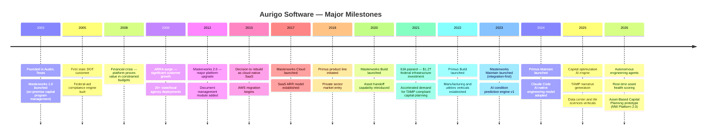

# 02 — History

---

## Founding Story

Aurigo Software Technologies was founded in 2003 in Austin, Texas. The founders came from enterprise software backgrounds and saw a specific gap in the market: the organizations responsible for building America's infrastructure — state departments of transportation, county road departments, transit agencies, water utilities — were managing multi-billion dollar capital programs on spreadsheets, shared drives, and disconnected point tools.

The opportunity was not to build generic project management software. It was to build software that understood the specific language, workflows, compliance requirements, and political dynamics of public infrastructure capital programs. Federal aid highway projects have funding rules that no generic project management tool can enforce. Right-of-way acquisition has workflows that Jira does not model. Federal reimbursement claims have documentation requirements that generic document management systems do not support.

The founders bet on domain depth. Rather than building a horizontal platform that could serve any industry, they went deep into a single domain: public infrastructure capital program management. That bet has compounded over 20 years into a moat that competitors cannot close without rebuilding from scratch.

---

## The Masterworks Era (2003–2015)

Aurigo's first product was Masterworks — an on-premise capital program management system built for state and local transportation agencies. It covered the full project lifecycle from programming through construction closeout: project initiation, scope and budget management, funding source tracking, schedule management, change order processing, document management, and federal reporting.

The early years were spent learning the market. Federal-aid highway projects follow complex rules defined by FHWA regulations, each state's STIP (Statewide Transportation Improvement Program), and individual project authorization letters. Understanding these rules at the level of software implementation requires years of customer collaboration. Aurigo built that understanding project by project, customer by customer.

By 2008, Masterworks was deployed at a significant number of state DOTs and had earned a reputation as the most domain-accurate capital program management system in the market. Competitors existed — some with larger sales teams and larger marketing budgets — but none had invested as heavily in understanding the specific compliance and workflow requirements of federal-aid infrastructure programs.

The 2008 financial crisis disrupted capital programs across the country as state revenues collapsed and infrastructure budgets were cut. Aurigo navigated this by demonstrating exactly the value that Masterworks provided in constrained budget environments: the ability to rapidly re-prioritize projects, reallocate funding across programs, and report to federal agencies on the revised program with accuracy. The tool that helps you manage abundance is also the tool that helps you manage scarcity. Customer retention through the crisis built long-term loyalty.

The American Recovery and Reinvestment Act (2009) created a surge in infrastructure investment and with it a surge in demand for the kind of program management that Masterworks provided. Federal requirements around "shovel-ready" projects, obligation deadlines, and reporting created exactly the compliance complexity where Aurigo's domain depth created value.

---

## The Cloud Transition (2015–2020)

By 2015, it was clear that on-premise deployment was becoming a liability. State IT departments were moving toward cloud-first policies. Security patching cycles for on-premise software were expensive for customers. Aurigo's own development velocity was constrained by the need to maintain multiple deployment versions across dozens of customer environments.

The decision to rebuild Masterworks as a cloud-native SaaS platform was not made lightly. It represented a multi-year engineering investment and a fundamental change in the business model — from perpetual license revenue to annual recurring revenue. The transition required careful management of existing customers who had invested heavily in on-premise deployments and needed confidence that their data and workflows would be preserved.

The cloud rebuild was also an opportunity to rethink the architecture. The original Masterworks was a monolithic application with a tightly coupled data model. The new platform was designed as a microservice architecture on AWS, with clean API boundaries between modules, a multi-tenant data layer, and a modern React-based frontend that could deliver the kind of user experience that on-premise enterprise software of the 2000s could not.

The microservice architecture proved its value almost immediately: it allowed Aurigo to ship improvements to individual modules without disrupting the entire platform, enabled horizontal scaling for large state DOT implementations with hundreds of concurrent users, and provided the foundation for the API integrations that would become increasingly important as the market matured.

---

## Primus: Expanding to Private Sector Infrastructure (2018–2022)

By 2018, Aurigo had strong market presence in public sector transportation. A pattern was emerging in customer conversations: private sector organizations — manufacturing companies, utilities, airports, data centers — had strikingly similar problems. They owned large, complex infrastructure assets. They needed to manage multi-year capital programs. They needed to track asset condition and plan replacements. They did not have software that connected their project delivery to their maintenance operations.

The decision to build Primus — a parallel product line for private sector infrastructure owners — was based on a straightforward insight: the underlying platform capabilities were already built. The domain knowledge required was different (no federal compliance requirements, but different regulatory frameworks, different asset classes, different organizational structures), but the core technology was sound. Primus was not a fork of Masterworks. It was a configuration of the same platform with different terminology, different default workflows, different compliance templates, and vertical-specific asset class libraries.

Primus entered the market targeting manufacturing and utilities first — the largest and most mature private infrastructure sectors — before expanding to airports, data centers, life sciences, and energy. Each vertical required domain research, customer development, and workflow customization. Aurigo's approach was consistent: go deep on one reference customer in each vertical, build the workflows that reference customer needed, and generalize from there.

The private sector expansion also validated the platform strategy. Primus customers who started with Plan frequently asked about Build and Maintain. The lifecycle problem was not unique to public agencies. Private owners also lost data at project closeout. Private owners also lacked the connection between capital planning and asset condition. The platform strategy resonated in both markets.

---

## Masterworks Build: Closing the Plan-to-Construction Gap (2020–2023)

The original Masterworks was primarily a planning tool. Construction management was either done in Masterworks with limited functionality or in specialized tools like Oracle Unifier or e-Builder. The gap between planning and construction represented a data loss point that Aurigo's own customers were experiencing.

Masterworks Build was developed to close this gap. It covered the full construction delivery lifecycle: design management, bid management, contract execution, RFI and submittal management, inspection and testing, change order management, and — critically — project closeout and asset handoff.

The asset handoff capability was technically straightforward but strategically transformative. When a project reached substantial completion in Masterworks Build, the system could generate a structured asset record — with geometry, condition baseline, material specifications, warranty information, and maintenance documentation — that could be imported directly into a maintenance management system. For customers using Masterworks Maintain (which was in development), this meant zero-loss handoff. For customers using existing EAM systems, it meant a structured data export that reduced re-entry effort by 80 to 90 percent.

The asset handoff feature became a significant differentiator in competitive evaluations. Competitors could point to similar project delivery capabilities, but none could demonstrate the structured, automated handoff to maintenance systems. This was the first concrete proof point of the platform strategy's competitive advantage.

---

## Masterworks Maintain and the Intelligence Layer (2023–present)

The development of Masterworks Maintain represented the completion of the Plan → Build → Maintain lifecycle strategy. But the product team made a deliberate architectural choice that distinguished Maintain from traditional CMMS and EAM competitors: Maintain would not be a system of record for maintenance execution. It would be a system of intelligence layered above existing systems.

This decision was driven by a clear-eyed assessment of the competitive landscape and customer buying behavior. Public agencies had already spent years implementing and customizing systems like IBM Maximo, Cityworks, and Infor EAM. Their maintenance technicians had workflows built around those systems. Their IT departments had integrations, custom reports, and support contracts. Asking those customers to replace their maintenance execution system was a different — and much longer — sales conversation than asking them to add an intelligence layer that made their existing system smarter.

The integration-first approach to Maintain also reduced implementation risk. A new system of record requires data migration, workflow retraining, and a full cutover. An intelligence layer requires an integration with the existing system and configuration of the Maintain data model. The customer is up and running with value — condition scoring, capital needs analysis, TAMP reports — in weeks rather than months.

The AI capabilities of Maintain were developed in parallel with the core platform capabilities. Condition prediction from inspection data, deterioration curve modeling, capital optimization under budget constraints — these are not features bolted onto a finished product. They are the reason the product exists. The data model was designed from the start to support the AI layer: every inspection, every maintenance event, every condition reading is captured in a form that the AI can consume.

The launch of Primus Maintain brought the same intelligence layer to private sector customers. Manufacturing companies could see OEE trends connected to capital investment requirements. Data centers could model generator and UPS lifecycles. Utilities could produce NERC CIP compliance documentation from asset condition data. The platform serving both markets, with appropriate configuration, validated the bet made in 2018 to build Primus.

---

## Timeline

---

## The Strategic Logic of the Journey

Looking back, Aurigo's history can be read as a series of deliberate expansions — each one building on the domain depth accumulated in the previous phase.

The move from on-premise to cloud was not primarily a technology choice. It was a business model choice that enabled faster iteration, better customer experience, and the economics of SaaS scale. The technology followed the strategy.

The move from Plan to Build closed the most obvious data loss point in the public sector workflow. It also created a new competitive argument: not just "we manage capital programs better" but "we connect the capital program to the construction project and capture what was built."

The move from Build to Maintain completed the lifecycle and created the most durable competitive advantage. Data continuity across all three phases is something that no single-phase vendor can match, and it is something that takes years to build. Every new customer that goes through a full Plan → Build → Maintain lifecycle strengthens the data model, improves the AI, and deepens the moat.

The expansion from Masterworks to Primus was not a distraction. It was a validation and an amplification. The same platform, differently configured, serves fundamentally the same problem in a market twice as large.

The AI-native engineering model adopted in 2024 — using Claude Code with defined agent roles, shared memory, and repository indexing — is the latest evolution in how Aurigo builds software. It is not a productivity hack. It is an architectural decision: the organization's knowledge is in its documents, its decisions, its code, and its agent memories. Not in the heads of individual contributors who might leave. This is Aurigo's institutional knowledge strategy, and it is as important as any product decision.

---

## Why Maintain in 2023 and Not 2010

An honest history has to answer the obvious question: if the lifecycle vision was clear in the mid-2000s, why did Maintain ship in 2023 rather than 2010? The answer is that four conditions had to be true simultaneously, and none of them were true 15 years ago:

1. **A federal mandate that forces evidence-based capital planning.** MAP-21 (2012) created the TAMP requirement; the FAST Act (2015) reinforced it; IIJA (2021) attached real funding stakes to it. Before 2012, the market did not have a compliance forcing function for the kind of data Maintain produces. Selling "better capital planning" without a mandate was a nice-to-have. After 2012 it became a must-have. After 2021 it became a funding contingency.
2. **A customer base already using cloud SaaS for capital planning.** In 2010, most state DOTs still ran on-premise Masterworks. Selling them a second cloud system that had to consume their capital plan would have failed integration testing on customer infrastructure alone. By 2020, Masterworks Cloud had normalized the AWS-hosted data model for the customer base.
3. **A data model that spans planning, construction, and asset condition.** The Build launch in 2020 was the prerequisite. Without a canonical asset record at project handoff, Maintain would have started with garbage-in data and produced garbage-out recommendations. The Build → Maintain data continuity is the one thing competitors cannot fake.
4. **AI economics that make condition prediction and capital optimization affordable to run at customer scale.** GPT-4-class models were not economically viable for embedded product intelligence before 2023. Running deterioration modeling and TAMP narrative generation across 250,000+ assets per customer would have cost more than the license. Sonnet/Haiku-class economics changed that math in 2024.

The convergence of these four conditions defines the strategic window Aurigo is executing into. That window opened around 2022 and, based on competitive activity, will remain open for roughly 3–4 more years before the market consolidates around 2–3 winners. Every quarter of execution during this window compounds Aurigo's data-continuity moat.

---

## Competitive Timing Analysis (2023–2028)

| Competitive event | Aurigo response window | Consequence of missing it |
|-------------------|-----------------------|---------------------------|
| Oracle acquires or builds a lifecycle competitor | 12–18 months to establish MW Platform 2.0 as customer default | Displacement from mid-market DOT accounts |
| Bentley or Trimble adds AI capital planning to their asset offering | 18–24 months to entrench the intelligence-layer positioning | Compressed pricing on Maintain modules |
| Cityworks (Trimble) adds native TAMP module | 12 months to lock lighthouse state DOTs on Aurigo TAMP | Loss of TAMP narrative moat |
| Regional CMMS vendor bundles with GIS + adds "planning add-on" | Ongoing — must maintain feature parity on execution basics | Downmarket erosion |
| Federal follow-on to IIJA (post-2026) | Must ship Maintain at 5+ lighthouse DOTs before appropriations debate | Loss of the "reference customer" argument in D.C. |

The takeaway: Aurigo is not defending a position, it is racing to establish one. The historical trajectory made the racecourse; the next 36 months determine the finish line.

---

## Domain Credibility: The Compounding 20-Year Asset

Aurigo's history is not merely a set of milestones. It is an intellectual asset that compounds:

- **~1,400 federal-aid highway project workflows encoded** into the Masterworks compliance engine. No competitor has this library.
- **20+ years of customer input on right-of-way, utility relocation, and change-order rules** — the "long tail" of infrastructure workflows that generic tools cannot capture.
- **Direct participation in the AASHTO TAM Committee, TRB Asset Management Committee, and NASHTO Executive working groups.** Aurigo employees author sections of the industry guidance our competitors implement.
- **A customer advisory board of 12 state DOTs and 6 large private owners** that has met quarterly for over a decade, providing direct product feedback loops competitors need years to replicate.

New entrants have to accumulate this. Aurigo already has it. Every year of continuous operation in this domain widens the gap.

---

*Next: [03 — Product Strategy](03-product-strategy.md)*
