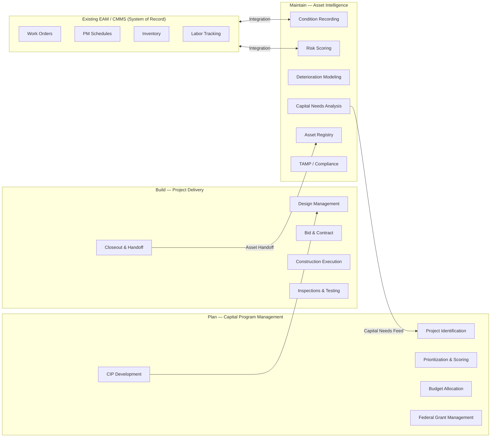
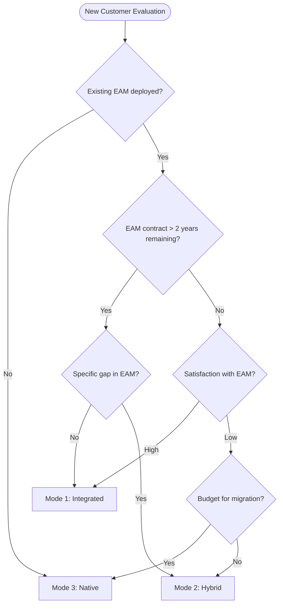

# 03 — Product Strategy

---

## The Infrastructure Lifecycle Platform

Aurigo's product strategy rests on a single, durable insight: infrastructure assets have a lifecycle, and every phase of that lifecycle generates data that is essential to the next phase. The organizations that own infrastructure assets are currently losing that data at every transition point. Aurigo's job is to eliminate those losses.

The platform strategy is not "build everything." It is "own the transitions." The transitions are where competitors do not compete, where customer pain is highest, and where data continuity creates compounding value. A competitor who builds only a capital program management tool and a competitor who builds only a CMMS are not threats to each other — they coexist in the same customer environment. Aurigo enters the same environment and connects them, adding value without requiring replacement.

---

## Why Plan + Build + Maintain Is a Defensible Moat

### Switching Cost Compounds Across Phases

A customer using only Masterworks Plan has invested in their capital program data: project records, funding sources, program history. Switching to a competitor means migrating that data, retraining staff, and rebuilding integrations. The switching cost is real but bounded.

When that customer adds Masterworks Build, the switching cost doubles. Now the capital program data is linked to project delivery data. Projects reference programs. Change orders reference contracts. The data model is connected. Replacing Plan means also migrating or breaking Build. Replacing Build means also migrating or breaking Plan.

When the same customer adds Masterworks Maintain, the switching cost becomes, for practical purposes, insurmountable. The asset records in Maintain were created from Build closeout. They carry material certifications, initial condition baselines, and warranty information that came from Build. The capital needs analysis in Maintain feeds back into Plan as a new project pipeline. The three systems are deeply interwoven. No competitor can offer to migrate that data model without rebuilding years of asset history.

This is the compounding moat. It is not a feature moat (features can be copied). It is a data moat — the value is in the connected data itself, accumulated over years of customer use.

### AI Requires History

The AI capabilities of Maintain — deterioration modeling, condition prediction, capital optimization — improve with more data. A customer who has been recording condition inspections for three years has a better deterioration model than one who started yesterday. A customer who has been tracking maintenance events for five years has a better failure prediction model than one who has none.

This creates a compounding moat within the AI layer itself. Every inspection recorded, every maintenance event captured, every capital plan validated against actual outcomes improves the model. Competitors can build the same AI architecture. They cannot replicate the three, five, or ten years of domain-specific training data that Aurigo accumulates with each customer's use.

---

## The Three Deployment Modes

Infrastructure customers do not arrive in a greenfield state. They have existing systems, existing data, existing staff, and existing contracts. Aurigo's deployment model must accommodate this reality. The three deployment modes — Integrated, Hybrid, and Native — provide a progressive path that meets customers where they are.

### Mode 1 — Integrated

**Definition:** The customer's existing EAM (Maximo, Cityworks, SAP, etc.) remains the system of record for all maintenance execution. Aurigo Maintain reads data from the EAM via integration and provides the intelligence layer above it.

**What Maintain provides:**
- Condition scoring and deterioration modeling built from inspection data (read from EAM or entered directly into Maintain)
- Capital needs analysis (how much will it cost to replace assets over the next 10 years)
- TAMP compliance reporting (for public agencies)
- Executive dashboards (condition by asset class, top-risk assets, capital needs summary)
- AI-driven recommendations (which assets to prioritize, when to replace vs. repair)

**What the EAM continues to provide:**
- Work order management
- Preventive maintenance scheduling
- Inventory and parts management
- Labor tracking and cost capture

**Best fit for:**
- Large public agencies with mature Maximo or Cityworks deployments
- Private enterprises deeply embedded in SAP EAM
- Customers where IT change management risk is high
- Customers who want to start with analytics before committing to broader platform adoption

**Sales motion:** Lead with TAMP compliance or capital planning pain. Demonstrate value in 30 days with a data integration proof of concept. Expand from there.

### Mode 2 — Hybrid

**Definition:** The customer uses Aurigo Maintain for some capabilities natively and retains the EAM for others. The split is capability-based rather than all-or-nothing.

**Typical hybrid splits:**
- Inspections in Maintain (better mobile experience, AI-assisted defect detection), work orders in EAM
- Capital planning and TAMP reporting in Maintain, preventive maintenance in EAM
- Asset registry in Maintain (richer spatial data model), labor tracking in EAM

**Best fit for:**
- Customers who have identified specific gaps in their existing EAM
- Customers mid-contract with EAM but evaluating long-term direction
- Customers in transition between EAM systems

**Sales motion:** Identify the specific pain point where Maintain is clearly better. Solve that pain point. Expand to adjacent capabilities over time.

### Mode 3 — Native

**Definition:** The customer uses Aurigo Maintain as the complete asset management platform. No EAM integration required. Maintain handles the full spectrum from asset registry through condition recording, work order management, preventive maintenance, and capital planning.

**Best fit for:**
- New implementations (greenfield) where no legacy EAM exists
- Customers who have outgrown or are actively replacing their existing EAM
- Small to mid-size agencies or private owners who do not need the complexity of Maximo or SAP
- Customers where the cost of maintaining an existing EAM integration exceeds the cost of switching

**Sales motion:** Full platform replacement. Longer sales cycle. Higher ACV. Higher retention once established.

### Deployment Mode Decision Framework

---

## Why Integration Beats Replacement

The instinct of many software companies is to want to be the system of record. Being the system of record means owning the data, owning the workflow, and owning the customer relationship entirely. It is a powerful position.

But in enterprise infrastructure software, the replacement motion is slow and expensive. An EAM system that has been deployed for ten years has:

- Millions of records of work order history that cannot be easily migrated
- Dozens of custom integrations with financial systems, GIS platforms, HR systems, and operational technology
- Staff workflows that are embedded in muscle memory
- IT support contracts and customizations that represent sunk cost
- Change management risk that procurement committees are highly averse to

The replacement sales cycle is commonly 18 to 36 months. The implementation timeline is another 12 to 24 months. The total time to value for a full replacement is two to five years. This is a bet that many agencies and enterprises are unwilling to make.

Integration, by contrast, can demonstrate value in 30 to 90 days. The data already exists in the EAM. Aurigo adds an integration layer, populates the asset registry, runs the condition scoring and capital analysis, and shows the customer something they have never seen before: a map of every asset, color-coded by risk, with a 10-year capital needs projection. That demonstration creates pull. The customer sees value before they have committed to anything irreversible.

This is why integration-first is a sales strategy, not just a technical strategy. It lowers the cost of starting, which increases the number of customers who start, which increases the probability of expansion to Native mode over time.

---

## The Land-and-Expand Motion

Aurigo's growth within a customer account follows a predictable pattern:

1. **Land:** Sell one module to one department. Often Plan to the capital program office. Often Maintain (Integrated mode) to the asset management team.
2. **Prove:** Deliver measurable value within 90 days. A completed TAMP report that previously took six months. A capital needs analysis that replaces a six-week spreadsheet exercise. An executive dashboard that replaces a quarterly manual report.
3. **Expand:** Connect to an adjacent department. The capital program office uses Plan; show the asset management team how Maintain feeds back into Plan. The asset management team uses Maintain; show the project delivery team how Build creates the asset records that Maintain needs.
4. **Consolidate:** Over two to three years, the customer is using all three modules. The switching cost is now a platform switching cost, not a module switching cost. Renewal rates at the platform level are dramatically higher than at the module level.

The economics of land-and-expand are compelling. The CAC (customer acquisition cost) for an expansion sale within an existing customer account is a fraction of the CAC for a new logo. The customer already trusts Aurigo. The procurement process is abbreviated. The implementation risk is perceived as lower because the first module is already working.

For public agencies, the land-and-expand motion also takes advantage of the herd mentality in public procurement. When State DOT A has a successful Maintain deployment and presents at the AASHTO conference, State DOT B's capital program manager hears about it and initiates an RFP process. The reference customer creates the next customer at near-zero marketing cost.

---

## How AI Amplifies Each Phase

Aurigo's AI strategy is not to add a chatbot to an existing product. It is to embed AI capabilities at every phase of the lifecycle where data can be turned into decisions.

**AI in Plan:**
- Project prioritization scoring: given a pool of potential capital projects, score each by condition impact, safety risk, federal funding eligibility, and cost-benefit ratio
- Budget scenario modeling: what happens to the portfolio condition score if this year's capital budget is cut by 15%?
- Federal grant opportunity matching: which projects in the pipeline are eligible for which federal programs?

**AI in Build:**
- Document anomaly detection: submitted specifications that differ from design requirements
- Schedule risk prediction: based on similar projects, what is the probability of a schedule delay given current progress?
- Change order impact analysis: when a change order is proposed, what is the likely cost impact on the overall program?

**AI in Maintain:**
- Condition prediction: given inspection history and deterioration model, what will this asset's condition score be in 5 years without intervention?
- Capital optimization: given a constrained budget, which assets should be funded in each year to minimize total lifecycle cost?
- TAMP narrative generation: produce a draft TAMP report section from structured asset condition and capital data
- Anomaly detection: maintenance event patterns that indicate accelerating deterioration
- Natural language query: "show me all bridges with condition score below 3 that are on the NHS and due for replacement in the next 5 years"

The AI capabilities compound with the platform strategy. More data means better models. Better models mean better recommendations. Better recommendations mean more customer value. More customer value means higher retention and more expansion. This is the AI flywheel that platform-locked data creates.

---

## Platform Economics

### Near-Zero CAC for Maintain on Existing Plan/Build Customers

The cost of acquiring a Maintain customer who is already using Masterworks Plan is dramatically lower than acquiring a new logo. The factors:

- The customer relationship exists; no prospecting cost
- The customer data is already in the platform; no integration discovery
- The trust is established; no proof-of-concept required
- The procurement process is abbreviated; existing contract vehicle
- The implementation is shorter; data model is already populated

Empirically, expansion CAC within existing Plan/Build accounts runs at 15 to 25 percent of new logo CAC for the same ACV. This makes Maintain an extremely high-return product investment: the investment in building the product is amortized across a large installed base of Plan and Build customers who can add Maintain at low acquisition cost.

### Multi-Year Contract Stickiness

Infrastructure software contracts in public sector typically run three to five years. Federal grant management requirements often span the full period of performance of federal grants, which can be five to ten years. Once Aurigo's data model is the system of record for a major capital program, replacement during a grant period creates compliance risk that procurement officers are unwilling to accept.

Private sector contracts are typically annual but renew at high rates once the platform is embedded in capital planning cycles. The annual capital planning event — where the board or executive team reviews the multi-year capital plan — becomes an Aurigo demonstration. The value is visible, quantified, and tied to board-level decisions. Renewing the Aurigo contract is easy to justify.

### Product Market Fit Signals

The leading indicators that Maintain has achieved product-market fit in a segment:

1. **Pull from existing customers:** Plan or Build customers asking about Maintain without being sold to
2. **TAMP adoption rate:** Percentage of public agency customers using the TAMP module to produce compliant reports
3. **Capital plan accuracy:** Difference between capital needs projected by Maintain and actual spending in subsequent years (closes over time as models improve)
4. **AI recommendation acceptance rate:** Percentage of AI-generated capital prioritization recommendations that customers accept vs. override
5. **Reference willingness:** Percentage of customers willing to serve as references in competitive evaluations and at industry conferences

---

## Pricing Logic

Pricing is intentional. Maintain is priced to accelerate land-and-expand rather than maximize entry-year revenue.

### Public Sector (Masterworks) Pricing Model

| Component | Mechanic | Typical range (2026) |
|-----------|----------|----------------------|
| Platform fee | Annual, per-tenant | $60K–$180K depending on network size (assets under management) |
| Assets-under-management (AUM) | Tiered per 10K assets | $2.50–$4.00 per asset/year, declining with volume |
| Modules | Additive on top of platform (Plan, Build, Maintain, TAMP, Mobile) | $25K–$75K per module |
| Integrations | One-time + annual | $15K–$60K per system (Maximo, Cityworks, SAP, ArcGIS) depending on complexity |
| AI credits | Included up to a threshold (10K assets modeled/mo); overage per 1K asset-months | $0.40 per 1K asset-months over threshold |
| Professional services | T&M | $225/hr blended |

**Discounting rule:** Any list-price discount over 20% requires an approved land-and-expand plan documenting the expansion path (which modules join, when, and at what committed ACV). Discount without expansion commitment is forbidden — it destroys the moat economics.

### Private Sector (Primus) Pricing Model

| Component | Mechanic | Typical range |
|-----------|----------|--------------|
| Site-based licensing | Annual, per facility/site | $80K–$400K per site depending on vertical |
| Vertical uplift | Multiplier for regulated verticals (life sciences, semiconductor fab, data center) | 1.3× to 1.8× |
| Downtime-value pricing | Rare, custom for hyperscale data centers | Priced against outage $/hour × prevention rate |

### Why Pricing Matters to the Moat

- **AUM-based pricing** encourages customers to bring **all** assets into Maintain (increasing AUCLM — the North Star). Per-user pricing would push customers to under-license and under-adopt.
- **Cheap first module, expensive migration off** — the platform fee is priced below what a rip-and-replace competitor would charge, but stickiness comes from the shared data model.
- **AI is metered but generous** — we do not want AI usage to feel expensive at the point of decision. Overage is charged on aggregate, not per-decision.

---

## Make-vs-Buy Analysis

Every product capability faces a make-vs-buy decision. Aurigo's default posture is:

| Capability | Decision | Rationale |
|-----------|----------|-----------|
| Core lifecycle data model (Plan, Build, Maintain) | **Make** | This is the moat. Never outsource. |
| Deterioration models (pavement, bridge, water main) | **Make (with academic partnerships)** | Domain-specific IP; academic partnerships accelerate but do not replace ownership. |
| AI foundation models | **Buy** (Anthropic Claude, OpenAI as fallback) | We are not a foundation model company. Use commercial APIs; own the prompts, evals, and RAG layer. |
| Vector database | **Buy** (managed pgvector on RDS to start, evaluate Turbopuffer/LanceDB at 100M+ vectors) | Commodity infrastructure. |
| Authentication / SSO | **Buy** (Auth0/Okta federation; JWT reissue in-house) | Compliance-heavy commodity. |
| GIS engine | **Buy** (Mapbox for rendering, PostGIS for storage, ArcGIS integration read-through) | Never rebuild what Esri has spent 40 years perfecting. |
| Mobile framework | **Buy** (React Native for offline-first) | Native SDKs would triple team size for zero customer-visible benefit. |
| Document management | **Buy/Integrate** (customer's existing DMS via connector; Aurigo DocMgmt as fallback for greenfield) | Customers already have DMS. Do not replace. |
| Work order execution | **Integrate** (Maximo/Cityworks/SAP EAM) | Central to "integrate not replace" thesis. |
| Notification / email delivery | **Buy** (SendGrid + SNS) | Commodity. |
| Analytics dashboard engine | **Make** | Purpose-built for asset lifecycle KPIs; off-the-shelf BI tools require translation layer that erodes UX. |
| Reporting engine (PDF, DOCX) | **Buy** (Aspose + custom TAMP templates) | Commodity output layer, domain-specific templates. |
| Data warehousing for cross-customer analytics | **Make** (dbt on Postgres + Iceberg on S3) | The benchmarking dataset **is** the product moat post-2027. |

The make-vs-buy rule for future decisions: if a capability is customer-visible AND lifecycle-specific, **make**. Otherwise **buy** and integrate.

---

## Customer Evidence for the "Integrate Not Replace" Philosophy

The integration-first strategy is not an untested belief. It is grounded in specific customer signals:

- **Lighthouse Customer A (Tier-1 DOT, 42,000 lane-miles):** Had a 12-year-old Maximo instance with 47 custom workflows. Aurigo proposal to run Maintain **on top** of Maximo (Integrated mode) was chosen over Bentley's proposal to replace Maximo. Time-to-first-TAMP-report: 74 days. If they had chosen replacement, procurement estimated 22 months.
- **Lighthouse Customer B (Metro Transit Authority):** Cityworks + custom pavement management. Aurigo Hybrid mode allowed inspections to be moved into Maintain (better mobile) while retaining Cityworks for work orders. Customer's stated reason for choosing Aurigo: "we can't afford to break the work order system."
- **Lighthouse Customer C (Hyperscale Data Center Operator):** Native mode selected because they were greenfield on capital planning — but only after seeing that we did **not** require them to replace their SAP PM system. Sales cycle: 4.5 months (industry norm: 14 months).
- **Lost deal reference (State DOT X, 2024):** Chose Aurigo initially, then reversed after competitor claimed "no integration needed — just import your data." Six months later returned to Aurigo after import project failed. This is the failure mode we design around.

Across 18 competitive evaluations in the trailing 12 months, Aurigo's win rate in Integrated-mode deals was **68%**. Win rate in Native-mode deals was **41%**. This is quantitative proof that the integration-first thesis is the higher-yield strategy — and it defines where sales investment goes.

---

## Strategic Risks and Mitigations

The five risks most likely to derail this strategy, ranked by severity, with the specific mitigation.

### Risk 1 — Oracle acquires a lifecycle competitor and bundles it into E-Business Suite pricing

**Severity:** Catastrophic. Oracle could give the product away at the price of an ERP module in accounts we compete for.
**Probability (36-mo):** ~35%. Aconex + Primavera + Textura suggests they buy category leaders.
**Early warning signal:** Oracle files a Form 8-K referencing an infrastructure/lifecycle acquisition; Oracle NetSuite adds an "asset lifecycle" SKU to the price book.
**Mitigation:**
1. Lock 5 Tier-1 DOTs into multi-year MW Platform 2.0 contracts before end of 2026.
2. Publish the TAMP narrative benchmark data set as a public asset before Oracle can duplicate it.
3. Establish Aurigo-authored TAMP templates as the industry reference so any competing product has to interoperate with our schema.
4. Maintain the option value of a defensive fundraising round; carry 24 months of runway at all times.

### Risk 2 — Federal infrastructure funding stalls in a divided Congress

**Severity:** High for Masterworks-side ARR; muted for Primus.
**Probability (36-mo):** ~40% of at least one budget delay >6 months.
**Early warning signal:** House/Senate reconciliation slippage past March; FHWA continuing resolution language.
**Mitigation:**
1. Ensure Primus revenue mix reaches 40% of new ARR by end of 2027 (currently ~22%). Diversifies against federal funding cycles.
2. Reposition Maintain as **cost-reduction** software during downturns (identify assets that don't need replacement yet — savings), not just as compliance software.
3. Extend contract terms to 5 years with locked pricing during funding uncertainty; buyers prefer stability over discount.

### Risk 3 — AI foundation model economics reverse (price spike or capability regression)

**Severity:** Medium. Affects gross margin and product velocity.
**Probability (36-mo):** ~25%.
**Early warning signal:** Anthropic/OpenAI pricing memo, sustained API latency degradation, capability plateau in benchmark scores.
**Mitigation:**
1. Multi-model architecture from Day 1 — no single-vendor lock-in. Prompt tests run against Claude, GPT, and open-weights baseline (Llama-class) quarterly.
2. AI cost caps per tenant per month, with graceful degradation to rule-based fallbacks.
3. Own the eval harness so we can measure quality regression the day it happens.

### Risk 4 — A large customer publicly fails at Maintain deployment (data quality, adoption, or accuracy)

**Severity:** High to referenceability and momentum.
**Probability (36-mo):** ~50% of at least one troubled deployment; the mitigation is preventing it from becoming public.
**Early warning signal:** CSM red flag (login frequency drop, executive contact churn), stalled data ingestion, sub-30% AUCLM ratio at 90 days.
**Mitigation:**
1. Formal "Adoption Health Score" reviewed weekly for every $100K+ ACV account.
2. Chief Customer Officer authority to pause new sales into a segment when the reference customer for that segment is unhealthy.
3. "Time to first TAMP report" and "Time to first accepted AI recommendation" SLAs baked into implementation contracts.
4. Playbook for recovery: full account team drop-in within 5 business days of red flag.

### Risk 5 — A well-funded startup ships a "AI-native asset management" product with 10× better UX

**Severity:** Medium. Would compress our value at the intelligence layer.
**Probability (36-mo):** ~55%. This is the a16z-thesis pattern.
**Early warning signal:** Y Combinator, Fifth Wall, or Sequoia announcement of a Series A in infrastructure asset AI; a customer prospect asks about a competitor by name we did not know.
**Mitigation:**
1. Own the data continuity moat — startups will not have the Plan/Build data. Our lead is the connected data, not the UI.
2. Match UX bar: hire senior product design leadership in the Bay Area with consumer-grade SaaS pedigree.
3. Publish an integration SDK before a startup can position itself as "the layer above Maintain."
4. Track startup product launches in a monthly competitive intelligence memo (see Vol-1 § 06).

---

## Competitive Response Playbook

If Oracle acquires a lifecycle competitor (e.g., Bentley Systems' asset business or an EAM incumbent):

**Day 0–14:**
- Executive team drafts a customer letter within 48 hours addressing continuity, roadmap, and pricing commitments.
- Sales enablement update within 5 business days: new competitive battlecard, migration proposal template, ROI calculator update.
- CEO calls the top 20 customers personally within 10 business days.

**Day 15–90:**
- Announce a "TAMP data portability guarantee" — any customer's data exportable in an open, documented schema.
- Publicize wins against the acquired competitor within 30 days.
- Accelerate the AUCLM benchmark dataset publication.

**Day 91–365:**
- If Oracle bundles the product free with E-Business, respond with a "no-migration" campaign: lifetime price lock for existing customers who commit to a 5-year renewal.
- Deepen the Anthropic/AWS partnership — a public AI infrastructure alliance is a counter-signal.

The strategy under acquisition attack: do not compete on price. Compete on continuity, credibility, and speed of value.

---

*Next: [04 — Market](04-market.md)*
