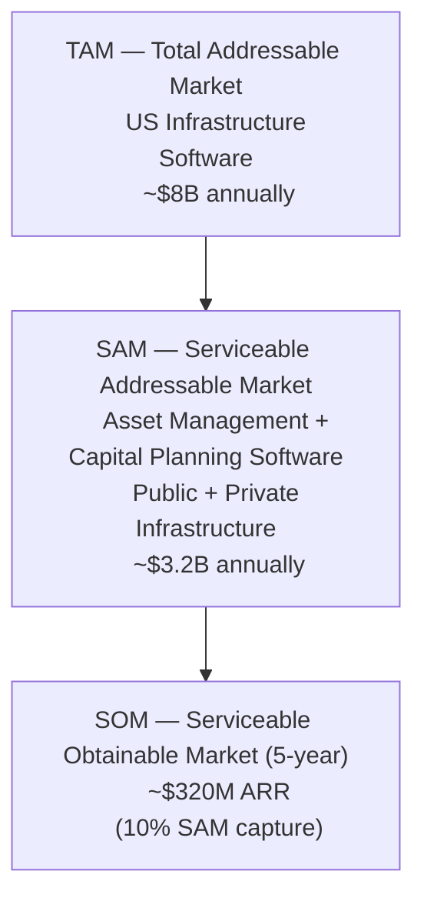

# 04 — Market

---

## Overview

Aurigo serves two distinct market segments with separate product lines: Masterworks for US public sector infrastructure agencies and Primus for private sector infrastructure owners. Both segments are large, growing, and systematically underserved by current software vendors. The Infrastructure Investment and Jobs Act (IIJA) has created a multi-year tailwind for the public sector market. The shift toward AI-driven capital planning is creating demand in both markets that did not exist five years ago.

---

## Public Sector Market (Masterworks)

### Market Size and Dynamics

State and local governments in the United States spend approximately $500 billion per year on infrastructure. This includes construction of new assets, major rehabilitation of existing assets, and routine maintenance. The $1.2 trillion IIJA (2021) adds approximately $120 billion per year in federal infrastructure investment on top of existing state and local funding — a roughly 24 percent increase in annual spending levels sustained over ten years.

This investment creates two types of demand for Aurigo:

**Demand for capital program management (Plan/Build):** More projects mean more program management complexity. A state DOT managing 500 active capital projects has different needs than one managing 200. IIJA funding comes with federal reporting requirements, obligation deadlines, and compliance documentation requirements that amplify the need for automated program management tools.

**Demand for asset management (Maintain):** IIJA includes specific requirements for Transportation Asset Management Plans (TAMPs), Performance-Based Planning, and asset condition data. Agencies receiving IIJA funds must be able to demonstrate that investments are being made based on objective condition data and that the resulting assets will be maintained to specified condition targets.

### Regulatory Drivers

**TAMP (Transportation Asset Management Plan):** The FHWA requires all state DOTs with NHS (National Highway System) assets to have approved Transportation Asset Management Plans. TAMP requirements specify:
- A complete inventory of NHS pavements and bridges
- Condition assessments using standardized measures (IRI, PSR for pavement; NBI ratings for bridges)
- Performance gap analysis between current condition and 10-year targets
- A financial plan that demonstrates how the agency will close performance gaps
- Risk analysis for assets that are not on a funded improvement schedule

TAMP approval is a prerequisite for many federal funding programs. States with non-compliant TAMPs face increased scrutiny and potential funding restrictions. The complexity of producing a compliant TAMP from manual data sources is exactly the pain point that Masterworks Maintain eliminates.

**Bridge Formula Program:** The IIJA created a dedicated bridge replacement and rehabilitation program with $27.5 billion over five years. To access these funds, state DOTs must demonstrate that bridge improvements are prioritized based on condition data from the National Bridge Inspection Standards (NBIS) program. Masterworks Maintain's NBIS-compatible condition recording directly feeds the data required for Bridge Formula Program compliance.

**National Highway Performance Program (NHPP):** The largest federal highway program at approximately $23 billion per year. Performance measures require states to report on pavement condition (percent good/fair/poor on the NHS), bridge condition (percent good/fair/structurally deficient), and travel time reliability. Maintain's condition scoring and reporting modules produce NHPP-compliant reports.

**Federal Transit Administration (FTA) — State of Good Repair:** Transit agencies receiving federal capital funding must develop Asset Management Plans (TAMPs for transit). These plans require the same elements as highway TAMPs: inventory, condition, performance gaps, and financial plans. Masterworks Maintain is designed to support both highway and transit asset management plans.

### Key Buyer Segments

**State Departments of Transportation (State DOTs)**
52 state and territory DOTs manage the vast majority of NHS assets. They have the largest capital programs (often $1-5 billion per year), the most complex federal compliance requirements, and the greatest need for automated program management tools. State DOT procurement is formal (RFP-driven), multi-year, and heavily influenced by peer agency references. A win at a top-15 state DOT creates sales leverage with the remaining 37.

**County Road Departments**
Over 3,000 US counties maintain roads, bridges, drainage infrastructure, and other civil assets. County budgets vary enormously — from a two-person road department in a rural Midwest county to a 500-person department in a major metro county. The lower end of the county market is served by simpler tools; Masterworks is positioned at mid-to-large counties with $20M+ annual capital programs.

**Transit Agencies**
Approximately 800 public transit agencies in the US manage fleets, facilities, track, signals, and other capital assets. The 50 largest agencies — those receiving the most federal funding — have the greatest need for FTA-compliant asset management. Masterworks supports fixed route, rail, ferry, and paratransit asset types.

**Port Authorities**
US port authorities manage marine terminals, cranes, dredging infrastructure, and intermodal facilities. Federal Maritime Administration and Army Corps of Engineers requirements drive asset management data needs. Ports are an underpenetrated market with high complexity and high willingness to pay for specialized tools.

**Water Utilities**
Municipal and regional water and wastewater utilities manage distribution networks, treatment plants, pumping stations, and storage infrastructure. EPA requirements (Lead and Copper Rule, Clean Water Act compliance) are creating demand for asset condition tracking. Water utilities are a natural adjacency for Masterworks.

### Buying Process

Public sector procurement is formal, rule-bound, and risk-averse. The typical process:

1. **Needs identification** (6-12 months): Internal champions identify a pain point (TAMP compliance, capital planning accuracy, program management efficiency). They build an internal business case.
2. **Market research** (3-6 months): The agency surveys available vendors, attends conferences (AASHTO, APWA, TRB), reviews peer agency deployments.
3. **RFP development** (3-6 months): The agency writes a formal Request for Proposals. RFPs for asset management software commonly run 50-100 pages and specify hundreds of functional requirements.
4. **Proposal evaluation** (2-4 months): Vendors submit proposals, demonstrations are conducted, references are checked.
5. **Contract award and negotiation** (2-4 months): Often requires approval by elected board or legislative body for contracts above a threshold.
6. **Implementation** (6-18 months): Software implementation, data migration, staff training, configuration.

Total sales cycle: 18 to 36 months. This is the price of admission for public sector enterprise software.

---

## Private Sector Market (Primus)

Private sector infrastructure owners share the lifecycle problem of public agencies but face different regulatory drivers, different financial incentives, and different purchasing processes. The private sector market is larger in total asset value but more fragmented in buying patterns.

### Manufacturing

US manufacturing infrastructure represents over $4 trillion in fixed assets. Production equipment, conveyors, presses, CNC machinery, HVAC, electrical distribution, and facility infrastructure are all capital assets that depreciate, deteriorate, and require replacement planning.

The financial driver is clear: unplanned downtime costs money. Industry estimates for automotive assembly range from $50,000 to $500,000 per hour. Semiconductor fabs can lose $10-50 million per day of unplanned outage. Even moderate manufacturing operations experience downtime costs of $10,000 to $100,000 per event. Capital investment in asset management intelligence that prevents one unplanned failure per year typically has an ROI measured in multiples.

Buyers in manufacturing: VP of Operations, Director of Maintenance, Plant Manager. These buyers are P&L accountable. They respond to ROI arguments faster than public sector buyers. Sales cycles are shorter (6-18 months), but procurement is competitive and technically rigorous.

### Utilities

Electric and gas utilities in the US own over $2 trillion in infrastructure assets. The transition to distributed energy resources (solar, wind, battery storage) is creating massive capital planning complexity. Utilities are replacing 50-year-old grid infrastructure while simultaneously integrating new asset classes.

Regulatory drivers are strong: NERC CIP compliance for bulk electric system assets, state Public Utility Commission rate case requirements, EPA environmental compliance. Rate case proceedings require utilities to justify capital investment to regulators. An asset management platform that produces defensible condition data and capital needs analysis is directly valuable for rate case preparation.

Buyers in utilities: VP of Engineering, Director of Asset Management, VP of Capital Programs. Procurement is often formal (RFP-driven) and multi-year, similar to public sector.

### Airports

US commercial airports (approximately 500 commercial service airports) manage runway pavement, taxiways, airfield lighting, terminal facilities, and ground transportation infrastructure. FAA requires airports receiving AIP (Airport Improvement Program) grants to maintain Airport Layout Plans and pavement condition data.

The FAA's Airport Pavement Management System (APMS) program provides technical guidance for pavement condition assessment. Airports following APMS standards use the Pavement Condition Index (PCI) — the same measure used by highway agencies. Masterworks and Primus share the same PCI data model, creating efficiency in development and consistency in the condition rating methodology.

Buyers in airports: Director of Airport Development, Chief Engineer, Capital Programs Manager.

### Data Centers

The data center sector is experiencing explosive growth driven by cloud computing and AI workloads. New hyperscale data centers regularly exceed $1 billion in capital investment. The critical infrastructure — generators, UPS systems, cooling, power distribution, fire suppression — must operate at Tier III (99.982% uptime) or Tier IV (99.995% uptime) standards.

Asset lifecycle management in data centers is a high-stakes, specialized discipline. Generators have defined overhaul intervals. UPS battery strings have specific replacement cycles based on float voltage trends and capacity tests. CRAC unit compressors have operating hour limits. Chillers require regular overhaul. A data center capital plan without a rigorous asset lifecycle model is operating blind.

Buyers in data centers: VP of Data Center Operations, Director of Critical Infrastructure, Chief Technology Officer (for smaller operators). Data center operators are sophisticated buyers who make fast decisions and pay premium prices for specialized expertise.

### Life Sciences and Pharmaceutical

FDA 21 CFR Part 11 requires that manufacturing equipment and systems used in pharmaceutical production maintain validated state. The Qualification lifecycle (Installation Qualification, Operational Qualification, Performance Qualification — IQ/OQ/PQ) must be documented and maintained. Revalidation is required after maintenance events that could affect the validated state.

For capital planning, this means that asset replacement schedules must account for requalification costs that can rival the cost of the equipment itself. A piece of manufacturing equipment that costs $2 million to replace may cost another $1-2 million to requalify. Ignoring these costs in capital plans leads to systematic underfunding.

Buyers in life sciences: Director of Engineering, VP of Manufacturing, Head of Quality Systems.

### Mining and Energy

Mining operations involve extremely high-value, asset-intensive operations in remote locations. Equipment failures have catastrophic consequences — production shutdowns, safety incidents, environmental compliance breaches. Capital planning in mining must account for lead times of months or years for major equipment replacement, the cost of operating in remote locations, and the complexity of managing a mixed fleet of OEM and third-party equipment.

Energy (oil and gas, renewable) has similar dynamics: asset integrity management is a regulatory requirement and safety imperative. Pipeline inspection, pressure vessel fitness-for-service assessment, and rotating equipment lifecycle management are all domains where Primus Maintain adds value.

---

## TAM / SAM / SOM Analysis

**TAM breakdown:**

| Segment | Annual Software Spend |
|---------|----------------------|
| Public sector capital program management | ~$1.2B |
| Public sector asset management | ~$0.8B |
| Private sector infrastructure capital planning | ~$1.5B |
| Private sector asset management (manufacturing, utilities, energy) | ~$4.5B |
| **Total TAM** | **~$8B** |

**SAM rationale:** Aurigo's SAM excludes pure maintenance execution (CMMS/EAM work order management) where IBM Maximo and SAP dominate, and pure construction management software (Procore, e-Builder) where construction-specific workflows dominate. Aurigo's SAM is the capital planning and asset intelligence layer — approximately 40% of the total TAM.

**SOM rationale:** 10% SAM capture in 5 years is achievable given: existing customer base in Plan/Build that can expand to Maintain, IIJA tailwind in public sector, AI capabilities that differentiate from legacy vendors, and the land-and-expand motion that accelerates expansion revenue.

**Sources:** IBISWorld Infrastructure Software Report (2024); Gartner Market Guide for Enterprise Asset Management Software (2024); ARC Advisory Group EAM/APM report (2023); AASHTO Transportation Asset Management Survey (2023); AWWA Buried No Longer report (2022). Aurigo-internal customer benchmarking (n=94 accounts, 2024–2026).

---

## Private Sector Market Sizing by Vertical

Generic "private sector infrastructure software" is misleading because per-vertical dynamics differ by an order of magnitude. Concrete sizing:

| Vertical | Number of buying units (US) | Avg annual asset-mgmt software spend per unit | Vertical TAM |
|----------|-----------------------------|-----------------------------------------------|--------------|
| Semiconductor fabs | ~85 (US) | $1.8M | $150M |
| Automotive assembly plants | ~200 | $650K | $130M |
| Discrete/process manufacturing (mid-large) | ~4,200 | $200K | $840M |
| Hyperscale data centers | ~650 buildings | $900K | $585M |
| Colocation/regional data centers | ~2,900 | $180K | $520M |
| Investor-owned electric utilities | ~170 | $2.5M | $425M |
| Municipal/coop electric utilities | ~2,000 | $75K | $150M |
| Natural gas LDCs | ~350 | $500K | $175M |
| Water/wastewater (large) | ~600 | $350K | $210M |
| Water/wastewater (mid-tier) | ~5,000 | $60K | $300M |
| Commercial airports (Part 139) | ~500 | $220K | $110M |
| Life sciences manufacturing sites | ~1,100 | $450K | $500M |
| Mining major sites (US) | ~350 | $700K | $245M |
| Ports (deep-water + inland) | ~360 | $200K | $72M |
| Oil & gas midstream operators | ~180 | $1.1M | $198M |
| **Private sector total** | — | — | **~$4.6B** |

**Aurigo priority ranking (by [TAM × win-rate × sales-cycle-inverse]):**
1. Hyperscale data centers — highest per-unit spend, fastest cycles, cleanest greenfield deployments
2. Semiconductor fabs — very high per-unit ACV, capacity-constrained supply/demand
3. Investor-owned electric utilities — rate case dynamics create budget certainty
4. Life sciences manufacturing — regulatory tailwind (21 CFR Part 11), premium pricing sustainable
5. Large water utilities — federal AWIA + Lead Service Line Replacement demand surge

The remaining verticals are opportunistic — entered only where a specific reference customer creates pull.

---

## IIJA Impact — Fully Quantified

The Infrastructure Investment and Jobs Act (Pub. L. 117-58) is not "$1.2T of infrastructure spending" abstractly. It is a specific set of programs with specific software-relevant demand:

| IIJA Program | Total funding (5-yr) | Software-relevant demand generated |
|--------------|----------------------|-----------------------------------|
| National Highway Performance Program (NHPP) | $148B | TAMP compliance for all 52 state DOTs (23 CFR 515). Bridge/pavement condition tracking mandatory. |
| Surface Transportation Block Grant (STBG) | $72B | Project prioritization tooling for MPOs and local agencies. |
| Bridge Formula Program | $27.5B | NBI-linked bridge condition analytics; funding tied to bridge condition improvement. |
| Bridge Investment Program (competitive) | $12.5B | Grant application analytics + benefit-cost analysis (23 CFR 650). |
| Highway Safety Improvement Program | $15.6B | Safety Performance Management Rule (23 CFR 490) reporting. |
| PROTECT (resilience) | $8.7B | Climate resilience asset scoring — new demand for Aurigo AI risk module. |
| Carbon Reduction Program | $6.4B | Reporting on GHG intensity per federal-aid project. |
| Airport Infrastructure Grants | $15B | FAA PMS reporting mandate (FAA AC 150/5380-6C). |
| Bipartisan Infrastructure Law (BIL) — Ports | $17B | Port asset management plans (increasingly required for MARAD grants). |
| Water Infrastructure (EPA + BOR) | $55B | Lead Service Line Replacement inventories (Lead & Copper Rule Revisions, 40 CFR 141 Subpart I). |

**Software TAM uplift from IIJA:** Aurigo's internal analysis models this as $180M–$250M of incremental annual asset-management + capital-planning software demand through 2028, above a 2019 baseline. This is why the 2023–2027 execution window matters — the demand is time-boxed to the IIJA authorization period.

---

## TAMP Federal Mandate — Regulatory Detail

The Transportation Asset Management Plan is not a "best practice." It is a federal regulatory requirement with specific citations. Engineers writing TAMP-related code must know:

### Governing Regulation

- **23 CFR Part 515** — "Asset Management Plans." Establishes the requirement for each state DOT to develop and implement a risk-based TAMP for NHS pavement and bridges.
- **23 CFR § 515.7** — Minimum TAMP contents (10 elements):
  1. Summary listing of NHS pavement and bridge assets
  2. Asset management objectives and measures
  3. Performance gap identification
  4. Lifecycle planning analysis for each asset class
  5. Risk management analysis
  6. Financial plan (10-year horizon)
  7. Investment strategies
  8. Consistency with State Long-Range Transportation Plan and STIP
  9. Process to develop performance targets
  10. Bridge and pavement condition targets
- **23 CFR § 515.9** — Process certification and re-certification (every 4 years).
- **23 CFR § 515.13** — Consequences of non-compliance — up to 65% of NHPP + STBG funds subject to withhold.

### Data Standards TAMP Must Ingest

| Standard | Governing document | Data required |
|---------|--------------------|---------------|
| NBI (National Bridge Inventory) | 23 CFR § 650 subpart C | 116 fields per bridge, submitted annually to FHWA |
| NBIS (National Bridge Inspection Standards) | 23 CFR § 650 subpart C | Inspection every 24 months (48 for special cases) |
| Pavement Condition | 23 CFR § 490 (Performance Management Rule 2) | IRI, cracking %, rutting, faulting; reported biennially |
| Bridge Condition | 23 CFR § 490 | Structural evaluation — good/fair/poor by deck area |

### State-Specific Status (2026 snapshot)

All 52 state DOTs have TAMPs approved. However, TAMP quality varies. FHWA has issued corrective action findings to 18 states in the trailing 24 months. States operating with active corrective action findings (higher software spend propensity): CA, NY, IL, GA, MI, LA, TX, WA, NJ, OH — the top 10 targets for Aurigo TAMP module sales.

### FTA Transit TAM

Parallel mandate for transit agencies:
- **49 CFR Part 625** — Transit Asset Management. Requires TAM plans for all Section 5307 grantees.
- Condition assessment mandatory for four asset categories: rolling stock, equipment, facilities, infrastructure.
- Reported annually via NTD (National Transit Database).

---

## Regulatory Citation Quick Reference (for engineers)

Whenever code mentions "regulatory compliance," reference this table rather than vague terms:

| Compliance term (do not use vaguely) | Actual regulation |
|--------------------------------------|-------------------|
| "FHWA compliance" | 23 CFR Parts 490, 515, 625, 650, 655 as applicable |
| "TAMP" | 23 CFR Part 515 |
| "NBIS" | 23 CFR § 650 subpart C |
| "TAM (transit)" | 49 CFR Part 625 |
| "FAA compliance" | 14 CFR Part 139 + FAA Advisory Circulars 150/5380 series |
| "NERC CIP" | NERC CIP-002 through CIP-014 (electric utility cyber) |
| "EPA lead rule" | 40 CFR Part 141 Subpart I |
| "AWIA compliance" | Section 2013 of America's Water Infrastructure Act 2018 |
| "FDA validation" | 21 CFR Part 11 + FDA CSA Draft Guidance (2023) |
| "SEC climate rules" | 17 CFR § 229.1500 (Regulation S-K climate disclosures) |

Never write code that claims "compliant with FHWA" without citing the specific regulation and the specific field or workflow that implements it.

---

*Next: [05 — Customers](05-customers.md)*
