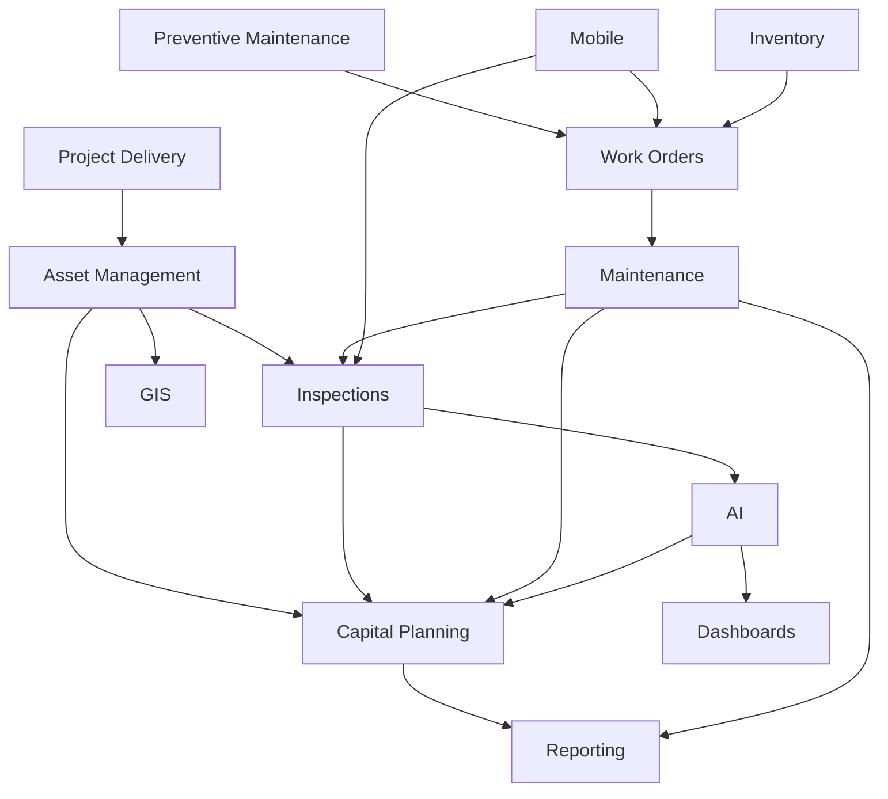

# Domains — Table of Contents

The domain documents describe the cross-cutting capabilities that underpin both Masterworks and Primus. Each domain is a building block of the platform — it appears in multiple product contexts and must be designed to serve both public and private sector use cases. Reading the domain document before implementing features in that domain is required, not optional.

---

## Domain Documents

| # | Domain | Description | Key Products |
|---|--------|-------------|-------------|
| 01 | [Asset Management](asset-management.md) | The asset registry — classification, geometry, condition, ownership, data quality | All |
| 02 | [Capital Planning](capital-planning.md) | Capital needs calculation, budget optimization, TAMP, multi-year programs | Plan, Maintain |
| 03 | [Project Delivery](project-delivery.md) | Project lifecycle, the Build → Maintain handoff, closeout data requirements | Build |
| 04 | [Maintenance](maintenance.md) | Maintenance intelligence vs. execution, EAM integration, condition signals | Maintain |
| 05 | [Inspections](inspections.md) | Inspection types, rating scales, mobile workflow, AI-assisted defect detection | Maintain |
| 06 | [Preventive Maintenance](preventive-maintenance.md) | PM programs, templates, work orders, deterioration model calibration | Maintain |
| 07 | [Inventory](inventory.md) | Spare parts, materials, tools, ERP integration | Maintain (Native Mode) |
| 08 | [GIS](gis.md) | Spatial data, WGS84, PostGIS, Mapbox GL JS, ArcGIS integration | All |
| 09 | [Work Orders](work-orders.md) | Work order lifecycle, creation triggers, EAM integration | Maintain |
| 10 | [Mobile](mobile.md) | Field experience, offline capability, PWA, sync | Maintain, Build |
| 11 | [AI](ai.md) | All AI capabilities: prediction, optimization, NLQ, anomaly detection | Maintain |
| 12 | [Dashboards](dashboards.md) | Executive, asset manager, field inspector dashboards | All |
| 13 | [Reporting](reporting.md) | Standard reports, custom builder, regulatory compliance, exports | All |
| 14 | [Future Vision](future-vision.md) | 5-10 year platform roadmap: digital twins, IoT, drones, SHM | All |

---

## Domain Dependency Map

Some domains depend on others. Understanding these dependencies helps engineers make the right architectural decisions when adding features.

---

## Notes for Engineers

- **Asset Management is the foundation.** Everything else depends on a well-structured asset registry. If asset records are incomplete, inconsistent, or missing geometry, every downstream capability is degraded.

- **Multi-tenant isolation is universal.** Every domain query is scoped to the tenant. This is enforced at the EF Core query filter level, but every engineer must understand why it matters: data from State DOT A must never be visible to State DOT B.

- **Integration points are everywhere.** The domains don't assume native data entry as the primary path. Most of the data in a Maintain deployment came from somewhere else — an EAM, a GIS, a bulk import. Domain designs must account for all data origins.

- **Calculation engines are in Application/Calculations/.** The RUL calculator, the ARV calculator, the risk scorer — these are pure C# classes with no I/O. Every calculation engine has a corresponding specification in vault/calculations/ and a test class in UnitTests/. Read the spec before touching the code.

---

*See also: [Masterworks](../masterworks/README.md) | [Primus](../primus/README.md)*
