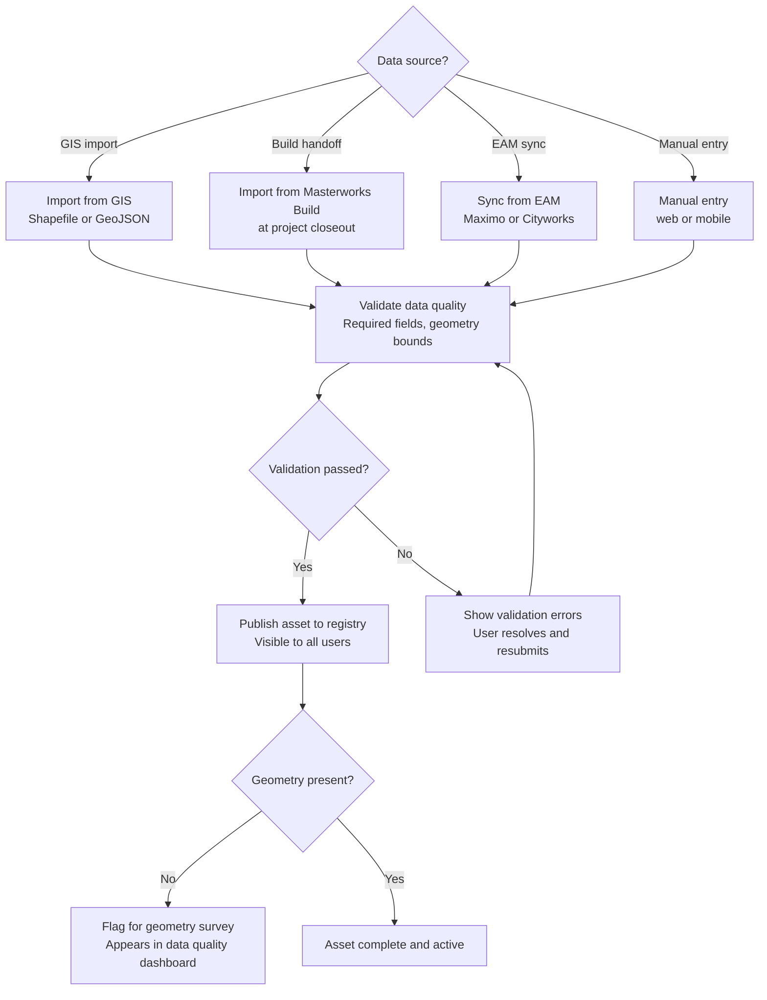
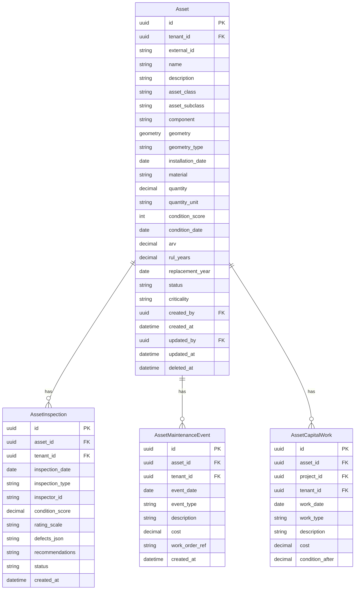

# Domain: Asset Management

## Purpose

The asset registry is the foundation on which every other capability in the Aurigo platform is built. Before you can assess condition, you need to know what assets exist. Before you can model deterioration, you need to know the asset's type, age, and material. Before you can prioritize capital investment, you need to know the asset's replacement value. Before you can display assets on a map, you need the asset's geometry.

The asset management domain defines how infrastructure assets are identified, classified, located, described, and tracked across their entire lifecycle. It is not just a database of things. It is a structured representation of physical infrastructure that enables every analytical capability that makes Masterworks and Primus valuable.

Asset data quality is the single biggest determinant of whether the platform delivers its promised value. An organization with 80% of its assets in the registry, with location data on all of them and current condition ratings on 70%, can produce meaningful capital needs analysis and defensible TAMP reports. An organization with 40% of its assets, missing locations on half, and condition data on 30% cannot produce reliable analysis — it can only produce estimates with wide error bounds.

This means that the asset management domain is not just a technical concern. It is a data governance concern, a user experience concern, and a customer success concern. The mobile inspection workflow, the bulk import tools, the data quality dashboard, and the automated handoff from Build — all of these features exist to drive asset data completeness and currency.

## Business Value

**Capital planning accuracy:** A capital needs analysis based on 95% complete asset data is far more accurate than one based on 60% complete data. The error in the capital needs estimate scales roughly with the inverse of the completeness percentage. Missing assets mean underestimated capital needs, which means underfunded programs, which means deferred maintenance backlogs.

**Regulatory compliance:** TAMP requirements specify minimum asset inventory completeness standards. NHS pavement must be 100% inventoried with standardized condition measures. NHS bridges must have current NBI records. An incomplete asset registry is a TAMP compliance finding.

**Insurance and financial reporting:** Asset Replacement Value (ARV) — the estimated cost to replace all assets at current prices — is a financial statement item for many organizations. It is also used for property insurance valuation. An accurate, complete asset registry is the foundation for ARV calculation.

**Risk management:** The risk score for a given asset depends on knowing the asset's condition, its importance (criticality, traffic volume, production contribution), and the consequence of its failure. Missing data on any of these dimensions degrades the risk score and the capital prioritization decisions that flow from it.

## Personas

**GIS Analyst (Agency):** Responsible for maintaining the spatial accuracy of the asset registry. Imports GIS layers from Esri, resolves geometry conflicts, validates coordinate systems, and maintains the linkage between the Maintain asset registry and the GIS of record.

**Asset Inventory Coordinator:** Maintains the completeness and accuracy of the asset attribute data. Manages bulk imports, resolves data conflicts from EAM integration, and drives the data quality score improvement process.

**Field Data Collector:** Uses the mobile app to record new assets (discovered during inspections) and update asset attributes in the field (e.g., recording a newly replaced sign's retroreflectivity value).

**Capital Program Manager:** Consumes the asset registry as the foundation for capital needs analysis. Needs confidence in the completeness of the registry to trust the capital needs outputs.

## User Stories

1. **As an Asset Inventory Coordinator**, I want to import the county's asset inventory from a GIS shapefile so that I can populate the asset registry without manually re-entering data that already exists in our GIS system.

   *Acceptance criteria:* Import wizard accepts Shapefile, GeoJSON, and KMZ. Field mapping allows user to match GIS attribute fields to Maintain schema fields. Validation report shows: records imported, records with validation errors (geometry outside expected bounds, required fields missing), and a preview of the first 20 records before commit.

   > **Status: ⏳ Backlog** — GIS import wizard (field mapping UI, batch validation, preview) is not yet shipped. Programmatic TxDOT shapefile import (`TxDotShapefileImporter`) is implemented as a seed-time utility. The interactive import wizard is a Beta milestone deliverable.

2. **As a GIS Analyst**, I want to see which assets are missing geometry so that I can prioritize the field survey effort to fill the most important gaps first.

   *Acceptance criteria:* Data quality dashboard shows percentage of assets with geometry by asset class. Drill-down shows list of assets missing geometry, sortable by condition score and risk score. Assets missing geometry are shown in a different color on the map (or excluded, based on user preference).

3. **As a Field Data Collector**, I want to add a new culvert asset from my phone while I am in the field so that newly discovered assets are captured immediately rather than waiting for an office data entry session.

   *Acceptance criteria:* "Add asset" flow in mobile app captures: asset class (dropdown), location (GPS auto-filled or map tap), key attributes (varies by asset class). New asset is saved locally and synced when connectivity is restored. New asset appears in the registry immediately after sync.

4. **As a Capital Program Manager**, I want to see the data quality score for each asset class — showing the percentage with complete attributes and current condition ratings — so that I can assess the reliability of the capital needs analysis before presenting it to leadership.

   *Acceptance criteria:* Data quality dashboard shows, for each asset class: percentage with complete required attributes, percentage with geometry, percentage with condition rating from within the past inspection cycle, overall completeness score. Trend over the past 12 months for each metric.

5. **As an Asset Manager**, I want to search for assets by location (draw a polygon on the map), by asset class, by condition score range, and by age so that I can build targeted lists for inspection campaigns or capital planning analysis.

   *Acceptance criteria:* Asset search supports: text search (asset ID, route/road name), filter by asset class, filter by condition score range, filter by installation year range, spatial filter (draw polygon or radius on map). Results show on map and in sortable table. Export to CSV.

6. **As an Asset Manager**, I want to view an asset's complete history — all inspections, all maintenance events, all capital work — on a single page so that I can understand the full context of the asset's condition without navigating across systems.

   *Acceptance criteria:* Asset detail page shows: asset attributes (classification, geometry, installation date, material, dimensions), condition timeline (chart of condition score vs. time with inspection dates), maintenance event history (list with date, type, and description), capital work history (projects that addressed this asset), current deterioration model and RUL projection.

7. **As a GIS Analyst**, I want to update the geometry of an existing asset by importing a new survey file so that the asset's location reflects the most recent survey data.

   *Acceptance criteria:* Geometry update records the previous geometry as a historical record (not overwritten). Update stores the date, source system, and user ID. Previous geometry can be restored if the update was in error.

8. **As an Asset Manager**, I want to retire an asset when it is demolished or removed from service so that it no longer appears in active inventory or capital needs analysis but its historical record is preserved.

   *Acceptance criteria:* Retirement captures: date, reason (replaced, demolished, sold, decommissioned), and reference to the replacement asset (if applicable). Retired assets are excluded from active inventory counts, condition assessments, and capital needs analysis. Retired assets are visible in historical reports and can be unretired if marked in error.

## Typical Workflows

### Asset Onboarding Workflow



### Asset Lifecycle Workflow

1. **Asset commissioned** (from Build closeout or manual entry): Asset record created with classification, geometry, initial condition, material specs, warranty
2. **Asset active (maintenance phase):** Periodic inspections update condition score; maintenance events are recorded; deterioration model updates
3. **Asset rehabilitation:** Major capital work resets or improves the condition baseline; new material specs recorded if replacement-in-kind not done
4. **Asset retirement:** Asset is removed from service; record marked as retired; replacement asset linked

## Business Rules

1. **Asset classification hierarchy:** All assets must be classified at the three-level hierarchy: Class → Subclass → Component. Classification is immutable after an inspection has been recorded.

2. **Geometry SRID:** All geometry is stored in WGS84 (SRID 4326). Geometry imported in other coordinate systems (e.g., state plane projections) is transformed at import.

3. **Asset ID uniqueness:** Asset IDs are unique within a tenant. The system auto-generates a UUID for each asset; agencies may also specify their own external ID from their GIS or EAM.

4. **Required fields for publication:** An asset cannot be published (active) without: asset class, asset subclass, tenant ID, and creation date. Geometry is required for assets of linear or area type. Point assets can be published without geometry (flagged in data quality).

5. **Multi-tenancy isolation:** All asset queries are scoped to the current tenant. There is no cross-tenant query. This is enforced at the ORM level via global query filters.

6. **Condition score range:** Condition scores are stored on a 0-5 scale (0 = failed, 5 = excellent). Rating scales from other systems (NBI, IRI, PASER) are normalized to 0-5 for internal storage but displayed in the original scale in the UI and reports.

7. **Installation date required for RUL calculation:** An asset without an installation date cannot have a Remaining Useful Life calculated. The system will calculate RUL only if installation date is known.

8. **Immutable audit fields:** Created date, created by, tenant ID, and asset class are immutable after creation. Changes require an admin-level operation with documented justification.

9. **Geometry type by asset class:** Roads and pipelines are LineString or MultiLineString. Individual assets (bridges, signs, culverts) are Point. Districts, watersheds, and maintenance zones are Polygon. The system validates geometry type at import.

10. **ARV recalculation trigger:** Asset Replacement Value is recalculated when the unit cost library is updated (annually or when a manual update is applied). The prior ARV is preserved in the history log.

## Data Model



## Integration Points

- **Masterworks Build:** Asset records are created automatically at project closeout. The Build data model maps to the Maintain Asset entity via the closeout handoff mapping configuration.
- **EAM systems (Maximo, Cityworks):** Asset master records and inspection/maintenance history are read from the EAM via REST API integration. The integration layer normalizes EAM data to the Maintain schema.
- **GIS systems (Esri ArcGIS, open-source):** Asset geometry is imported from GIS layers (Shapefile, GeoJSON, Feature Services). The GIS is typically the geometry-of-record; Maintain reads and uses it.
- **Masterworks Plan:** The capital needs list in Plan includes the asset ID for each need, linking the Plan project pipeline to the Maintain asset that drives the need.

## Future Evolution

- **Digital twin linkage:** Associate a 3D BIM or point cloud model with each asset record, enabling spatial visualization beyond 2D map geometry
- **IoT sensor association:** Link sensor feeds (structural monitoring, flow meters, vibration sensors) to asset records, feeding real-time condition signals into the asset condition time series
- **AI-powered asset discovery:** Computer vision model that identifies assets in drone imagery or street-level photos and creates draft asset records for review
- **Cross-tenant benchmarking:** Anonymized aggregate statistics by asset class and vintage (opt-in) to enable peer benchmarking without exposing individual customer data

---

## Complete Data Dictionary — Asset Entity

Every field in the Asset table with its type, cardinality, source-of-truth, and business rule. This is the authoritative reference.

| Field | Type | Nullable | Source | Constraint | Notes |
|-------|------|----------|--------|-----------|-------|
| id | UUID | No | System | PK, generated | Never reused, never regenerated |
| tenant_id | UUID | No | Auth context | FK, immutable | Enforced by global query filter |
| external_id | varchar(64) | Yes | Customer GIS/EAM | Unique per tenant + system | E.g., Maximo assetnum, NBI Structure Number |
| external_source | varchar(32) | Yes | System | maximo, cityworks, esri, build, native | Data lineage |
| name | varchar(255) | Yes | Customer | — | Display name, e.g., "Main St Bridge" |
| description | text | Yes | Customer | — | Long-form context |
| asset_class | varchar(64) | No | Customer/spec | Immutable after inspection | See asset class registry |
| asset_subclass | varchar(64) | No | Customer/spec | Immutable | E.g., MFG_EQUIP > CNC_MILL |
| component | varchar(64) | Yes | Customer | — | Sub-part of asset, e.g., "Deck" of a bridge |
| parent_asset_id | UUID | Yes | System | FK to Asset | Enables hierarchical composition |
| geometry | geometry(4326) | Yes | GIS or field capture | Valid SRID 4326 | See GIS domain |
| geometry_source | varchar(32) | Yes | System | gis, field-gps, manual | Provenance |
| geometry_captured_at | timestamp | Yes | System | — | For staleness detection |
| geometry_accuracy_m | decimal(6,2) | Yes | GPS device | — | Meters of horizontal accuracy |
| installation_date | date | Yes | Build handoff / Customer | ≤ today | Required for RUL calc |
| commissioning_date | date | Yes | Build handoff | ≥ installation_date | When placed in service |
| design_life_years | int | Yes | Class default or customer | > 0 | Used by lifecycle model |
| material | varchar(128) | Yes | Class-specific | — | E.g., "Prestressed Concrete", "HDPE" |
| manufacturer | varchar(128) | Yes | Customer | — | For rotating equipment mainly |
| model_number | varchar(128) | Yes | Customer | — | Serial-level identification |
| serial_number | varchar(128) | Yes | Customer | — | Unique per manufacturer |
| quantity | decimal(15,4) | Yes | Customer | > 0 | E.g., lane-miles, feet, count |
| quantity_unit | varchar(16) | Yes | Customer | Enum | ft, m, lane-mi, count, kW, etc. |
| replacement_unit_cost | decimal(15,2) | Yes | Cost library or override | ≥ 0 | Per quantity_unit |
| condition_score | decimal(4,2) | Yes | System (derived from inspections) | 0.00–5.00 | Rating-scale-normalized |
| condition_scale | varchar(16) | Yes | Customer | Enum | native, pci, iri, nbi, paser, custom |
| condition_date | date | Yes | System (latest inspection) | — | Freshness indicator |
| deterioration_model_id | UUID | Yes | Customer | FK | Which model applies |
| rul_years | decimal(6,2) | Yes | System (computed) | ≥ 0 | Cached; recomputed nightly |
| rul_confidence | decimal(4,3) | Yes | System | 0.000–1.000 | Wide interval if < 3 inspections |
| replacement_year | int | Yes | System (computed) | — | commissioning_date year + design_life or RUL |
| arv | decimal(15,2) | Yes | System (computed) | ≥ 0 | replacement_unit_cost × quantity × infl adj |
| arv_calculated_at | timestamp | Yes | System | — | For freshness |
| risk_score | decimal(4,2) | Yes | System (computed) | 0.00–5.00 | probability × consequence |
| criticality | int | No | Customer | 1–5 | 5 = safety-critical |
| status | varchar(24) | No | System | Enum, see lifecycle states | Default: `planned` |
| commission_project_id | UUID | Yes | Build handoff | FK to project | Traceability |
| retirement_date | date | Yes | System | ≥ commissioning_date | Set on retirement |
| retirement_reason | varchar(32) | Yes | Customer | Enum | replaced, demolished, sold, decommissioned, lost |
| replacement_asset_id | UUID | Yes | Customer | FK to Asset | For retirement replaced-by |
| owner_org_id | UUID | Yes | Customer | FK to org | E.g., "District 5 Maintenance" |
| custodian_user_id | UUID | Yes | Customer | FK to user | Named engineer accountable |
| custom_attributes_json | jsonb | Yes | Customer | Validated by schema | Class-specific extras |
| created_by | UUID | No | System | FK to user, immutable | Audit |
| created_at | timestamp | No | System | immutable | Audit |
| updated_by | UUID | Yes | System | FK to user | Audit |
| updated_at | timestamp | Yes | System | — | Audit |
| deleted_at | timestamp | Yes | System | — | Soft delete |
| version | int | No | System | monotonic | Optimistic concurrency |

**Change-log fields** (populated automatically by the SaveChangesInterceptor):
- `_history` — event source stream, all changes across all fields, JSONB.
- `_lineage` — chain of external systems that touched this record.

---

## Asset Lifecycle States

The `status` field is a formal state machine. Illegal transitions raise a domain exception.

```
planned → under_construction → active
                                ↓
                             active → under_rehabilitation → active
                                ↓
                             active → out_of_service → active (return)
                                                    → retired
```

| State | Meaning | Countable in inventory | Included in TAMP | Editable |
|-------|---------|-----------------------|------------------|----------|
| `planned` | Programmed in Plan but not yet commissioned | No | No | Yes (attributes only) |
| `under_construction` | Build project active | No | No | Attributes editable; not condition |
| `active` | In service, receives inspections | Yes | Yes | Yes |
| `under_rehabilitation` | Capital work in progress | Yes | Yes | Restricted — condition frozen |
| `out_of_service` | Temporarily removed from service (not retired) | Yes (flagged) | Optional | Restricted |
| `retired` | Removed from service permanently | No | No (historical only) | Read-only |

### Transition rules

- **`planned → under_construction`:** Triggered by Build project entering construction phase, or by manual admin.
- **`under_construction → active`:** Triggered by Build project closeout OR manual "Commission Asset" action. Requires: geometry, initial inspection, warranty, material_spec.
- **`active → under_rehabilitation`:** Triggered by capital project addressing this asset entering construction, or by manual.
- **`under_rehabilitation → active`:** Requires: post-rehab inspection recorded.
- **`active → out_of_service`:** Requires: reason (weather, temporary closure, safety).
- **`out_of_service → active`:** Requires: return-to-service inspection.
- **`active → retired`:** See decommission process below.

Transitions are logged in the audit trail with actor, timestamp, and reason. Cannot skip states; e.g., `planned → active` requires either passing through `under_construction` or an admin override with documented justification.

---

## Decommission Process (End-of-Life)

Retiring an asset is not "delete." It is a controlled process that preserves the historical record for future audits, insurance, and TAMP.

### Required steps to retire an asset

1. **Initiate retirement:** User with appropriate permission opens the "Retire Asset" workflow.
2. **Capture retirement data:**
   - Retirement date (must be ≥ last inspection date; ≤ today)
   - Reason: `replaced`, `demolished`, `sold`, `decommissioned`, `abandoned`, `lost`, `destroyed`
   - Replacement asset reference (required if reason = `replaced`)
   - Retirement narrative (freeform, min 20 chars, required)
   - Supporting documents (optional but recommended)
3. **Approval gate:** Retirement requires approval from a user with `Asset.Retire` permission (typically Asset Manager or supervisor).
4. **Financial impact assessment:**
   - If asset has active warranty — flag for warranty transfer or termination
   - If asset is subject of active capital work — must close or transfer the capital work first
   - If asset has active inspections in draft — must be resolved first
5. **Deferred operations:**
   - Remove from active inspection queue
   - Remove from active capital needs list
   - Exclude from all future TAMP/NHPP aggregation
6. **Historical preservation:**
   - All inspection history preserved read-only
   - All maintenance events preserved read-only
   - All capital work history preserved read-only
   - Asset record itself becomes read-only (except for `un-retire` operation)
7. **Notification:** If asset is linked to third-party integration (Maximo, Cityworks), retirement is propagated per integration config.

### Un-retire (reversal)

If a retirement is done in error:
- Must be within 90 days of retirement
- Requires admin-level permission
- Requires documented justification
- Restores prior status; retirement_date is cleared
- Full audit trail preserved

### Bulk retirement (during decommission projects)

For large decommission events (a substation being demolished, a rail line being abandoned):
- Bulk retirement operation processes list of asset IDs
- All same reason, same date
- All same retirement narrative reference
- Same approval gate (single approval for the batch)
- Cannot include assets in inconsistent state

---

## Data Quality Metrics — Formal Definitions

The Data Quality Score is not vibes. It is defined:

**Overall Data Quality Score (DQS) per asset:**

```
DQS = (0.30 × Attribute Completeness)
    + (0.20 × Geometry Completeness)
    + (0.25 × Condition Freshness)
    + (0.15 × Inspection Compliance)
    + (0.10 × Integration Sync Health)
```

- **Attribute Completeness:** % of required fields populated. Required set is per asset_class in the asset class registry.
- **Geometry Completeness:** 1.0 if geometry present AND accuracy_m ≤ 5m; 0.5 if present but stale (> 3 years) or inaccurate; 0.0 if absent.
- **Condition Freshness:** 1.0 if condition_date within class inspection cycle; degrades linearly to 0.0 at 2× cycle.
- **Inspection Compliance:** For assets subject to a mandated cycle (NBIS bridges 24-mo, e.g.), 1.0 if compliant, degrading past due.
- **Integration Sync Health:** For Integrated mode assets, based on trailing 30-day sync success rate for this asset's records.

Tenant-level DQS is the ARV-weighted average across all active assets.

Publication rule: any asset with DQS < 0.4 cannot be published to executive dashboards or exported for federal reporting without an explicit override.

---

*See also: [GIS Domain](gis.md) | [Inspections Domain](inspections.md) | [Capital Planning Domain](capital-planning.md)*
