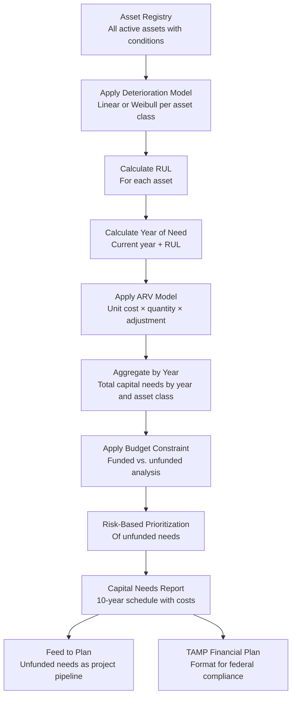

# Domain: Capital Planning

## Purpose

Capital planning is the primary value proposition of the Aurigo platform. Every other capability — condition recording, deterioration modeling, risk scoring, TAMP compliance, integration with EAM systems — exists in service of one outcome: enabling infrastructure owners to make better capital investment decisions.

A capital investment decision is: which assets should receive funding, in what year, at what cost, and what happens if they are not funded? This decision is made under conditions of data uncertainty (condition data is always incomplete), budget constraint (needs always exceed available funding), political pressure (some assets are more politically visible than others), and regulatory obligation (federal compliance requirements must be met).

The capital planning domain provides the analytical engine that transforms asset condition data into capital needs, applies budget constraints to produce a fundable capital plan, and quantifies the risk of deferrals. It does not make the decision — that is a human judgment. It makes the decision defensible.

## Business Value

**Quantified capital needs:** Instead of "we need to replace a lot of roads over the next decade," the capital program manager can say "we have $2.3 billion in capital needs over the next 10 years, of which $1.7 billion is in the NHS pavement program and $0.6 billion is in the bridge program." This specificity is what federal agencies, legislatures, and boards require.

**Risk-based prioritization:** When budget is constrained (it always is), the capital plan must make choices. Risk-based prioritization ensures that the assets that represent the greatest risk — highest probability of failure, highest consequence of failure — receive priority funding. Assets with lower risk can be safely deferred without catastrophic consequence.

**TAMP compliance:** For state DOTs, the capital needs analysis is the financial planning chapter of the TAMP. Producing this from structured data instead of manual spreadsheet work reduces the TAMP preparation effort from months to days and improves accuracy.

**Deferred maintenance quantification:** The backlog — the total cost of all unfunded capital needs — grows as assets deteriorate without investment. Quantifying the backlog is the tool that capital program managers use to make the case for increased funding. A backlog that grew from $1.2B to $1.8B in three years is a compelling argument for a funding increase.

## Deterioration Mathematics

Understanding the deterioration math is essential for anyone implementing or testing the capital planning calculation engines. The specifications below summarize the models; the full specifications are in `vault/calculations/`.

### Linear Deterioration Model

The simplest deterioration model assumes that condition decreases at a constant rate per year:

```
Condition(t) = Condition_0 - (Rate × t)
```

Where:
- `Condition_0` is the initial condition score (at installation or last major rehabilitation)
- `Rate` is the annual deterioration rate (condition points per year)
- `t` is the number of years elapsed since installation or rehabilitation

The linear model is appropriate for:
- Assets where visual inspection data shows approximately linear decline
- Assets where the physical deterioration mechanism is approximately linear (e.g., pavement oxidation and surface wear)
- Assets where inspection history is limited (only 1-2 data points; linear is the only fittable model)

The Remaining Useful Life under the linear model:

```
RUL = (Condition_current - Condition_threshold) / Rate
```

The Year of Need (replacement year):
```
Year_of_need = Current_year + RUL
```

### Weibull Deterioration Model

For assets where deterioration accelerates with age (the most common case for mechanical and structural systems), the Weibull model provides a better fit:

```
Condition(t) = Condition_0 × exp(-(t/λ)^β)
```

Where:
- `λ` (lambda) is the scale parameter — the characteristic life (the time at which condition has deteriorated to `1/e` ≈ 36.8% of its initial value)
- `β` (beta) is the shape parameter:
  - `β < 1`: Decreasing hazard rate (infant mortality — rarely used for infrastructure)
  - `β = 1`: Constant hazard rate (equivalent to exponential deterioration)
  - `β > 1`: Increasing hazard rate (wear-out failure — most common for infrastructure assets)
  - `β = 2`: Rayleigh distribution (moderate wear-out)
  - `β = 3.5`: Approximately normal distribution (advanced wear-out)

The Weibull model requires fitting `β` and `λ` to observed inspection data. With three or more inspection points, the parameters are estimated by minimizing the sum of squared residuals between the model and the observations. With fewer than three points, the model uses asset class defaults from the unit cost library.

RUL under the Weibull model is solved numerically by finding the time `t` such that:
```
Condition_0 × exp(-(t/λ)^β) = Condition_threshold
```

Solving for t:
```
t = λ × (ln(Condition_0 / Condition_threshold))^(1/β)
RUL = t - Age_current
```

### Asset Replacement Value (ARV)

The replacement value of an asset is the estimated cost to replace it at current prices:

```
ARV = Unit_cost × Quantity × Location_adjustment_factor
```

Where:
- `Unit_cost` is the current market cost per unit (from the unit cost library, updated annually)
- `Quantity` is the asset's physical quantity (lane-miles for pavement, square feet for bridge deck, etc.)
- `Location_adjustment_factor` is a geographic cost adjustment (urban vs. rural, state-level cost indices)

The unit cost library is maintained per asset class and per year. Unit costs are sourced from:
- RS Means construction cost data (for building and civil assets)
- FHWA cost data (for highway assets)
- Tenant-specific actual cost data (imported from historical project cost records)

When actual cost data from Masterworks Build is available for a tenant, the system weights tenant-specific data more heavily than the generic library data.

## Capital Needs Calculation Workflow



## Budget-Constrained Optimization

When capital needs exceed available budget (the standard condition), the capital planning module applies a risk-based optimization to determine which assets receive priority funding. The optimization is configurable by the tenant through a weighting scheme:

**Priority score = (w₁ × Condition_urgency) + (w₂ × Safety_risk) + (w₃ × Federal_eligibility) + (w₄ × Cost_benefit) + (w₅ × Geographic_equity)**

Where:
- `w₁ through w₅` are weights set by the capital program manager (must sum to 1.0)
- `Condition_urgency` = normalized score based on distance from replacement threshold (higher = more urgent)
- `Safety_risk` = risk of catastrophic failure (based on condition, criticality, and adjacent use)
- `Federal_eligibility` = 1.0 if eligible for current federal program, 0.5 if eligible with local match, 0.0 if not eligible
- `Cost_benefit` = condition improvement per dollar (lower cost + higher condition impact = higher score)
- `Geographic_equity` = inverse of funding received by the asset's jurisdiction in prior periods (prevents geographic concentration of investment)

Assets are sorted by priority score. The optimization fills each budget year starting with the highest-priority assets until the budget is exhausted. Remaining assets are deferred to subsequent years or remain in the unfunded backlog.

**Hard constraints that override prioritization:**
- Assets with safety risk score above the "immediate action threshold" are funded regardless of priority score
- Federal funding programs with non-discretionary allocation rules are applied first before the optimization runs on the remaining budget

## TAMP Compliance

The Transportation Asset Management Plan (TAMP) financial planning chapter must demonstrate:

1. **Total capital investment needs** by asset class over the 10-year planning horizon
2. **Projected funding** by source (federal, state, local) over the 10-year horizon
3. **Investment strategies** for each asset class (what maintenance and capital investment strategies will be applied)
4. **Performance outcomes** under the proposed investment strategy (predicted condition by year)
5. **Risk analysis** for assets not funded within the planning horizon

The capital planning domain produces all five components. The TAMP module in Masterworks Maintain formats them according to the FHWA TAMP structure.

**Key TAMP compliance rules:**
- NHS pavement must be inventoried to 100% of lane-miles
- NHS bridge condition must use NBI items 58, 59, 60, 61, 62 for the condition determination
- Condition measures must be standardized (IRI for pavement, NBI for bridges) — custom condition scales cannot be used for TAMP compliance purposes
- Financial plan must identify funding sources by federal program code and state budget category
- Performance gap analysis must compare current condition to the TAMP performance targets approved in the prior TAMP cycle

## User Stories

1. **As a Capital Program Manager**, I want to see the total capital needs for my network over the next 10 years, broken down by asset class and by year, so that I can compare the needs to my projected funding and quantify the gap.

2. **As a State DOT Asset Manager**, I want to configure the deterioration model parameters for each asset class — choosing between linear and Weibull, and setting the model parameters — so that the capital needs forecast reflects the actual deterioration behavior of our specific asset network.

3. **As a Capital Program Manager**, I want to run a budget scenario analysis that shows what happens to network condition under three funding levels (current, +20%, -20%) so that I can quantify the impact of budget changes to present to the legislature.

4. **As a State DOT Asset Manager**, I want the capital needs forecast to automatically exclude projects that are already in the funded capital program so that the unfunded needs report shows only the true gap.

5. **As a Capital Program Manager**, I want to adjust the priority weighting scheme (condition urgency, safety risk, federal eligibility, cost-benefit, geographic equity) and see the capital plan update in real time so that I can explore different prioritization philosophies before committing to a plan.

6. **As a State DOT Asset Manager**, I want to generate the TAMP financial plan chapter, formatted to FHWA requirements, from the capital needs data so that TAMP preparation time is reduced from months to days.

7. **As a County Engineer**, I want to see the deferred maintenance backlog — the total cost of assets past their replacement date that are not funded — and how it grows year over year under the current funding level so that I can show the elected board the consequence of underfunding.

8. **As a CFO at a Private Company**, I want the capital needs forecast to show the NPV and payback period for each capital investment so that I can apply consistent financial screening criteria across all capital requests.

## Business Rules

1. **Minimum inspections for model fit:** The Weibull model requires at least three inspection data points to fit model parameters. With fewer points, the system uses asset class defaults and labels the calculation as "estimated."

2. **Replacement threshold configurable by asset class:** The condition score threshold that triggers a replacement recommendation is configurable per asset class. The default is 2.5/5.0. Agencies may set different thresholds for different asset classes based on their risk tolerance.

3. **ARV cannot exceed a configurable maximum per unit:** To prevent data entry errors from generating absurd capital needs totals, ARV per unit has a configurable maximum that triggers a validation warning.

4. **Budget period constraint:** The optimization cannot defer all spending to the last year of the planning period. Federal programs require that funding be obligated within defined periods. The optimization respects these constraints when federal funding sources are specified.

5. **Capital needs exclude retired assets:** Retired assets are automatically excluded from the capital needs calculation. Assets that are retired within the planning horizon are excluded from needs in years after retirement.

6. **Year of need minimum is current year:** RUL calculations that produce a negative RUL (the asset is already past its theoretical replacement date) result in a Year of Need of the current year.

7. **ARV calculation audit trail:** ARV calculations are logged with the unit cost version used, the quantity, and the date. When unit costs are updated, the previous ARV values remain in history and new values are calculated.

## Integration Points

- **Asset Management Domain:** Condition scores and deterioration history from the asset registry are the primary inputs to the capital needs calculation.
- **Masterworks Plan:** Capital needs from Maintain flow into Plan as unfunded project needs. Funded projects in Plan feed back into Maintain to exclude funded assets from the unfunded backlog.
- **Reporting Domain:** Capital needs reports, TAMP financial plan, deferred maintenance backlog — all produced by the reporting layer from capital planning domain data.
- **AI Domain:** The capital optimization and scenario analysis capabilities use AI to solve the constrained optimization problem when the number of assets and constraints makes the greedy algorithm suboptimal.

## Future Evolution

- **Automated federal funding matching:** AI identifies which unfunded capital needs are eligible for specific federal grant programs and suggests grant applications based on the needs list
- **Climate risk adjustment:** Deterioration models adjusted for projected climate impacts (temperature extremes, precipitation changes) on specific asset types in specific geographies
- **Stochastic simulation:** Monte Carlo simulation of capital needs under uncertain deterioration rates, enabling confidence intervals around the capital needs forecast rather than point estimates
- **Multi-agency coordinated planning:** Coordinated capital planning across adjacent agencies (e.g., state DOT and county road department) where asset networks interact

---

*See also: [Asset Management Domain](asset-management.md) | [Inspections Domain](inspections.md) | [AI Domain](ai.md) | [Masterworks Maintain](../masterworks/maintain.md)*
