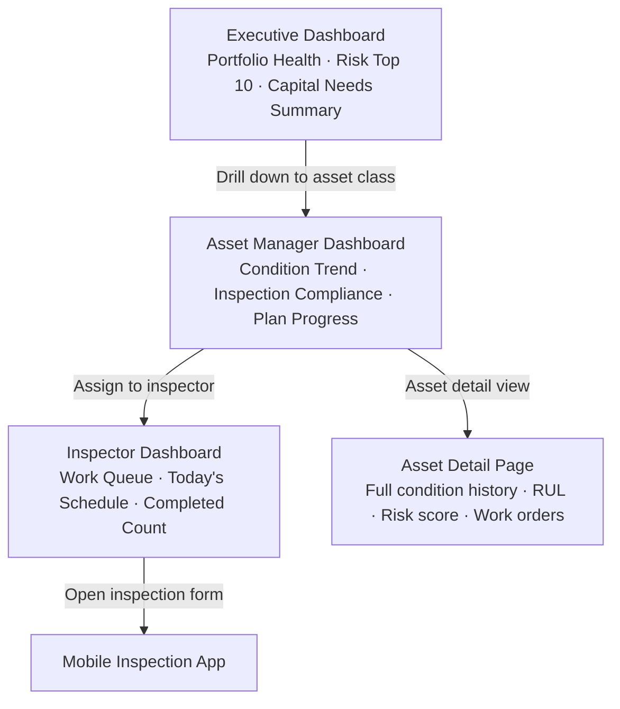

# Dashboards

## Purpose

Dashboards in Aurigo Maintain translate the complexity of managing hundreds or thousands of infrastructure assets into actionable intelligence for three distinct audience types: executives who need portfolio health in 30 seconds, asset managers who need operational control, and inspectors who need their daily work queue. The wrong information to the wrong audience creates cognitive overload; the right information at the right level creates confidence and clarity.

This document defines the three-tier dashboard architecture, the KPIs for each tier, design principles, and the data model that supports real-time dashboard rendering.

---

## Business Value

Public infrastructure agencies spend significant political capital producing condition reports and capital justifications for boards, councils, and state transportation officials. Before Maintain, producing a portfolio health slide for a board meeting required manually aggregating spreadsheets from multiple department managers — a process that took 2–3 days and frequently produced inconsistent numbers.

With Maintain dashboards, the Program Director opens a screen that shows the complete portfolio health picture in real time. Board presentations are accurate, consistent, and current. The agency looks competent and data-driven — which improves relationships with federal oversight bodies and facilitates TAMP approval.

The measurable value: agencies report 80% reduction in reporting preparation time and elimination of data inconsistency errors between board packages and audit submissions.

---

## Dashboard Hierarchy



---

## Tier 1: Executive Dashboard

### Audience

Program Directors, Agency Directors, CFOs, elected officials reviewing capital programs. These users may look at the dashboard once a week or once a month. They have zero tolerance for complexity. Every number must be explained in plain English.

### Core KPIs

| KPI | Definition | Target/Alert Threshold |
|---|---|---|
| Portfolio Health Score | Weighted average condition score across all managed assets (0–100) | Alert if < 60 |
| Assets in Poor Condition | Count and % of assets with condition score < 40 | Alert if > 15% of portfolio |
| Assets Overdue for Inspection | Count of assets whose inspection due date has passed | Alert if > 5% of portfolio |
| Capital Needs (Current Year) | Approved capital budget vs. committed work orders | Alert if committed > 110% |
| 10-Year Capital Gap | Total estimated capital need minus total projected budget (cumulative) | Red if gap > 20% |
| Top 10 Risk Assets | The 10 assets with the highest risk score, with risk score and recommended action | Always visible |
| Open Work Orders | Count by status: Open, In Progress, On Hold, Pending Close | — |
| EAM Sync Health | Last successful sync timestamp, error count (if integrated) | Alert if last sync > 24h ago |

### Visualizations

**Portfolio Health Gauge**
A circular gauge from 0–100 with colored zones (green > 70, yellow 50–70, red < 50). The current score is displayed prominently. Below the gauge, a trend arrow shows whether the portfolio is improving or declining compared to 12 months ago.

**Capital Needs by Year (Waterfall/Bar Chart)**
A 10-year bar chart showing estimated capital need per year (grey) overlaid with approved budget (blue). Years where need exceeds budget are highlighted in red. This is the primary "budget sufficiency" visualization and is the most-requested chart for board presentations.

**Asset Condition by Class (Stacked Bar)**
One column per asset class (Bridges, Roads, Culverts, Signs, etc.) with condition distribution stacked: Good (>70), Fair (40–70), Poor (<40). Allows executives to see which asset classes are most degraded.

**Top 10 Risk Assets (Table)**
Asset name | Class | Condition | Risk Score | Recommended Action | Last Inspection. Sortable by risk score. Clicking any row opens the asset detail page.

**Investment ROI Trend (Line Chart)**
For agencies that have been on Maintain for > 2 years: actual portfolio condition trend vs. what it would have been with no intervention (model projection). Shows the value of capital investment as a measurable condition improvement.

### Print-Ready Mode

The executive dashboard has a "Print-Ready" mode that reformats content for A4/Letter paper in portrait orientation, using print-safe colors (no dark backgrounds), and a standard header/footer with agency name, date, and report reference. This mode is used for board presentation packets.

---

## Tier 2: Asset Manager Dashboard

### Audience

Capital Asset Managers, Program Managers, Public Works Directors. These users work in Maintain daily. They need operational control: which assets need attention, are inspections getting done on time, how is the capital plan progressing?

### Core KPIs

| KPI | Definition | Target/Alert Threshold |
|---|---|---|
| Inspection Compliance Rate | % of assets inspected on schedule (within due date) | Target > 90%; alert < 80% |
| Overdue Inspections | Count with days overdue, sorted descending | Zero target |
| Capital Plan Progress | % of approved projects with work orders created, in progress, or closed | By quarter |
| Deteriorating Assets (Anomaly) | Assets flagged by anomaly detection as deteriorating faster than predicted | Alert on any new flag |
| Condition Trend (Portfolio) | Rolling 12-month average condition score — is the portfolio getting better or worse? | Alert on 3-point decline |
| Work Order Backlog | Open + In Progress + On Hold work orders, by priority | Alert if Critical backlog > 10 |
| EAM Integration Health | Last sync time, records pushed/received, errors in last 24h | Alert on errors |
| Budget Burn Rate | YTD actual capital spend as % of annual budget | Alert if > 110% by mid-year |

### Visualizations

**Condition Trend Over Time (Line Chart)**
12-month rolling average condition score. Segmented by asset class. Shows whether management actions are improving the portfolio or whether deterioration is outpacing investment.

**Inspection Calendar Compliance (Heatmap)**
A calendar heatmap (GitHub-style) showing inspection activity over the past 12 months. Days with high inspection activity are dark green; days with no activity are light grey. Identifies periods of under-inspection (vacation periods, weather, staff shortages).

**Capital Plan Gantt View**
A simplified Gantt chart showing approved projects vs. timeline. Work orders that are open, in progress, or closed appear as filled bars. Projects without work orders appear as empty bars (not started). Click any bar to see work order details.

**Work Order Status Funnel**
A funnel or sankey diagram: Pending Approval → Open → In Progress → Pending Completion → Closed. Widths proportional to work order counts. Quickly shows where work is bottlenecking (e.g., large "Pending Approval" pool means the approval process is a bottleneck).

**Asset Health Map**
A Mapbox map of all managed assets, colored by condition score (green/yellow/orange/red). Filter controls by asset class, condition range, and last inspection date. Click any asset to open asset detail. Cluster at low zoom levels; individual markers at high zoom.

**EAM Sync Status Panel**
If the tenant uses EAM integration: last sync timestamp, records synced in/out, error log with expandable details. "Trigger Manual Sync" button for ad-hoc refresh.

### Filters and Personalization

The asset manager dashboard supports persistent filters: the user can set their default view to a specific district, asset class, or date range, and the dashboard loads with those filters pre-applied on every login.

---

## Tier 3: Inspector Dashboard

### Audience

Field inspectors. Viewed primarily on mobile devices (tablet or phone). The goal is ruthless simplicity: the inspector needs to know what they're doing today, where to go, and that their completed work has been received.

### Core KPIs

| KPI | Definition | Display |
|---|---|---|
| Today's Inspections | Inspections assigned and due today | Count badge |
| This Week's Queue | Total assigned inspections due this week | List |
| Completed Today | Count of inspections submitted today | Count with green check |
| Pending Sync | Count of locally saved inspections not yet synced | Badge with sync icon |
| Overdue (My Queue) | Inspections in my queue past their due date | Alert banner |
| Inspection Streak | Consecutive days with at least one completed inspection | Gamification element |

### Visualizations

**My Work Queue (List View)**
Chronological list of assigned inspections: asset name, asset class, due date, priority, status badge (Not Started / In Progress / Completed / Overdue). Tapping any item opens the inspection form. Sort options: by due date (default), by priority, by proximity (GPS-based).

**Today's Map View**
Mapbox map showing today's inspection locations as pins, with a suggested route (optimized for travel distance). Inspector can open turn-by-turn directions to each asset from this view.

**Completion Summary (Today)**
A simple count: "7 of 12 inspections completed today." A progress bar fills as inspections complete. This creates a small dopamine loop that encourages daily productivity.

**Inspection Streak (Gamification)**
A streak counter showing consecutive days with at least one completed inspection. Agencies using Maintain have reported that this simple gamification element visibly improves inspection consistency, particularly for contract inspectors paid per inspection.

### Mobile-Specific Adaptations

The inspector dashboard is optimized for 375px width (minimum) and thumb-driven navigation:
- All tap targets are minimum 44×44px
- The primary action (Start Inspection) is a large button at the bottom of the screen (within thumb reach)
- No horizontal scrolling in the work queue list
- Offline status indicator is always visible in the header
- Bottom navigation: Queue | Map | Completed | Sync Status

---

## Design Principles

### 1. Progressive Disclosure

Dashboards show summary metrics by default. Details are revealed on demand (click/tap to drill down). This applies at every level: the executive sees a portfolio health score; clicking reveals asset class breakdown; clicking reveals individual assets; clicking reveals condition history. No user is forced to process detail they didn't ask for.

### 2. Mobile-First

All dashboards are designed at 375px first and scaled up to desktop. This ensures that the inspector dashboard is first-class, not an afterthought. Desktop layouts use the extra space for additional chart columns and panel side-by-side layouts, but the core information hierarchy is established in mobile.

### 3. Print-Ready for Board Presentations

Executive dashboards include a print stylesheet that removes interactive elements, uses print-safe color palette (CMYK-friendly, no transparency), and formats for standard paper sizes. Government agencies still use physical board presentation packets; the dashboard must look professional when printed.

### 4. Color-Blind Safe Palette

All condition and risk color bands use a color-blind safe palette (distinguishable by blue-yellow dichromats, the most common form of color blindness). The palette uses:
- Good: #2E7D32 (dark green) — distinguishable from Poor even in deuteranopia
- Fair: #F9A825 (amber) — not red, not green, clearly neutral
- Poor: #C62828 (dark red)

Additionally, all color-coded data is accompanied by text labels or patterns to ensure accessibility even in printed greyscale.

### 5. Real-Time Updates

Dashboard KPIs update in near-real-time via server-sent events (SSE) for metrics that change frequently (sync status, work order counts, new anomaly alerts). For metrics that update less frequently (condition scores, capital plan progress), a 5-minute polling interval is used. The last-updated timestamp is visible on each card.

---

## Data Model for Dashboard Metrics

Dashboard KPIs are not computed on-demand from raw data on each page load. That approach would produce unacceptable query latency at scale (10,000+ assets, years of inspection history). Instead, a **materialized metrics layer** is computed nightly (and on-demand when major data changes occur):

```
DashboardMetricsSnapshot
├── TenantId
├── SnapshotDate
├── PortfolioHealthScore (decimal)
├── AssetsInPoorConditionCount (int)
├── AssetsInPoorConditionPct (decimal)
├── AssetsOverdueForInspectionCount (int)
├── CapitalNeedsCurrentYear (decimal)
├── CapitalBudgetCurrentYear (decimal)
├── CapitalGap10Year (decimal)
├── OpenWorkOrdersCount (int)
├── InProgressWorkOrdersCount (int)
├── CriticalWorkOrdersCount (int)
├── InspectionComplianceRate (decimal)
├── AnomalyFlaggedAssetsCount (int)
└── ComputedAt (timestamptz)

AssetClassMetricsSnapshot
├── TenantId
├── AssetClass
├── SnapshotDate
├── AverageConditionScore
├── GoodConditionCount
├── FairConditionCount
├── PoorConditionCount
├── TotalReplacementValue
└── ComputedAt (timestamptz)
```

Real-time metrics (work order counts, sync status) are computed on-demand from the operational tables, as they are lightweight queries and must reflect the current state immediately.

---

## Future Evolution

**Natural Language Dashboard**
A user types "Show me bridges in District 3 with condition below 50 and no inspection in the past year" and the dashboard dynamically assembles a custom view. Powered by the NL Query capability described in the AI domain document.

**Executive Mobile App**
A stripped-down iOS/Android native app showing only executive KPIs, designed for brief use in meeting rooms: portfolio health, top risks, capital plan status. Push notifications for portfolio health breaches or critical anomaly detections.

**Embedded BI**
Agency analysts can embed any Maintain chart or KPI into their enterprise BI tool (Power BI, Tableau) using a secure iframe embed or a published data connector. This allows agencies to combine infrastructure condition data with other agency data in their existing analytics platforms.

**Benchmark Comparison**
Agencies opt into an anonymized benchmarking pool. The executive dashboard shows how their portfolio condition compares to peer agencies (similar asset class mix, similar climate, similar funding level). "Your bridge portfolio condition is 8 points below the median for comparable DOTs." This provides powerful motivation for investment and helps agencies justify capital requests.
