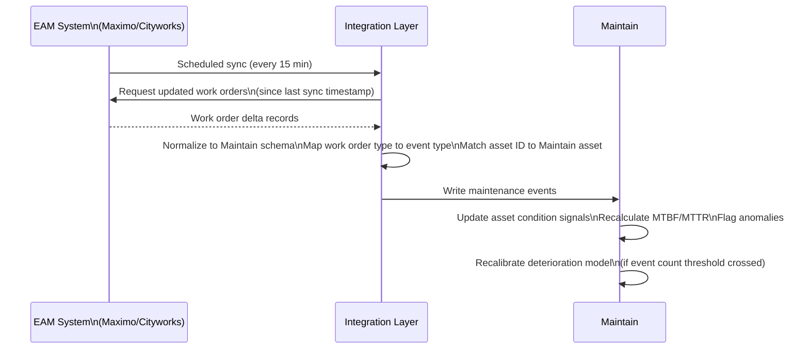

# Domain: Maintenance

## Purpose

The maintenance domain in Aurigo Maintain is fundamentally different from what the word "maintenance" connotes in most enterprise software. In IBM Maximo, SAP PM, or Cityworks, maintenance means work order management: scheduling technicians, tracking parts, capturing labor hours, recording completion. That is maintenance execution, and it is not what Aurigo does.

Aurigo's maintenance domain is **maintenance intelligence** — the use of maintenance history, work order data, and cost patterns to build a richer picture of asset health, calibrate deterioration models, and improve capital planning decisions.

The distinction is critical both for product design and for customer conversations. When a customer asks "does Maintain replace our work order system?" the answer is: no. Your existing work order system continues to do what it does. Maintain reads from it, learns from it, and adds the intelligence layer that tells you which assets are consuming disproportionate maintenance resources, which maintenance patterns indicate accelerating deterioration, and what the capital investment requirement is to reduce reactive maintenance costs.

## Business Value

**Maintenance cost trend analysis:** Reactive maintenance cost per asset, trending over time, is one of the best leading indicators of deterioration. An asset whose annual maintenance cost has doubled over three years is likely approaching economic end-of-life. Maintain surfaces this trend automatically, enabling proactive capital investment rather than continued reactive repair.

**Deterioration model calibration:** Maintenance event data enriches the deterioration model. When a pavement segment requires frequent crack sealing and patching, this is a condition signal that supplements formal inspection data. When a generator has had three reactive maintenance events in two years after seven years of none, the failure rate trend is informative. Maintain uses maintenance event history to calibrate and improve deterioration models.

**Maintenance cost avoidance through capital investment:** One of the most powerful business cases for capital investment is maintenance cost avoidance: replacing an aging asset eliminates the escalating maintenance cost of keeping it running. Maintain calculates this explicitly: the cumulative maintenance cost of operating an asset through its remaining life vs. the one-time capital cost of replacement.

**Integration health monitoring:** For customers in Integrated mode, the connection to their EAM system is a critical dependency. The maintenance domain monitors integration health: sync success rates, data conflicts, and latency. Degraded integration health is surfaced to the customer and to Aurigo's customer success team.

## Personas

**Maintenance Manager (Agency):** Manages the maintenance organization. Uses Maintain to understand which asset classes are consuming the most maintenance resources, identify assets with anomalous maintenance cost trends, and plan the transition from reactive to planned maintenance.

**Asset Manager:** Uses maintenance history in Maintain to calibrate deterioration models and improve capital planning accuracy. Needs to understand the connection between maintenance patterns and asset condition.

**Reliability Engineer (Private Sector):** Analyzes MTBF and MTTR trends, maintenance cost per unit, and failure mode patterns. Uses Maintain to identify root causes of recurring failures and recommend capital interventions.

**Integration Administrator:** Manages the EAM integration configuration. Monitors sync health, resolves data conflicts, and troubleshoot integration failures.

## User Stories

1. **As a Maintenance Manager**, I want to see the total maintenance cost by asset class over the past 5 years, with year-over-year trending, so that I can identify which asset classes are consuming disproportionate maintenance resources.

2. **As an Asset Manager**, I want maintenance event history from our Maximo system to be reflected in the deterioration model for each asset, so that the capital needs forecast accounts for maintenance patterns, not just formal inspection data.

3. **As a Reliability Engineer**, I want to see the MTBF trend for each critical production asset over the past 3 years so that I can identify assets with accelerating failure rates before they cause a major production incident.

4. **As an Asset Manager**, I want to calculate the maintenance cost avoidance that would result from replacing an aging asset class now vs. operating it to failure so that I can make a cost-justified capital investment recommendation.

5. **As an Integration Administrator**, I want to see the EAM sync health dashboard showing the success rate of the last 30 days of sync jobs, any data conflicts, and the current sync latency so that I can detect and address integration issues before they affect data quality.

6. **As a Maintenance Manager**, I want to be alerted when an asset's reactive maintenance event frequency exceeds the threshold that indicates accelerating deterioration so that I can proactively schedule a detailed inspection.

## Typical Workflow: EAM Integration Data Flow

## Business Rules

1. **Maintenance event types:** Events are classified as: Reactive (unplanned failure response), Planned Corrective (defect known, maintenance planned), Preventive (PM schedule), and Capital (major rehabilitation or replacement). The event type determines how the event affects the deterioration model.

2. **Reactive maintenance cost threshold:** An alert is generated when an asset's cumulative reactive maintenance cost in a rolling 12-month period exceeds a configurable percentage of its ARV. Default threshold: 10% of ARV. Above this level, replacement is typically more economical than continued repair.

3. **EAM data normalization:** Maintenance event types from the EAM are mapped to Maintain event types via a configurable mapping table. Different customers use different terminology in their EAMs; the mapping ensures consistent classification.

4. **Sync conflict resolution:** When an EAM sync produces a record that conflicts with an existing Maintain record (same asset, overlapping date, different condition score), the conflict is logged and presented to the integration administrator for resolution. The default resolution is to keep the most recent record.

5. **Maintenance cost currency:** All maintenance cost amounts are stored with the currency and the fiscal year. For trend analysis, costs are normalized to current-year dollars using the Engineering News Record (ENR) Construction Cost Index.

6. **Event date validation:** Maintenance events cannot be dated after today's date. Events from the EAM that have future dates are held in a pending queue and imported when the date passes.

## Integration Points

- **EAM Systems (Maximo, Cityworks, Infor, SAP PM):** Work order records are read from EAM via REST API. The integration adapter normalizes EAM work order fields to the Maintain maintenance event schema.
- **Asset Management Domain:** Maintenance events are linked to assets by the asset ID. The maintenance cost trend is displayed on the asset detail page.
- **Inspections Domain:** Maintenance events can create inspection triggers. A reactive maintenance event on a bridge may trigger a requirement for a detailed inspection within 30 days.
- **Capital Planning Domain:** Maintenance cost trends and MTBF analysis feed into the deterioration model calibration, improving the accuracy of the capital needs calculation.

## Future Evolution

- **IoT-driven event capture:** Automated creation of maintenance events from sensor anomaly alerts, reducing the dependence on manual work order entry
- **NLP work order parsing:** Natural language processing of free-text work order descriptions to extract condition information (defect type, location, severity) and populate structured fields automatically
- **Failure mode library:** Structured taxonomy of failure modes by asset class, enabling failure mode trend analysis at the network level

---

*See also: [Inspections Domain](inspections.md) | [Preventive Maintenance Domain](preventive-maintenance.md) | [Work Orders Domain](work-orders.md)*
