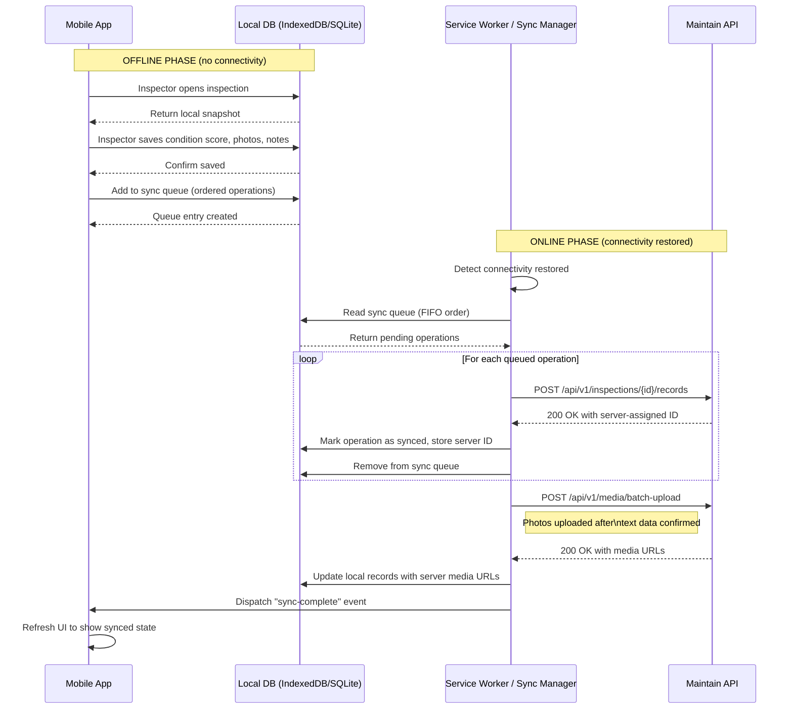

# Mobile

> **Implementation Status (as of 2026-07-19)**
>
> The current shipped product is **desktop-first web application** (React PWA, port 5173). The offline-first mobile experience described in this document is **not yet implemented** — it is the target architecture for a future milestone. Mobile-specific features (offline sync, QR scanning, voice capture, push notifications, IndexedDB local store) are design intent, not shipped functionality.
>
> Priority for implementation: **Beta milestone** (inspection workflow PWA with partial offline support) → **GA milestone** (full offline, Capacitor native wrapper).

## Purpose

The mobile experience in Aurigo Maintain exists for one primary use case: enabling infrastructure inspectors to perform complete, high-quality condition assessments in the field, without any dependency on cellular connectivity. Everything else — dashboards, capital planning, reporting — is desktop-first. Inspections are mobile-first. This distinction drives every mobile architecture decision.

The secondary mobile use case is work order management for field technicians who receive, update, and close work orders from the field. This is a lighter workload than full inspections but shares the same offline infrastructure.

---

## Business Value

Infrastructure inspections happen in places without cell service. Bridges are under highways. Culverts are in drainage channels under roads. Tunnels are inside mountains. Sign bridges are along rural interstates. An inspector who loses cell service mid-inspection and has to re-do the work the next day is an inspector who costs the agency twice as much and introduces consistency errors between visits.

The offline-first mobile experience eliminates the connectivity dependency entirely. An inspector downloads their work queue in the morning, drives to 15 assets in a rural county, completes all 15 inspections with photos and GPS coordinates and condition scores, returns to the office, and syncs. The data appears in Maintain as if it had been entered online. No data loss, no re-entry, no gaps.

The quantifiable value: a team of 4 inspectors can complete a county-wide bridge inventory 40% faster when they don't need to stay near cell towers. Field time is expensive — travel, equipment, traffic control. Anything that increases the number of productive inspection hours per day is a direct cost reduction.

---

## Platform Strategy

### PWA vs. Native — The Decision

Maintain ships as a **Progressive Web App (PWA) first**, with a path to **native iOS/Android for high-criticality offline workflows**.

**PWA (primary delivery vehicle)**:
- Installable from the browser — no app store friction for government IT
- Single codebase shared with the web application
- Service Worker handles offline caching and background sync
- Web APIs cover GPS, camera, storage
- Works on Android Chrome, iOS Safari (with known limitations), and any modern browser
- Push notifications work on Android; iOS support varies by iOS version

**Native wrapper (for high-criticality deployments)**:
- Capacitor.js wraps the PWA in a native container
- Unlocks: background sync when app is closed, native camera with better image compression, Bluetooth peripheral access (for handheld laser distance meters), guaranteed push notification delivery
- Deployed as a managed app via MDM (Mobile Device Management) — government agencies commonly use JAMF or Microsoft Intune
- Required when agency policy prohibits PWAs or when inspection workflows require background sync

The engineering team builds and maintains one codebase (React + TypeScript). The PWA is the default build target. The Capacitor native build is an optional wrapper that adds platform-specific plugins.

### Device Targets

Primary: Android tablet (10-inch) — most common government field device
Secondary: Android phone (6-inch) — for technicians
Secondary: iPad — common among DOT inspection teams
Minimum screen: 375px wide (iPhone SE) — the design system breakpoint

---

## Personas

**Field Inspector (Primary)** — Full-time infrastructure condition assessor. Performs 5–20 asset inspections per day. Works in remote locations, tunnels, rooftops, and under structures. Has gloves on. Can't afford to re-do work. Needs the app to work even when they forget to download their queue before leaving cell range.

**Contract Inspector** — External consultant conducting a one-time bridge inventory. Uses Maintain on a personal device or agency-provided tablet. Lower tolerance for complexity — the UX must be self-explanatory.

**Maintenance Technician** — Receives work orders, updates status in the field, and captures completion photos. Less frequent app user than inspectors.

**Supervisor/Reviewer** — Stays in the office but monitors field progress in real-time (or near-real-time after sync). Reviews submitted inspections and flags issues.

---

## User Stories

1. **As a Field Inspector**, I want to start my workday by downloading all assigned inspections for the week, so that I can complete inspections in areas with no cell service without losing any data.

2. **As a Field Inspector**, I want the app to automatically tag each inspection entry with my GPS coordinates at the moment of data capture, so that I don't have to manually locate assets and the data is spatially accurate.

3. **As a Field Inspector**, I want to scan a QR code or barcode on an asset tag to instantly open the correct asset record, so that I don't waste time searching for the asset by name or ID.

4. **As a Field Inspector**, I want to dictate defect descriptions using voice-to-text while my hands hold measurement tools, so that I can capture detailed notes without stopping to type.

5. **As a Field Inspector**, I want to capture multiple photos per defect and have them automatically compressed and queued for upload when I reconnect, so that photo documentation doesn't require connectivity.

6. **As a Field Inspector**, I want the app to show me which inspections are completed and which are pending at any point during my day, so that I can manage my field schedule without needing a paper manifest.

7. **As a Contract Inspector**, I want to receive a digital signature pad prompt at the end of each inspection, so that I can certify the inspection data on-site rather than completing paperwork later.

8. **As a Maintenance Technician**, I want to receive push notifications when a work order is assigned to me, so that I don't have to check the app periodically.

9. **As a Supervisor**, I want to see a live map of inspection activity as sync events arrive, so that I can monitor field team progress from the office.

10. **As a Field Inspector**, I want the app to warn me if I'm about to close an inspection with missing required fields, so that I catch data quality issues while I'm still at the asset.

---

## Offline Architecture

### The Core Constraint

Inspectors work in locations where connectivity is zero — not slow, not intermittent, zero. The app must function identically whether online or offline. The UX should not degrade: no "you must be connected" error screens, no read-only lockout modes, no features that silently fail.

### Local Data Store

All inspection data is written to **IndexedDB** (web) or **SQLite via Capacitor** (native) first, before any network operations. The network is treated as an optimization (sync), not a requirement (operation).

The local store contains:
- Downloaded asset records for assigned inspections (read-only snapshot)
- Reference data: condition rating scales, defect code tables, asset type definitions
- Pending inspection records (created/modified offline, awaiting sync)
- Pending photo metadata (binary stored separately in Cache Storage)
- Sync queue: ordered list of operations to replay against the server

### Sync Architecture

### Conflict Resolution

Conflicts occur when the same asset record is modified both offline (by the field inspector) and online (by a back-office user) before sync.

Resolution policy:
- **Inspection records**: Field data wins. An inspection conducted at the asset by a credentialed inspector is authoritative. Server-side changes during the inspection window are overwritten with a conflict note in the audit log.
- **Work order status**: Last-write-wins with timestamp comparison. The system logs both versions in the status history.
- **Asset metadata** (name, description, location): Conflict flagged, human review required. Both versions are preserved; the supervisor chooses.

The conflict resolution policy is configurable per tenant. Conservative agencies can require human review for all conflicts; others accept automatic field-wins.

---

## Key Features

### GPS Stamping

Every inspection entry carries a GPS coordinate captured at the moment of data entry, not the asset's stored location. This serves two purposes:
1. Quality assurance — the timestamp and GPS confirm the inspector was physically at the asset
2. Asset location correction — if the inspector's GPS differs from the stored asset location by more than 50 meters, the system flags the discrepancy for a location update review

GPS accuracy requirements: horizontal accuracy < 10 meters for standard inspections. Bridge inspections require < 3 meters (for structural positioning). Where GPS is unavailable (inside tunnels), the last known GPS position is carried forward with a "GPS unavailable" flag.

### QR/Barcode Scanning

Assets receive physical QR code tags during initial inventory. Inspectors scan the tag to instantly open the asset record, eliminating the risk of inspecting the wrong asset or entering data against an incorrect record.

Supported formats: QR Code, Code 128, Code 39, DataMatrix, PDF417. The scanner uses the device camera via the Web Barcode Detection API or Capacitor Camera + zxing for older devices.

Fallback: Asset ID manual entry with a type-ahead search against the locally cached asset list.

### Photo and Video Capture

Each defect entry can carry up to 10 photos and 2 videos. Photos are captured in-app (not imported from gallery — this ensures metadata integrity). Each photo is:
- Compressed client-side to a maximum of 2MB before local storage
- Tagged with GPS coordinates, timestamp, and the inspection record ID
- Queued for upload with the inspection sync operation
- Displayed as a thumbnail inline in the defect record

Video: maximum 30 seconds, compressed to H.264 720p. Videos are large; the app warns inspectors when storage is approaching 80% of available device storage.

### Voice-to-Text Notes

The Web Speech API (or Capacitor plugin for native) powers voice dictation for the notes field on defect entries and inspection general remarks. Inspectors tap a microphone icon, speak, and the transcript is inserted into the text field. They can edit the transcript before saving.

Supported languages: English (default), Spanish (configurable per tenant). Language model selection is a tenant setting.

The voice capture works offline only when the device has an on-device speech model installed (Android 13+ supports this natively). On iOS, voice input requires Siri online recognition unless an on-device model is available.

### Digital Signature Capture

Inspection certification requires a digital signature from the inspector confirming the accuracy of the submitted data. The signature is captured on a touch screen using a canvas-based drawing component. The rendered signature image is embedded in the inspection PDF report and stored as a base64 string in the inspection record.

For FHWA-compliant bridge inspections, the signature of the Team Leader (a certified bridge inspector) is required before submission is accepted.

### Push Notifications

| Event | Recipient | Channel |
|---|---|---|
| New inspection assigned | Inspector | Push + in-app |
| Inspection overdue (24h past due date) | Inspector + Supervisor | Push + email |
| Work order assigned | Technician | Push + in-app |
| Sync failed (after 3 retries) | Inspector | Push + in-app |
| Conflict detected | Inspector + Supervisor | Push + email |

Push notification delivery on iOS requires the app to be installed from the App Store (native build) or from Safari's "Add to Home Screen" (PWA, iOS 16.4+). The team must account for iOS push limitations in the delivery SLA.

---

## Offline State Indicators

The UX communicates sync state clearly at all times:

- **Green dot** in the header: Connected, all data synced
- **Orange dot + count badge**: Connected, N operations pending sync
- **Grey dot + "Offline" label**: No connectivity, local mode active
- **Red dot + error count**: Sync errors requiring attention

Inspectors should never be surprised by the connectivity state. The status indicator is always visible, even when they're deep inside an inspection form.

---

## Storage Limits and Management

Device storage is finite. The app manages its local storage footprint:

- Maximum local DB size: 500MB (configurable, default lower on older devices)
- Photos older than 30 days that have been successfully synced are purged from local cache
- Asset snapshots for inspections completed more than 90 days ago are removed from the local store
- The inspector can manually trigger a "clean up synced data" action from settings

When storage approaches 90% of the app's quota, the app prevents new photo capture and warns the inspector. Inspections in progress are never purged.

---

## Future Evolution

**Augmented Reality Asset Overlay (Phase 3)**
When pointing a device camera at infrastructure, AR overlays will show asset ID, last inspection date, condition score, and open work orders superimposed on the real world view. This is particularly useful for complex utility networks where assets aren't visually distinguishable.

**Wearable Integration**
Smart glasses integration (Meta Ray-Ban, Google Glass Enterprise) for hands-free inspection — voice commands to navigate the inspection form, photos captured by head-mounted camera, inspection completion confirmed by voice.

**AI Defect Suggestion (Phase 2)**
While the inspector captures a photo, on-device AI (compressed model running locally) suggests defect codes based on what it sees in the image. The inspector confirms or overrides. This reduces data entry time and improves defect code consistency across inspector teams.

**Bluetooth Peripheral Integration**
Integration with handheld laser distance meters (Leica DISTO, Bosch GLM) and crack width gauges via Bluetooth. Measurement readings flow directly into the inspection form fields, eliminating manual transcription errors.
