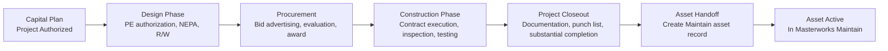

# Domain: Project Delivery

## Purpose

The project delivery domain manages the lifecycle of a capital project from authorization through construction completion to asset handoff. It is the bridge between the planning world (where projects are conceived, prioritized, and funded) and the maintenance world (where assets are operated and managed throughout their lives).

The most important function of the project delivery domain is not project management. Every project management tool on the market handles budget, schedule, and documents. The unique function of the project delivery domain in the Aurigo platform is the **asset handoff** — the structured transfer of all project-generated data to the asset registry at project closeout. This is the feature that eliminates the lifecycle discontinuity that every other tool in the market perpetuates.

Without the asset handoff, the project delivery system is just another construction management tool. With the asset handoff, it is the mechanism by which the infrastructure lifecycle becomes continuous.

## Business Value

**Zero-loss asset handoff:** When a project closes in Masterworks Build, the asset record in Masterworks Maintain is populated automatically from the project data. Material certifications, warranty information, as-built geometry, commissioning test results, and baseline condition are all captured without manual re-entry. This eliminates the data loss that currently occurs at every infrastructure project closeout.

**Project delivery visibility:** Capital program managers can see the status of all active projects in real time — budget, schedule, milestones, and the connection to the capital needs that funded each project.

**Federal compliance documentation:** Federal-aid infrastructure projects require extensive documentation at every phase — design reviews, right-of-way certification, NEPA compliance, construction inspection records, testing results, and closeout documentation. The project delivery domain captures and organizes this documentation in a way that satisfies federal audit requirements.

**Warranty management:** Equipment and systems installed during capital projects carry manufacturer warranties. The project delivery domain captures warranty information at closeout and generates alerts as warranties approach expiration, ensuring that defects are addressed under warranty rather than at owner expense.

## Personas

**Project Manager (Owner):** Manages project budget, schedule, changes, and documentation from design through closeout. Primary user for day-to-day project management.

**Resident Engineer:** On-site management of construction activities. Records daily work reports, inspection observations, test results, and contractor performance.

**Capital Program Manager:** Portfolio-level visibility. Monitors all projects for budget and schedule risk. Manages the connection between the project program and the capital plan.

**Closeout Manager / Administrative Engineer:** Ensures that all closeout documentation requirements are met before financial closeout. Responsible for completing the Maintain asset handoff record.

**Contractor / Equipment Vendor (External User):** Submits RFIs, responds to submittals, uploads O&M manuals and warranty certificates, and provides as-built documentation through the contractor portal.

## User Stories

1. **As a Capital Program Manager**, I want to see all projects authorized from the capital plan, with their current budget-at-completion and schedule status, so that I can identify deviations from the plan before they create STIP compliance issues.

2. **As a Project Manager**, I want to process a change order through the approval workflow and have the approved change automatically update the project budget so that the budget-at-completion is always current.

3. **As a Resident Engineer**, I want to record daily construction inspection observations from my mobile device so that the inspection record is created in real time rather than reconstructed from notes at the end of the week.

4. **As a Closeout Manager**, I want a checklist of all required closeout items — federal documentation, as-built drawings, warranty certificates, O&M manuals, Maintain handoff fields — so that I don't miss a required item and delay financial closeout.

5. **As a Project Manager**, I want to generate the Masterworks Maintain asset record from the project data at closeout, reviewing and completing any fields that were not captured during construction, so that the maintenance team inherits a complete asset record.

6. **As a Capital Program Manager**, I want to see which projects are approaching financial closeout and confirm that the Maintain asset handoff has been completed so that I know new asset records are flowing into Maintain correctly.

7. **As a Contractor**, I want to submit O&M manuals and warranty certificates through the contractor portal so that I fulfill my closeout obligations without needing to provide physical documents.

8. **As a Project Manager**, I want to track all non-conformances from discovery through resolution, with photos and specification references, so that the construction quality record is complete.

## Typical Workflows

### Full Project Lifecycle

### Asset Handoff Workflow

The closeout-to-handoff workflow is the most critical workflow in the project delivery domain:

1. **Project reaches substantial completion:** Resident engineer records substantial completion date; punch list is finalized
2. **Closeout checklist activated:** System presents the full closeout checklist, including the Maintain handoff section
3. **Project manager completes handoff form:** For each asset class created by the project, the system pre-populates all fields captured during construction (geometry from as-built survey, material from submittals, installation date from daily work report). Project manager reviews and completes any missing fields.
4. **Validation:** System validates that all required Maintain fields are populated for each asset
5. **Handoff submitted:** Asset records are written to Maintain; project is marked as "Maintain handoff complete"
6. **Maintain confirmation:** Asset manager in Maintain reviews the new records; can request corrections from the project team before final acceptance
7. **Financial closeout authorized:** Only after Maintain handoff is accepted can the project be financially closed

## Business Rules

1. **Maintain handoff is required for financial closeout:** A project cannot be financially closed without the Maintain asset handoff being completed and accepted.

2. **Budget amendment requires approval:** Any change order that increases the project budget requires approval at the level specified by the approval threshold configuration.

3. **Environmental clearance before construction authorization:** Federal-aid projects cannot advance to construction authorization without an approved NEPA determination (CE, EA/FONSI, or EIS/ROD).

4. **As-built document deadline:** As-built drawings and documents must be uploaded within 90 days of substantial completion. The system sends reminders at 60, 30, and 0 days.

5. **Warranty certificate tracking:** All equipment and specialty items with a value above the configurable threshold require a warranty certificate at closeout. Missing warranties block financial closeout.

6. **Contractor portal access scope:** External contractor users can only access documents, RFIs, and submittals for their specific contract. They cannot view other contracts or any financial data.

7. **Change order audit trail:** Every change to a change order (revision, approval, rejection, correction) is logged with the user ID, timestamp, and reason.

8. **Non-conformance resolution:** All open non-conformances must be resolved (accepted, rejected, or waived) before substantial completion can be issued.

## Integration Points

- **Capital Planning / Plan:** Projects are authorized from the capital plan. The authorized budget, funding sources, and project type flow from Plan to Build at authorization.
- **Asset Management / Maintain:** Asset records are created from the project closeout handoff. The handoff mapping configuration defines which Build fields map to which Maintain asset fields.
- **Document Management:** Project documents (drawings, specifications, submittals, RFIs) are stored and retrieved from the document management service.
- **Financial Systems:** Approved pay estimates create cost transactions that sync to the financial system (Oracle, SAP, or state financial system).

## Future Evolution

- **BIM integration:** Import IFC/BIM models from design tools; use the BIM model as the source of as-built geometry for the Maintain handoff
- **Drone survey integration:** As-built geometry captured by drone survey auto-populates the Maintain handoff geometry fields
- **AI schedule risk prediction:** ML model that predicts schedule delay probability based on current progress indicators and weather data
- **Automated commissioning data capture:** IoT sensors during commissioning automatically record test results, reducing manual data entry

---

*See also: [Asset Management Domain](asset-management.md) | [Masterworks Build](../masterworks/build.md) | [Primus Build](../primus/build.md)*
