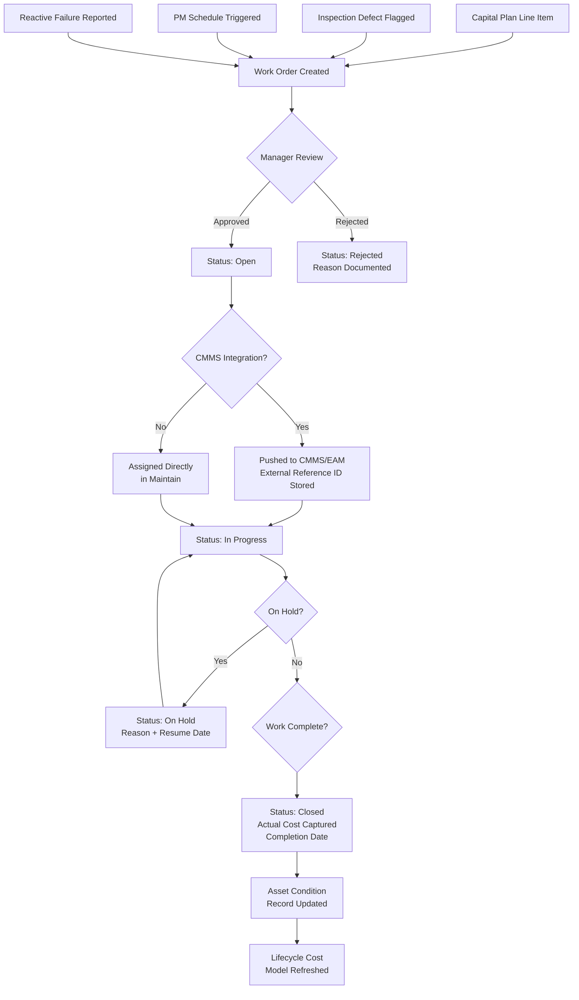

# Work Orders

## Purpose

Work orders are the operational currency of infrastructure asset management. They translate capital planning recommendations and inspection findings into discrete units of work that get assigned, executed, tracked, and closed. In the context of Aurigo Maintain, the work order domain sits at the boundary between strategic planning (what do we need to do over the next 10 years?) and operational execution (who is doing what, today?).

This document defines how Maintain conceptualizes and manages work orders — critically distinguishing between the **capital-level work** that Maintain directly owns and the **day-to-day operational work** that remains in the agency's CMMS or EAM platform.

---

## Business Value

Public agencies manage thousands of assets and produce hundreds or thousands of work orders annually. Before Maintain, the link between a deteriorating bridge condition score and a funded rehabilitation work order was tracked in spreadsheets, email threads, or tribal knowledge. A condition inspector would flag a defect; it would be handed off verbally; the CMMS work order would be created with no reference back to the condition record; and a year later nobody could explain why the bridge condition score improved.

Maintain closes this loop. Every work order in Maintain carries a traceable origin — inspection defect, capital plan line item, preventive maintenance trigger, or reactive failure report. Every completion drives a condition update. Every cost flows back into the asset's lifecycle cost model. The result is a closed-loop asset management system where capital expenditure and asset condition are always in sync.

The business value is measurable: agencies using closed-loop work management report 20–35% improvement in capital plan accuracy, because actual costs and condition outcomes replace estimates.

---

## Critical Distinction: Maintain vs. CMMS

This distinction must be understood by every engineer on the team.

**Aurigo Maintain does NOT replace CMMS/EAM for operational work.** Agencies have IBM Maximo, SAP PM, Cityworks, or Infor EAM running their day-to-day operations — preventive maintenance schedules, parts inventory, technician time tracking, safety checklists. Those systems are deeply embedded. Replacing them is a multi-year program of its own.

What Maintain does:

- **Recommends** capital-level work orders based on condition, risk, and budget analysis
- **Tracks** capital work execution status (not at the task/parts level, but at the milestone level)
- **Originates** work orders that are then pushed into the CMMS/EAM for execution
- **Receives** completion confirmation and actual cost from the CMMS/EAM
- **Updates** asset condition records based on work completion

The integration pattern is: Maintain creates a work order record → pushes to CMMS/EAM → CMMS/EAM manages execution → Maintain polls or receives webhook for completion → Maintain updates its condition and cost models.

---

## Personas

**Capital Asset Manager (Primary)** — Creates and approves capital work orders. Uses Maintain to translate capital plan line items into work orders, monitor execution progress across the portfolio, and report actual spend vs. budget.

**Field Inspector** — Encounters a defect during an inspection and creates a reactive work order. Needs to do this in the field on a mobile device, with minimal friction. May work offline.

**Maintenance Supervisor** — Receives work orders from Maintain (via CMMS/EAM integration) and assigns technicians. Doesn't use Maintain directly but sees work order references in the CMMS.

**Program Director** — Needs high-level visibility into capital work execution: how many work orders are open vs. closed, what percentage of the annual capital budget has been committed, which critical assets have work in progress.

**Finance Analyst** — Reconciles work order costs against capital budget. Uses Maintain exports to match actuals to the approved capital improvement program (CIP).

---

## User Stories

1. **As a Capital Asset Manager**, I want to convert a capital plan line item into a work order with one click, so that approved projects immediately enter the execution tracking pipeline.

2. **As a Field Inspector**, I want to create a reactive work order directly from a flagged inspection defect while I'm still at the asset, so that critical findings don't get lost between field observation and back-office follow-up.

3. **As a Capital Asset Manager**, I want to see all open work orders for my portfolio on a map, so that I can identify geographic clusters and optimize contractor dispatch.

4. **As a Program Director**, I want a real-time dashboard showing work order status distribution (Open, In Progress, On Hold, Complete), so that I can present accurate capital plan execution status at monthly board meetings.

5. **As a Finance Analyst**, I want to export all closed work orders for a fiscal year with estimated vs. actual cost columns, so that I can produce the annual capital expenditure reconciliation report.

6. **As a Capital Asset Manager**, I want the system to automatically update an asset's condition score when a rehabilitation work order is closed, so that our condition inventory reflects actual post-work state without manual data entry.

7. **As a Capital Asset Manager**, I want to put a work order on hold with a documented reason (funding delay, permitting, weather), so that the portfolio dashboard accurately reflects which work is stalled and why.

8. **As a Field Inspector**, I want work orders assigned to me to appear in my mobile app work queue, so that I have a single place to see what I need to do today.

9. **As a Capital Asset Manager**, I want to link multiple work orders to a single capital plan project, so that I can track total project cost as individual work orders complete.

10. **As a Program Director**, I want to drill from a capital plan project to its constituent work orders, so that I can investigate why a project is over budget at the work order level.

---

## Typical Workflows

### Work Order Creation Sources

There are four distinct origination paths for a work order in Maintain:

**1. Capital Plan Line Item → Work Order**
The most common path for planned capital work. An asset manager approves a capital plan, then converts individual line items into work orders for execution in the current fiscal year.

**2. Inspection Defect → Work Order**
An inspector flags a critical defect during a condition assessment. The severity triggers an automatic work order recommendation. The asset manager reviews and approves.

**3. Scheduled PM Trigger → Work Order**
A preventive maintenance schedule (managed in Maintain for capital-level PM, e.g., bridge painting every 7 years) generates a work order recommendation when the scheduled interval arrives.

**4. Reactive Failure Report → Work Order**
An operator reports an unexpected failure (pothole, broken sign, collapsed culvert). A reactive emergency work order is created with high priority.



### Work Order Lifecycle States

| State | Description | Entry Conditions | Exit Conditions |
|---|---|---|---|
| Draft | Being assembled, not yet reviewed | Created from any source | Submitted for approval |
| Open | Approved, not yet started | Manager approval | Work begins OR push to CMMS |
| In Progress | Actively being executed | Work starts | Work completes OR hold placed |
| On Hold | Work paused, documented reason | Hold action taken | Hold lifted |
| Pending Completion | Work done, awaiting final review | Technician marks complete | Reviewer signs off |
| Closed | Fully complete, condition updated | Final sign-off | Terminal state |
| Cancelled | Will not be done | Cancellation with reason | Terminal state |
| Rejected | Did not pass review | Manager rejection | Rework → resubmit or cancel |

---

## Business Rules

**BR-WO-001: Origin Traceability**
Every work order must carry a non-null `origin_type` (CapitalPlan, InspectionDefect, PMSchedule, Reactive) and an `origin_reference_id` pointing to the originating record. This ensures full traceability from work order back to the condition event or plan that triggered it.

**BR-WO-002: Asset Association**
A work order must be associated with exactly one asset. Multi-asset projects are modeled as a capital plan project with one work order per asset. (This keeps cost and condition updates clean at the per-asset level.)

**BR-WO-003: Estimated Cost Required Before Approval**
A work order cannot be moved from Draft to Open without an estimated cost. The estimate may be a rough order of magnitude (ROM), but something must be recorded to support budget commitment tracking.

**BR-WO-004: Condition Update on Close**
When a rehabilitation or replacement work order is closed, the system automatically creates a prompted condition re-assessment entry. The asset manager or inspector is expected to document post-work condition within 30 days of closure.

**BR-WO-005: CMMS External Reference**
When a work order is pushed to an integrated CMMS/EAM, the external system's work order ID is stored in `external_reference_id`. All subsequent status updates must reference this ID. If the push fails, the work order stays in Open state and the sync error is logged.

**BR-WO-006: Budget Impact Tracking**
When a work order is created from a capital plan line item, it is automatically linked to the capital plan's budget line. Actual cost at closure updates the line item's actual spend field. Overruns trigger a notification to the asset manager.

**BR-WO-007: Priority Inheritance**
Work orders created from high-risk assets (Risk Score > 80/100) are automatically assigned Priority: Critical. This cannot be downgraded below High without documented justification.

**BR-WO-008: Multi-Tenancy Isolation**
Work orders are strictly tenant-scoped. Cross-tenant queries are not permitted. CMMS integrations are configured per-tenant and may not share credentials or endpoints across tenants.

---

## Data Model

```
WorkOrder
├── Id (uuid, PK)
├── TenantId (uuid, FK → Tenant, indexed)
├── AssetId (uuid, FK → Asset)
├── Title (varchar 200)
├── Description (text)
├── OriginType (enum: CapitalPlan | InspectionDefect | PMSchedule | Reactive)
├── OriginReferenceId (uuid, nullable — points to source record)
├── Status (enum: Draft | Open | InProgress | OnHold | PendingCompletion | Closed | Cancelled | Rejected)
├── Priority (enum: Low | Medium | High | Critical)
├── WorkType (enum: Inspection | Preventive | Rehabilitation | Replacement | Emergency)
├── EstimatedCost (decimal 18,2)
├── ActualCost (decimal 18,2, nullable)
├── EstimatedStartDate (date)
├── EstimatedEndDate (date)
├── ActualStartDate (date, nullable)
├── ActualEndDate (date, nullable)
├── AssignedToUserId (uuid, nullable)
├── ExternalReferenceId (varchar 100, nullable — CMMS/EAM work order ID)
├── ExternalSystemName (varchar 50, nullable — "Maximo" | "SAP" | "Cityworks")
├── HoldReason (text, nullable)
├── HoldResumeDate (date, nullable)
├── CancellationReason (text, nullable)
├── CapitalPlanLineItemId (uuid, nullable, FK → CapitalPlanLineItem)
├── CreatedAt (timestamptz)
├── UpdatedAt (timestamptz)
└── CreatedByUserId (uuid)

WorkOrderStatusHistory
├── Id (uuid, PK)
├── WorkOrderId (uuid, FK)
├── FromStatus (enum)
├── ToStatus (enum)
├── ChangedAt (timestamptz)
├── ChangedByUserId (uuid)
└── Notes (text, nullable)

WorkOrderAttachment
├── Id (uuid, PK)
├── WorkOrderId (uuid, FK)
├── FileName (varchar 255)
├── StorageUrl (varchar 1000)
├── FileType (varchar 50)
├── UploadedAt (timestamptz)
└── UploadedByUserId (uuid)
```

---

## Integration Points

**Capital Planning Module (Internal)**
Work orders are created from capital plan line items. Actual costs flow back to update line item actuals. The capital plan's execution progress percentage is calculated from work order status distribution.

**Inspection Module (Internal)**
Inspection defects with severity >= Critical or High automatically suggest work order creation. The work order carries a reference to the inspection record and the specific defect. When the work order is closed, the inspection defect is marked as resolved.

**CMMS/EAM Connector (External — Integration Strategist domain)**
The primary outbound integration. Supports: IBM Maximo (REST API + WebService), SAP PM (BAPI + OData), Cityworks (REST), Infor EAM (REST). The connector handles:
- Work order creation (outbound)
- Status polling or webhook receipt (inbound)
- Actual cost synchronization (inbound)
- Technician assignment data (inbound, optional)

**Notification Service (Internal/External)**
Status transitions fire notifications to relevant parties. Work order assigned → inspector/technician notified. Work order overdue → asset manager notified. CMMS sync failure → integration admin notified.

**Reporting Module (Internal)**
Work orders are a primary data source for capital expenditure reports, work order backlog analysis, and contractor performance reporting.

---

## Future Evolution

**Contractor Portal (Phase 2 candidate)**
A lightweight external-facing view that allows contracted firms to update work order progress directly without requiring a full Maintain license. They see only their assigned work orders.

**Field Execution Module (Phase 2 candidate)**
For agencies without a CMMS, Maintain could extend into basic task-level field execution: parts checklist, time logging, safety sign-off. This keeps Maintain positioned below enterprise CMMS complexity but above pure capital planning tools.

**Predictive Work Order Generation (Phase 3)**
When the AI deterioration model predicts that an asset will breach a condition threshold within 18 months, it automatically generates a draft work order with a recommended work type, estimated cost, and suggested completion window. The asset manager reviews and approves.

**Cost Learning Model**
As work order actuals accumulate, the system builds an agency-specific cost model: "bridge deck rehabilitation for this agency costs $X per square foot." Estimated costs for future work orders auto-populate from this learned model rather than requiring manual entry.

**IoT-Triggered Work Orders**
When structural health monitoring sensors (planned Phase 3 capability) detect anomalies, they will automatically generate high-priority work orders with sensor event data attached. Inspection confirmation will be required before escalation to rehabilitation.
