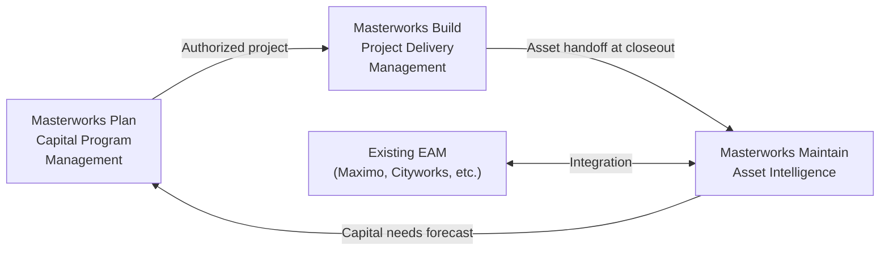

# Masterworks — Product Family Overview

## Who Masterworks Serves

Masterworks is Aurigo's product family for US public sector infrastructure agencies. The target customers are the organizations that own, operate, and maintain public infrastructure on behalf of citizens and taxpayers:

- **State Departments of Transportation (State DOTs):** Manage the National Highway System, state road networks, and bridge inventories. Responsible for Transportation Asset Management Plans and federal reporting.
- **County Road Departments:** Own and maintain county road and bridge networks, often with limited staff and budgets.
- **Municipal Public Works Departments:** Manage city roads, sidewalks, drainage, signs, signals, parks, and facilities.
- **Transit Agencies:** Manage bus and rail fleets, transit facilities, track, stations, and support infrastructure.
- **Port Authorities:** Own marine terminals, cranes, dredging infrastructure, and intermodal facilities.
- **Water Utilities:** Manage water distribution, wastewater collection, treatment plants, and pumping stations.
- **Airport Authorities:** Own runway pavement, taxiways, terminals, and airfield support infrastructure.

What these organizations share: they are accountable to the public, they receive federal and state funding with compliance requirements attached, they manage large networks of diverse assets with multi-decade useful lives, and they are chronically underfunded relative to the capital needs their assets represent.

## Why "Masterworks"

The name "Masterworks" was chosen to evoke the scale and significance of the infrastructure these agencies build and maintain. Major public infrastructure projects — the Interstate Highway System, the Golden Gate Bridge, the Big Dig — are genuine engineering masterworks. The agencies responsible for these assets deserve software worthy of the work they do.

The name also carries a sense of craft and quality — an alignment with Aurigo's value of "Quality as a Competitive Advantage." Masterworks is not generic enterprise software dressed in infrastructure clothing. It is purpose-built, domain-deep software for a specific and important class of problem.

## The Three Modules and How They Connect

Masterworks is three interconnected modules that together span the full infrastructure lifecycle:

### Masterworks Plan — Capital Program Management

Plan is the beginning of the infrastructure lifecycle. It is where agencies identify capital needs, score and prioritize projects, allocate funding across a multi-year program, track federal grant management, and produce the Statewide Transportation Improvement Program (STIP) or Capital Improvement Program (CIP) that governs spending. Plan is not a project management tool — it is a portfolio management and financial planning tool for capital programs.

The critical output of Plan is a funded, authorized project pipeline that flows into Build for delivery. The critical input to Plan (in the reverse lifecycle direction) is the capital needs identified by Maintain — the 10-year replacement and rehabilitation schedule for existing assets.

### Masterworks Build — Project Delivery Management

Build manages the lifecycle of a capital project from design authorization through construction to project closeout. It covers: design management, bid and contract management, change order management, RFI and submittal processing, field inspection and testing, document management, and project closeout.

The critical input to Build is the authorized project from Plan. The critical output of Build is the asset record — the structured handoff to Maintain that captures everything known about an asset at the moment it enters service.

### Masterworks Maintain — Asset Intelligence

Maintain is the system that a public agency uses to understand the condition, risk, and capital requirements of their existing asset network. It is not a CMMS. It does not manage work orders or spare parts (those live in Maximo or Cityworks, which Maintain integrates with). It manages the intelligence layer: condition scoring, deterioration modeling, remaining useful life, asset replacement value, risk scoring, capital needs analysis, and TAMP compliance.

The critical input to Maintain is asset records from Build (for newly commissioned assets) and inspection data from field inspectors (ongoing condition updates). The critical output of Maintain is the capital needs forecast that feeds back into Plan as the next generation of capital projects.

## The Lifecycle Loop

This loop is the fundamental value proposition of Masterworks: a continuous cycle where capital investments are made based on asset condition data, projects are delivered and their data is captured, and the resulting assets are monitored and feed their condition back into the next capital planning cycle. No competitor spans this entire loop.

---

*Documents in this section:*
- [Masterworks Plan](plan.md)
- [Masterworks Build](build.md)
- [Masterworks Maintain](maintain.md)
