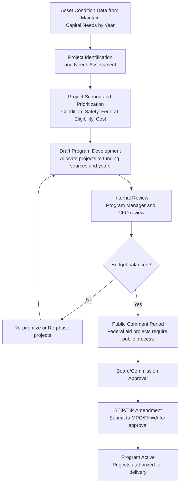

# Masterworks Plan — Capital Program Management

## Purpose

Masterworks Plan is the capital program management system for public infrastructure agencies. Its purpose is to manage the full lifecycle of a capital program: identifying capital needs, prioritizing projects, allocating funding across a multi-year program, tracking federal grant management, managing project delivery obligations, and producing the statutory program documents (STIP, CIP, TIP) that govern capital spending.

A capital program is not a collection of projects. It is a portfolio — a deliberate allocation of constrained resources (funding) against competing needs (project demands), subject to regulatory requirements (federal aid rules), strategic objectives (performance targets), and political constraints (elected board priorities). Masterworks Plan gives the capital program manager the tools to manage this complexity with transparency and rigor.

Most agencies arrive at Masterworks Plan having managed their capital program in spreadsheets, or in a general-purpose project management tool not designed for the specific requirements of federal-aid infrastructure programs. The transition to Masterworks Plan delivers immediate value in two areas: reducing the manual data aggregation burden of program reporting, and improving the quality of the decisions made about which projects to fund.

## Business Value

**Federal funding compliance:** Federal-aid highway and transit projects are subject to complex funding rules — obligation deadlines, eligible cost categories, federal share requirements, NEPA milestones, right-of-way certification requirements. Masterworks Plan enforces these rules as business logic, catching compliance violations before they become audit findings.

**Program visibility:** A state DOT capital program may include 500 to 2,000 active projects at any point in time. No capital program manager can maintain situational awareness of that many projects from spreadsheets and email. Masterworks Plan provides the aggregated view — which projects are behind schedule, which are over budget, which have uncommitted fund balances approaching expiration — that enables proactive management rather than reactive crisis response.

**Planning accuracy:** Capital programs managed with Masterworks Plan deliver higher cost and schedule accuracy than programs managed in general-purpose tools, because the system enforces project data completeness and flags anomalies in real time rather than at the next monthly reporting cycle.

**TAMP integration:** Capital needs identified by Masterworks Maintain feed directly into Plan as unfunded project needs. The capital planner can see the full picture: funded projects in the current STIP, unfunded needs from the asset condition analysis, and the gap between them. This is the data that drives TAMP financial planning.

## Personas

**State DOT Capital Program Manager**
Manages a portfolio of 200 to 1,000 active capital projects. Responsible for producing the STIP, managing the programming cycle, and reporting program status to the Secretary, the Federal Highway Administration, and the state legislature. The primary Masterworks Plan user and internal champion.

**Federal Grant Manager**
Manages the federal aid funding portfolio: grant applications, fund authorizations, obligation tracking, drawdown monitoring, and federal reimbursement claims. Works closely with FHWA and FTA division offices. Depends on Masterworks Plan for obligation balance tracking and reimbursement status.

**City / County Budget Director**
Responsible for the annual and multi-year Capital Improvement Program (CIP) that goes to the elected board for approval. Needs the program financial summary (by funding source, by project, by year), the prior year execution report, and the multi-year financial projection.

**Project Manager**
Manages one to twenty capital projects within the program. Uses Masterworks Plan to update project milestones, enter budget transactions, process change orders, and track deliverables. The project manager is a consumer of the program context that the Capital Program Manager maintains.

## User Stories

1. **As a Capital Program Manager**, I want to see the complete list of all active projects with their current budget, schedule status, and funding balance so that I can identify projects at risk of cost overrun or schedule delay before they miss federal obligation deadlines.

   *Acceptance criteria:* Dashboard shows all active projects with color-coded status indicators. Drill-down to project detail shows budget variance (original vs. current estimate), schedule variance (planned vs. actual milestones), and funding balance by source. Filter by project phase, funding program, district, and responsible manager.

2. **As a Federal Grant Manager**, I want to be alerted when a federal fund authorization is within 90 days of its obligation deadline so that I can ensure the project is obligated before the funding expires.

   *Acceptance criteria:* System generates automated alerts at 180, 90, and 30 days before obligation deadline. Alert includes project name, authorization number, fund amount, and deadline. Alert is routed to the project manager, the grant manager, and the capital program manager.

3. **As a City Budget Director**, I want to produce a multi-year Capital Improvement Program document that shows all funded projects by year, by funding source, by project type, and by geographic district, formatted for presentation to the City Council.

   *Acceptance criteria:* CIP report generates in PDF format. User can filter by year range, project type, funding source, and district. Totals reconcile to the approved budget. Report includes project description, funding sources, annual amounts, and cumulative total.

4. **As a Capital Program Manager**, I want to add a new capital project to the program and specify its funding sources, phase costs (preliminary engineering, right-of-way, construction), and milestone schedule so that the project is included in the STIP.

   *Acceptance criteria:* New project form captures all STIP-required fields: project identification number, description, phase costs, funding sources with federal program code and federal share percentage, milestone dates. Validation enforces that all federal fund codes are valid for the project type. Project appears in STIP export immediately upon save.

5. **As a Project Manager**, I want to enter the actual cost and completion date for a project milestone so that the program manager has current progress information without waiting for the monthly status meeting.

   *Acceptance criteria:* Project detail page shows milestone list with planned and actual dates. User can enter actual completion date and actual cost for each milestone. System calculates schedule variance (actual vs. planned) and cost variance (actual vs. estimate). Variance flags appear on the program dashboard immediately.

6. **As a Federal Grant Manager**, I want to generate a federal reimbursement claim for all eligible expenditures posted in the current billing period so that I can submit the claim to FHWA and receive reimbursement within the required timeframe.

   *Acceptance criteria:* Claim generation selects all cost transactions posted in the billing period, applies the federal share percentage by funding source, and produces the claim in the FHWA/LAPM required format. System marks claimed transactions so they are not included in future claims. Claim status (submitted, paid, rejected) is tracked.

7. **As a Capital Program Manager**, I want to see the impact on the capital program if Project A is added to the current STIP year so that I can make a budget trade-off decision before committing.

   *Acceptance criteria:* "What if" scenario tool allows adding or removing projects and immediately shows updated fund balances by source for each STIP year. Scenario is not saved until the user explicitly commits the change. Multiple scenarios can be saved and compared.

8. **As a Capital Program Manager**, I want to import the capital needs forecast from Masterworks Maintain so that I can compare the funded STIP program against the unfunded asset replacement needs and quantify the backlog.

   *Acceptance criteria:* Import function reads the Maintain capital needs export (by asset class, by year, by estimated cost) and displays the unfunded needs alongside the funded STIP projects. Gap analysis report shows funded vs. unfunded by year, by asset class, and by funding program eligibility.

9. **As a State DOT CFO**, I want to see the federal fund obligation rate by program and the projected end-of-year obligated balance so that I can report our obligation performance to the Federal Highway Administration.

   *Acceptance criteria:* Financial dashboard shows obligation rate by federal program (NHPP, STP, HSIP, etc.) for the current federal fiscal year. Projected year-end obligation is calculated by extrapolating the current obligation rate. Comparison to prior year obligation rate. Export to Excel for FHWA reporting.

10. **As a Program Controls Analyst**, I want to be alerted when the total committed cost across all projects in a funding program exceeds the available program balance so that I can prevent overcommitment before it creates a funding shortfall.

    *Acceptance criteria:* Real-time validation prevents adding a cost transaction that would cause a program balance to go negative. Warning notification is generated when program balance is within 10% of the total committed cost. Override is available with documented justification and supervisor approval.

## Typical Workflows

### Annual CIP Development Workflow

The Capital Improvement Program development cycle is the primary annual event for most agencies. It typically runs from July through October for a fiscal year beginning January 1.

1. **Capital needs input:** Masterworks Maintain produces a 10-year capital needs forecast by asset class. This becomes the input to the project identification process.
2. **Project scoring:** Each potential project is scored against criteria: asset condition urgency, safety risk, federal funding eligibility, cost-benefit ratio, geographic equity, and strategic plan alignment.
3. **Program development:** The capital program manager allocates projects to funding years, matching project costs to available fund balances by funding source.
4. **Financial balancing:** An iterative process of adjusting the program until fund balances are non-negative in all years.
5. **Review and approval:** Internal leadership review, public comment (required for federally funded projects), elected board approval.
6. **STIP/TIP processing:** Submission to the Metropolitan Planning Organization (MPO) for TIP amendment, and to FHWA/FTA for STIP approval.

### Federal Grant Management Workflow

1. **Grant identification:** Federal grant opportunity is identified (RAISE, Bridge Investment Program, PROTECT, etc.)
2. **Project matching:** Capital Program Manager identifies which projects in the pipeline are eligible for the grant program
3. **Application development:** Application is prepared with project description, benefit-cost analysis, and documentation of need
4. **Award and authorization:** Federal agency issues grant award; Masterworks records the authorization with amount, federal share, and obligation deadline
5. **Project programming:** Project is added to the STIP with the grant as the funding source
6. **Obligation:** Project costs are obligated to the federal authorization by the deadline
7. **Drawdown and reimbursement:** As project expenditures are incurred, reimbursement claims are submitted and federal funds are drawn down
8. **Closeout:** When project is complete, final audit documentation is prepared and grant is closed

## Business Rules

1. **Federal share limits:** Each federal funding program has a maximum federal share percentage. NHPP allows up to 80% federal share; some safety programs allow 100%. Masterworks Plan enforces these limits when entering project budgets.

2. **Obligation deadline enforcement:** Federal fund authorizations have an obligation deadline. Masterworks Plan will not allow a project to be removed from the STIP if it has an outstanding federal obligation without documenting the obligation status.

3. **Budget period enforcement:** Federal funds cannot be used to pay for costs incurred outside the authorized budget period. Masterworks Plan validates that cost transactions fall within the authorization period.

4. **Eligible costs by phase and program:** Federal aid programs define eligible cost categories. Preliminary engineering, right-of-way, and construction have different eligibility rules. Masterworks Plan validates cost entries against the applicable program eligibility rules.

5. **Multi-level approval for significant changes:** Budget amendments above defined thresholds require supervisor approval. STIP amendments require federal agency approval. Masterworks Plan enforces these approval chains and maintains an audit log of all approvals.

6. **STIP/TIP currency:** All projects receiving federal aid must be in the current STIP/TIP with current cost and schedule information. Masterworks Plan flags projects where the programmed cost deviates from the current project estimate by more than 10%.

7. **Environmental document status:** Federal aid projects cannot advance to construction without a completed NEPA determination. Masterworks Plan tracks environmental document status and prevents construction authorization for projects without a current NEPA determination.

8. **Match requirement tracking:** Federal aid requires a state or local match. Masterworks Plan tracks the committed match by source for each project and flags projects where the match commitment is insufficient.

## Future Evolution

- **AI-driven project prioritization:** Machine learning model that predicts which projects in the unfunded needs list will have the highest long-term cost-benefit ratio given projected funding availability
- **Automated federal reporting:** STIP/TIP amendment packages generated automatically from Masterworks Plan data
- **Integration with state financial systems:** Two-way integration with state accounting systems (Oracle Financials, SAP) for fund accounting reconciliation
- **Predictive budget modeling:** AI scenario planning that projects 10-year program financial health under different funding and cost scenarios
- **Grant opportunity matching:** AI-driven analysis of pending federal grant programs against the unfunded needs list, prioritizing grant applications by eligibility and probability of award

---

*See also: [Masterworks Build](build.md) | [Masterworks Maintain](maintain.md) | [Capital Planning Domain](../domains/capital-planning.md)*
