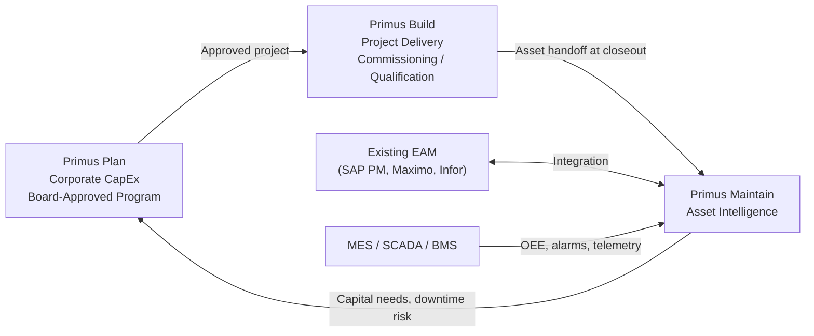

# Primus — Product Family Overview

## Who Primus Serves

Primus is Aurigo's product family for **private sector infrastructure owners**. Where Masterworks serves public agencies accountable to taxpayers and federal regulators, Primus serves private organizations accountable to shareholders, boards, and industry-specific regulators. The core problem — assets deteriorate, capital investment is required, and lifecycle data is lost at project transitions — is the same. The regulatory frameworks, financial incentives, buyer psychology, and organizational rhythm are different.

Primus target buyers:

- **Manufacturing companies** — automotive assembly plants, consumer packaged goods facilities, semiconductor fabs, food and beverage processing, aerospace fabrication. Assets: production equipment, conveyors, presses, CNC machinery, industrial HVAC, compressed air, electrical distribution, facilities.
- **Electric and gas utilities** (investor-owned) — transmission and distribution infrastructure, substations, generation assets, metering, gas pipelines. Subject to state Public Utility Commission (PUC) rate case oversight and NERC CIP for bulk electric system assets.
- **Data center operators** — hyperscale (AWS, Azure, Google), colocation providers (Equinix, Digital Realty, CoreSite), and enterprise data centers. Assets: generators, UPS systems, PDUs, ATS, switchgear, chillers, CRAC/CRAH units, cooling towers, fire suppression, BMS.
- **Airport authorities** — includes private FBOs, cargo operators, and public-private partnership operations. Assets: runway/taxiway pavement, terminals, airfield lighting, jet bridges, ground support equipment. AIP-funded portions carry FAA compliance requirements similar to Masterworks.
- **Life sciences and pharmaceutical manufacturers** — cGMP manufacturing facilities, biologics production, aseptic filling lines, cold chain infrastructure. Assets are subject to FDA 21 CFR Part 11 (electronic records), 21 CFR Parts 210/211 (cGMP for finished pharmaceuticals), and 21 CFR Part 820 (medical device QSR).
- **Port authorities and marine terminal operators** — container terminals, bulk terminals, cruise terminals. Assets: cranes (STS, RTG, RMG), berths, cargo handling equipment, fuel infrastructure, terminal facilities.
- **Mining operations** — surface and underground mines, mineral processing facilities, tailings dam infrastructure, haul roads, heavy mobile equipment.
- **Hospitals and health systems** — HTM (healthcare technology management) systems: imaging equipment (MRI, CT, PET), sterilization, laboratory automation, physical plant (chillers, boilers, generators, medical gas), building systems. Subject to Joint Commission and CMS compliance.
- **Energy companies** — oil and gas upstream/midstream/downstream, LNG facilities, renewable generation (utility-scale wind and solar farms), transmission. Subject to PHMSA for pipelines and FERC for interstate transmission.

What these organizations share: their infrastructure directly generates or protects revenue, unplanned failure has measurable P&L consequences, capital decisions must be justified in financial terms to a private board or corporate CFO, and compliance regimes are industry-specific rather than federal-transportation-specific.

## Why "Primus"

The name Primus — Latin for "first" — reflects the fundamental difference in private sector asset management: private owners put their assets first because their business depends on them.

- A broken CNC machine on a Tier 1 automotive supplier's floor is not a maintenance inconvenience — it can trigger contractual line-down penalties measured in tens of thousands of dollars per hour.
- A UPS failure at a hyperscale data center is not a service disruption — it is an SLA breach with penalty clauses tied to customer revenue.
- A cGMP violation on a pharmaceutical aseptic line is not a paperwork issue — it can result in FDA 483 observations, warning letters, consent decrees, or product recalls costing hundreds of millions.
- A tailings dam failure at a mining operation is not a compliance matter — it is a catastrophic loss-of-life event that ends companies (Vale/Brumadinho, 2019).

The assets are the business. Primus reflects this primacy. The name also distinguishes the product from Masterworks without implying a quality difference — Primus and Masterworks are parallel product lines for different markets, built on the same platform, configured differently. Neither is "better"; each is precisely fit for its market.

## How Primus Differs from Masterworks

The differences are not in the underlying platform code. Both products run on the same .NET 8 API, PostgreSQL + PostGIS database, and React frontend. The differences are in configuration, terminology, regulatory templates, asset class libraries, financial modeling, and buyer motion:

| Dimension | Masterworks | Primus |
|-----------|-------------|--------|
| **Buyer** | State/city/county elected officials, agency directors, CFOs | Board of directors, CEO/COO, VP Operations, VP Facilities |
| **Approval cycle** | Legislative sessions, annual budget, elected board votes | Board meetings (quarterly), corporate CapEx approvals (rolling) |
| **Regulatory framework** | FHWA, FTA, FAA, FEMA, NBIS, TAMP, GASB 34/45 | OSHA 29 CFR, NFPA (110, 25, 72), NERC CIP, FDA 21 CFR (11, 210, 211, 820), PHMSA 49 CFR 192/195, ISO 55001, EPA RCRA |
| **Financial driver** | Stewardship of public funds, GASB compliance, federal reporting | EBITDA impact, uptime SLA, ROI, payback period, NPV, board justification |
| **Planning horizon** | 20-year TAMP, 4-year STIP cycle, annual CIP | 3-5 year strategic capital plan, annual board-approved CapEx, rolling 12-month forecast |
| **Compliance reports** | TAMP (FHWA), NBIS (bridges), NHPP, FTA TAM, FAA PMS | NERC CIP-014 (physical security), FDA IQ/OQ/PQ, NFPA 110 (emergency power), ISO 55001, PHMSA integrity management |
| **Asset classes** | Roads, bridges, culverts, transit, water/wastewater, drainage | Production equipment, critical infrastructure (gen/UPS/PDU), process systems, imaging (hospitals), pipelines |
| **Condition rating scales** | NBI (0-9), IRI, PASER (1-10), PACP, sufficiency rating (0-100) | OEE (0-100%), MTBF/MTTR, PUE (data centers), FFS/API 579 (pressure vessels), fitness-for-service |
| **Procurement rules** | Public bid required by law (FAR, state procurement code), Buy America, DBE requirements | Private procurement — negotiated contracts, master service agreements, sole source permitted, faster cycle |
| **Buying process** | RFP → 6-18 month sales cycle → multi-year contract → GSA/state master schedule | Direct evaluation → 3-6 month sales cycle → PO or MSA → C-suite approval |
| **Deployment mode** | Almost always Integrated (customer has Cityworks, Maximo, ESRI) or Native (small agencies) | Frequently Integrated (SAP PM, IBM Maximo, Infor EAM) or Hybrid (Maintain owns condition + capital, EAM owns work orders) |
| **Success metric** | Network condition improvement (% Good pavement, % Good bridge deck area), TAMP submission on time | Uptime SLA compliance (99.99%+ for data centers), OEE improvement, unplanned downtime hours, capital plan accuracy |

## The Three Primus Modules

### Primus Plan — Private Capital Planning

Capital program management for private organizations. Focus areas that distinguish it from Masterworks Plan:

- **Financial case first, engineering case second.** Every capital request has an NPV, IRR, payback period, and risk-adjusted return, in a format a corporate finance team will accept without translation.
- **No federal aid programming.** No STIP, no TIP, no obligation deadlines, no eligible-cost matrix, no federal share percentage. This eliminates about 30% of Masterworks Plan's business rules but adds board packet generation, downtime cost modeling, and integration with corporate ERPs (SAP, Oracle Financials, Workday, NetSuite).
- **Vertical-specific templates.** Manufacturing gets an economic-replacement-age model. Data centers get lifecycle replacement schedules driven by operating hours and calendar age. Life sciences gets qualification cost estimators. Utilities get rate case documentation templates.
- **Corporate approval workflow.** Approval thresholds by dollar amount (department manager < $50K, VP < $500K, board > $500K), configurable to match the customer's delegation of authority policy.

### Primus Build — Private Project Delivery

Construction and commissioning management for private capital projects. Key differences from Masterworks Build:

- **Faster procurement.** Private bids can close in weeks; formal public bid protests do not apply. The procurement module is lighter and configurable for direct award, negotiated procurement, or competitive bid depending on the customer's policy.
- **Production downtime as first-class schedule risk.** For manufacturing and data center projects, construction downtime is revenue loss. Primus Build includes a production impact calendar: the project schedule is overlaid on the production calendar to flag conflicts with high-production periods (e.g., "line 3 rebuild scheduled during Q4 automotive model-year build-up").
- **Commissioning workflows are first-class.** Data center commissioning (Level 1-5 per ASHRAE Guideline 0), power system commissioning per NETA acceptance testing, HVAC commissioning per ASHRAE. Test execution records, acceptance criteria verification, and formal sign-off are captured natively.
- **Qualification workflows for life sciences.** IQ (Installation Qualification), OQ (Operational Qualification), and PQ (Performance Qualification) under FDA GMP. Change control, deviation tracking, and electronic signatures per 21 CFR Part 11.
- **Contractor relationships.** Many private customers use long-term contractor relationships or master service agreements. The contractor portal supports frequent collaborators without the formal contractor setup process of public procurement.

### Primus Maintain — Private Asset Intelligence

The intelligence layer for private asset networks. This is the richest and most vertically differentiated Primus product because different verticals have fundamentally different asset classes and condition methodologies:

- **Manufacturing:** OEE tracking (Availability × Performance × Quality), MTBF/MTTR trending, economic replacement age modeling, MES/SCADA integration for automated condition signal capture.
- **Data centers:** Generator hours, UPS battery float voltage trending, PUE tracking, Tier rating compliance (Uptime Institute), lifecycle replacement schedules by asset class (generators at 15,000 hours, UPS batteries at 5-7 years, CRAC compressors at 80,000 hours).
- **Utilities:** Rate case documentation, NERC CIP compliance for BES assets, distribution transformer age/vintage analysis, prudency documentation for PUC filings.
- **Life sciences:** Qualification status tracking (IQ/OQ/PQ), requalification triggers on maintenance events, periodic review scheduling, cGMP compliance documentation.
- **Airports:** PMS pavement management (FAA Advisory Circular 150/5380-6B), airfield lighting reliability, ground support equipment lifecycle.
- **Hospitals:** HTM equipment lifecycle (imaging systems, sterilizers), physical plant (chillers/boilers/gens), Joint Commission Environment of Care compliance.

## Integration Modes (Same as Masterworks, Different Ecosystem)

Primus uses the same three integration modes as Masterworks, but the target systems differ:

- **Integrated Mode:** Read from SAP PM (most common in manufacturing and utilities), IBM Maximo (data centers, hospitals, and heavy industry), Infor EAM (manufacturing, hospitals), Oracle EAM (energy, utilities), or vertical-specific systems (Emerson AMS for process industries, TRIRIGA for facilities).
- **Hybrid Mode:** Maintain owns condition assessment and capital planning; EAM owns work order execution and inventory. Bidirectional integration keeps both systems current.
- **Native Mode:** For customers without an existing EAM, or for greenfield deployments (new plant, new data center), Maintain functions as the full asset management platform.

## The Lifecycle Loop (Private Sector Framing)

The loop is the same as Masterworks conceptually, but the inputs, outputs, and language differ. In the public sector, the loop closes on a TAMP submitted to FHWA. In the private sector, it closes on a board-approved capital plan justified by uptime risk and EBITDA impact. Same platform, different destination.

---

*Documents in this section:*
- [Primus Plan](plan.md)
- [Primus Build](build.md)
- [Primus Maintain](maintain.md)
