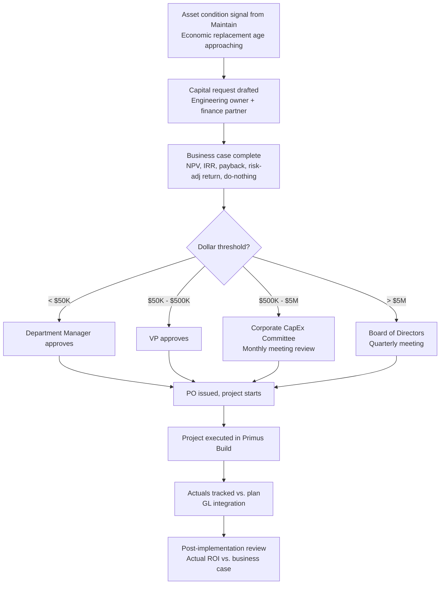

# Primus Plan — Private Capital Planning

## Purpose

Primus Plan is the capital program management system for private infrastructure owners. Its purpose is to manage multi-year capital investment programs, support board-level investment justification, track project financial performance, and connect capital planning to asset condition data from Primus Maintain.

Private capital planning differs fundamentally from public sector capital planning in its financial framework. There are no federal aid programs, no obligation deadlines, no STIP/TIP processes. Instead, the capital plan is a business investment decision: the organization is choosing to deploy capital to maintain or improve its productive capacity. Every capital project must justify itself in terms that a corporate finance team and a board of directors will accept — net present value (NPV), internal rate of return (IRR), payback period, and risk-adjusted return.

Primus Plan provides the tools to develop, justify, and track these investments — from the identification of capital needs (often driven by Primus Maintain's condition analysis) through board approval, project delivery, and financial reporting to actuals variance.

## Business Value

**Board-level capital plan justification.** Primus Plan produces capital investment packages that translate engineering analysis into financial language. A request to replace an aging production line becomes a capital case with:
- **NPV at the corporate hurdle rate** (typically 8-12% WACC + risk premium)
- **Payback period** — years to recover the capital investment via reduced maintenance cost, avoided downtime, or increased throughput
- **IRR** — the discount rate at which NPV = 0
- **Risk-adjusted return** — expected value adjusted by probability-weighted downside scenarios (equipment fails before replacement, throughput gain lower than modeled)
- **Comparison to "do nothing"** — the counterfactual case showing escalating maintenance cost, projected downtime hours, and expected failure cost if the capital is not spent

Finance sees numbers in the format they expect. Engineering provides the underlying data. Primus Plan structures the argument.

**Multi-year capital program management.** Private organizations run annual and multi-year capital programs. Primus Plan manages the full program — from long-range strategic planning (5-10 years) through near-term budget commitments (1-2 years) to current-year execution tracking. Changes to the plan (approved additions, budget reductions, scope changes) are tracked with full audit trail; the program is always current.

**Integration with corporate finance systems.** Capital plans that live in spreadsheets are disconnected from the financial systems that track actual spending. Primus Plan integrates with SAP FI-AA (Asset Accounting), Oracle Financials Capital Projects, Workday Financials, and NetSuite Fixed Assets to close the loop between the capital plan (planned) and the general ledger (actual). Variance is visible in real time.

**Asset condition integration.** The single most valuable capability of Primus Plan is the connection to Primus Maintain. Capital projects don't emerge from intuition — they emerge from asset condition. When Maintain identifies that a critical CNC machine is projected to hit economic replacement age in year 3, that need flows directly into Plan as a capital candidate with pre-populated financial modeling inputs (current maintenance cost trend, downtime hours history, replacement unit cost). The engineer who identified the need and the finance team that approves the budget see the same data.

## The Corporate Capital Approval Cycle

Unlike the public sector CIP cycle (annual budget → legislative approval → federal STIP submission), private capital approval runs on a **rolling corporate cadence** with defined thresholds:

Thresholds are configurable per tenant to match the customer's delegation of authority (DOA) policy. Primus Plan enforces the approval chain — a project cannot leave "Pending Approval" without the required signature captured (electronic signature with audit log).

## How Private Capital Planning Differs by Vertical

### Manufacturing

Capital planning in manufacturing is driven by production capacity and uptime requirements. Major investment categories:

- **Major equipment overhaul/rebuild** — planned intervention to restore an asset to near-new condition, extending life by 5-10 years at a fraction of replacement cost. Example: rebuilding a $2M stamping press for $600K to add 8 years of life.
- **Equipment replacement** — end-of-life replacement when overhaul is no longer cost-effective. Triggered by economic replacement age analysis in Maintain.
- **Capacity expansion** — new equipment to increase production capacity in response to demand growth or new product launches. Justification driven by throughput economics and marginal contribution margin.
- **Compliance capital** — safety improvements required by OSHA, fire codes, EPA, or SEC compliance. Not discretionary; justification is regulatory necessity rather than ROI.
- **Reliability capital** — investments that improve MTBF without changing capacity: redundancy additions, variable-frequency drive retrofits, condition monitoring instrumentation.

The financial model for manufacturing capital is centered on **throughput at risk**: what is the production value at risk if this asset fails? What is the cost of the planned intervention vs. the expected failure cost?

**Example calculation** — replacing a $1.2M packaging line:
- Current annual maintenance cost: $180K (trending +12%/yr)
- Annual unplanned downtime: 240 hours (trending up)
- Line throughput value: $8,500/hour
- Expected annual downtime cost: 240 × $8,500 = $2.04M
- Do-nothing 5-yr cost: escalating maintenance + escalating downtime = ~$14.8M
- Replace-now 5-yr cost: $1.2M capital + $1.5M projected maintenance = $2.7M
- 5-year NPV of replacement (at 10% WACC): +$8.9M
- Payback period: 1.4 years

Primus Plan's ROI model captures these calculations and presents them in a format that plant managers and CFOs evaluate.

### Utilities

Utility capital planning is regulated by state Public Utility Commissions (PUCs). Capital investments must be **"prudent"** under regulatory standards, meaning they must be justified by a need (safety, reliability, compliance, or efficiency) and the investment amount must be reasonable for the purpose. Utilities maintain detailed asset management documentation to support rate case proceedings.

Rate case cadence is typically 2-4 years. A utility files a rate case with the PUC requesting rate recovery for capital investments planned over the next rate period. The PUC reviews and may approve, deny, or reduce the request. Approved capital enters the **rate base**, and the utility recovers the investment plus an approved return on equity through customer rates.

Primus Plan for utilities supports the regulatory documentation requirements:
- Asset condition data from Maintain (justification for need)
- Investment amount with cost-benefit analysis (justification for cost)
- Multi-year capital plan aligned to rate case periods
- Alternatives analysis (what other approaches were considered)
- Reliability impact (SAIDI/SAIFI improvements expected)

The integration between Maintain's condition analysis and Plan's rate case documentation is the primary value driver for utility customers.

### Data Centers

Data center capital planning is driven by two forces:
1. **Scheduled asset lifecycle replacements** — generator overhauls at 15,000 operating hours, UPS batteries every 5-7 years, CRAC compressor rebuilds at 80,000 hours, chiller compressor rebuilds at 40,000 hours, ATS contact replacements at cycle count thresholds
2. **Capacity expansion** — new power density requirements from AI workloads (jumping from 6 kW/rack to 40+ kW/rack for GPU compute), cooling infrastructure upgrades (transitioning from air to liquid cooling), additional generator/UPS capacity for expansion

Capital planning in data centers is unusual in that the cost of getting it wrong is **asymmetric**: a missed generator overhaul that results in a utility-outage failure is catastrophically expensive — SLA breach penalties, customer credits, potential customer loss, and reputation damage that impacts future sales. A colocation provider with a 99.999% SLA has a downtime budget of 5.26 minutes per year; a single failure can consume months of budget.

The financial incentive is to over-invest in planned maintenance rather than risk failure. Primus Plan models this risk asymmetry explicitly: for each deferred investment, the expected failure cost is calculated as:

**Expected failure cost = P(failure in deferral period) × (SLA penalty + customer credit + reputation cost + remediation cost)**

And presented alongside the investment cost. For a Tier III colocation facility, the expected failure cost of deferring a UPS battery replacement can exceed the replacement cost by 10-100x.

### Airports

Airport capital planning combines public and private sector elements. Most airports receive federal Airport Improvement Program (AIP) funding, which brings federal compliance requirements similar to Masterworks. But many airports operate under public-private partnership models where the financial justification framework is private sector. Primus Plan supports:
- Federal AIP compliance for grant-funded portions of the capital program
- Private financial justification for concessions, terminal expansions, and non-AIP work
- Passenger Facility Charge (PFC) revenue tracking and use restrictions
- Cost-benefit analysis for airport capital (e.g., runway extension enabling larger aircraft = incremental landing fees)

### Life Sciences

Capital planning in life sciences must account for **qualification costs that can equal or exceed equipment costs**. An $800K bioreactor replacement also requires:
- $150-300K installation and utility connections
- $200-400K IQ/OQ/PQ qualification protocols and execution
- $100-200K change control documentation and regulatory submission (if change-controlled)
- Lost production during qualification (2-6 months of reduced capacity)

Plans that omit qualification costs create systematic budget surprises. Primus Plan includes **qualification cost templates** for common life sciences asset classes:
- Bioreactors: 60-80% of equipment cost for qualification
- Filling/packaging lines: 40-60% of equipment cost
- Utilities (WFI, purified water, clean steam): 80-120% of equipment cost due to extensive validation
- HVAC in classified areas: 30-50% of equipment cost

The regulatory approval timeline is also a capital planning consideration. Bringing a new manufacturing line into GMP compliance requires either:
- **Notification** (Type I DMF supplement for minor changes) — 30 days
- **Approval** (Type II or CBE-30 supplement) — 30-180 days
- **Prior approval supplement** (PAS for major changes) — 4-12 months

The capital plan must account for regulatory approval timelines in the project schedule; a fully commissioned line that cannot legally produce commercial product is a stranded asset.

## Personas

**VP of Operations / Manufacturing** — Owns production uptime. Needs capital plan that prevents unplanned downtime. Presents capital requests to CFO and board. Success metric: OEE improvement, unplanned downtime reduction.

**VP of Facilities / Data Center Director** — Owns critical infrastructure. Needs lifecycle model for all critical systems. Success metric: uptime SLA compliance, PUE improvement.

**Director of Capital Programs / Utilities** — Manages multi-year capital program for distribution or transmission infrastructure. Needs rate case documentation and regulatory compliance. Success metric: rate case approval rate, prudency standard compliance.

**CFO / VP Finance** — Approves capital investment requests. Needs financial justification (NPV, payback, IRR) and risk-adjusted analysis. Not a daily system user; receives executive summaries and board packages generated by Primus Plan.

**Life Sciences Capital Projects Director** — Manages the intersection of engineering, quality, and regulatory. Needs total-cost-of-compliance visibility across the capital program.

**Corporate Controller** — Reconciles capital plan (planned) against general ledger (actual). Owns integration with SAP FI-AA or Oracle Financials.

## User Stories

1. **As a VP of Operations**, I want to see which production assets have capital needs projected in the next 3 years, with cost estimates and business impact analysis, so that I can prepare my capital budget request with a defensible justification.

   *Acceptance criteria:* Dashboard shows all assets with projected replacement year in years 1-3, ranked by risk-adjusted priority score. Each asset shows: current condition, projected replacement year, replacement cost estimate, expected downtime cost if not replaced, and pre-populated business case.

2. **As a Plant Manager**, I want to run a "do nothing" scenario analysis that shows the projected condition and failure probability of aging equipment if it is not funded in the capital plan so that I can quantify the risk of underfunding to the board.

   *Acceptance criteria:* Scenario tool takes the current capital plan and produces a side-by-side comparison: funded scenario (condition trajectory under approved plan) vs. do-nothing scenario (condition trajectory with no capital, escalating maintenance cost, projected unplanned downtime hours). Downtime is monetized at configurable production value per hour.

3. **As a CFO**, I want the capital plan to show NPV, payback period, and IRR for each capital project so that I can apply consistent financial standards across all investment requests.

   *Acceptance criteria:* Financial summary per project shows NPV at configurable discount rate (default: corporate WACC), IRR, payback period (simple and discounted), and 5-year cumulative cash flow. Sensitivity analysis toggles show impact of ±10%, ±20% variance in key inputs.

4. **As a VP of Engineering at a utility**, I want to produce the multi-year capital plan section of the rate case filing with supporting asset condition data from Primus Maintain so that our capital investment requests are defensible to the PUC.

   *Acceptance criteria:* Rate case package generator produces: multi-year capital plan by asset class, condition data justifying each investment, alternatives analysis, reliability impact (SAIDI/SAIFI expected improvement), and prudency documentation package formatted for PUC filing.

5. **As a Life Sciences Capital Projects Director**, I want each capital project to include an estimated qualification cost based on the asset class and scope of change so that our capital plan accurately reflects the total cost of compliance.

   *Acceptance criteria:* Project template for life sciences assets includes qualification cost estimator that applies asset-class-specific validation cost factor. User can override with actual quote when available. Total project cost sums equipment + installation + qualification + regulatory submission.

6. **As a Data Center VP of Operations**, I want to see the generator and UPS replacement schedule for the next 10 years, with year-of-need projections based on manufacturer overhaul intervals, so that I can budget for these replacements before they become emergency procurements.

   *Acceptance criteria:* 10-year lifecycle replacement schedule shows year-of-need for each critical asset (generators, UPS units, batteries, CRAC compressors, chillers). Year-of-need is calculated from installation date + expected life OR cumulative operating hours + hourly-interval threshold, whichever comes first.

7. **As a Capital Program Manager**, I want to integrate the capital plan with our SAP Financial Accounting system so that approved capital budgets flow automatically into SAP and actual spend is reflected in the capital plan in real time.

   *Acceptance criteria:* Bidirectional integration with SAP FI-AA. Approved capital projects create asset master records (AS01) in SAP. Cost postings to the SAP project WBS flow back into Primus Plan as actual spend. Variance (planned vs. actual) is displayed on the project detail page.

8. **As a Manufacturing CFO**, I want to see the total capital request for next fiscal year, categorized by strategic driver (replacement/reliability/capacity/compliance), so that I can allocate the capital budget across strategic priorities.

   *Acceptance criteria:* Capital plan dashboard groups projects by driver category with totals. Each category shows count of projects, total capital, and aggregated business case metrics.

## Business Rules

1. **Approval thresholds enforced.** Capital project approval requirements are configurable by dollar amount: under $50K (department manager), $50K-$500K (VP), $500K-$5M (CapEx Committee), over $5M (board). System enforces the approval chain before a project can be marked as approved.

2. **Business case required above threshold.** Projects above a configurable threshold (default: $250K) require a completed business case (NPV, payback, risk analysis) before approval routing. System validates all required business case fields are populated.

3. **Asset condition linkage.** Capital projects that address a condition-based need must be linked to the Primus Maintain asset record. The link populates the project's need statement automatically from asset condition data.

4. **Budget period enforcement.** Capital budgets are allocated by fiscal year. System enforces project spending falls within the approved fiscal year budget unless a carryover is explicitly approved.

5. **Qualification cost tracking (life sciences).** For life sciences customers, qualification cost is tracked as a separate cost category from equipment cost, installation cost, and engineering cost. Total project cost = equipment + installation + engineering + qualification + regulatory submission.

6. **Discount rate configurable per tenant.** NPV/IRR calculations use the tenant's corporate discount rate (default: 10%). Different tenants can specify different rates (utilities typically use their authorized ROE + inflation premium; manufacturers use corporate WACC).

7. **Reserve for contingency.** Approved capital projects reserve a configurable contingency percentage (default: 10% for standard, 20% for high-uncertainty) that is drawn down only against change orders. Contingency remaining is visible on the project dashboard.

8. **Post-implementation review required.** For projects above a configurable threshold (default: $1M), a post-implementation review is required within 12 months of asset in-service. The review compares actual vs. business case metrics.

## Future Evolution

- **AI-driven ROI optimization** — given a constrained capital budget, AI optimization of the project portfolio to maximize aggregate risk-adjusted return
- **Automated board package generation** — AI-generated capital investment packages formatted for board presentation, pulling data from Maintain's condition analysis and Plan's financial modeling
- **Multi-year scenario planning** — Multi-year capital program simulations under different budget and risk assumptions, with Monte Carlo simulation of key variables
- **Sustainability capital tracking** — Carbon reduction metrics for capital investments, supporting ESG reporting (Scope 1/2/3 emissions impact)
- **Predictive downtime cost modeling** — ML model that predicts downtime hours and cost based on asset condition, age, and maintenance history

---

*See also: [Primus Build](build.md) | [Primus Maintain](maintain.md) | [Capital Planning Domain](../domains/capital-planning.md)*
