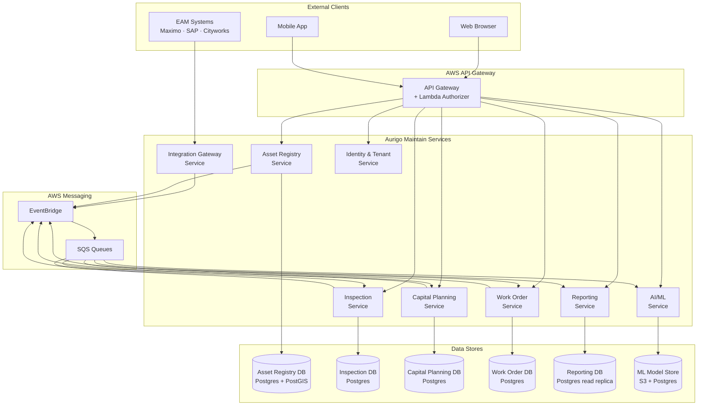

# Microservices Architecture

> Volume 3 · Architecture · Document 05  
> Current state, service decomposition strategy, and communication patterns

---

## Current State: Strategic Monolith

Aurigo Maintain is currently deployed as a **single deployable service** — sometimes called a "strategic monolith" or "modular monolith." This is a deliberate choice made in [ADR-001](./adrs/ADR-001-microservices.md). The reasons are practical: the team is small, the domain is still being discovered, and the operational overhead of maintaining 8+ independent services before the domain boundaries are proven would slow delivery without providing meaningful benefit.

This does not mean the codebase is a big ball of mud. The internal structure is disciplined: Clean Architecture with clear module boundaries (Assets, Inspections, CapitalNeeds, JobOrders, Dashboard), domain events for cross-module communication, and repository interfaces that would allow swapping the database without touching domain logic. Extracting a module into a microservice is a 2–3 week effort when the internal boundaries are clean.

The **decomposition trigger** is simple: when a single bounded context requires independent scaling, a different deployment cadence, or a different technology stack than the rest of the service, it is time to extract it. See [ADR-001](./adrs/ADR-001-microservices.md) for the full decision.

---

## Target Service Topology (GA and Beyond)

When decomposition is warranted, the following service boundaries define the target state. Each boundary is derived from Domain-Driven Design bounded context analysis.

---

## Service Definitions

### 1. Asset Registry Service

**Domain:** Asset master data, classifications, GIS geometry, asset lifecycle (Active/Inactive/Decommissioned).

**Owns:** `assets`, `asset_classes`, `asset_components` tables.

**Events published:**
- `asset.registered` — when a new asset is created
- `asset.condition.changed` — when the asset's current condition index changes
- `asset.decommissioned` — when an asset is removed from service
- `asset.location.updated` — when geometry is updated

**API surface:** CRUD for assets and asset classes. Spatial search (bounding box, radius). Bulk import.

**Scaling considerations:** GIS spatial queries are CPU-intensive. This service may need independent scaling before others during bulk import or reporting peak.

---

### 2. Inspection Service

**Domain:** Inspection records, defect cataloging, condition assessment workflow.

**Owns:** `inspections`, `inspection_defects`, `inspection_photos` tables.

**Events consumed:**
- (none required at subscription time — inspectors create inspections directly)

**Events published:**
- `inspection.completed` — triggers condition update in Asset Registry, RUL recalculation in Capital Planning

**API surface:** Create/complete inspections, record defects, upload photos, retrieve inspection history for an asset.

**Scaling considerations:** Peak load during field inspection campaigns (all inspectors submitting simultaneously). Photo upload is I/O-bound. Independently scalable.

---

### 3. Capital Planning Service

**Domain:** Remaining Useful Life (RUL) calculations, Asset Replacement Value (ARV), capital need identification, budget prioritization, TAMP generation.

**Owns:** `capital_needs`, `budget_scenarios`, `tamp_snapshots`, `rul_scores`, `arv_scores` tables.

**Events consumed:**
- `inspection.completed` — recalculate RUL for the inspected asset
- `asset.condition.changed` — recalculate risk score
- `asset.decommissioned` — remove pending capital needs for decommissioned asset

**Events published:**
- `capital-need.created` — when a new capital need is identified
- `capital-plan.approved` — when a budget scenario is approved

**API surface:** Capital needs CRUD, budget scenario management, TAMP report generation, RUL query, risk score query.

**Scaling considerations:** RUL and risk recalculation after a large inspection campaign can be bursty. Background job processing via SQS queue is preferred over synchronous computation on the critical path.

---

### 4. Work Order Service

**Domain:** Preventive maintenance work orders, work order lifecycle, completion recording.

**Owns:** `work_orders`, `pm_templates`, `work_order_activities` tables.

**Events consumed:**
- `capital-plan.approved` — create work orders for approved capital needs
- `asset.decommissioned` — cancel open work orders

**Events published:**
- `work-order.completed` — triggers condition update in Asset Registry

**API surface:** Work order CRUD, PM template management, field technician completion recording.

---

### 5. Integration Gateway Service

**Domain:** EAM connector management, data translation, sync orchestration.

**Owns:** `integration_configs`, `sync_logs`, `field_mappings` tables.

**Role:** Adapts external EAM data (Maximo, SAP, Cityworks) into the Aurigo canonical model and publishes events to EventBridge. Also handles outbound sync (pushing work order completions back to Maximo).

**Events published:**
- `asset.sync.received` — when EAM asset data arrives
- `inspection.sync.received` — when EAM inspection data arrives
- `work-order.sync.received` — when EAM work order completion arrives

---

### 6. Reporting Service

**Domain:** Report generation, scheduled delivery, TAMP document rendering.

**Owns:** Materialized reporting tables populated from other services' events.

**Events consumed:**
- All domain events — maintains denormalized reporting views

**API surface:** Generate report (async), check report status, download report. Report catalog management.

**Technology notes:** May use a read replica of other databases. PDF generation is CPU-intensive — separate scaling profile warranted.

---

### 7. Identity & Tenant Service

**Domain:** JWT issuance (for development/testing only — production uses the Aurigo lambda-authorizer), tenant provisioning, user management.

**Owns:** `tenants`, `users`, `roles` tables.

**Notes:** In production, the Aurigo lambda-authorizer handles JWT validation. This service provides user management APIs for tenant administrators.

---

### 8. AI/ML Service

**Domain:** Deterioration model training, RUL prediction, anomaly detection, TAMP narrative generation, capital optimization.

**Owns:** Model artifacts in S3, prediction log in Postgres.

**API surface:** Predict RUL (synchronous for UI), batch recalculate (async), explain prediction, suggest capital allocation.

**Technology notes:** May require GPU instances for model training. The prediction endpoint must be synchronous with < 200ms latency. Model training is async.

---

## Service Communication Patterns

### Synchronous (REST)

Use synchronous REST calls when:
- The caller needs the response to continue processing.
- The operation must be atomic from the caller's perspective.
- The latency of one additional network hop is acceptable (< 100ms internal service-to-service).

Examples:
- Frontend → API Gateway → Asset Registry (user is waiting for the response)
- Capital Planning recalculating RUL in response to a direct user request
- Integration Gateway validating an incoming asset record against Asset Registry classifications

### Asynchronous (EventBridge + SQS)

Use asynchronous events when:
- The sender does not need the result to continue.
- Multiple services may react to the same event.
- Eventual consistency is acceptable.
- The operation is a side effect of the primary operation (e.g., "inspection completed" → recalculate RUL is a side effect, not the primary purpose of recording an inspection).

Examples:
- `inspection.completed` → Capital Planning recalculates RUL (the inspector doesn't wait for RUL recalculation)
- `asset.condition.changed` → Reporting service updates its materialized views
- `capital-plan.approved` → Work Order service creates work orders

### Service Discovery

AWS ECS service discovery (internal DNS). Each service registers at `[service-name].asset-maintenance.internal`. Internal calls use this DNS name. No hardcoded IP addresses.

---

## Data Isolation

Each service owns its own database schema (or its own RDS instance for large services). Services never share databases. This is the most important constraint in microservices architecture — without it, you have a distributed monolith with all the operational complexity of microservices and none of the independence.

Cross-service data access follows these rules:
1. **Read the API, not the database.** If Capital Planning needs the asset's name, it calls the Asset Registry API.
2. **Subscribe to events, not direct queries.** If Reporting needs to know when an inspection is completed, it subscribes to `inspection.completed`.
3. **Maintain local copies of what you need frequently.** Reporting may maintain a denormalized copy of asset names. This is acceptable — it is not a shared database, it is a service-local projection.

---

## Anti-Patterns to Avoid

### Distributed Monolith

**What it looks like:** Services that must always be deployed together because they share a database, share a code library that includes domain logic, or have synchronous chains that make independent deployment impossible.

**Prevention:** Strict data isolation (separate databases). No shared domain code (share only infrastructure utilities — logging, retry policies, not domain types). Avoid synchronous chains longer than 2 hops.

### Chatty Services

**What it looks like:** A single user request triggers 15 synchronous service-to-service calls. Each hop adds latency; any hop failure propagates.

**Prevention:** Design APIs to be "chunky not chatty" — one call that returns everything needed. Use the BFF (Backend for Frontend) pattern for complex aggregated views. Use asynchronous event-driven data synchronization so services have local copies of frequently-needed cross-domain data.

### Synchronous Chains

**What it looks like:** API Gateway → Service A → Service B → Service C. If Service C is slow, the whole chain is slow. If Service C fails, the user sees an error.

**Prevention:** Maximum 2 synchronous hops for any user-facing request. Cross-domain operations that do not need to be synchronous become events.

### Premature Microservices

**What it looks like:** Splitting the monolith into 12 services before the domain boundaries are proven, resulting in constant refactoring as the team discovers the actual boundaries.

**Prevention:** Follow ADR-001. Stay modular. Extract when the trigger conditions are met.

---

_See also: [ADR-001 — Microservices](./adrs/ADR-001-microservices.md) for the deployment decision, [06 — Events](./06-events.md) for event schema and AWS patterns._
