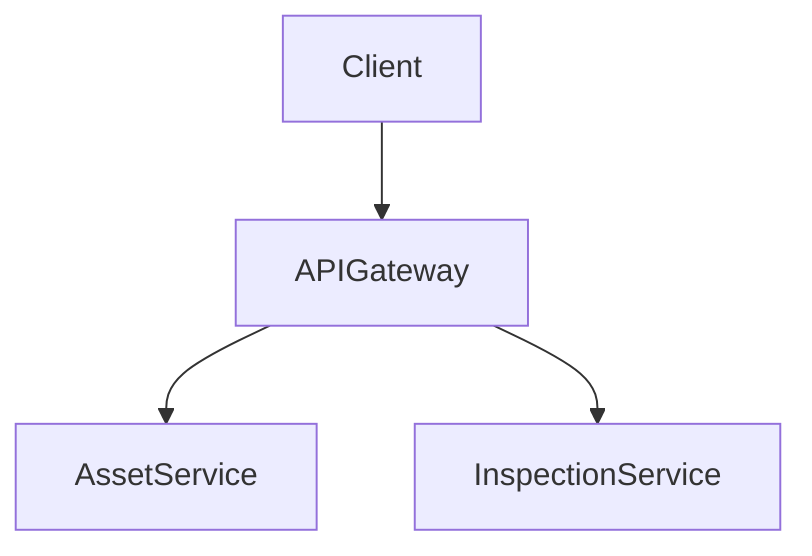

# Documentation Standards

> Volume 3 · Architecture · Document 15  
> Code documentation, API docs, architecture docs, runbooks, and anti-patterns

---

## The Purpose of Documentation

Documentation serves one purpose: to allow the next person (or AI agent) to understand a decision, use a piece of code correctly, or recover from a failure — faster than they could by reading the code alone. If documentation does not accelerate understanding, it is waste.

This means:
- **Comments that restate what the code does are waste.** The code already says what it does.
- **Comments that explain WHY a decision was made are valuable.** The code cannot say why.
- **Documentation that lives only in Slack is effectively deleted** — it cannot be searched, versioned, or found by the next engineer.
- **Documentation that is never updated becomes misleading** — worse than no documentation.

These standards enforce documentation that is valuable, version-controlled, and maintained.

---

## Code Documentation

### C# XML Doc Comments

Every public type and member in the `Application/` and `Domain/` layers requires XML doc comments. The Swagger generator uses these comments to populate the API documentation automatically.

**Correct — explains what the method does and its contract:**
```csharp
/// <summary>
/// Calculates the Remaining Useful Life of an asset using the Weibull deterioration model.
/// </summary>
/// <param name="conditionIndex">
/// The current condition index on a 0–5 scale.
/// 0 = failed, 5 = new or like-new condition.
/// </param>
/// <param name="installDate">
/// The date the asset was placed in service. Must not be in the future.
/// </param>
/// <param name="assetClass">
/// The asset class containing the Weibull shape parameter (β) and design life.
/// </param>
/// <returns>
/// A <see cref="RulResult"/> containing the estimated remaining years and a flag
/// indicating whether the estimate is considered reliable for the given inputs.
/// </returns>
/// <exception cref="ArgumentOutOfRangeException">
/// Thrown when <paramref name="conditionIndex"/> is outside 0–5.
/// </exception>
public RulResult Calculate(decimal conditionIndex, DateOnly installDate, AssetClass assetClass)
```

**Incorrect — comment restates the code:**
```csharp
/// <summary>
/// Calculates RUL.
/// </summary>
public RulResult Calculate(decimal conditionIndex, DateOnly installDate, AssetClass assetClass)
```

### Inline Comments: Only for Non-Obvious Invariants

Inline comments should explain reasoning that the reader cannot derive from the code. They should be rare in clean code — if a comment is needed to explain every other line, the code needs refactoring, not comments.

**Correct — explains a non-obvious constraint:**
```csharp
// Weibull survival function uses age-at-failure, not current age.
// We estimate age at current condition by inverting the deterioration curve.
// This inversion is only reliable when conditionIndex > 0.5 (the model
// degenerates near the failure point). IsReliable flags unreliable estimates.
var estimatedAgeAtCurrentCondition = InvertDeteriorationCurve(conditionIndex, assetClass);
```

**Incorrect — restates the code:**
```csharp
// Add inspection to the list
_inspections.Add(inspection);
```

### No Commented-Out Code

Use git history to preserve old code. Commented-out code creates clutter, confuses reviewers about intent ("is this intentionally disabled or forgotten?"), and is never cleaned up. The pre-commit ESLint rule for TypeScript and a custom analyzer for C# flag commented-out code blocks in PRs.

---

## API Documentation (OpenAPI / Swagger)

Every controller action that is part of the public API requires:
1. **XML doc `<summary>`** on the action method.
2. **`[ProducesResponseType]`** for every possible response status code.
3. **`[ProducesResponseType(typeof(ValidationProblemDetails), 400)]`** on every action that accepts a request body.
4. Enum values in DTOs documented with their string representations.

**Controller documentation example:**
```csharp
/// <summary>
/// Retrieve the inspection history for an asset.
/// Returns inspections in reverse chronological order (most recent first).
/// </summary>
/// <param name="assetId">The asset's unique identifier.</param>
/// <param name="page">Page number (1-based). Default: 1.</param>
/// <param name="pageSize">Page size (max 100). Default: 20.</param>
/// <param name="ct">Cancellation token.</param>
/// <returns>Paginated list of inspections for the specified asset.</returns>
/// <response code="200">Inspections returned successfully.</response>
/// <response code="401">Authentication token missing or invalid.</response>
/// <response code="404">Asset not found in this tenant.</response>
[HttpGet("{assetId:guid}/inspections")]
[ProducesResponseType(typeof(PagedList<InspectionListItemDto>), StatusCodes.Status200OK)]
[ProducesResponseType(StatusCodes.Status401Unauthorized)]
[ProducesResponseType(StatusCodes.Status404NotFound)]
public async Task<ActionResult<PagedList<InspectionListItemDto>>> GetInspectionHistory(...)
```

### Keeping Swagger in Sync

The `infra/swagger/asset-maintenance-v1.json` file is generated from the running API and committed to the repository. The CI pipeline validates that the committed Swagger matches the built API. If they diverge, the pipeline fails.

Workflow for updating Swagger:
1. Change the API.
2. Run the API locally.
3. Run `dotnet run --project src/Api -- --swagger-export infra/swagger/asset-maintenance-v1.json`.
4. Run `npm run gen:api` in the frontend to regenerate the TypeScript client.
5. Commit both the updated Swagger JSON and the regenerated client.

---

## Architecture Documentation

### Architecture Decision Records (ADRs)

ADRs are the most important documentation artifact. They answer: "Why does this system look the way it does?" Without ADRs, new team members (and AI agents) repeat decisions that were already made and found to be wrong, or fail to understand the constraints that make an "obvious" alternative unworkable.

See the full ADR process in [adrs/README.md](./adrs/README.md).

**When to write an ADR:**
- A technology choice that will outlast the sprint (framework, library, database, cloud service)
- A design pattern applied across the codebase (Clean Architecture, CQRS, EF Core global filters)
- A decision that overturns a previous approach
- A decision where there was meaningful discussion about alternatives

**Format:** See [adrs/README.md](./adrs/README.md) for the template.

### Mermaid Diagrams

Architecture diagrams are written in Mermaid and committed alongside the documentation. They are rendered in GitHub's markdown viewer. Avoid external diagram tools (Lucidchart, draw.io) — they are not version-controlled.

```markdown

```

When a diagram becomes stale (the code has changed but the diagram has not), the diagram is worse than no diagram. Review diagrams as part of PR review when the system structure changes.

### CLAUDE.md for AI Agents

`CLAUDE.md` at the project root is the entry point for AI agents (Claude Code) working on the codebase. It contains: project purpose, tech stack, directory layout, commands, conventions, and explicit "DO NOT" rules. Update `CLAUDE.md` whenever:
- A new major dependency is added
- A new directory convention is established
- A new "DO NOT" constraint is agreed upon

AI agents that work on this codebase read `CLAUDE.md` first. If the CLAUDE.md is inaccurate, the agent will make incorrect assumptions.

### README.md Files

Every significant directory has a `README.md` explaining:
- What lives in this directory
- Why it is organized this way
- What does NOT belong here (equally important)

This is especially important for directories with non-obvious rules (e.g., `Application/Calculations/` — pure C#, no I/O, no dependencies).

---

## Runbooks

Runbooks are step-by-step operational procedures. They live in `docs/runbooks/` and are version-controlled.

Required runbooks:

### Deployment Runbook

`docs/runbooks/deployment.md`

Step-by-step instructions for:
1. Creating a release tag
2. Monitoring the staging deployment
3. Approving the production deployment gate
4. Verifying production health after deployment
5. Rolling back if needed

### Database Migration Runbook

`docs/runbooks/database-migration.md`

Step-by-step instructions for:
1. Reviewing the generated migration SQL
2. Testing on a clean database
3. Applying to staging
4. Applying to production (procedure for zero-downtime migrations)
5. Verifying the migration succeeded
6. Rollback procedure (forward-only fix migration)

### Incident Response Runbook

`docs/runbooks/incident-response.md`

Step-by-step instructions for:
1. Detecting the incident (CloudWatch alert, customer report)
2. Initial triage (check CloudWatch dashboard, X-Ray traces, recent deployments)
3. Communication (notify the team, update status page)
4. Mitigation options (rollback, feature flag, scale up)
5. Root cause analysis
6. Post-incident review process

### Integration Troubleshooting Guide

`docs/runbooks/integration-troubleshooting.md`

Per-integration (Maximo, SAP, Cityworks) troubleshooting for common sync failures, credential expiry, API version mismatches, and custom field mapping errors.

---

## Anti-Patterns

| Anti-pattern | Why it's wrong | Correct approach |
|---|---|---|
| Documentation only in Confluence | Not version-controlled; not searchable alongside code; diverges from reality | Commit docs alongside code in Markdown |
| Confluence as the "single source of truth" | Code moves faster than Confluence; Confluence becomes stale | Code is truth; Markdown docs in the repo are close second |
| ADR written in Slack thread | Not searchable in 6 months; disappears when team members leave | ADR in `vol-3-architecture/adrs/` |
| Comments that restate the code | Noise; becomes wrong when code is refactored but comment is not | Delete the comment; let the code speak |
| Diagram in draw.io without code commit | Not version-controlled; link breaks when doc is moved; not visible in code review | Mermaid diagrams in Markdown |
| PR description says "Added feature X" without explaining what changed and why | Reviewers cannot evaluate whether the implementation is correct | PR description must include: what changed, why, testing approach, any tradeoffs |
| Sprint planning docs in Notion without linking to code | Context lost when trying to understand why a piece of code was written | User stories linked to ADRs where relevant; code comments for non-obvious invariants |
| CLAUDE.md not updated when conventions change | AI agents make incorrect decisions based on stale context | CLAUDE.md is a living document; update on every convention change |

---

_See also: [adrs/README.md](./adrs/README.md) for the ADR process, [16 — Definition of Done](./16-definition-of-done.md) for documentation as a gate._
