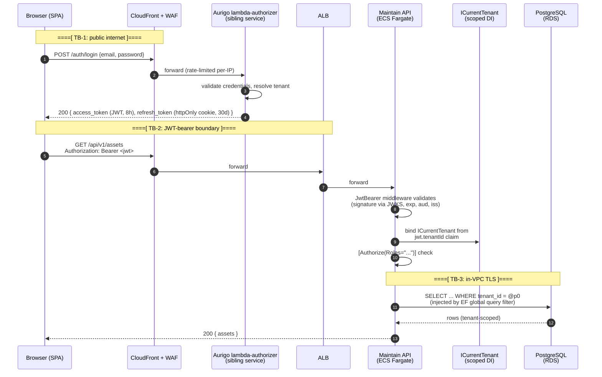
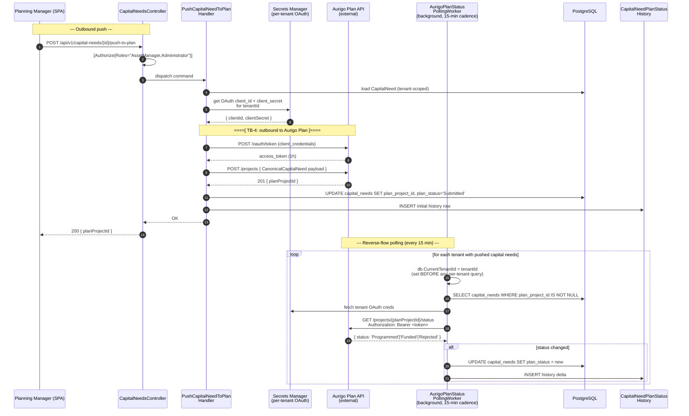
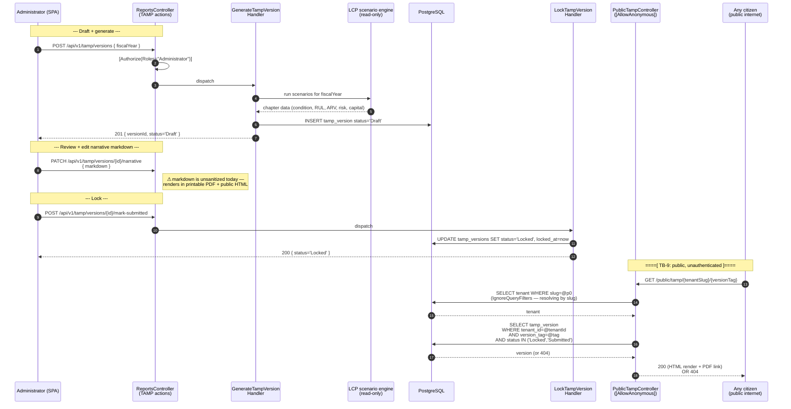
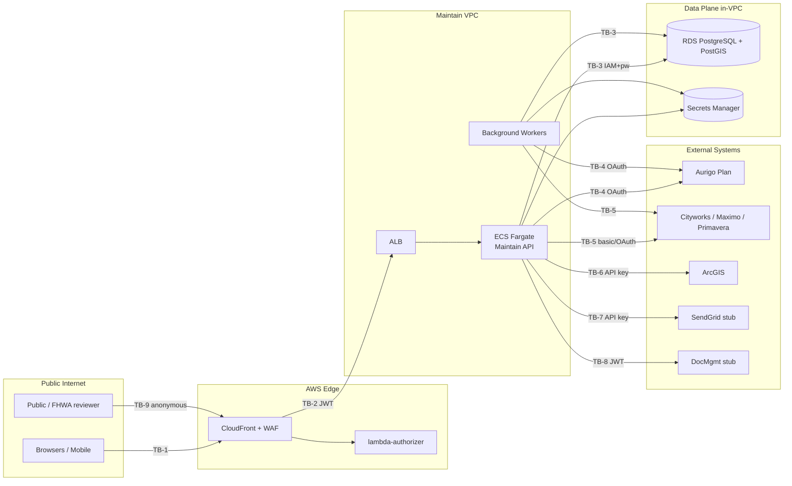

# Data Flow Diagrams — Aurigo Maintain

> Companion to `README.md` in this folder. Walk these DFDs in the workshop; STRIDE per DFD.
> Trust boundaries are marked `====[ TB-N ]====` in narrative and as dashed rectangles in Mermaid.

---

## Trust Boundary Legend

| ID | Boundary | Auth mechanism | Notes |
|---|---|---|---|
| **TB-1** | Public internet → CloudFront/WAF | none (WAF rules only) | Public entry — highest untrust |
| **TB-2** | ALB → ECS Fargate (Maintain API) | JWT bearer (validated at controller via `[Authorize]`) | Reused Aurigo `lambda-authorizer` claim shape |
| **TB-3** | ECS → RDS PostgreSQL 16 + PostGIS | IAM DB auth + password from Secrets Manager | In-VPC, TLS 1.2+ |
| **TB-4** | ECS → Aurigo Plan API | OAuth2 client-credentials (per-tenant secret) | Outbound only for capital-need push; inbound polling reads Plan status |
| **TB-5** | ECS → Cityworks / Maximo / Primavera EAM | Basic-auth or OAuth per adapter, per-tenant | Outbound sync + optional write-back (Hybrid Mode) |
| **TB-6** | ECS → ArcGIS Enterprise / Online | API key or SAML per tenant | Read-only (asset geometry, ownership boundaries) |
| **TB-7** | ECS → SendGrid (stub today) | API key from Secrets Manager | Outbound only; templated content |
| **TB-8** | ECS → DocMgmt (stub today) | JWT to sibling MW Platform 2.0 service | Internal service-to-service |
| **TB-9** | Public internet → `PublicTampController` | **none — `[AllowAnonymous]`** | Highest-exposure surface; status-gated in code |

---

## DFD-1 — Login → JWT → Tenant Scoping

**Purpose:** How a user establishes identity and how every subsequent request is scoped to their tenant.



**Narrative + trust-boundary notes:**

- **TB-1 → TB-2 crossover:** The JWT is issued by `lambda-authorizer` — the Maintain service does not issue tokens in production (`07-security.md` § Authentication). The Maintain API only validates: signature (JWKS), `exp`, `aud`, `iss`, plus presence of `tenantId` and `role` claims.
- **`tenantId` is trusted only from the JWT.** It never comes from a request body, query string, path parameter, or header. This is `B-03` in the security-review template. `17-tenant-isolation-audit.md` § BUG-01 (SsoConfigController IDOR) is exactly the case of a controller trusting a path `{tenantId}` instead of `ICurrentTenant.Value`.
- **EF global query filter** appends `WHERE tenant_id = <ICurrentTenant.Value> AND deleted_at IS NULL` to every query on an `ITenantOwned` entity (`08-authorization.md` § Row-Level Security). Bypassing this requires `.IgnoreQueryFilters()` with a documented reason.
- **Refresh flow:** refresh tokens are httpOnly cookies to block XSS theft (`07-security.md` § Token Lifetime). Rotation on use is a `Fail`-gate item (`security-review-template.md` A-05).

---

## DFD-2 — Asset Create → Audit Log → PostGIS Writeback

**Purpose:** Standard mutation path. Shows the `SaveChangesInterceptor` audit sidecar and the PostGIS geometry writeback.

```mermaid
sequenceDiagram
    autonumber
    participant User as Browser (SPA)
    participant API as Maintain API<br/>(AssetsController)
    participant Val as FluentValidation<br/>(MediatR pipeline)
    participant H as CreateAssetHandler<br/>(Application)
    participant Dom as Asset entity<br/>(Domain — invariants)
    participant Int as AuditInterceptor<br/>(SaveChangesInterceptor)
    participant DB as PostgreSQL + PostGIS

    User->>API: POST /api/v1/assets<br/>{name, geometry (GeoJSON), assetClass, ...}
    API->>API: [Authorize(Roles="AssetManager,Administrator")]
    API->>Val: CreateAssetCommandValidator
    Val-->>API: OK / 400 with problem-details

    API->>H: dispatch command
    H->>Dom: Asset.Create(cmd, tenantId=ICurrentTenant.Value)
    Dom-->>H: Asset entity (with GEOMETRY(4326) point)
    H->>DB: db.Assets.Add(asset); db.SaveChangesAsync()

    Note over DB,Int: ====[ SaveChangesInterceptor cross-cuts ]====
    Int->>Int: capture old/new JSON, user_id,<br/>tenant_id, request_id, changed_at
    Int->>DB: INSERT INTO audit.audit_log (...)
    DB-->>H: OK (asset id)

    H-->>API: AssetDto
    API-->>User: 201 Created { asset }
```

**Narrative + trust-boundary notes:**

- **Input validation is at the API boundary via FluentValidation** (`07-security.md` § Input Validation). Domain layer enforces invariants only — no re-validation of field lengths.
- **`tenant_id` on insert comes from `ICurrentTenant.Value`, never from the DTO** (`security-review-template.md` B-04). A DTO carrying `tenantId` is a `Fail`.
- **PostGIS injection** (`security-review-template.md` D-02) — geometry is parsed by NetTopologySuite into `Point`/`LineString`/`Polygon` before entering the entity. No user-supplied string is interpolated into `ST_GeomFromText` or any spatial function. SRID is fixed at `4326`.
- **`AuditInterceptor` cannot be bypassed** (`07-security.md` § Audit Log) — the table has no UPDATE/DELETE grants for the application user. This is the anti-repudiation control.
- **Threat: what if the interceptor throws?** The transaction rolls back — data is not persisted without an audit row. Confirmed in existing tests, but is the seed for DFD-2 seeded Repudiation threat.

---

## DFD-3 — Inspection Submit → Condition → RUL / ARV / Risk Cascade

**Purpose:** The single command that triggers the entire intelligence pipeline. Highest business-logic risk surface — a bug here silently corrupts capital-planning outputs.

```mermaid
sequenceDiagram
    autonumber
    participant Inspector as Inspector (SPA/mobile)
    participant API as InspectionsController
    participant H as SubmitInspectionCommand<br/>Handler
    participant Cond as ConditionScoreRecalc
    participant RUL as RulCalculator<br/>(pure, stateless)
    participant ARV as ArvCalculator<br/>(pure, stateless)
    participant Risk as RiskScorer<br/>(pure, stateless)
    participant DB as PostgreSQL
    participant Int as AuditInterceptor

    Inspector->>API: POST /api/v1/inspections/{id}/submit<br/>{ conditionRatings, photos, notes }
    API->>API: [Authorize(Roles="Inspector,AssetManager,...")]
    API->>H: dispatch SubmitInspectionCommand

    H->>DB: load Asset + last N Inspections<br/>(tenant-filtered by global query filter)
    DB-->>H: Asset + history

    H->>Cond: recalc conditionIndex from ratings
    Cond-->>H: newConditionIndex

    H->>RUL: RulCalculator.Compute(asset, condition, class-params)
    RUL-->>H: rulYears

    H->>ARV: ArvCalculator.Compute(asset, unitCost, indexation)
    ARV-->>H: replacementValue

    H->>Risk: RiskScorer.Compute(condition, consequence, exposure)
    Risk-->>H: riskScore

    H->>DB: UPDATE assets SET condition, rul, arv, risk;<br/>INSERT inspection; INSERT capital_need (if triggered)
    Note over Int,DB: AuditInterceptor writes rows for every mutation
    DB-->>H: OK

    H-->>API: InspectionResultDto
    API-->>Inspector: 200 { conditionIndex, rul, arv, riskScore, capitalNeedCreated? }
```

**Narrative + trust-boundary notes:**

- **Calculation engines are pure C#, stateless, no DB access, no I/O** (`CLAUDE.md` § Conventions). The trust boundary is the handler → calculator call — inputs must be validated before reaching the calculator or garbage-in-garbage-out propagates silently.
- **The cascade is a moat.** Per `03-tech-architect.md` charter, `SubmitInspectionCommand` cascade is an architectural moat that must not be weakened.
- **All reads use the tenant-filtered DbSet.** No `IgnoreQueryFilters()` in this handler path (confirmed clean in `17-tenant-isolation-audit.md` § 4.2).
- **Threat surface:** input tampering on condition ratings (an Inspector maliciously downgrading a bridge to trigger a capital need), boundary math errors in the calculators (fuzz coverage is a `qa-lead` follow-up), and cascade failure (partial write leaves asset.condition updated but capital_need not created — atomic-transaction test is a QA regression).

---

## DFD-4 — Capital Need → Aurigo Plan Push → Reverse-Flow Polling

**Purpose:** Bidirectional external integration. OAuth outbound, credential-per-tenant, polling-worker inbound. Reverse-flow returns Plan status (Draft/Programmed/Funded/Rejected) that flows back into Maintain to close the loop.



**Narrative + trust-boundary notes:**

- **TB-4 credential per tenant.** Naming per `vol-6-integration-strategy/00-integration-overview.md` § Service Account Least-Privilege — `aurigo-maintain-{tenantSlug}-plan-readwrite`. Never share client-secrets across tenants.
- **Reverse-flow worker ordering.** Sets `db.CurrentTenantId` BEFORE any per-tenant query (`17-tenant-isolation-audit.md` § 4.3 confirmed clean). A reversal of this order would be a tenant-leak regression.
- **Token replay.** OAuth access tokens are 1-hour bearer strings. If leaked mid-flight (Splunk log, breakpoint), attacker gets 1 hour of Plan API access scoped to that tenant. `HttpBodyScrubber` (`Application/Integrations/Diagnostics/HttpBodyScrubber.cs`) is the mitigation — every outbound log line is scrubbed of `Authorization`, `client_secret`, and known token patterns.
- **Retry-storm amplification.** If Plan API returns 5xx, the worker must exponential-backoff and dead-letter after N attempts. Uncontrolled retry across all tenants simultaneously is a DoS-against-Plan risk (workshop threat).
- **Echo/loop prevention.** When the push completes, Plan may fire a webhook back — the handler must detect that the incoming status matches the just-pushed state and not treat it as a state change (echo detection). Cityworks/Maximo already have this pattern.

---

## DFD-5 — TAMP Generate → Version Lock → Public Publish

**Purpose:** External-compliance-facing publish flow. `PublicTampController` is the **only `[AllowAnonymous]` controller** in the codebase besides `/health` and `/auth/login`. Highest external exposure — a leak here is a public-record disclosure.



**Narrative + trust-boundary notes:**

- **TB-9 is the only unauthenticated data path** in the system beyond `/health` and `/auth/login`. Any expansion of the public surface requires an explicit security review (`07-security.md` § Security Review Requirements).
- **Status guard is the ONLY gate** between draft data and the public. `17-tenant-isolation-audit.md` § 1.2 confirmed the current pattern is safe: resolve tenant from slug, then filter by `TenantId` AND status in `('Locked','Submitted')`. A regression that drops the status guard would leak draft financials to the public.
- **Watermark/attribution.** TAMP PDFs carry Aurigo attribution + version tag + generation timestamp. A "print without watermark" path (e.g., a hidden query param `?raw=1`) would be a compliance leak — flag as a threat.
- **Markdown XSS.** Per current session context, TAMP narrative markdown is rendered without sanitization in both the public HTML view and the printable PDF path (`frontend/asset-maintenance-web/src/features/reports/TampNarrativeTab.tsx`, `ConsistencyLetterModal.tsx`). An Administrator writing `<script>` or `<iframe>` into narrative → executes in every citizen's browser on the public page. Mitigation gap flagged in seed catalog `T-19`.
- **Draft-version leakage protection is codified in the status guard.** Any refactor to `PublicTampController` needs a regression test in `TenantIsolationTests.cs` proving Draft versions return 404.
- **Compliance surface:** the public URL is what FHWA reviewers may cite in a consistency determination (`domains/tamp.md` § Annual consistency determination July 31). Availability + integrity of this endpoint are a compliance concern, not just a UX concern.

---

## Trust-Boundary Composite Diagram



---

_Continue to `threat-catalog-seed.md` for the seeded STRIDE table._
