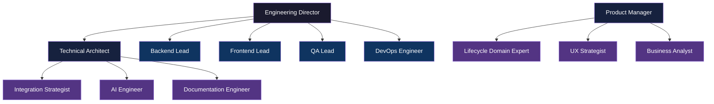

# Volume 4 — AI Organization

> Engineering Playbook · Volume 4 of 10

This volume describes the operating model of Aurigo's AI-native engineering organization. Every role is an AI-augmented role. The human owns accountability; the AI agent amplifies output, accelerates research, and handles heavy implementation lifting. Understanding how roles are structured and how they collaborate is essential for any engineer joining the team or any AI agent operating within it.

---

## The Core Principle

Aurigo is an **AI-native engineering organization**. This does not mean replacing engineers with AI — it means that every engineer works in continuous collaboration with AI agents. The engineer sets context, makes judgment calls, reviews outputs, and owns accountability. The AI agent does the heavy lifting: exploring large codebases, drafting code and tests, researching standards, generating documentation, and proposing architectural options.

The goal is not to reduce headcount. The goal is to **dramatically increase what a small team can deliver** — to operate with the quality and output of a team 5x larger, by removing the mechanical work from skilled engineers' plates.

---

## Overview

| Document | Role | Brief Description |
|---|---|---|
| [00 — Org Overview](./00-org-overview.md) | N/A | Full model: how agents collaborate, memory architecture, human approval gates |
| [01 — Engineering Director](./01-engineering-director.md) | Engineering Director | Senior human authority over engineering execution, quality, and culture |
| [02 — Product Manager](./02-product-manager.md) | Product Manager | Customer discovery → engineering requirements → sprint goals |
| [03 — Technical Architect](./03-tech-architect.md) | Technical Architect | Architecture decisions, ADRs, cross-cutting standards |
| [04 — Backend Lead](./04-backend-lead.md) | Backend Lead | .NET, EF Core, API, database migration quality |
| [05 — Frontend Lead](./05-frontend-lead.md) | Frontend Lead | React, TypeScript, TanStack, accessibility, performance |
| [06 — QA Lead](./06-qa-lead.md) | QA Lead | Testing strategy, automation, coverage, acceptance sign-off |
| [07 — DevOps Engineer](./07-devops-engineer.md) | DevOps Engineer | CI/CD, AWS infrastructure, deployment, monitoring |
| [08 — Lifecycle Domain Expert](./08-lifecycle-domain-expert.md) | Lifecycle Domain Expert | Infrastructure asset management practitioner embedded in engineering |
| [09 — Integration Strategist](./09-integration-strategist.md) | Integration Strategist | EAM integration architecture (Maximo, SAP, Cityworks, Infor) |
| [10 — UX Strategist](./10-ux-strategist.md) | UX Strategist | Design system, user research, field usability, accessibility |
| [11 — Business Analyst](./11-business-analyst.md) | Business Analyst | Requirements gathering, process mapping, acceptance criteria |
| [12 — AI Engineer](./12-ai-engineer.md) | AI Engineer | ML models, deterioration curves, capital optimization, AI features |
| [13 — Documentation Engineer](./13-documentation-engineer.md) | Documentation Engineer | All documentation: API reference, user guides, playbook, release notes |

---

## Organization Chart

---

## How Roles Collaborate

Roles communicate through:
- **Shared memory files** (MEMORY.md and typed memory files in `~/.claude/projects/`) — persist context across sessions
- **Code artifacts** (PRs, ADRs, test plans) — the primary collaboration medium
- **Issue trackers and sprint boards** — for task handoffs and status visibility
- **The engineering playbook itself** — the shared context that keeps all roles aligned

Every AI-augmented workflow in this volume follows the same pattern: the human defines the goal and constraints, the AI agent does the research and drafting, the human reviews and makes judgment calls, the output is committed to the repository.

---

## Scaling Plan — How the Org Grows

The AI-native org scales differently than a traditional engineering org. AI agents amplify each human role, so the team composition grows more slowly than a traditional team would, but with sharper role specialization at each stage. The following plan describes the hiring order as the team scales from prototype through GA to multi-product.

### Stage 1 — Founding Team (5 people)

**Composition**: Engineering Director, Product Manager, Backend Lead (playing Tech Architect), Frontend Lead (playing UX Strategist), Lifecycle Domain Expert.

**Notes**: The Backend Lead doubles as Tech Architect because architectural decisions and .NET implementation are tightly coupled at this stage. The Frontend Lead handles UX because UI patterns are still being established. The Lifecycle Domain Expert is the differentiator — no infrastructure asset management product succeeds without deep domain input from day one.

**AI leverage**: Every role uses Claude Code for daily work. The 5-person team ships at the velocity of a traditional 12–15 person team.

**Hire in order**: ED (or hire ED first if founder is technical), then Backend Lead, then Domain Expert, then PM, then Frontend Lead.

### Stage 2 — Delivery Team (10 people)

**Adds**: QA Lead, DevOps Engineer, Tech Architect (split from Backend Lead), Integration Strategist, Business Analyst.

**Trigger to hire**:
- QA Lead: at first paying customer, when test debt begins to accumulate
- DevOps: at first production deployment, or when >2 hours/week are lost to infrastructure issues
- Tech Architect: when >2 ADRs/month are needed and the Backend Lead is missing them
- Integration Strategist: at first customer with an EAM to integrate
- BA: when the PM cannot keep up with requirements documentation for >2 customers

**AI leverage**: The 10-person team ships at the velocity of a traditional 25–30 person team.

### Stage 3 — Product Team (25 people)

**Adds**: 2 additional Backend Engineers, 2 additional Frontend Engineers, 1 additional QA Engineer, 1 AI Engineer, 1 UX Strategist (dedicated), 1 additional Integration Strategist (for a second EAM), 1 Documentation Engineer, 3 additional Domain Experts (specialization: bridges, pavement, facilities).

**Trigger**: Multiple customers in production, first competitive threat requiring accelerated roadmap, AI features (deterioration models, TAMP generation) requiring dedicated ML expertise.

**AI leverage**: 25-person team ships at velocity of traditional 60–80 person team.

### Stage 4 — Platform Team (50+ people)

**Adds**: 2 additional squads (each with Backend Lead, Frontend Lead, QA, engineers), Security Engineer, additional AI Engineers, Site Reliability Engineer (dedicated on-call rotation), Customer Success Engineer (technical account management), Compliance Officer (FedRAMP, SOC 2, StateRAMP audits).

**Trigger**: 20+ paying customers, multi-region deployment (US East + US West), federal government tenant with FedRAMP requirements, second product line (e.g., Primus expansion).

---

## RACI Matrix — Key Cross-Functional Processes

The RACI matrix defines who is **R**esponsible (does the work), **A**ccountable (owns the outcome), **C**onsulted (gives input), and **I**nformed (told after).

### Feature Delivery (story → production)

| Activity | ED | PM | TA | BE Lead | FE Lead | QA | DevOps | Dom Expert | Doc Eng |
|---|---|---|---|---|---|---|---|---|---|
| Feature brief | I | **A/R** | I | I | I | I | I | C | I |
| Story writing (AC) | I | **A** | I | I | I | C | I | C (domain) | R |
| Sprint planning | **A** | C | C | R | R | C | C | I | I |
| Backend implementation | I | I | C | **A** | I | I | I | C (domain) | I |
| Frontend implementation | I | I | C | I | **A** | I | I | C (domain) | I |
| Code review | I | I | C | **A/R** (BE) | **A/R** (FE) | I | I | I | I |
| QA sign-off | I | I | I | C | C | **A/R** | I | I | I |
| Documentation | I | I | I | C | C | I | I | I | **A/R** |
| Deployment | **A** | I | I | C | C | R | R | I | I |

### Incident Response (production down)

| Activity | ED | PM | TA | BE Lead | FE Lead | QA | DevOps | Dom Expert |
|---|---|---|---|---|---|---|---|---|
| Detection & paging | I | I | I | I | I | I | **A/R** | I |
| Initial triage (first 15 min) | I | I | C | C | C | I | **A/R** | I |
| P1 incident commander | **A/R** | I | C | C | C | I | R | I |
| Technical fix | I | I | C | R (BE) | R (FE) | I | **A/R** | I |
| Customer communication | C | **A/R** | I | I | I | I | I | I |
| Postmortem | **A** | C | C | R | R | C | R | I |
| Preventive action | **A** | I | R | R | R | C | R | I |

### Architecture Review (new ADR)

| Activity | ED | PM | TA | BE Lead | FE Lead | Dom Expert | DevOps |
|---|---|---|---|---|---|---|---|
| Draft RFC | I | I | **A/R** | R (if BE) | R (if FE) | C | C (if infra) |
| Async review (3 days) | C | C | **A** | R | R | C | C |
| Block resolution | **A** | I | R | C | C | C | C |
| Publish ADR | I | I | **A/R** | C | C | I | I |
| Update agent constraints | I | I | **A/R** | C | C | I | I |

### Release (production deployment)

| Activity | ED | PM | TA | BE Lead | FE Lead | QA | DevOps |
|---|---|---|---|---|---|---|---|
| Release cut (branch) | I | C | I | R | R | I | **A/R** |
| Staging validation | I | R | I | C | C | **A/R** | R |
| Go/no-go decision | **A** | R | C | C | C | R (veto power) | R |
| Production deploy | **A** | I | I | C | C | I | **R** |
| 30-min monitoring | R | I | I | C | C | I | **A/R** |
| Rollback (if needed) | **A** | I | I | C | C | I | **R** |

### Customer Escalation (customer reports production bug)

| Activity | ED | PM | CSM* | BE Lead | FE Lead | QA | DevOps | BA |
|---|---|---|---|---|---|---|---|---|
| Initial customer contact | I | C | **A/R** | I | I | I | I | I |
| Severity triage | C | R | **A** | C | C | C | C | I |
| Reproduction attempt | I | I | I | R (BE bug) | R (FE bug) | **A/R** | C | C |
| Root cause analysis | I | C | I | R | R | C | **A/R** | I |
| Fix delivery | R | **A** | C | R | R | C | R | I |
| Customer communication update | I | R | **A/R** | I | I | I | I | C |
| Post-resolution followup | I | **A/R** | R | I | I | I | I | I |

*CSM = Customer Success Manager (Sales org, not Engineering — noted for completeness)

---

## Hiring Framework — Universal Criteria for All Roles

Every engineering hire at Aurigo is evaluated on five universal criteria in addition to role-specific requirements (defined in each role document):

**1. AI Fluency (weight: 25%).** Can the candidate work productively with an AI agent? This is not about having used ChatGPT — it is about the mental model shift from "I write every line of code" to "I direct an AI agent, review its output, and own the accountability." Assess in a live pairing exercise: give the candidate a problem, ask them to solve it using Claude Code, and observe how they prompt, what they accept, what they reject, and how they close the gap between AI output and the correct answer.

**2. Domain Curiosity (weight: 15%).** For a company selling to infrastructure agencies, engineers who cannot get interested in bridges, pavement, culverts, and drainage will produce technically correct but domain-wrong software. Assess by having the candidate read a 2-page primer on TAMP, then discuss what they find interesting and where their questions are. Silence or disengagement is a bad signal.

**3. Judgment Under Uncertainty (weight: 20%).** AI amplifies both good and bad judgment. Engineers who defer every decision to "let me think about it more" or "let me ask my lead" slow the entire team. Assess with a case study: present a real architectural trade-off, ask them to make a decision in 15 minutes, and observe the reasoning quality.

**4. Written Communication (weight: 20%).** In an AI-native org, the shared context is written (CLAUDE.md, ADRs, memory files, PR descriptions). Engineers who cannot write clearly cannot build shared context effectively. Assess by having them write a 1-page technical proposal (ADR-style) for a design decision as part of the interview.

**5. Ownership Orientation (weight: 20%).** The AI-native model rewards engineers who own outcomes, not just tasks. Assess by asking about a project they shipped: what was the outcome, what would they do differently, what did they own vs. what did the team own? Vague answers or blame-shifting is a bad signal.

**Sourcing**: Prefer candidates with 3+ years of production engineering experience over recent grads for AI-native roles. The judgment component is harder to teach than the AI tooling. Recent grads can join specialized IC roles (Junior Backend Engineer, Junior Frontend Engineer) reporting to a Lead, where they will be coached on judgment while contributing to code review load.

---

## Onboarding Timeline — Universal 30-60-90 Structure

Every new hire follows the same three-phase onboarding. Role-specific details are in each role document.

### Day 1

- Welcome + laptop + AWS SSO + GitHub access + Claude Code installed + calendar invites for standups and 1:1s
- Read Volume 1 (Company Context) — 90 minutes reading
- Read Volume 2 (Product Knowledge) — 120 minutes reading
- Meet the team: 30-minute intros with every direct teammate
- Set up local dev environment: clone repos, `docker compose up`, run backend, run frontend, see the app locally
- End of day: successfully run the seed data loader; can view a sample asset in the local UI

**Success signal for Day 1**: the new hire can describe (in their own words) what Aurigo Maintain is, who the target customer is, and what the three deployment modes are.

### Week 1

- Read remaining playbook volumes (3, 4, 5, plus their role-specific documents)
- Shadow their manager and one peer for a full day each — attend all their meetings
- Execute the Repository Discovery Protocol (Vol 5, doc 01) on their assigned codebase
- Pick up a 1-point starter story from the backlog, complete it end-to-end (setup → PR → merge)
- Review 3 recent PRs from other engineers as "learning reviews" — leave observations, not blocking comments

**Success signal for Week 1**: first PR merged; can navigate the codebase without asking for file paths.

### Month 1

- Complete 5+ stories at various complexity levels (1-point through 5-point)
- Attend two sprint plannings and two retrospectives
- Meet with the Lifecycle Domain Expert for a 90-minute domain deep-dive (bridges, pavement, drainage, TAMP)
- Meet with the Integration Strategist for a 60-minute integration deep-dive (Maximo, SAP, canonical model)
- Complete the AI Agent Effectiveness Assessment: pair with the ED (or their manager) for a 90-minute session on prompt engineering, agent constraint documents, and quality supervision
- Contribute at least one meaningful comment to code review on other engineers' PRs
- Update the vault or a playbook document with one thing they wish they had known during Week 1 (fixing knowledge debt as they go)

**Success signal for Month 1**: rated as "trending toward productive" by their manager; velocity is at least 40% of an experienced team member; has updated at least one shared context document.

### Month 3

- Full velocity (matching senior engineer output)
- Independent story ownership from grooming through production
- Contributes to architecture discussion in ADR review
- Has identified and documented at least one improvement to their role's playbook document

**Success signal for Month 3**: rated as "productive" by manager; peers seek out their code review; they lead at least one story from grooming through production without heavy supervision.

---

## Performance Review Framework — How AI Output Is Attributed

Every engineer in the AI-native org uses Claude Code. So how do you evaluate the human?

**Wrong question**: "How much code did the engineer write?"

**Right question**: "How well did the engineer + AI pair deliver outcomes?"

Aurigo evaluates on four dimensions, on a quarterly cadence.

**1. Outcome Delivery (40%).** Did the engineer ship what they committed to? Did their features work correctly in production? Were their PRs merged with minimal rework? This is measured directly: sprint commitments met, defect escape rate on their features, production incidents attributable to their code.

**2. Quality of AI Direction (25%).** Are the engineer's prompts, agent constraint contributions, and pattern library additions increasing the productivity of the entire team? This is measured by: the number of agent constraint improvements they authored, the delta in AI-generated PR quality for the patterns they own, peer feedback in retrospectives.

**3. Judgment and Review Quality (20%).** When reviewing others' PRs (including AI-generated PRs), do they catch the important issues? Do they focus on architecture and correctness over style nits? Are their review comments actionable and specific? This is measured by: peer feedback, defects escaping their reviews, review turnaround SLA compliance.

**4. Knowledge Contribution (15%).** Are they capturing what they learn in ways that make future work easier? Are they updating CLAUDE.md, adding to the vault, writing ADRs, improving the playbook? This is measured by: number of documentation contributions, whether new hires cite their contributions as helpful during onboarding surveys.

**What is not measured**:
- Lines of code written (nonsensical when AI writes most lines)
- Hours worked (outcome > input)
- Meeting attendance beyond core rituals
- "AI usage rate" as a vanity metric

**Performance calibration**: Twice a year, the ED and each Lead calibrate ratings across the team. The ED ensures no team member is unfairly disadvantaged because they work in an area where measurement is harder (e.g., pure documentation work).

---

## Escalation Matrix — Who Do You Call?

| Situation | First contact | Escalate to | Escalate again to |
|---|---|---|---|
| Blocked in daily work | Your manager | ED | VP Engineering |
| Production incident (P1) | DevOps on-call (PagerDuty) | ED | CTO |
| Security concern | Tech Architect | ED | CISO / VP Security |
| Customer complaint | Product Manager | ED (if engineering-caused) | VP Product |
| Architectural disagreement | Tech Architect | ED | CTO |
| Personnel issue | Your manager | ED | HR + VP Engineering |
| Ethics or code-of-conduct concern | Any manager you trust | HR (directly) | CEO / Board |
| AI agent misbehavior (unsafe output, data leakage) | Tech Architect | ED + CISO | CTO |

**Response time expectations**:
- Blocked in daily work: 30 minutes during business hours, next business day otherwise
- P1 incident: 5 minutes (PagerDuty)
- Security concern: 1 hour for triage, then per severity
- Customer complaint: 4 business hours for acknowledgment
- Ethics concern: acknowledged same day; investigation begins within 48 hours

---

## Incident RACI (Detailed)

For clarity, the following expanded RACI covers the full incident lifecycle for a P1 production incident. See Vol 5, doc 16 (Incident Management) for the process detail.

| Phase | ED | PM | TA | BE Lead | FE Lead | QA | DevOps | Dom Expert | CSM |
|---|---|---|---|---|---|---|---|---|---|
| Detection (< 5 min) | I | I | I | I | I | I | **A/R** | I | I |
| Triage (5–15 min) | C | I | C | C | C | I | **A/R** | I | I |
| P1 declared, incident channel opened | **A** (Incident Commander) | I | I | R | R | I | R | I | I |
| Customer notification (initial) | C | **A/R** | I | I | I | I | I | I | R |
| Technical remediation | I | I | R | **A/R** (if BE) | **A/R** (if FE) | C | R | C (if domain) | I |
| Sanity check post-fix | I | I | C | C | C | **A/R** | R | C | I |
| Customer notification (resolved) | C | **A/R** | I | I | I | I | I | I | R |
| Postmortem drafting | C | C | R | R | R | R | **A/R** | I | I |
| Postmortem review | **A/R** | R | R | R | R | R | R | I | I |
| Preventive actions | **A** | I | R | R | R | C | R | I | I |
| Follow-up validation (2 weeks) | R | I | I | C | C | R | **A/R** | I | I |

---

_Volume 4 of 10 · Aurigo Engineering Playbook · Last updated: 2026-07-18_
