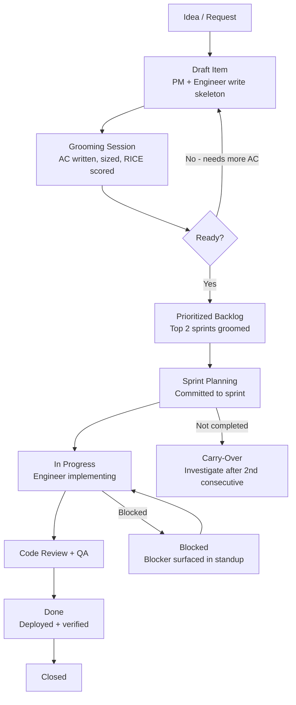

# 04 — Backlog Management

The backlog is the team's shared view of future work. A healthy backlog gives the team confidence: the next sprint's work is well-understood, estimates are honest, and priorities reflect current business reality. An unhealthy backlog creates chaos: engineers pick up stories they cannot implement, estimates are fiction, and the highest-priority work is buried under outdated tickets.

This document defines how Aurigo's backlog is organized, how items are prioritized, and how it stays healthy over time.

---

## Backlog Item Types

All backlog items fall into one of six types. Every item must have exactly one type. The type determines what information is required before the item can enter a sprint.

**Epic**
A large body of work delivering a significant product capability. Epics span multiple sprints. They are never directly implemented — they exist to group related stories. Required fields: goal, success metrics, estimated story count, dependencies on other epics.

Example: "Asset Condition Recording" — captures the complete capability for field inspectors to record, review, and submit asset condition assessments.

**Story**
The primary unit of implementable work. Delivers observable business value. Must fit in one sprint (≤ 8 points). Required fields: persona, want, so-that, acceptance criteria in Gherkin, out-of-scope, dependencies. See document 05 for the complete story anatomy.

**Task**
A technical work item that does not directly deliver user value but is necessary for engineering. Examples: upgrade a dependency, configure a new environment variable, add a missing index. Tasks do not require Gherkin AC but must have a clear definition of done.

**Bug**
A defect in existing behavior. Required fields: current behavior (what happens), expected behavior (what should happen), steps to reproduce, environment (dev/staging/production), severity. Bugs skip the estimation ceremony but still need a size label (S/M/L).

**Tech Debt**
A deliberate improvement to existing code that reduces future cost but does not change user-visible behavior. Required fields: what the debt is, where it lives (file/class path), why it was incurred, impact if left unaddressed, estimated effort. Tech Debt items must be prioritized alongside feature work — they do not automatically get scheduled. See document 13 for the full technical debt process.

**Spike**
A time-boxed investigation to answer a specific technical or product question. The output is knowledge (a written summary, a decision, a prototype), not shippable code. Required fields: the specific question being answered, the maximum time box (never more than 3 points / 3 days), and how the output will be shared. If a spike produces code, that code is thrown away — the learning is the deliverable.

---

## Story Point Scale (Fibonacci)

Story points represent relative complexity and effort, not hours. The team agrees on points together — they are not assigned unilaterally by a lead.

| Points | Complexity | Approximate Engineer-Days | Description |
|--------|-----------|--------------------------|-------------|
| 1 | Trivial | Half a day | Single-file change, obvious solution, no unknowns. Examples: rename a field, fix a typo in a message, add a missing nullable annotation. |
| 2 | Small | 1 day | Clear implementation path, minimal risk. Examples: add a new field to an existing form, add a new column with migration, extend an existing endpoint with a new query parameter. |
| 3 | Moderate | 1.5–2 days | Requires touching backend and frontend, a migration, and tests. Standard well-understood feature. |
| 5 | Complex | 2.5–3 days | Multiple moving parts, some unknowns, requires careful consideration of edge cases. May touch multiple bounded contexts. |
| 8 | Large | 4–5 days | Near the sprint boundary. If a story estimates at 8 points consistently, it is a candidate for splitting. |
| 13 | Too Large | > 1 sprint | This story must be split before it enters a sprint. A 13-point story is a signal that scope is unclear or that the story contains multiple independent deliverables. |

**Estimation rule**: if more than two team members (or the AI agent's assessment) believe a story is 13 points, the story goes back to the PM for scope reduction before re-estimation.

---

## RICE Prioritization

The backlog is prioritized using the RICE framework. RICE prevents the loudest voice in the room from controlling the roadmap.

**RICE Score = (Reach × Impact × Confidence) / Effort**

**Reach** — How many users are affected over one sprint period?
- 5: Affects all users of the module
- 4: Affects most users (>50%)
- 3: Affects many users (25–50%)
- 2: Affects some users (10–25%)
- 1: Affects few users (<10%)

**Impact** — How much does this move a key metric when it lands?
- 3: Massive — enables a workflow that was impossible before
- 2: High — significantly improves a key workflow
- 1: Medium — noticeable improvement
- 0.5: Low — minor convenience
- 0.25: Minimal — cosmetic

**Confidence** — How confident are we in the Reach and Impact estimates?
- 100%: Strong data or direct user research
- 80%: Reasonable assumption with some data
- 50%: Educated guess
- 20%: Speculative

**Effort** — Story points for the item (or sum of story points for an epic)

**Worked Example:**
```
Item: "Add TAMP condition report export to PDF"

Reach: 4 — affects all agency capital planners (>50% of users)
Impact: 3 — enables a workflow (regulatory submission) that currently requires manual work
Confidence: 80% — we have direct PM feedback from two agencies
Effort: 5 points

RICE Score = (4 × 3 × 0.80) / 5 = 9.6 / 5 = 1.92

Item: "Add dark mode toggle to settings"

Reach: 3 — affects 25-50% of users
Impact: 0.5 — minor convenience
Confidence: 50% — assumption only
Effort: 3 points

RICE Score = (3 × 0.5 × 0.50) / 3 = 0.75 / 3 = 0.25
```

The TAMP report (1.92) is prioritized 7.7x higher than the dark mode toggle (0.25). This is the correct outcome — it reflects business reality.

RICE is recalculated monthly. User feedback from demo sessions, support tickets, and usage data can change Reach and Impact scores.

---

## Backlog Health Rules

A healthy backlog satisfies all of the following. Violations are raised in the monthly backlog review.

**Rule 1: Top 2 sprints are fully groomed.**
Every story in the next two sprints has: complete AC, a size estimate, all dependencies listed and resolved, and no blockers. If a story does not meet this standard, it moves down the backlog until groomed.

**Rule 2: No story enters a sprint without AC.**
This is non-negotiable. A story without AC cannot be verified as done. Engineers spend unaccounted time clarifying scope. This rule was introduced after multiple sprint failures caused by ambiguous stories.

**Rule 3: No story in a sprint exceeds 8 points.**
If a story is estimated at 13 during sprint planning, the sprint planning meeting pauses. The PM and lead engineer split the story on the spot, or the story is removed from the sprint.

**Rule 4: 20% of sprint capacity is reserved for tech debt.**
If the sprint has 100 story points of capacity, 20 points are allocated to tech debt items. This is not a suggestion — it is a commitment made to engineering quality. If the PM wants to use this capacity for features, the conversation is: "We can do that, and we will defer the tech debt. Here is the growing list of deferred items and their risk."

**Rule 5: No story is older than 90 days without being re-evaluated.**
Stale backlog items represent decisions made with outdated context. Any story that has been in the backlog for more than 90 days without being scheduled must be reviewed: is it still needed? Has the context changed? Should it be closed?

**Rule 6: Bugs are resolved within SLA by severity.**
- P1 (production down / data loss risk): resolved within 4 hours
- P2 (significant user impact, workaround exists): resolved within 2 business days
- P3 (minor impact): enters next available sprint
- P4 (cosmetic): batched monthly

---

## AI-Assisted Backlog Workflows

Claude Code agents assist with three recurring backlog workflows:

**Monthly Backlog Analysis**
On the first Monday of each month, an AI agent runs:
```
Review the current backlog. Identify:
1. Stories older than 90 days that have not been scheduled
2. Stories with incomplete AC
3. Tech debt items that have been deferred more than 3 sprints
4. Any story > 8 points that has not been split
5. RICE scores that may have changed based on recent user feedback or incident reports
Output a prioritized list of backlog health issues with recommended actions.
```

**Weekly Story Drafting**
When a Domain Expert or PM provides rough feature notes, an AI agent drafts the full story anatomy (see document 05) for review. The PM reviews and edits the draft, then approves before it enters the backlog.

**Daily Blocker Surfacing**
During standups, an AI agent reviews the sprint board and flags:
- Stories that have been in-progress for more than 3 days without movement
- Dependencies that are blocking multiple stories
- Stories where the assigned engineer has not logged any progress (possible hidden blocker)

---

## Backlog Lifecycle



---

## Backlog Review Meeting

The backlog review happens every two weeks, on the Thursday before sprint planning. Duration: 60 minutes.

**Agenda:**
1. Backlog health check (10 min) — AI agent runs health analysis, team reviews findings
2. Story grooming (30 min) — top-priority ungroomed stories are refined, AC written, sized
3. Priority review (15 min) — RICE re-scored for any items where context has changed
4. Capacity forecast (5 min) — confirm next sprint capacity accounting for PTO and known interruptions

The output: a fully groomed top of backlog, ready for sprint planning the following Monday.

---

## Definition of Ready

A story is "ready" when it can be pulled into a sprint without any additional clarification required. A story that is not ready by these criteria cannot enter a sprint, no matter the pressure from stakeholders. This is a hard gate.

### Definition of Ready Checklist

Every story must satisfy every criterion below before sprint planning accepts it:

**Value clarity**
- [ ] The persona is identified (Asset Manager, Field Inspector, Capital Planner, Finance Officer, Agency Director, or Facility Manager)
- [ ] The user problem being solved is stated in the story
- [ ] The business value is stated in the "so that" clause
- [ ] The Product Manager has approved this story for the sprint

**Scope clarity**
- [ ] The scope boundary is stated: what is in scope
- [ ] The out-of-scope items are stated explicitly (things reviewers might assume are included but are not)
- [ ] Dependencies on other stories are listed with their status (blocked, ready, in progress)
- [ ] Dependencies on external teams or external systems are listed with their status

**Acceptance criteria**
- [ ] All acceptance criteria are written in Gherkin (Given/When/Then) format
- [ ] Every criterion is unambiguously testable — no "should be fast" or "should be intuitive"
- [ ] Happy path is covered
- [ ] At least 2 validation/error cases are covered
- [ ] Empty state and edge cases are covered (empty portfolio, zero results, offline)
- [ ] Permission scenarios are covered (unauthenticated, read-only user, admin)

**Domain review (if applicable)**
- [ ] If the story touches TAMP, RUL, ARV, Risk, or any regulated calculation, the Lifecycle Domain Expert has reviewed and approved
- [ ] Any domain-specific vocabulary in the AC is correct

**Design (if UI-facing)**
- [ ] Wireframes exist for all viewports (desktop 1280px, tablet 768px, mobile 375px)
- [ ] The wireframes have been reviewed by the Frontend Lead for technical feasibility
- [ ] Any new UI components are identified: reuse an existing shared component, or design a new one first

**Estimation**
- [ ] The story has been sized (Fibonacci: 1, 2, 3, 5, 8)
- [ ] If size is 8, the team has agreed it does not need to be split
- [ ] If size is 13 or higher, the story is NOT ready — it must be split first

**Technical readiness**
- [ ] Any new APIs or data model changes have been identified and have an API contract (even draft)
- [ ] Any integration touch points are documented
- [ ] Any migration required has been discussed with the Backend Lead

**Testing readiness**
- [ ] The QA Lead has reviewed the AC and confirmed it is testable
- [ ] Test data requirements are identified (need a specific tenant setup? need seed data?)

### What Happens If a Story Is Not Ready

If a story does not meet the DoR at sprint planning:

1. **Small gap** (missing one or two items that can be filled during planning in < 10 minutes): fill it, move on
2. **Medium gap** (missing AC on 2–3 items, or missing domain review): defer to a later grooming session, do not accept into sprint
3. **Large gap** (missing wireframes, missing domain review on a regulated calculation, undefined scope): move back to draft, PM re-schedules with the domain expert or UX Strategist

The team does not "commit anyway" and figure it out during the sprint. That pattern is the single largest source of sprint failure and rework.

### Definition of Done (paired with DoR)

For completeness, a story is "done" when:
- All acceptance criteria pass a test (unit, integration, or manual)
- The PR is merged to main
- Unit tests are written and passing (see Vol 5, doc 10)
- Integration tests are written and passing where applicable
- Documentation is updated (Swagger for API changes, user guide for user-facing features)
- The feature has been deployed to staging and verified working
- The PM has accepted the story in the sprint review

The DoR is the entrance gate. The DoD is the exit gate.
