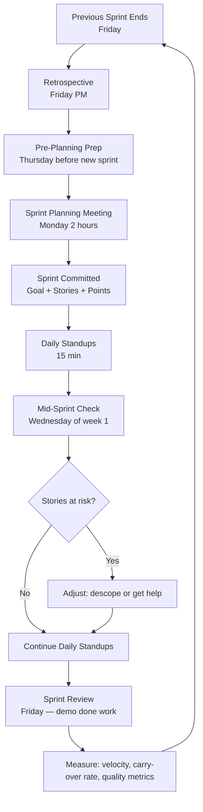

# 06 — Sprint Planning

Sprint planning is the meeting where the team commits to a specific set of work for the next two weeks. Done well, it creates clarity, shared ownership, and a realistic plan. Done poorly, it creates overcommitment, ambiguity, and the conditions for mid-sprint chaos.

This document covers the 2-week sprint cadence, the pre-planning process, the planning meeting agenda, capacity calculation, sprint goals, carry-over policy, and the role of AI agents in planning.

---

## 2-Week Sprint Cadence

Sprints are 2 weeks long. They start on Monday and end on Friday, two weeks later. This cadence is fixed — it does not flex for individual preference or holiday proximity (though capacity adjusts for holidays).

| Day | Event |
|-----|-------|
| Thursday (before sprint start) | Pre-planning: backlog review + grooming, capacity finalization |
| Monday (sprint start) | Sprint planning meeting: 2 hours, commit to sprint goal and stories |
| Daily | Standup: 15 minutes, progress + blockers |
| Wednesday (sprint midpoint) | Mid-sprint check: are we on track? any stories at risk? |
| Friday (sprint end) | Sprint review: demonstrate done work to PM |
| Friday (sprint end) | Retrospective: 1 hour, Start/Stop/Continue + metrics review |

The sprint review and retrospective happen on the same Friday. Review is 30 minutes (demo done work), retrospective is 60 minutes (process improvement).

---

## Pre-Planning: Thursday Before Sprint Start

Pre-planning is not a meeting — it is individual preparation that makes the planning meeting productive. Each participant completes their preparation before arriving at the Monday planning meeting.

**PM completes by Thursday EOD:**
- Confirms the sprint goal (one sentence describing what the sprint delivers)
- Confirms the top-priority stories are fully groomed (AC, estimates, dependencies resolved)
- Confirms any stories from the previous sprint's carry-over list and their disposition (carry forward or return to backlog)
- Identifies any external dependencies (sign-off from agency, waiting for spec) that could block stories

**Lead Engineer completes by Thursday EOD:**
- Calculates team capacity (see capacity formula below)
- Reviews the top-priority groomed stories and confirms they are implementable as written
- Identifies any technical dependencies not captured in the stories
- Checks open PRs from the previous sprint — are they likely to merge before planning?
- Runs the AI-assisted pre-planning analysis (see below)

**Each Engineer completes by Thursday EOD:**
- Reviews their own availability for the coming sprint (planned PTO, meetings, on-call rotations)
- Flags any story they believe is incorrectly estimated
- Identifies stories they have domain knowledge on (useful for assignment)

---

## Sprint Planning Meeting Agenda (2 Hours)

**[0:00–0:15] Sprint Goal Review**

The PM presents the proposed sprint goal. The team confirms it is achievable given capacity. If the goal requires more work than capacity allows, the PM adjusts the goal or the stories, not the capacity.

Sprint goal format: "[Sprint N]: Deliver [capability] for [persona] so that [business outcome]."

Example: "Sprint 14: Deliver complete condition recording workflow for Field Inspectors so that the agency QA team can begin user acceptance testing."

**[0:15–0:45] Capacity Confirmation**

Lead engineer walks through the capacity calculation (see below). The team confirms the number is accurate. Any adjustments are made here. The capacity number in points is agreed and written down.

**[0:45–1:30] Story Selection and Task Breakdown**

For each candidate story (in priority order):
1. PM reads the story title and AC summary
2. Team confirms the estimate is still accurate (re-estimate if needed)
3. The story is accepted into the sprint if capacity remains
4. Engineers break the story into implementation tasks (not tracked in the board, but mentally mapped). Each task should be completable in half a day to 1 day.

Continue until either capacity is reached or all groomed stories are accepted.

**[1:30–1:50] Risk Identification**

Review the sprint for risks:
- Any stories with external dependencies (EAM API availability, agency data, external approval)?
- Any stories touching the same files (merge conflict risk)?
- Any stories where the AC is still slightly vague?
- Any stories where the engineer has no prior experience with the code area (knowledge risk)?

For each identified risk, assign an owner and a mitigation action.

**[1:50–2:00] Wrap-Up**

Confirm: sprint goal, accepted stories, total committed points, risk owners. The PM updates the sprint board. The meeting ends on time.

---

## Capacity Calculation Formula

```
Available Capacity = Team Size × Sprint Days × Focus Hours × Focus Factor − Buffer

Where:
  Team Size = number of engineers committed to this sprint (whole or fractional for part-time)
  Sprint Days = 10 (2 weeks × 5 days), minus holidays, minus PTO days
  Focus Hours = 6 hours/day (8 hours minus 2 hours for meetings, slack, context switching)
  Focus Factor = 0.70 (accounts for unexpected interruptions, cross-team requests, incidents)
  Buffer = 20% of result (reserved for unplanned work — bugs, urgent spikes, process overhead)

Story Point Conversion: 1 story point ≈ 1 focused engineer-day
```

**Example Calculation:**
```
Team: 4 engineers
Sprint days: 10 (no holidays, no PTO this sprint)
Focus hours: 6 per day → 6 focus-hours per day → 1 story point per day (roughly)
Focus factor: 0.70

Raw capacity = 4 engineers × 10 days = 40 engineer-days
With focus factor = 40 × 0.70 = 28 story points
Buffer (20%) = 28 × 0.80 = 22 story points committed

If one engineer has 2 PTO days: remove 2 days from their contribution
Updated: (3 × 10 × 0.70 + 1 × 8 × 0.70) × 0.80 = (21 + 5.6) × 0.80 = 21 story points
```

The buffer is real. Do not fill it with planned work "in case we have time." It is consumed by: production incidents, emergency spikes, review load from other teams, onboarding interruptions.

---

## Sprint Goal Format and Examples

The sprint goal is a single sentence. It answers: what valuable capability will be available at the end of this sprint that was not available at the start?

**Format**: "[Sprint N]: [Verb] [capability] for [persona] enabling [business outcome]."

**Strong sprint goals:**
- "Sprint 6: Complete the condition recording backend and frontend so Field Inspectors can record and submit pavement conditions in a test environment."
- "Sprint 11: Deliver TAMP report generation for Capital Planners and close the regulatory compliance gap identified in the agency pilot feedback."
- "Sprint 15: Implement risk scoring engine and risk dashboard so Agency Directors can prioritize the top 20 highest-risk assets."

**Weak sprint goals (avoid):**
- "Sprint 6: Work on backend and frontend." (No value statement)
- "Sprint 11: Complete TAMP and also fix some bugs." (Two things, no focus)
- "Sprint 15: Improve the system." (Meaningless)

A sprint goal is the PM's commitment to the business. It is the team's shared definition of success for the sprint.

---

## Carry-Over Policy

Carry-over is a story that was committed in a sprint but not completed by sprint end. Carry-over is not a failure by default — unexpected complexity, dependencies, and interruptions happen. But carry-over is a signal.

**Single carry-over**: Normal. Move the story to the top of the next sprint (it is already groomed). No action required beyond acknowledging it in the retrospective.

**Two consecutive carry-overs of the same story**: Trigger an investigation.
- Was the story incorrectly estimated? (Re-estimate and potentially split)
- Is there a hidden dependency blocking completion? (Surface and resolve)
- Is there an unclear requirement causing rework? (Return to PM for clarification)
- Is the engineer assigned to it blocked by something else? (Remove the blocker)

**Three consecutive carry-overs**: The story is removed from the sprint and returned to the backlog. It must be re-groomed — it clearly has a problem that was not identified in the original grooming. This is not a judgment on the engineer; it is a signal that the story's specification or scope needs revision.

Carry-over rate (stories carried over / stories committed) is tracked as a sprint health metric. Target: < 15%. Consistent > 25% indicates systemic over-commitment or chronic under-estimation.

---

## AI Agent Role in Sprint Planning

Claude Code agents assist with three planning activities:

**Pre-planning analysis (Thursday):**
```
Analyze the top 15 stories in the backlog prioritized for the next sprint:
1. Identify stories that are not fully groomed (missing AC, no estimate, unresolved dependencies)
2. Estimate total capacity needed vs available capacity of [N] points
3. Identify stories that touch the same code areas (risk of merge conflicts)
4. Flag any stories where technical complexity suggests the estimate is too low
5. Draft preliminary task breakdowns for the 5 highest-priority stories
Output: a pre-planning briefing document for the lead engineer and PM.
```

**Capacity analysis:**
```
Given team composition: [list engineers and PTO days], calculate sprint capacity.
Show the calculation step by step. Flag if committed capacity exceeds calculated capacity by more than 10%.
```

**Risk identification:**
```
For the committed stories in Sprint [N], identify:
1. External dependencies and their current status
2. File-level conflicts (multiple stories modifying the same files)
3. Stories with no passing test coverage (implementation risk)
4. Stories marked "investigation needed" in prior sprints
Output: risk register for Sprint [N] with owner and mitigation for each risk.
```

---

## Sprint Lifecycle Diagram



---

## Post-Planning Actions

After the planning meeting closes:

1. **Sprint board updated**: all committed stories moved to the sprint, backlog re-ordered with carry-over stories at top
2. **Sprint goal posted**: visible in the team channel, the sprint board header, and the weekly status update
3. **Risk register shared**: the risk items identified in planning are in a shared document, not only in the meeting notes
4. **Branch hygiene**: any branches from the previous sprint that have merged are deleted; any lingering branches are reviewed
5. **AI memory updated**: the AI agent's context is updated with the new sprint goal and committed stories for the daily standup assistant

---

## When Something Goes Wrong Mid-Sprint

Sprint planning assumes the plan will play out. Reality is that plans get disrupted. This section defines how to handle common mid-sprint disruptions without abandoning the entire sprint.

### Key Engineer Is Sick or Unexpectedly Unavailable

When a key engineer (assigned to one or more critical stories) becomes unavailable mid-sprint:

**Day 1 of absence — immediate triage**:
1. Lead engineer reviews the affected stories. What state are they in? (not started, in progress with X% done, in code review, blocked)
2. If in progress: locate the branch, get the latest push, review the WIP with another engineer to understand the state
3. Assess criticality: is this story required for the sprint goal, or is it a secondary story?

**Reassignment options** (in preferred order):
1. **Pair another engineer with the WIP**: another engineer picks up where the first left off, using the branch as the starting point and any documentation (PR draft, comments, chat logs) as context
2. **AI-assisted continuation**: use Claude Code with the branch history and the story AC to identify what has been done and what remains. Assign the completion to another engineer with Claude as their pairing partner
3. **Descope the story**: if no one can pick it up in time, the story rolls to the next sprint (carry-over) with an explanation
4. **Descope the sprint goal**: if the story is central to the sprint goal, the PM and ED explicitly reduce the sprint goal and communicate to stakeholders

**Absence > 3 days**: the sprint plan is formally re-evaluated. Stories on the missing engineer's plate are either reassigned, descoped, or the sprint scope is reduced. No "hope they come back tomorrow" planning.

**Preventive practice**: no engineer is the sole owner of a story area. Pair rotations, story documentation in PRs, and the "context memory" written to CLAUDE.md or the feature's README ensure that any engineer can pick up any story with < 30 minutes of ramp-up.

### Cross-Team Dependency Blocks

When a story depends on external work (another Aurigo team, an EAM vendor's API fix, an agency's data delivery), the dependency can slip.

**Dependency management protocol**:

**Before sprint planning**:
- Identified in the Definition of Ready check
- Assign an Owner (usually the PM) responsible for tracking the dependency
- Set an expected delivery date and a fallback trigger date (typically delivery date + 2 days)

**During the sprint**:
- Owner checks with the external team at least every 2 business days
- Standup includes a "dependency status" line for any story with an external dependency
- If the delivery date slips past the fallback trigger, the story is paused, the team informed, and the fallback plan invoked

**Fallback plans by category**:
- **Blocked on another Aurigo team**: escalate to the ED, who works with the other team's ED to prioritize
- **Blocked on EAM vendor**: use the last-known-good stub or a recorded fixture in place of the real API. The story ships with an integration test but manual verification is deferred until the vendor delivers
- **Blocked on customer data**: the PM works with the CSM to accelerate the data delivery. If delayed > 1 week, the story ships against test data with the customer data cutover treated as a separate follow-up story
- **Blocked on cross-team API contract**: the two teams agree on a stub contract, both implement to the stub, and integration is treated as a separate story after both sides land

**Anti-pattern**: waiting silently for the dependency to arrive. Every day of silent waiting is a day of sunk sprint capacity. Surface the block within 24 hours.

### Sprint Goal at Risk

Mid-sprint check (Wednesday of week 1) is the earliest formal moment to detect a sprint goal at risk. If more than 40% of the committed points are still "not started" at mid-sprint, the goal is at risk.

**Response options**:
1. **Descope**: identify the least-critical stories and remove them from the sprint, giving them explicit "carry-over" status with the PM's blessing
2. **Redistribute**: reassign in-progress work to unblock the slowest-moving story
3. **Pair up**: reduce parallelism, have two engineers pair on the highest-risk story to complete it faster
4. **Accept and communicate**: for external stakeholders who are counting on the sprint, communicate the risk early — do not surprise them at sprint review

The ED is informed at mid-sprint check if the sprint is at risk. The ED does not "fix" the sprint (that is the team's job) but does become part of the stakeholder communication chain.

### Emergency Priority Change (Customer Escalation)

Occasionally a P1 customer issue arrives that requires immediate engineering attention outside the sprint plan.

**Rule**: the sprint absorbs at most one P1 emergency per sprint. If a second one arrives, either the PM defers it (with customer expectation management) or the sprint is formally re-scoped.

**Protocol**:
1. Identify the emergency scope (usually 1–3 days of engineering work)
2. Trade against sprint scope: which existing sprint stories will be deferred to accommodate?
3. PM communicates the trade to the affected stakeholders
4. Update the sprint board: emergency work becomes a P1 story with a clear owner and DoR
5. Retrospective specifically discusses whether the emergency could have been avoided (was there a slower-warning signal we missed?)

---

## Contingency Reserve — The "20% Buffer"

The sprint capacity formula includes a 20% buffer. This buffer is not for planned stories that "did not fit." It is reserved for the disruptions above.

**Correct use of the buffer**:
- Absorb a mid-sprint P1 emergency
- Absorb an unplanned incident response day
- Absorb 1–2 days of PTO that emerged after planning
- Absorb interruption from cross-team review requests

**Incorrect use of the buffer**:
- Adding a story mid-sprint because "we have time"
- Increasing scope of a story mid-sprint
- Ignoring the buffer because "we always have slack"

If the buffer is consistently unused, the focus factor may be miscalibrated (too pessimistic). If the buffer is regularly exceeded, the focus factor is too optimistic. Adjust in the retrospective.
