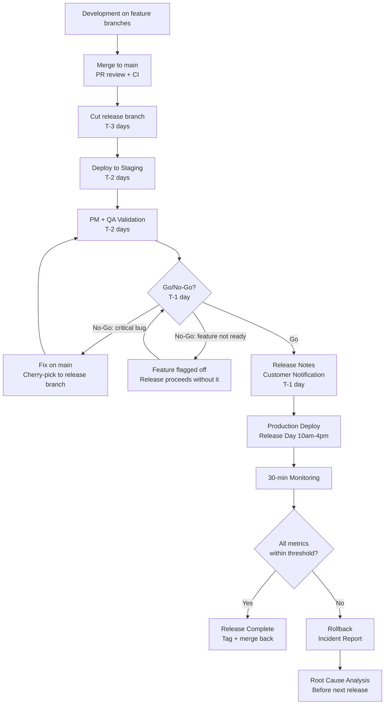

# 12 — Release Management

Release management is how working software gets from the development environment to users. The goal is a predictable, low-risk release process that ships value frequently and recovers quickly from problems. Aurigo follows a time-boxed release cadence aligned with the sprint schedule, with explicit gates to prevent quality and stability regressions.

---

## Release Cadence

| Release Type | Cadence | Trigger | Scope |
|-------------|---------|---------|-------|
| Minor release | Every 2 sprints (4 weeks) | Sprint 2 review completes | New features, improvements |
| Patch release | As needed | Bug fix merged to main | Bug fixes only, no new features |
| Major release | Quarterly | Product milestone | Breaking changes, large feature sets |

**Minor release (the default)**: After every second sprint, the work accumulated across both sprints is packaged and deployed to staging, passes go/no-go, then deploys to production. Minor releases may contain multiple features and improvements.

**Patch release**: When a P1 or P2 bug is fixed, a patch is cut from the release branch (or from main if on trunk-based development) and deployed through an abbreviated process. Patch releases follow the hotfix process (see below).

**Major release**: Quarterly milestones where larger architectural changes, API versioning changes, or significant feature sets are released together. These require extended staging validation and customer notification.

---

## Version Numbering

Aurigo Maintain follows Semantic Versioning (SemVer):

```
MAJOR.MINOR.PATCH

Examples:
1.0.0  — Initial release
1.1.0  — Minor release after sprints 1+2
1.2.0  — Minor release after sprints 3+4
1.2.1  — Patch for bug in 1.2.0
2.0.0  — Major release (breaking change, e.g., API v2)
```

**When to increment each:**
- MAJOR: breaking API change (endpoint removed, response shape changed incompatibly), major migration required for tenants
- MINOR: new feature or improvement, backward-compatible
- PATCH: bug fix that does not change the API surface

Version is stored in:
- `Directory.Build.props` (backend .NET solution)
- `package.json` (frontend)
- The git tag (e.g., `v1.2.0`) applied to the merge commit on main

---

## The Release Timeline

### T-2 Weeks (Sprint N start)

- Development work begins
- No special release actions

### T-1 Week (Sprint N midpoint)

- Lead engineer confirms no in-progress migration that would require downtime
- DevOps confirms staging environment is clean and responsive
- PM confirms which features are in scope for this release (feature flags may be used to ship-off features not ready for users)

### T-3 Days (Tuesday of release week)

- All feature PRs must be merged to main by end of day Tuesday
- Any PR not merged by Tuesday is deferred to the next release cycle — no exceptions
- Release branch is cut from main: `release/v1.2.0`
- Automated test suite runs on the release branch
- If CI fails on the release branch: stop, fix on main, re-cut the branch

### T-2 Days (Wednesday)

- Release branch deploys to staging environment
- PM and QA run manual validation on staging
- Validation scenarios: all new features in AC-order, critical existing workflows (smoke test), edge cases from product discovery
- Any staging bugs are fixed on main and cherry-picked to the release branch

### T-1 Day (Thursday)

- Staging validation complete with written sign-off from PM
- Go/no-go decision made: if all validation passes → go; if critical issues found → no-go with decision on whether to fix and delay or ship without the affected feature
- Release notes drafted and reviewed (AI-assisted, see document 11)
- Customer notification sent for releases with user-visible changes (if applicable per customer contract)

### Release Day

- Deploy window: Monday–Thursday, 10am–4pm local time
- Friday deployments are prohibited (no support coverage over the weekend)
- Holiday eve deployments are prohibited
- Deployment runs automatically via CI/CD pipeline on the release branch
- Engineering lead monitors the deployment

---

## Deploy Window Rules

| Day | Allowed | Notes |
|-----|---------|-------|
| Monday | Yes | Preferred — full week to respond if issues emerge |
| Tuesday | Yes | |
| Wednesday | Yes | |
| Thursday | Yes (until 3pm) | Late Thursday at risk of rolling into a weekend without coverage |
| Friday | No | No weekend support coverage |
| Day before a public holiday | No | Extended weekend without coverage |
| During an ongoing incident | No | Never deploy into an active incident |

Deploy window hours: 10am–4pm in the deploying team's primary timezone. Never deploy first thing in the morning (system hasn't been warmed up for the day) or late afternoon (not enough monitoring time before EOD).

---

## Go/No-Go Criteria

A release proceeds to production only when all go criteria are met. A single no-go item halts the release.

### 30-Minute Monitoring Window After Deployment

After deploying to production, the engineering lead monitors for 30 minutes before the deployment is considered stable:

| Metric | Go Threshold | No-Go Threshold |
|--------|-------------|-----------------|
| HTTP 5xx error rate | Baseline or lower | > 0.5% of requests (was not present pre-deploy) |
| P50 API response latency | Baseline ± 10% | > 20% increase from baseline |
| P95 API response latency | Baseline ± 15% | > 30% increase from baseline |
| Database connection pool | Within normal range | Pool exhaustion or errors |
| Frontend JavaScript errors | Baseline or lower | New errors appearing in monitoring |
| Memory usage | Within normal range | > 20% above baseline |

**Baseline**: the 30-minute window immediately before the deployment.

If any no-go threshold is crossed during monitoring:
1. Immediate rollback to the previous release (via the release pipeline)
2. Incident record created
3. Root cause analysis completed before next release attempt

---

## Rollback Process

Every release must be rollbackable within 10 minutes of a decision to roll back.

**Standard rollback (no schema migration)**:
1. Deploy the previous release tag via the CI/CD pipeline
2. Confirm metrics return to baseline
3. File an incident report
4. Duration: < 5 minutes

**Rollback with schema migration**:
If the release included a database migration, rollback requires:
1. Run EF migration rollback: `dotnet ef database update [PreviousMigrationName]`
2. Deploy the previous release tag
3. Confirm database and application are consistent
4. Duration: 5–15 minutes depending on migration complexity

**Prevention of irreversible migrations**: migrations must be written to be safely rollbackable. Dropping columns or tables is prohibited in forward migrations. Instead: mark column as deprecated, release, wait one release cycle, then drop in a subsequent migration.

---

## When a Database Migration Fails in Production

Migration failure in production is one of the highest-severity operational scenarios. It affects data integrity, service availability, and customer trust. This section defines the exact procedure to follow when a migration fails mid-run in production.

### Detection

Migrations run as part of the deployment pipeline. Failure indicators:

- The deployment pipeline reports the migration step as failed
- The application starts but health checks fail because the schema is in an inconsistent state
- Application logs show EF Core errors like "The current model no longer matches the model schema" or "column X does not exist"
- Query error rate spikes immediately after deployment
- The migration table (`__EFMigrationsHistory`) shows the migration as "in progress" but never completed

### Immediate Response — First 5 Minutes

**Rule 1: Do not run the migration again.** Retry-and-hope is the wrong response. Retrying a partially-applied migration often makes the situation worse.

**Rule 2: Stop new deployments.** Freeze the pipeline immediately. No other engineer can deploy while this is being resolved.

**Rule 3: Assess the schema state.** Determine what actually happened:

```sql
-- What migrations does EF think are applied?
SELECT * FROM "__EFMigrationsHistory" ORDER BY "MigrationId" DESC LIMIT 5;

-- Do the actual tables and columns exist as expected?
-- (Check each expected schema change from the migration)
```

The schema is in one of three states:
- **State A: Migration did not run at all** (transaction rolled back). Schema is unchanged. Safest — see State A recovery below.
- **State B: Migration partially ran** (some steps succeeded, then failed mid-transaction). Schema is inconsistent. Most dangerous.
- **State C: Migration ran successfully but the app cannot start for other reasons**. Schema is correct. Not a migration issue — treat as an app deployment failure and roll back the app.

### Recovery for State A (Migration Did Not Run)

Schema is unchanged. This is the easiest case.

1. Roll back the application to the previous release tag
2. The old application works with the old schema
3. Investigate the migration failure in a staging environment (does it fail there too?)
4. Fix the migration, test in staging with a production-scale dataset copy
5. Re-attempt on the next deployment window

### Recovery for State B (Migration Partially Applied)

**This is the critical scenario.** The database schema is in a state that neither the old application nor the new application expects.

**Step 1: Preserve evidence**
- Take a snapshot of the current RDS instance (via AWS console — takes 2-5 minutes but critical for forensic analysis and worst-case restore)
- Export the current `__EFMigrationsHistory` table
- Save the application logs showing the failure

**Step 2: Determine repair strategy**

Two options, in preferred order:

**Option A: Complete the migration manually (if the failure was recoverable)**
- If the migration failed because of a temporary condition (e.g., long-running lock, timeout on a large index build), the schema changes that succeeded may be salvageable
- The Backend Lead + DevOps + Tech Architect jointly review the migration SQL and the actual schema state
- They identify the incomplete steps and apply them manually via SQL
- They mark the migration as completed in `__EFMigrationsHistory`
- The new application deploys and works correctly

This option is preferred when: the failure cause is understood, the remaining steps are small, and rollback would require significant downtime

**Option B: Roll the schema forward to a known-good state**
- Write a compensating migration that safely reverts the partial changes
- Deploy the compensating migration
- Deploy the previous application version
- Old application is now compatible

This option is preferred when: the failure cause is unclear, the partial state is significant, or the fix is not obvious

**Never do: attempt to "just roll back" the partial migration using EF's `dotnet ef database update <PreviousMigration>`**. EF assumes the migration to be reverted was fully applied; it cannot correctly reverse a partial application.

**Step 3: Restore service while working**

The application may be completely down while you work. Options to minimize customer impact:

1. **Serve maintenance page**: update the ALB target to serve a maintenance page (`503 Service Unavailable` with a friendly message and expected duration)
2. **Read-only mode**: if the old application can start with the corrupted schema in read-only mode (some workflows work), enable read-only mode for degraded but partial service
3. **Fallback to previous instance**: if you have a green environment from blue/green deployment still running with the old schema and old code, route traffic there

Serve maintenance page is safer than degraded service — customers understand a maintenance page.

### Recovery for State C (Migration Ran but App Failed to Start)

Migration is complete and correct. The new application failed to start for reasons unrelated to schema (bad config, missing environment variable, dependency issue).

1. Investigate the application logs — find the actual startup error
2. If quick to fix, patch and redeploy
3. If not quick to fix, deploy the previous application version against the migrated schema
- This only works if the previous version is forward-compatible with the new schema (which it should be, per the "additive migration" rule)
4. Debug and fix the new version, deploy on the next window

### Data Corruption Scenario (Worst Case)

If a migration ran but produced corrupted data (e.g., a data migration script had a bug that mis-transformed rows):

1. **Immediately stop all writes**: put the application in read-only mode or maintenance mode
2. **Restore the RDS snapshot taken before the deployment** — this is the last-resort action; the snapshot was created automatically before the migration
3. **Estimated recovery time**: 30–90 minutes for a production-size RDS instance
4. **Data loss window**: any writes between the snapshot and the incident are lost (typically <30 minutes)
5. **Customer notification**: mandatory; specific customers whose writes may have been lost must be identified and contacted

The snapshot approach has significant customer impact. It should be reserved for scenarios where the alternative is prolonged data corruption or extended downtime.

### Preventive Practices

The best response to migration failure in production is preventing it from happening:

**Practice 1: Additive migrations only**
- New columns are nullable initially
- New tables are optional in the old code
- Column drops happen in a subsequent release after the code stops using them
- This means the old application can always run against the new schema

**Practice 2: Production-scale staging validation**
- Every migration is applied to a staging database that is a recent copy of production
- The staging database has actual production row counts (not just test data)
- Migrations that take > 5 minutes on staging are flagged for planning (may need chunking or off-hours execution)

**Practice 3: Migration timeout limits**
- All migrations have a 5-minute timeout for individual operations
- Longer operations (backfilling data, rebuilding indexes) are done in application code or dedicated backfill jobs, not migrations

**Practice 4: Pre-deployment snapshot**
- The CI/CD pipeline takes an RDS snapshot immediately before applying migrations
- The snapshot is retained for 7 days
- The snapshot is the "reset button" for the worst case

**Practice 5: Migration review checklist**
- Every migration is reviewed by the Backend Lead
- Checklist includes: is this additive? does it have a timeout risk? is it idempotent? can it be rolled forward safely?

**Practice 6: Feature flag decoupling**
- New features that depend on new schema are gated behind a feature flag
- Deployment sequence: (1) migration + code with flag OFF, (2) verify healthy, (3) turn on the flag
- This decouples migration risk from feature-release risk

### Escalation

Migration failures in production are P0 incidents until resolved. The full incident response protocol (Vol 5, doc 16) applies:

- ED is Incident Commander
- Backend Lead and DevOps are Technical Leads
- PM handles customer communication
- Tech Architect consulted for schema decisions
- All action taken is logged in the incident channel

Post-incident, the migration process is reviewed and updated. Every migration failure produces one or more preventive actions.

---

## Hotfix Process

A hotfix is an emergency patch for a P1 or P2 production issue that cannot wait for the next planned release.

**Step 1: Assess**
Confirm the issue severity. A P1 (production down, data loss risk) triggers immediate hotfix. A P2 (significant user impact, workaround available) may wait for next patch cycle. A P3 waits for next minor release.

**Step 2: Branch from the Release Tag**
```sh
git checkout tags/v1.2.0 -b hotfix/v1.2.1-[description]
```

The hotfix branches from the current production release, not from main. This isolates the fix from in-progress development work.

**Step 3: Fix and Abbreviated Review**
The fix is implemented on the hotfix branch. Review requirements:
- Lead engineer review: mandatory
- Standard review checklist (document 09): required
- Testing: the specific bug scenario must have a test, full test suite must pass
- Timeline: 4 hours for P1, 24 hours for P2

**Step 4: Abbreviated Staging Validation**
The hotfix deploys to staging. Validation is narrowed to:
- The specific bug scenario is resolved
- Critical smoke tests pass (5–10 key workflows)
- No new issues introduced by the fix

**Step 5: Production Deployment**
- Same deploy window rules apply (no Friday, no holiday eve)
- For P1: deploy window exception possible with senior management approval
- Post-deployment monitoring: 30 minutes minimum

**Step 6: Merge Back to Main**
```sh
git checkout main
git merge hotfix/v1.2.1-[description]
```

The hotfix must be merged back to main to ensure the fix is in future releases. This step is often forgotten under the pressure of a P1 incident. The lead engineer is responsible for confirming the merge-back before closing the incident.

---

## Release Communication Template

For releases with user-visible changes, this communication goes to affected tenants:

```
Subject: Aurigo Maintain v[X.Y.Z] — Release on [Date]

Aurigo Maintain version [X.Y.Z] will be deployed to your environment on [Date] between [time window].

What's new:
- [Feature 1 in user language]
- [Feature 2 in user language]

Improvements:
- [Improvement in user language]

What to expect during deployment:
The deployment typically completes in under [N] minutes. During this window, you may experience brief interruptions. We recommend avoiding field inspections or report generation during the deployment window.

Questions or issues: contact support@aurigo.com or your Customer Success Manager.
```

---

## Release Pipeline Diagram


