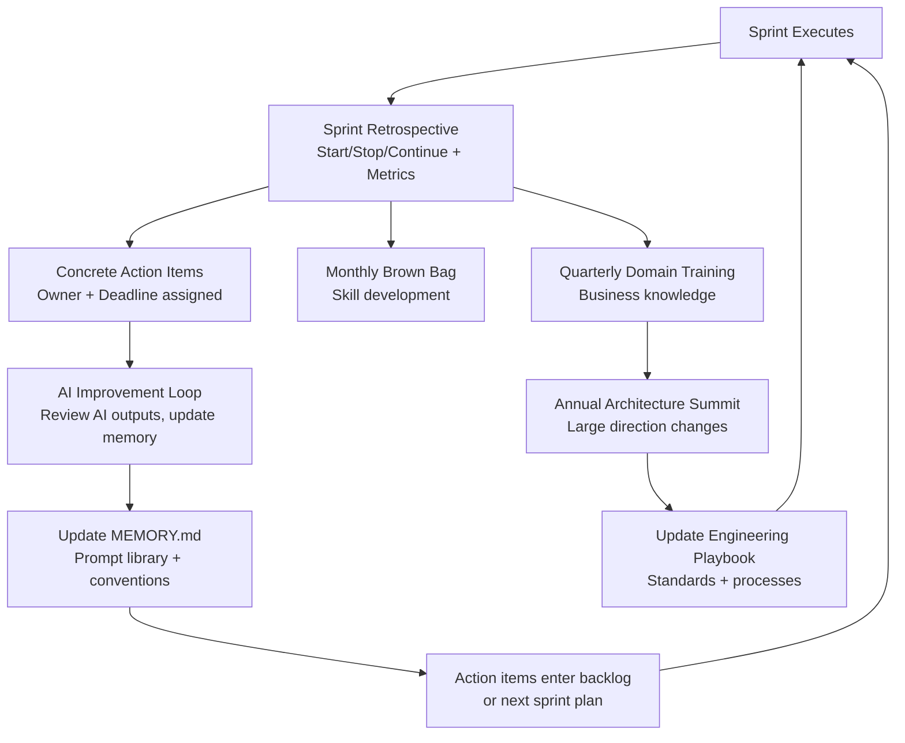

# 14 — Continuous Improvement

A team that does not reflect on how it works will work the same way forever — including the parts that are not working. Continuous improvement is the process by which Aurigo engineering teams get measurably better over time: shipping faster, with higher quality, with less rework, and with more confidence.

This document covers the retrospective process, the metrics that matter, the continuous learning programs, and the AI improvement loop.

---

## The Retrospective Process

Every sprint ends with a retrospective. No exceptions. The retrospective is not optional, not shortened to 15 minutes, and not replaced with a stand-up conversation. It is a protected, focused hour for the team to improve their process.

**Cadence**: End of every sprint (every 2 weeks), Friday afternoon, 60 minutes.

**Format**: Start / Stop / Continue, followed by quantitative metrics review.

### Start / Stop / Continue

Each team member (including the PM and lead engineer) contributes to three lists:

**Start**: What should we begin doing that we are not doing now? Examples: writing AC before starting a story; running the AI first-pass review before requesting human review; conducting mid-sprint checks.

**Stop**: What should we stop doing because it is not working or is causing harm? Examples: having PR review discussions in Slack instead of in the PR; carrying over stories three times without investigation; merging on Friday.

**Continue**: What is working well and should be preserved? Examples: the AI-assisted pre-planning analysis; the 24-hour review SLA; the architectural reviews for multi-tenancy changes.

**Process**:
1. Each person writes their Start/Stop/Continue items independently (5 minutes)
2. Items are shared and grouped by theme (10 minutes)
3. Prioritize: the team votes on which items to act on this sprint (5 minutes)
4. Assign owners and define the action items concretely (10 minutes)
5. Review last sprint's action items: were they completed? Did they help? (10 minutes)
6. Quantitative metrics review (20 minutes)

The output of every retrospective is a small number of **concrete, owned action items** — not aspirational statements. "We should write better stories" is not an action item. "PM will add the story quality checklist to the Jira story template by next Monday" is an action item.

---

## Metrics Reviewed Each Sprint

Metrics give the team objective data to work with alongside subjective feedback. They prevent retrospectives from being dominated by recency bias (the most vivid recent event) and help identify trends over time.

### Deployment Frequency

**What**: How many times was the production system updated this sprint?

**Target**: At least 1 production deployment per sprint (more for patches).

**Why it matters**: Low deployment frequency often means large, risky releases instead of small, safe ones.

### PR Merge Time

**What**: Average time from PR creation to merge, in business hours.

**Target**: < 24 hours for small/medium PRs, < 48 hours for large PRs.

**Why it matters**: Long PR merge times indicate review bottlenecks, scope issues, or quality problems that are generating rework.

**How to calculate**: AI agent queries the git log or issue tracker for PR open and merge timestamps.

### Test Coverage Trend

**What**: Coverage percentage for Calculations/, Domain/, and Application/ over the last 4 sprints.

**Target**: Stable or improving. Any downward trend in Calculations/ requires investigation.

**Why it matters**: Declining coverage often means features are being shipped without adequate tests — technical debt accumulating in real time.

### Build Success Rate

**What**: Percentage of CI runs that pass on the first attempt (no rerun required).

**Target**: > 90% first-pass success rate.

**Why it matters**: Frequent CI failures indicate flaky tests, environment instability, or consistent code quality issues in PRs. A 70% pass rate means engineers are spending significant time investigating failures rather than developing.

### Carry-Over Rate

**What**: Percentage of sprint-committed stories that were not completed within the sprint.

**Target**: < 15%.

**Why it matters**: Consistent carry-over above 15% indicates systematic over-commitment, chronic under-estimation, or hidden blockers that the team is not surfacing.

### Bug Rate Per Story Point

**What**: Number of bugs filed in production (or found in QA) per story point delivered, measured over a rolling 4-sprint window.

**Target**: Trending downward over time.

**Why it matters**: A rising bug rate means quality is being sacrificed for velocity. A stable low bug rate is the goal — it means the development process is producing reliable software.

---

## Quantitative Metrics Review Agenda (20 minutes)

1. Lead engineer presents the metrics dashboard (AI agent generates it automatically — see below)
2. For each metric: is it better, worse, or stable compared to last sprint and to the 4-sprint trend?
3. For any metric that is worse: is this a one-time anomaly (sprint with a P1 incident) or a trend?
4. If it is a trend: is it already on the Start/Stop/Continue list? If not, add it.
5. Celebrate any metric that has improved meaningfully.

**AI-generated metrics report:**
```
Generate the sprint metrics report for Sprint [N]:
1. Deployment frequency: count of production deployments
2. PR merge time: average and median for PRs merged this sprint (from git log timestamps)
3. Test coverage: current vs. last sprint for each layer (from CI coverage report)
4. Build success rate: pass/fail ratio for CI runs this sprint
5. Carry-over rate: stories carried over / stories committed
6. Bugs filed this sprint vs. story points delivered

Format as a table with this-sprint value, last-sprint value, and 4-sprint trend (up arrow, down arrow, or stable).
Flag any metric that has moved more than 20% in the wrong direction.
```

---

## Continuous Learning Programs

Improvement is not only process improvement — it is also knowledge and skill development.

### Monthly Brown Bag (Lunch-and-Learn)

**Cadence**: First Wednesday of each month, 60 minutes, optional but encouraged.

**Format**: One engineer or PM presents a topic relevant to the team. 30 minutes presentation, 30 minutes discussion.

**Topic selection**: Engineers and PMs nominate topics in a running list. The team votes monthly. Priority goes to topics that directly improve daily work.

Example topics from the Aurigo Maintain context:
- PostGIS spatial query optimization for large datasets
- EF Core 8 new features: JSON columns, primitive collections
- TAMP compliance requirements in depth — what the regulations actually say
- TanStack Query advanced patterns: optimistic updates, query invalidation strategies
- Claude Code effective usage: how to write prompts that produce better implementation plans
- Reading a flaky Playwright test: 5 common causes and how to fix them

### Quarterly Domain Training

**Cadence**: Once per quarter, 2 hours.

**Focus**: Deep understanding of the infrastructure owner domain — not software techniques, but the business problems Aurigo solves.

Participants: engineering team + PM + at least one customer-facing representative (Customer Success, Solutions Engineer, or direct customer contact if available).

**Example sessions for Aurigo Maintain:**
- "A day in the life of a Capital Planner" — follow the complete TAMP workflow
- "How infrastructure deterioration is actually modeled" — domain expert presents the Markov chain and LCCA approaches
- "What agencies actually do with condition data" — watch a real agency's process (recorded screen share from a CS call)
- "ISO 55001 and what it means for our product" — compliance requirements that drive Primus features

Engineers who understand the domain write better code. They choose better names, design better abstractions, and catch requirements that don't make domain sense.

### Annual Architecture Summit

**Cadence**: Once per year, full day.

**Participants**: All engineers + lead engineer + VP Engineering + PM leads.

**Agenda**:
- Morning: review the year in architecture decisions (all ADRs from the past year)
- Morning: identify architectural patterns that are no longer serving the system well
- Afternoon: propose and discuss architectural direction for the coming year
- Afternoon: update the engineering playbook to reflect decisions made at the summit
- End of day: publish the updated playbook and announce the architectural priorities

The architecture summit is where large technical direction changes are made with the full team's input — not in individual PRs or single-engineer decisions.

---

## The AI Improvement Loop

Aurigo is an AI-native engineering organization. AI agents (Claude Code) are used throughout the development process. Like any tool, the effectiveness of AI agents improves with feedback and calibration.

After every sprint, the lead engineer runs the AI improvement loop:

### Step 1: Review AI Outputs

For the sprint just completed, review a sample of AI agent outputs:
- Implementation plans generated from stories
- First-pass code reviews
- Pre-planning analyses
- Documentation drafts

For each output type, identify:
- What was accurate and useful?
- What was wrong, off-target, or required significant rework?
- What patterns of error recurred?

### Step 2: Update MEMORY.md

The AI agent's shared memory file (`memory/MEMORY.md`) accumulates cross-session context. After each sprint, update it with:
- New conventions adopted by the team
- New patterns introduced in the codebase
- Domain learnings that should inform future agent context
- Common mistakes the agent made this sprint (so they can be avoided)

**Example memory update:**
```markdown
## Sprint 14 Learnings (Added 2026-07-18)
- The RulCalculator now uses DateOnly instead of DateTime for inspection dates.
  AI agent generated DateTime in a new test — update prompts to use DateOnly.
- Capital needs created from inspection triggers must use a separate MediatR command,
  not inline handler logic. Agent tried to inline this in Sprint 14.
- When generating migrations, the agent does not always include the tenant_id composite index.
  Reviewer must check for: HasIndex(e => new { e.TenantId, e.Id }).
```

### Step 3: Update the Prompt Library

The team maintains a prompt library (`vault/ai-prompts/`) with validated prompts for recurring tasks. After each sprint, add prompts that produced high-quality outputs and mark prompts that consistently produced poor results for revision.

```
# vault/ai-prompts/implementation-plan.md

## Validated: 2026-07-15
## Produces high-quality output for: 3-8 point backend stories

Prompt:
You are implementing [STORY_TITLE] for the Aurigo Maintain project.

Before writing any code, execute the full discovery protocol from
engineering-playbook/vol-5-operating-model/01-repository-discovery.md.

Then produce an implementation plan in this format:
1. Files to create (with layer and purpose)
2. Files to modify (with what changes and why)
3. Migrations required (yes/no, what they add)
4. Order of implementation (entity → config → migration → handler → controller → tests → frontend)
5. Test cases to write (unit and integration)
6. Edge cases to handle (from product discovery document 03)

Do not write any implementation code yet. Output only the plan.
```

### Step 4: Share Successful AI Workflows

When a team member discovers a particularly effective way to use Claude Code for a task, they share it:
- A brief write-up in the team channel
- The prompt added to `vault/ai-prompts/`
- A note in the next retrospective's "Continue" section

This creates a positive feedback loop: good AI workflows are amplified across the team.

---

## The Improvement Cycle Diagram



The key insight in this diagram: improvement feeds back into the sprint. Action items become backlog items. Memory updates improve AI agent quality next sprint. Playbook updates change behavior starting the next sprint. The loop is tight — improvement is continuous, not annual.
