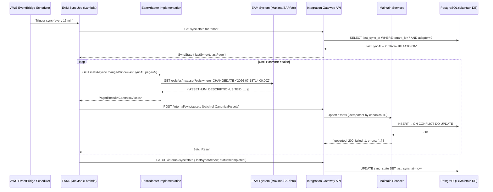

# 00 — Integration Philosophy and Architecture

## Why Integrate Rather Than Replace

The most common failure mode in enterprise software sales to public agencies is the lift-and-shift migration pitch. A vendor arrives, demonstrates a shiny new system, and proposes replacing the agency's existing EAM platform. The agency nods along, signs a contract, and then spends the next three to five years in a painful data migration, retraining program, and political battle with the maintenance department that built its identity around the old system. Half of these projects fail to deliver the promised value. Many are quietly abandoned.

Aurigo Maintain takes the opposite approach. The premise is simple: your EAM is not the problem. IBM Maximo, SAP PM, Oracle EAM — these are industrial-strength maintenance execution systems. They are very good at scheduling PMs, tracking work orders, managing spare parts, and dispatching technicians. What they cannot do is tell you which assets are at the end of their useful life, what your five-year capital investment requirement is, which assets carry the most risk to your level of service, or how to prioritize $40M of capital needs when you have a $25M budget.

That intelligence gap is exactly what Maintain fills. By integrating with the EAM rather than replacing it, Aurigo delivers three measurable business outcomes:

**Customer retention of existing EAM investment.** The agency's $2M Maximo implementation stays. The 15 years of work order history stays. The custom preventive maintenance schedules stay. The Maintain project budget is smaller, the implementation is faster, and the political risk is dramatically lower.

**Faster time to value.** An Integrated Mode deployment can go live in 30 to 60 days. The agency sees condition scores and capital needs projections using real data from their EAM within weeks, not years. Compare this to a full EAM replacement, which typically takes 18 to 36 months.

**No migration risk.** Data migration is the leading cause of failed ERP and EAM projects. By reading from the existing EAM rather than replacing it, Maintain avoids data migration entirely in Integrated Mode. When and if the customer moves toward Native Mode, the migration is incremental and reversible.

## The Three Deployment Modes

### Integrated Mode

In Integrated Mode, Maintain reads from the EAM system via the integration adapter and adds the intelligence layer on top. No data flows back to the EAM. All work orders, PM schedules, and maintenance records continue to be created and updated in the EAM. Maintain builds its condition scores, RUL projections, ARV calculations, and risk scores on top of the EAM data.

This mode is appropriate when:
- The customer wants to minimize change management risk
- The EAM is heavily customized and write-back would require EAM-side development
- The EAM contract is under active license and the agency does not want to disturb it
- The project is a proof of concept or a pilot

### Hybrid Mode

In Hybrid Mode, Maintain reads from the EAM and writes specific records back. Typically this means work order recommendations generated by the capital planning engine flow back to the EAM as maintenance requests or work orders. Maintain owns the inspection workflow, condition assessment, RUL, ARV, risk, and capital planning. The EAM owns PM execution, technician dispatch, and parts management.

This mode is appropriate when:
- The agency wants Maintain to drive maintenance prioritization but keep EAM for execution
- The customer has an Aurigo Workflow license and wants approval chains in Maintain before EAM dispatch
- The integration adapter has been validated and the write-back path is well-tested

### Native Mode

In Native Mode, Maintain handles the full asset lifecycle. The legacy EAM is either retired or kept in read-only archive mode. Maintain owns inspections, condition, capital planning, and work order management. This is appropriate for:
- Greenfield agencies with no legacy EAM
- Agencies completing a planned EAM decommission
- Customers who have been on Integrated or Hybrid Mode for 12+ months and are confident in Maintain

### Decision Tree

```
Does the customer have an existing EAM?
  NO  → Native Mode
  YES → Is the EAM under active support contract and heavily customized?
          YES → Integrated Mode (start here, move to Hybrid after 3-6 months)
          NO  → Does the customer want Maintain to drive work order creation?
                  YES → Hybrid Mode
                  NO  → Integrated Mode
```

## The Canonical Data Model Principle

The most important architectural constraint in the integration layer is this: **Maintain's business logic must never contain EAM-specific field names or concepts.** The application layer operates on canonical types — `CanonicalAsset`, `CanonicalWorkOrder`, `CanonicalPmSchedule` — that are defined by Aurigo, not by any EAM vendor.

The adapter's responsibility is translation. A Maximo adapter translates `ASSET.SERIALNUM` to `CanonicalAsset.SerialNumber`. A SAP adapter translates `EQUI.SERNR` to the same field. The RUL calculator, the risk scorer, the ARV engine — none of them know whether the data came from Maximo or SAP. They operate on canonical types only.

This constraint has a critical operational benefit: adding a new EAM integration does not require any changes to the business logic. You write the adapter, register it, and the entire Maintain intelligence stack works automatically.

## The IEamAdapter Interface

Every adapter implements a single interface. No exceptions.

```csharp
public interface IEamAdapter
{
    string AdapterName { get; }
    
    Task<AdapterHealthResult> CheckHealthAsync(
        CancellationToken cancellationToken = default);
    
    Task<PagedResult<CanonicalAsset>> GetAssetsAsync(
        SyncRequest request,
        CancellationToken cancellationToken = default);
    
    Task<PagedResult<CanonicalWorkOrder>> GetWorkOrdersAsync(
        SyncRequest request,
        CancellationToken cancellationToken = default);
    
    Task<PagedResult<CanonicalPmSchedule>> GetPmSchedulesAsync(
        SyncRequest request,
        CancellationToken cancellationToken = default);
    
    Task<PagedResult<CanonicalDefect>> GetDefectsAsync(
        SyncRequest request,
        CancellationToken cancellationToken = default);
    
    // Hybrid and Native Mode only
    Task<CreateResult> CreateWorkOrderAsync(
        CanonicalWorkOrder workOrder,
        CancellationToken cancellationToken = default);
    
    Task<UpdateResult> UpdateWorkOrderStatusAsync(
        string eamNativeId,
        WorkOrderStatus status,
        CancellationToken cancellationToken = default);
}

public record SyncRequest(
    string TenantId,
    DateTimeOffset? ChangedSince,    // null = initial load
    int PageSize = 200,
    string? ContinuationToken = null  // for cursor-based pagination
);

public record PagedResult<T>(
    IReadOnlyList<T> Items,
    string? NextContinuationToken,
    int TotalCount,
    bool HasMore
);
```

The `SyncRequest.ChangedSince` field controls whether the sync is a full initial load (null) or a delta sync (timestamp of last successful sync). Adapters must translate this into the appropriate EAM query filter — CHANGEDATE for Maximo, AEDAT for SAP, LastUpdateDate for Oracle.

## Integration Architecture

The integration layer sits between the EAM systems and the Maintain application services. AWS EventBridge is the backbone for decoupling the sync process from the application.



## ROI of Integration vs. Replacement

A typical mid-size city deploys Maximo for $1.5M to $3M, including licenses, configuration, and training. A full replacement with a competing EAM would cost $2M to $5M in migration, retraining, and data conversion — with an 18-to-36-month timeline before the agency sees any new value.

An Aurigo Maintain Integrated Mode deployment costs $150K to $400K and delivers capital planning intelligence in 30 to 60 days using the existing data. The ROI case is not a comparison between systems. It is a comparison between paying for another large migration or paying a fraction of that to add intelligence on top of what you already have.

From the Aurigo account team perspective: the integration approach unlocks deals that would otherwise stall on procurement risk. Agencies that would never approve a full EAM replacement will approve a capital planning intelligence layer that doesn't touch their maintenance operations.

## Configuration Model

Every adapter is configured per tenant. The configuration is stored in the `IntegrationAdapterConfig` table and includes the EAM-specific connection details plus the field mapping overrides for that customer's customizations. The field mapping configuration is a JSON document — no code changes required when a customer has renamed a Maximo attribute.

```json
{
  "adapterName": "ibm-maximo",
  "tenantId": "city-of-boston",
  "baseUrl": "https://maximo.boston.gov/maximo",
  "authType": "basic",
  "credentials": { "secretArn": "arn:aws:secretsmanager:us-east-1:..." },
  "syncIntervalMinutes": 15,
  "fieldMappingOverrides": {
    "asset.serialNumber": "ASSET.SERIALNUM",
    "asset.installDate": "ASSET.INSTALLDATE",
    "asset.department": "ASSET.GLACCOUNT"
  },
  "assetClassFilter": ["ROAD", "BRIDGE", "CULVERT", "SIGN"],
  "siteFilter": ["BOSTON", "BOSTON-PARKS"]
}
```

## Integration Security Model

Integration security is the highest-risk area of the Maintain platform. Compromised EAM credentials expose the customer's entire maintenance operation. Bad integration data feeds the entire Maintain intelligence stack. This section defines the security model that every integration follows.

### Service Account Least-Privilege Principle

Every EAM integration uses a **dedicated service account per tenant per adapter**. Never share credentials across tenants or across adapters. The rules:

**Service account naming convention**:
```
aurigo-maintain-{tenantSlug}-{adapterName}-{mode}
```

Examples:
- `aurigo-maintain-boston-maximo-read` (Integrated Mode)
- `aurigo-maintain-boston-maximo-readwrite` (Hybrid Mode)
- `aurigo-maintain-scdot-cityworks-read`

**Permission scope**:

| Mode | Required Read Permissions | Required Write Permissions |
|---|---|---|
| Integrated | ASSET, LOCATIONS, WORKORDER, PM, FAILURE, ASSET_SPEC, CLASSSTRUCTURE (read only) | none |
| Hybrid | Same as Integrated | WORKORDER create + WORKORDER status update; NEVER: user management, security groups, workflow config |
| Native | N/A | N/A |

**Anti-patterns to avoid**:
- Using an administrator account (`maxadmin`) even for read-only work
- Sharing one service account across multiple customer tenants
- Storing credentials in the adapter configuration JSON in plain text
- Committing credentials to any repository, even in test data
- Reusing credentials across dev, staging, and production environments

### Credential Storage

All credentials are stored in AWS Secrets Manager. Never in:
- Application configuration files
- Environment variables (except the secret ARN reference)
- Database columns
- Log files
- CloudWatch metrics or dimensions

The adapter references the secret by ARN. The secret is read at adapter initialization and cached in memory for the adapter's lifetime. If the secret is rotated, the adapter picks up the new credential on next initialization (typically within 5 minutes via the sync scheduler).

### Credential Rotation Policy

| Credential Type | Rotation Frequency | Notification |
|---|---|---|
| Basic Auth password | Every 90 days | 14 days advance notice to customer IT |
| OAuth client secret | Every 180 days | 14 days advance notice to customer IT |
| API keys | Every 90 days | 14 days advance notice |
| Certificate-based auth | Every 365 days | 30 days advance notice |

**Rotation process**:
1. Customer IT generates a new credential in their EAM system
2. Customer IT shares the new credential via a secure channel (encrypted email, SFTP, or password manager)
3. Aurigo DevOps updates AWS Secrets Manager (creating a new version, preserving the old for rollback)
4. The adapter picks up the new credential on next sync cycle
5. Verify the sync succeeds; if it fails, roll back to the previous secret version
6. After 24 hours of stable operation, the old credential can be deactivated in the EAM

**Emergency rotation** (credential suspected compromised):
1. Customer IT immediately disables the compromised credential
2. Aurigo DevOps updates Secrets Manager with the new credential
3. Halt integration sync until confirmed working
4. Audit log all sync operations from the last 90 days for anomalies
5. If unauthorized activity is confirmed, follow Vol 5 doc 16 security incident response

### Network Isolation

Integration traffic flows through defined paths only:

- Adapter Lambdas run in a private VPC subnet
- Outbound traffic goes through a NAT Gateway with a static IP
- The customer's EAM is expected to allow-list our static IP for API access (documented in onboarding)
- No inbound integration traffic (webhooks are handled by a separate WAF-protected endpoint)
- All EAM API calls use HTTPS (TLS 1.2 minimum, TLS 1.3 preferred)
- Certificate validation is enforced; self-signed certificates are only allowed with explicit configuration and are logged

### Audit Trail

Every integration operation is logged with:
- Timestamp
- Tenant ID + adapter name + operation type
- Records fetched, mapped, upserted, failed
- HTTP status codes and any error messages (with PII redacted)
- The service account used (not the credential itself)
- The originating source (scheduled sync, manual trigger, webhook)

Logs are retained for 90 days in CloudWatch and 1 year in S3 (compliance archive). The audit trail is queryable by the Integration Strategist and the customer's tenant admin via the Maintain admin UI.

### Data Handling During Sync

- **PII minimization**: adapters must only sync fields required for Maintain features. Fields like resident contact info, technician SSNs, or personal notes are excluded unless explicitly required
- **Field-level filtering**: sensitive fields identified during onboarding (e.g., a custom field containing employee SSNs) are excluded via the adapter config
- **Encryption at rest**: all data is stored encrypted in PostgreSQL via AWS KMS
- **Encryption in transit**: all API calls and internal service calls use TLS 1.2+
- **No data in dev/staging**: production customer data is never synced to dev or staging environments. Test data is generated or heavily anonymized

### Integration Monitoring Coverage (High Level)

Every integration is monitored on:
- **Availability**: sync success rate and lag
- **Correctness**: data quality score, conflict rate, error rate
- **Performance**: latency, throughput, rate limit consumption
- **Security**: authentication failure rate, unusual access patterns, credential expiration warnings

See document 18 (Integration Monitoring Runbook) for dashboards, alarms, and on-call response procedures.
