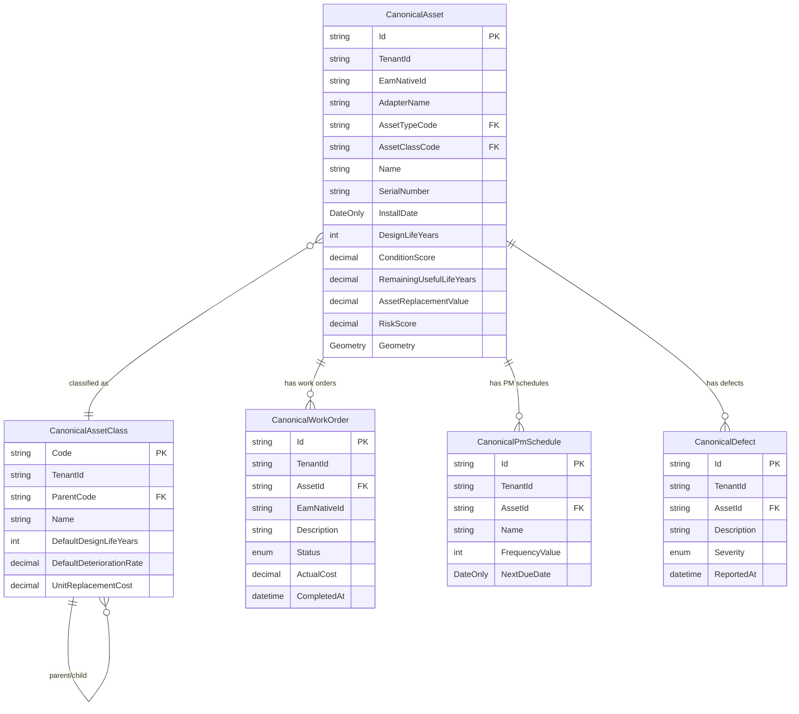

# 14 — Canonical Data Models

## Overview

The canonical data model is the common language between all EAM adapters and the Maintain application layer. Every adapter translates its EAM-specific data to these types. The Maintain business logic (condition engine, RUL calculator, ARV engine, risk scorer, capital planning) operates exclusively on canonical types and has no knowledge of any specific EAM system.

The canonical model is versioned independently of EAM versions. Adding a new field to `CanonicalAsset` does not require changes to any adapter unless the adapter knows how to populate that field.

## CanonicalAsset

```csharp
public record CanonicalAsset
{
    // Identity
    public string Id { get; init; } = default!;           // SHA-256(tenantId|adapterName|eamNativeId)
    public string TenantId { get; init; } = default!;
    public string EamNativeId { get; init; } = default!;  // Adapter-specific primary key
    public string AdapterName { get; init; } = default!;  // "ibm-maximo", "cityworks", etc.
    public string? ExternalGisId { get; init; }           // ArcGIS GlobalID or OBJECTID
    public string? Barcode { get; init; }

    // Classification
    public string AssetTypeCode { get; init; } = default!;   // Top-level type: "ROAD", "BRIDGE"
    public string AssetClassCode { get; init; } = default!;  // Sub-class: "ASPHALT_ROAD", "STEEL_BRIDGE"
    public string? AssetSubClassCode { get; init; }          // Optional tertiary classification

    // Descriptive
    public string Name { get; init; } = default!;
    public string? Description { get; init; }
    public string? SerialNumber { get; init; }
    public string? Manufacturer { get; init; }
    public string? Model { get; init; }
    public string? MaterialType { get; init; }              // Road: asphalt, concrete. Pipe: PVC, ductile iron.

    // Lifecycle dates
    public DateOnly? InstallDate { get; init; }
    public DateOnly? DesignLifeEndDate { get; init; }       // InstallDate + DesignLifeYears
    public DateOnly? DecommissionDate { get; init; }
    public int? DesignLifeYears { get; init; }              // Expected life from EAM or asset class

    // Location
    public string? SiteCode { get; init; }
    public string? LocationCode { get; init; }
    public string? LocationName { get; init; }
    public Geometry? Geometry { get; init; }               // NetTopologySuite, SRID 4326
    public string? Address { get; init; }

    // Financials
    public decimal? OriginalCost { get; init; }            // Historical cost from EAM
    public decimal? ReplacementCostEam { get; init; }      // Replacement cost from EAM (optional)
    public decimal? ResidualValue { get; init; }           // Salvage value
    public string? CurrencyCode { get; init; } = "USD";

    // Organizational
    public string? DepartmentCode { get; init; }
    public string? AssignedTo { get; init; }               // Responsible person or team
    public string? OwnerOrganization { get; init; }

    // Status
    public AssetStatus Status { get; init; } = AssetStatus.Active;

    // Maintain-calculated (never overwritten by EAM sync)
    public decimal? ConditionScore { get; init; }          // 0–100; Maintain-owned
    public decimal? RemainingUsefulLifeYears { get; init; }
    public decimal? AssetReplacementValue { get; init; }
    public decimal? RiskScore { get; init; }
    public string? RiskCategory { get; init; }             // Low/Medium/High/Critical
    public DateOnly? LastInspectionDate { get; init; }

    // Extension
    public Dictionary<string, string> CustomFields { get; init; } = new();

    // Sync metadata
    public DateTimeOffset? EamLastSyncAt { get; init; }
    public long EamSyncVersion { get; init; }              // Monotonically increasing
    public DateTimeOffset CreatedAt { get; init; }
    public DateTimeOffset UpdatedAt { get; init; }
}

public enum AssetStatus
{
    Active,
    Inactive,
    UnderRepair,
    EamDecommissioned,  // Decommissioned in EAM but has active Maintain records
    Decommissioned,     // Fully decommissioned
    Disposed
}
```

**EAM Field Mapping by System:**

| Canonical Field | IBM Maximo | SAP PM | Oracle EAM | Cityworks | MaintainX/UpKeep |
|---|---|---|---|---|---|
| EamNativeId | ASSETNUM:SITEID | EQUNR | ORG:ASSET_NUMBER | EntityId | id (UUID) |
| Name | DESCRIPTION | EQKTX | AssetDescription | EntityDescription | name |
| AssetTypeCode | ASSETTYPE | EQART | AssetType | EntityType (mapped) | category |
| AssetClassCode | CLASSSTRUCTUREID | ILART | — | EntityType (sub-mapped) | subCategory |
| SerialNumber | SERIALNUM | SERGE | SerialNumber | — | serialNumber |
| InstallDate | INSTALLDATE | INBDT | DateInService | InstallDate | purchasedDate |
| Manufacturer | MANUFACTURER | HERST | ManufacturerName | — | manufacturer |
| OriginalCost | PURCHPRICE | ANLAV.ANSDT | CurrentCost | — | purchasedCost |
| SiteCode | SITEID | IWERK | InventoryOrgCode | — | — |
| DepartmentCode | GLACCOUNT | KOSTL | OwningDepartment | — | — |
| Geometry | — (from GIS) | — (from GIS) | — | EntityUID→Esri | — |

## CanonicalWorkOrder

```csharp
public record CanonicalWorkOrder
{
    public string Id { get; init; } = default!;
    public string TenantId { get; init; } = default!;
    public string EamNativeId { get; init; } = default!;
    public string AdapterName { get; init; } = default!;
    public string AssetEamId { get; init; } = default!;    // FK to CanonicalAsset.EamNativeId
    public string AssetId { get; init; } = default!;       // FK to CanonicalAsset.Id

    public string Description { get; init; } = default!;
    public string? Notes { get; init; }
    public WorkOrderStatus Status { get; init; }
    public WorkOrderPriority Priority { get; init; }
    public WorkOrderType Type { get; init; }               // Corrective, Preventive, Inspection, Emergency

    public DateTimeOffset ReportedAt { get; init; }
    public string? ReportedBy { get; init; }
    public DateTimeOffset? ScheduledStartDate { get; init; }
    public DateTimeOffset? ScheduledEndDate { get; init; }
    public DateTimeOffset? ActualStartDate { get; init; }
    public DateTimeOffset? CompletedAt { get; init; }

    public decimal? EstimatedCost { get; init; }
    public decimal? ActualCost { get; init; }
    public decimal? ActualLaborHours { get; init; }

    public string? AssignedTo { get; init; }
    public string? SiteCode { get; init; }
    public Geometry? Location { get; init; }               // Where work was done (Point)
    public string? Category { get; init; }                 // Work category
    public string? CapitalNeedId { get; init; }            // If spawned from a capital need

    public Dictionary<string, string> CustomFields { get; init; } = new();
    public DateTimeOffset? EamLastSyncAt { get; init; }
}

public enum WorkOrderStatus { Open, InProgress, OnHold, Completed, Cancelled, Closed }
public enum WorkOrderPriority { None, Low, Medium, High, Critical }
public enum WorkOrderType { Corrective, Preventive, Inspection, Emergency, Capital }
```

## CanonicalPmSchedule

```csharp
public record CanonicalPmSchedule
{
    public string Id { get; init; } = default!;
    public string TenantId { get; init; } = default!;
    public string EamNativeId { get; init; } = default!;
    public string AdapterName { get; init; } = default!;
    public string AssetId { get; init; } = default!;

    public string Name { get; init; } = default!;
    public string? Description { get; init; }
    public PmFrequencyType FrequencyType { get; init; }    // Calendar, Meter, Condition
    public int? FrequencyValue { get; init; }              // Every N days/miles/hours
    public string? FrequencyUnit { get; init; }            // days, miles, hours
    public DateOnly? NextDueDate { get; init; }
    public DateOnly? LastCompletedDate { get; init; }
    public bool IsActive { get; init; }
    public decimal? EstimatedCostPerCycle { get; init; }
    public decimal? EstimatedLaborHoursPerCycle { get; init; }

    public DateTimeOffset? EamLastSyncAt { get; init; }
}
```

## CanonicalDefect

```csharp
public record CanonicalDefect
{
    public string Id { get; init; } = default!;
    public string TenantId { get; init; } = default!;
    public string EamNativeId { get; init; } = default!;
    public string AdapterName { get; init; } = default!;
    public string AssetId { get; init; } = default!;

    public string Description { get; init; } = default!;
    public DefectSeverity Severity { get; init; }          // Minor/Moderate/Severe/Critical
    public DefectStatus Status { get; init; }
    public string? DefectCode { get; init; }               // EAM failure code
    public string? Component { get; init; }                // Which component is defective
    public DateTimeOffset ReportedAt { get; init; }
    public string? ReportedBy { get; init; }
    public string? RelatedWorkOrderId { get; init; }
    public Geometry? Location { get; init; }

    public DateTimeOffset? EamLastSyncAt { get; init; }
}

public enum DefectSeverity { Minor, Moderate, Severe, Critical }
public enum DefectStatus { Open, InProgress, Resolved, WontFix }
```

## CanonicalAssetClass

```csharp
public record CanonicalAssetClass
{
    public string Code { get; init; } = default!;          // Primary key: "ASPHALT_ROAD"
    public string TenantId { get; init; } = default!;
    public string Name { get; init; } = default!;
    public string? ParentCode { get; init; }               // "ROAD" (parent class)
    public string? Description { get; init; }
    public string Infrastructure { get; init; } = default!; // "Roads", "Bridges", "Utilities"

    // Lifecycle defaults (used when asset-specific values are missing)
    public int? DefaultDesignLifeYears { get; init; }
    public decimal? DefaultDeteriorationRate { get; init; } // Condition points per year
    public string? DefaultCostBasisMethod { get; init; }   // "replacement-cost", "square-foot", "linear-foot"
    public decimal? UnitReplacementCost { get; init; }     // Per unit ($ per sq ft, $ per linear ft)
    public string? UnitOfMeasure { get; init; }            // "sq_ft", "linear_ft", "each"
    public string? CsiDivision { get; init; }              // CSI MasterFormat division code
    
    // Inspection config
    public int? InspectionCycleYears { get; init; }        // Recommended inspection frequency
    public string? DefaultInspectionMethod { get; init; }  // "visual", "structural", "pavement-pci"
    
    // Risk weights
    public decimal? DefaultCriticalityWeight { get; init; }
    public string? AssetGroupingCode { get; init; }        // For grouping in dashboards
    
    public bool IsActive { get; init; } = true;
    public DateTimeOffset CreatedAt { get; init; }
    public DateTimeOffset UpdatedAt { get; init; }
}
```

## Entity Relationship Diagram



## Canonical Model Versioning

The canonical model is versioned with a `CanonicalModelVersion` attribute on each type. When a field is added, the model version increments. Adapters that do not know about the new field simply leave it null — the sync engine does not break.

When a field is **renamed or removed**, a migration is required:
1. Add the new field (old field remains)
2. Update all adapters to populate the new field
3. Run a backfill to populate the new field from EAM data
4. Mark the old field deprecated (not removed)
5. Remove the old field in the next major version

## Extension Fields

The `CustomFields` dictionary preserves EAM-specific data that has no canonical equivalent. This serves three purposes:
1. No EAM data is lost during mapping
2. Customers can see their original EAM attributes in Maintain (via a raw fields view)
3. Future canonical model additions can be bootstrapped from CustomFields data

All EAM adapter mappers should populate CustomFields with every EAM field that is not explicitly mapped to a canonical field. Use the naming convention `{EamFieldName}` (e.g., `CUST_BRIDGE_LOAD_CLASS`, `MaximoSiteId`).
