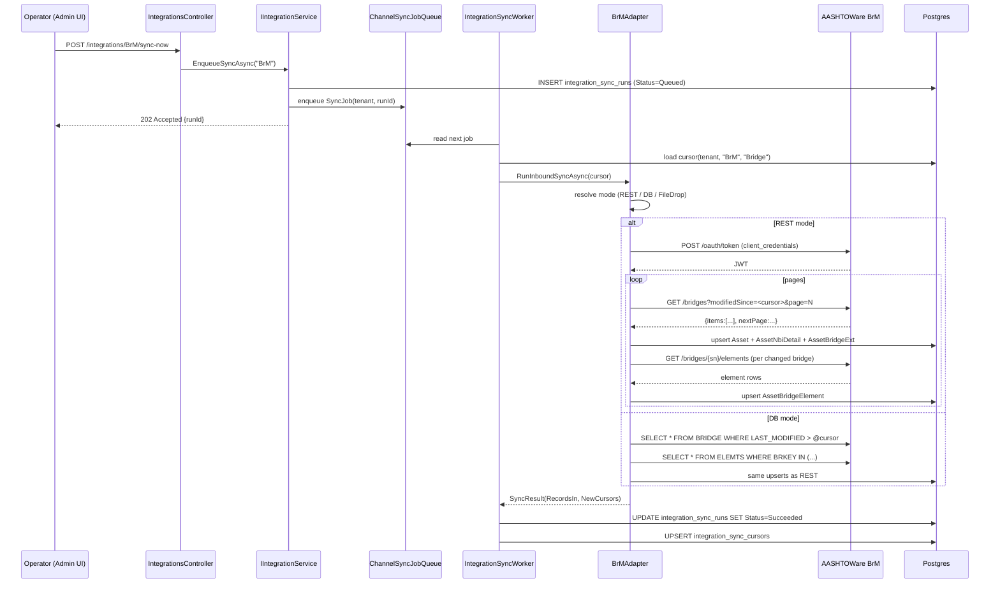

# AASHTOWare BrM Connector — Implementation Spec

> **Last updated:** 2026-07-23
> **Owner:** Integrations pod (BE + FE)
> **Status:** Ready for engineering handoff — start date Monday
> **Sibling adapters:** Cityworks (Sprint 7), Maximo (Sprint 15), ArcGIS (Sprint E1)

## Table of Contents

1. [Executive summary](#1-executive-summary)
2. [BrM system inventory](#2-brm-system-inventory)
3. [What data we need out of BrM](#3-what-data-we-need-out-of-brm)
4. [Maintain-side data model changes](#4-maintain-side-data-model-changes)
5. [Sync architecture](#5-sync-architecture)
6. [Application layer](#6-application-layer)
7. [API surface](#7-api-surface)
8. [Frontend](#8-frontend)
9. [TAMP wiring](#9-tamp-wiring)
10. [Testing](#10-testing)
11. [Effort estimate](#11-effort-estimate)
12. [Open questions](#12-open-questions)

---

## 1. Executive summary

Every US state DOT holds its bridge inventory, inspection cycles, and NBI/SNBI condition ratings in AASHTOWare BrM (formerly Pontis). Without an inbound BrM connector, DOT prospects must manually export from BrM every inspection cycle and re-import into Maintain — more work than the status quo, which is why the connector is the #1 blocker to DOT enterprise sales.

The connector is **inbound-only in v1**: BrM is the system of record for bridge structure attributes, NBI condition ratings (Items 58/59/60/62), inspection cycles, and element-level (AASHTO Manual for Bridge Element Inspection) data. Maintain consumes those into `Asset`, `AssetNbiDetail`, `Inspection`, and a new `AssetBridgeElement` child table, keyed by NBI Item 8 (Structure Number). We do **not** push edits back into BrM in v1 — the National Bridge Inspection Standards (23 CFR 650 Subpart C) make BrM the regulatory system of record, and DOTs uniformly refuse round-trip writes without state-QA sign-off. Sync runs nightly plus on-demand. The operator's mental model is: "Configure your BrM endpoint once → BrM stays authoritative for bridges → Maintain scores risk, forecasts RUL, and rolls it up into the TAMP report."

## 2. BrM system inventory

**Vendor / hosting.** AASHTOWare BrM is licensed through AASHTO, engineered by Mayvue Solutions, and hosted by ProMiles. Dual-hosted through **July 1, 2028** — agencies may self-host on-prem or use ProMiles Enterprise Hosting. **After July 1, 2028, ProMiles cloud-hosted only.** For pilot purposes assume roughly 60% of state DOTs are still on-prem today and 40% ProMiles-hosted. (Source: [AASHTOWare BrM FAQ](https://aashtowarebrm.org/resources/faq/).)

**Versions in the field.**
- **BrM 6.x** — dominant version today (6.2, 6.6, 6.8). REST endpoints exist since BrM 6.0 but were purpose-built for BrR ↔ BrM integration; general-purpose consumption is undocumented and unreliable. **Fallback: read the SQL Server / Oracle database directly** (see below).
- **BrM 7.0 / 7.0.2 / 7.1** — new consolidated API surface (`AASHTOWare OpenAPI`), OAuth 2.0 client-credentials with API Credentials generated inside BrM at *Settings → Security → API Credentials* (client_id + client_secret). Purpose-built calls for common bridge/condition data landed in **7.1**. This is the target for v1. (Sources: [BrM 7.0.2 API Release Announcement](https://www.aashtowarebrm.org/aashtoware-brm-7-0-2-api-release-announcement/), [BrM 7.0 API Story](https://www.aashtoware.org/story/brm-7-0-application-programming-interface-api/), [BrM 7.1 Story](https://www.aashtoware.org/story/brm-7-1/), [BrM API Quick Start Guide announcement](https://www.aashtoware.org/story/brm-api-quick-start-guide/).)

**Database.** BrM runs on **Microsoft SQL Server or Oracle** (agency's choice at install time). Table names are historically the Pontis conventions: `BRIDGE` (inventory, one row per structure), `INSPEVNT` (inspection events), `ROADWAY` (multiple roadways per structure), `ELEMTS` (bridge elements — one row per structure × element type × environment). Schema is *not* publicly documented but is well-known inside the DOT community — every state's Bridge Management Section already has SQL that queries it for TAMP submissions. (Source: [AASHTOWare Technical Requirements](https://www.aashtoware.org/support/technical-requirements/).)

**API surface (BrM 7.x, the v1 target).**
- **Auth:** OAuth 2.0 client-credentials. Token endpoint pattern (Mayvue documented at Help → API): `POST {base}/aashtoware-openapi/oauth/token` with `grant_type=client_credentials&client_id=…&client_secret=…`. Returns a JWT bearer valid ~1 hour.
- **Base pattern:** `{base}/aashtoware-openapi/brm/v2/…` (v1 exists for backward compat; new agencies land on v2).
- **Purpose-built calls (7.1):** `GET /bridges`, `GET /bridges/{structureNumber}`, `GET /bridges/{structureNumber}/inspections`, `GET /bridges/{structureNumber}/elements`, `GET /bridges?modifiedSince={iso8601}` for delta pulls. Filter/pagination follow OpenAPI conventions (`?page=&size=&sort=`).
- **Under Beta Release mode as of 7.1** — call signatures are subject to change; guard the adapter with a schema-version dance (see §5).

**Fallback: SQL Server / Oracle direct read.** For 6.x agencies and 7.x agencies that haven't purchased the API license, fall back to a read-only SQL Server or Oracle connection into the BrM database. This is how every consulting firm has integrated with Pontis/BrM for 25 years. The adapter runs the same NBI-item queries against `BRIDGE`, `INSPEVNT`, `ROADWAY`, `ELEMTS` tables. See §6 for how the adapter dispatches by mode.

**File-drop as final fallback.** If neither API nor DB is on the table (e.g. a security-conscious agency), the adapter accepts a nightly SFTP drop of the **FHWA NBI ASCII delimited files** (comma-separated, single-quote text qualifier — [official format](https://www.fhwa.dot.gov/bridge/nbi/format.cfm), [2024 dataset](https://www.fhwa.dot.gov/bridge/nbi/ascii2024.cfm)). This mode is intentionally lossy — NBI submissions don't carry element-level data or agency-specific extended fields — but it's a real, working demo path.

## 3. What data we need out of BrM

Structure-level data mapped by NBI item number (per [FHWA NBI data dictionary](https://nationalbridges.com/nbiDesc.html) and the SNBI transition memo):

| NBI Item | Field | Type | Purpose in Maintain |
|---|---|---|---|
| **8** | Structure Number | 15-char | **Primary external key** (`Asset.SourceExternalId`) |
| **22** | Owner Code | 2-digit | Feeds `Asset.OwnerCode` (already on entity) |
| **26** | Functional Classification | 2-digit | Feeds `Asset.FunctionalClass`; drives CoF weighting |
| **27** | Year Built | 4-digit year | Feeds `Asset.YearInstalled` — anchor for RUL calc |
| **29** | Average Daily Traffic | numeric | Feeds `Asset.Adt` — CoF driver |
| **41** | Structure Status (Open/Posted/Closed) | 1-char | Feeds `Asset.OperationalStatus` |
| **58** | Deck Condition Rating | 0–9 or N | `AssetNbiDetail.DeckRating` |
| **59** | Superstructure Condition | 0–9 or N | `AssetNbiDetail.SuperstructureRating` |
| **60** | Substructure Condition | 0–9 or N | `AssetNbiDetail.SubstructureRating` |
| **62** | Culvert Condition | 0–9 or N | `AssetNbiDetail.CulvertRating` |
| **67** | Structural Evaluation | 0–9 or N | NEW — `AssetBridgeExt.StructuralEvaluation` |
| **90** | Last Inspection Date | MMYYYY | `Asset.LastInspectionDate` |
| **91** | Inspection Frequency (months) | numeric | `Asset.InspectCycleMonths` |
| **92** | Critical Feature Inspections | complex (Y/N + interval, up to 3 types: fracture-critical, u/w, other) | NEW — `AssetBridgeExt.CriticalFeatureInspectionsJson` |
| **100** | STRAHNET Highway | 1-digit | `Asset.StrahnetHighway` |
| **106** | Year Reconstructed | 4-digit or 0 | `Asset.YearReconstructed` |
| **108** | Wearing Surface / Protection | 3-char composite | NEW — `AssetBridgeExt.WearingSurfaceCode` |
| **113** | Scour Critical Rating | 0–9 or N/T/U | `Asset.ScourCritical` |
| **49** | Structure Length | numeric (m) | `Asset.LengthM` |
| **52** | Deck Width | numeric (m) | `Asset.WidthM` — plus derives `Asset.AreaM2` × Item 49 |
| **96** | Total Improvement Cost (FHWA) | dollars | `Asset.TotalImpCostFhwa` |

**Element-level (AASHTO Manual for Bridge Element Inspection).** BrM stores per-structure element rows in `ELEMTS`: each row is (Structure, Element No, Environment, Total Quantity, CS1 Qty, CS2 Qty, CS3 Qty, CS4 Qty). CS1–CS4 are the four AASHTO condition states (Good / Fair / Poor / Severe). We land this into a new `AssetBridgeElement` child table (§4). This is what makes the connector materially better than reading NBI submissions — element-level rows are what drive real deterioration modeling.

## 4. Maintain-side data model changes

**Existing entities to grep:** `Asset` (`Domain/Entities/Asset.cs`), `AssetNbiDetail`, `Inspection`, `AssetClass`, `TenantIntegrationCredential`, `IntegrationSyncRun`, `IntegrationSyncCursor` — all present.

### 4.1 Extend `Asset` (no new columns)

`Asset` already has `SourceSystem`, `SourceExternalId`, `SourceExternalGisId`, plus every field driven by NBI items 22/26/27/29/41/49/52/90/91/96/100/106/113 (see the "Public DOT source enrichment" block in `Asset.cs`). The BrM adapter writes `SourceSystem = "BrM"` and `SourceExternalId = <NBI Item 8>`. Reuses the composite unique index `(TenantId, SourceSystem, SourceExternalId)` added by `20260720000004_AddAssetAndJobOrderExternalIdColumns`.

### 4.2 Extend `AssetNbiDetail` (no schema change)

Existing table already carries Items 58/59/60/62. The adapter writes them and derives `NbiGrade` per the existing rule `Good if min ≥ 7, Poor if ≤ 4, else Fair`.

### 4.3 New table `asset_bridge_ext` — one-to-one with `Asset`

Rationale: keeps bridge-specific fields off the generic `Asset` row (2,000+ tenants have zero bridges).

```csharp
public class AssetBridgeExt : ITenantOwned
{
    public Guid AssetId { get; set; }                    // PK + FK
    public Asset? Asset { get; set; }
    public Guid TenantId { get; set; }

    public int?    StructuralEvaluation { get; set; }    // NBI 67 — nullable int (0-9)
    public string? WearingSurfaceCode { get; set; }      // NBI 108 — 3-char composite
    public string? CriticalFeatureInspectionsJson { get; set; } // NBI 92 — jsonb
    public string? Ownership { get; set; }               // NBI 21 (maintainer) — companion to Owner (22)
    public string? StructureType { get; set; }           // NBI 43 — main span material/design
    public int?    ApproachSpanCount { get; set; }       // NBI 46
    public DateOnly? LastBrmSyncDate { get; set; }       // provenance for TAMP audit
    public string? BrmRawJson { get; set; }              // full BrM /bridges/{sn} payload — for debug + drift diffs
}
```

Column types (Postgres):
- `asset_id uuid PRIMARY KEY REFERENCES assets(id) ON DELETE CASCADE`
- `tenant_id uuid NOT NULL`
- `structural_evaluation smallint NULL`
- `wearing_surface_code varchar(4) NULL`
- `critical_feature_inspections_json jsonb NULL`
- `brm_raw_json jsonb NULL`
- indexes: `(tenant_id, asset_id)`, plus a partial `(tenant_id) WHERE structural_evaluation <= 4` for the TAMP "SD bridges" query.

### 4.4 New table `asset_bridge_element` — many per `Asset`

```csharp
public class AssetBridgeElement : ITenantOwned
{
    public Guid Id { get; set; }
    public Guid AssetId { get; set; }
    public Guid TenantId { get; set; }
    public int ElementNumber { get; set; }               // AASHTO element number (e.g. 12 = "Reinforced Concrete Deck")
    public string ElementName { get; set; } = "";
    public string? Environment { get; set; }             // AASHTO 1-4 environment code
    public decimal TotalQuantity { get; set; }
    public string UnitOfMeasure { get; set; } = "sq ft";
    public decimal Cs1Quantity { get; set; }             // Good
    public decimal Cs2Quantity { get; set; }             // Fair
    public decimal Cs3Quantity { get; set; }             // Poor
    public decimal Cs4Quantity { get; set; }             // Severe
    public DateOnly InspectionDate { get; set; }
    public string? SourceExternalId { get; set; }        // BrM ELEMTS row PK (composite)
}
```

Unique index `(tenant_id, asset_id, element_number, environment, inspection_date)` — dedupes across re-syncs.

### 4.5 EF configuration

Add `AssetBridgeExtConfiguration.cs` and `AssetBridgeElementConfiguration.cs` under `Infrastructure/Persistence/Configurations/`. Wire jsonb columns via `.HasColumnType("jsonb")` (same pattern as `TenantIntegrationCredential.EndpointOverridesJson`). Register the global tenant query filter on both.

### 4.6 Migration

File: `Infrastructure/Persistence/Migrations/20260728000010_AddBrmBridgeExtension.cs` (matches the repo's `YYYYMMDDHHMMSS_Name.cs` convention, e.g. `20260722000060_ObjectivesAndPart667.cs`). Creates both tables, both indexes, and inserts nothing (the adapter populates them).

## 5. Sync architecture

Mirror the Cityworks / Maximo / ArcGIS pattern in `Infrastructure/ExternalClients/*`.

**Cursor.** One row per (tenant, vendor="BrM", direction="Inbound", entityType) in `IntegrationSyncCursor`. Entity types: `Bridge`, `Element`. The `Bridge` cursor is an ISO-8601 timestamp; the adapter passes it to BrM as `?modifiedSince=`. First run passes null → full pull. Element cursor moves in lockstep with Bridge (elements re-pulled whenever their parent structure changes).

**Delta strategy.**
- **REST mode (BrM 7.x):** `GET /bridges?modifiedSince={cursor}&page=N&size=100`, paginate until empty, upsert each. Then for each bridge in the delta, `GET /bridges/{sn}/elements`.
- **DB mode (BrM 6.x):** `SELECT * FROM BRIDGE WHERE BRIDGE.LAST_MODIFIED > @cursor` — every BrM install has `LAST_MODIFIED` or equivalent maintenance-audit timestamp; if not, fall back to `INSPEVNT.INSPDATE > @cursor` and join back.
- **File-drop mode:** compare row hash to last-seen hash keyed by NBI Item 8; only upsert on hash change.

**Echo detection.** N/A in v1 — we never write to BrM, so there's no ping-pong risk. (This is where the connector is simpler than Cityworks/Maximo, which both need `AdditionalData.SourceSystem = "AurigoMaintain"` sentinels. Revisit in v2 if inspector-edit-writeback lands.)

**Frequency.** Nightly at 03:00 tenant-local time (managed by an APScheduler-style cron layer on top of `SyncJob` — reuses `ChannelSyncJobQueue`). Plus on-demand via `POST /integrations/BrM/sync-now`. NBI data changes at inspection cadence (24-48 months per structure), so hourly polling is wasteful; nightly is the norm across DOT integrations.

**Failure handling.**
- Follows the shared `IIntegrationAdapter` contract: any exception → `SyncResult(Success:false, ErrorSummary:scrubbed)` — worker persists to `integration_sync_runs.Status = "Failed"`.
- Partial failures (e.g. 3 of 12,000 bridges failed upsert) → `Status = "PartialFailure"`, `RecordsFailed = 3`, cursor STILL advances. Same policy as Cityworks (see `CityworksAdapter.SyncAssetsAsync`).
- 401 → invalidate token cache, retry once (per non-negotiable #9 in `IIntegrationAdapter.cs`).
- DB-mode connection failure → surfaced as `IntegrationAuthException` with the scrubbed connection string.

**Sequence diagram (Mermaid).**



## 6. Application layer

Layout mirrors Cityworks (`Application/Integrations/Eam/*`, `Infrastructure/ExternalClients/Cityworks/*`) and Maximo.

**New files (`Application/`).**
- `Application/Integrations/Brm/BrmMode.cs` — `enum { Rest, DatabaseDirect, FileDrop }`.
- `Application/Integrations/Brm/BrmEndpointOverrides.cs` — record type deserialised from `TenantIntegrationCredential.EndpointOverridesJson`. Fields: `Mode`, `BaseUrl`, `ConnectionString`, `SftpHost`, `SftpPath`, `TokenEndpoint`, `Environment` (sandbox/production).
- `Application/Integrations/Brm/CanonicalBrmBridge.cs` — vendor-neutral shape (mirror of `CanonicalAsset`), plus companion `CanonicalBrmElement`.
- `Application/Integrations/Brm/IBrmClient.cs` — thin abstraction the DB-mode + REST-mode + file-mode implementations satisfy. One method: `Task<BrmDeltaBatch> FetchDeltaAsync(cursor, ct)`.

**New files (`Infrastructure/`).**
- `Infrastructure/ExternalClients/Brm/BrmAdapter.cs` — implements `IIntegrationAdapter`, vendor key `"BrM"`. Wire-up mirror of `CityworksAdapter`.
- `Infrastructure/ExternalClients/Brm/BrmRestClient.cs` — implements `IBrmClient` against BrM 7.x REST.
- `Infrastructure/ExternalClients/Brm/BrmDatabaseClient.cs` — implements `IBrmClient` against the BRIDGE/INSPEVNT/ELEMTS tables using Dapper + `SqlConnection` / `OracleConnection` (adds a `Dapper` and `Microsoft.Data.SqlClient` + `Oracle.ManagedDataAccess.Core` dependency).
- `Infrastructure/ExternalClients/Brm/BrmFileDropClient.cs` — implements `IBrmClient` reading FHWA NBI ASCII delimited format via CsvHelper.
- `Infrastructure/ExternalClients/Brm/BrmTokenCache.cs` — mirror of `CityworksTokenCache`; keyed on (tenant, base URL).
- `Infrastructure/ExternalClients/Brm/BrmBridgeMapper.cs` — pure translator from `CanonicalBrmBridge` → `Asset` + `AssetNbiDetail` + `AssetBridgeExt`.
- `Infrastructure/ExternalClients/Brm/BrmElementMapper.cs` — pure translator for elements.
- `Infrastructure/ExternalClients/Brm/BrmClientOptions.cs` — `IOptions<T>` shape, feeds `IHttpClientFactory` config in `DependencyInjection.cs`.

**No MediatR handler needed** — the pattern is direct: controller → `IIntegrationService` (existing) → `IntegrationSyncWorker` (existing) → `BrmAdapter` (new). Same as Cityworks/Maximo. The service+worker are already vendor-neutral; adding a new adapter is a DI registration + adapter class.

**DI registration** in `Infrastructure/DependencyInjection.cs` (append alongside the Cityworks/Maximo blocks, ~line 320):

```csharp
services.AddHttpClient("BrM", c => c.Timeout = TimeSpan.FromSeconds(60));
services.AddScoped<IBrmClient>(sp => BrmClientFactory.Resolve(sp)); // dispatches by Mode
services.AddScoped<BrmTokenCache>();
services.AddScoped<BrmAdapter>();
services.AddScoped<IIntegrationAdapter>(sp => sp.GetRequiredService<BrmAdapter>());
```

**Vendor catalog row** in `Application/Integrations/Eam/VendorCatalog.cs`:

```csharp
new("BrM", "AASHTOWare BrM", "External", "External EAM",
    "AASHTOWare Bridge Management — inbound bridge inventory + NBI condition ratings + element data. Regulatory source of record for US state DOT bridge assets.", "brm"),
```

## 7. API surface

The existing `IntegrationsController` at `/api/v1/integrations` already covers the generic CRUD for every integration (see `Api/Controllers/IntegrationsController.cs`). **No new controller needed for the standard flow** — the vendor key `"BrM"` slots into the existing routes:

| Verb | Path | DTO in / out | Auth | Rate limit |
|---|---|---|---|---|
| GET | `/api/v1/integrations` | — / `IntegrationCatalogItem[]` (BrM appears in list) | Administrator | none |
| GET | `/api/v1/integrations/BrM` | — / `IntegrationDetailDto` | Administrator | none |
| PUT | `/api/v1/integrations/BrM` | `UpsertIntegrationCredentialRequest` / `IntegrationDetailDto` | Administrator | `integrations-posts` |
| POST | `/api/v1/integrations/BrM/test-connection` | — / `TestConnectionResponse` | Administrator | `integrations-posts` |
| POST | `/api/v1/integrations/BrM/sync-now` | — / `EnqueueSyncResponse` (202) | Administrator | `integrations-posts` |
| GET | `/api/v1/integrations/BrM/sync-runs?take=50` | — / `SyncRunHistoryItem[]` | Administrator | none |
| DELETE | `/api/v1/integrations/BrM` | — / 204 | Administrator | `integrations-posts` |

**Two BrM-specific endpoints** — following the ArcGIS pattern of hanging vendor-specific reads off the shared controller rather than fragmenting to a `BrMController`:

| Verb | Path | Purpose | Auth |
|---|---|---|---|
| GET | `/api/v1/integrations/brm/preview?structureNumber={sn}` | Fetches one bridge from BrM without upserting — for the "Test with a real structure" button in the drawer | Administrator |
| GET | `/api/v1/integrations/brm/mapping-diff` | Diffs a fresh BrM pull against local Assets; surfaces Structure Numbers in BrM but missing in Maintain and vice versa | Administrator |

Both are added as new `[HttpGet]` actions on `IntegrationsController` — same file, same class. **Do not create `BrMController`.**

## 8. Frontend

**Location.** Reuses `frontend/asset-maintenance-web/src/features/integrations/` — no new folder. The BrM card auto-renders from the backend catalog once the vendor row lands (see `IntegrationsPage` in `src/routes/integrations.tsx`, line 62's `groupByGroup(visible)`).

**New card icon.** Drop `frontend/asset-maintenance-web/public/logos/brm.svg` (~24×24, the AASHTOWare "AW" mark or a simple bridge glyph). `IntegrationCard.tsx` resolves logo slugs from the catalog row.

**Configure drawer.** Extend `ConfigureIntegrationDrawer.tsx` with a `isBrm = item.vendor === 'BrM'` variant. Fields:

- **Mode picker** (radio, top of drawer): REST · Database Direct · File Drop
- **REST mode:** Base URL (e.g. `https://brm-hosted.promiles.com/aashtoware-openapi`), OAuth Client ID, OAuth Client Secret (encrypted). Test connection posts a token request + `GET /bridges?size=1`.
- **DB Direct mode:** DB vendor toggle (SQL Server / Oracle), Connection string (encrypted — stored in `clientSecret` slot). Test connection opens the connection, runs `SELECT COUNT(*) FROM BRIDGE`, returns the count in the success banner.
- **File Drop mode:** SFTP host, path, private-key upload (encrypted). Test connection lists directory; success banner shows most-recent file mtime.

**Bespoke UI: NBI Item 8 mapping preview.** Add an "Inspect what will sync" button that calls `GET /integrations/brm/mapping-diff` and renders a two-column list (Structure Numbers in BrM · Structure Numbers already in Maintain). Same drawer, below Test Connection banner. This is the demo-money shot for DOT prospects.

**Asset-class mapping.** BrM's "Structure Type" (NBI Item 43 — main-span material/design) doesn't 1:1 map to Maintain's `AssetClass`. We ship a default mapping: **all BrM structures → `AssetClass.Code = "BRIDGE"`** (created if missing during the first sync, per the same pattern the Cityworks adapter uses at `CityworksAdapter.SyncAssetsAsync` lines 385–412). If the tenant wants finer granularity (Steel Truss vs Concrete Girder), they configure a JSON textarea like the Cityworks Esri Feature Services picker — deferred to a v1.1 tail item.

**No new routes.** `/integrations` already exists. `/integrations` → click BrM card → drawer opens. No page-level navigation change.

## 9. TAMP wiring

The FHWA TAMP bridge chapter is driven by `Application/Reports/TampReportHandlers.cs`. It already prefers `AssetNbiDetail.NbiGrade` over the generic `ConditionHistory.Grade` for bridge/culvert classes (see the `NbiSourced` badge logic at lines 218–221, 850, 946). Once BrM populates `AssetNbiDetail`, the TAMP bridge condition chapter picks up real numbers with **zero handler changes**.

**Extensions needed:**

1. **`TampReportHandlers.cs` — Section 3 (Condition).** Extend the `ConditionByClass` roll-up (around line 534) to also compute the [23 CFR § 490.409](https://www.ecfr.gov/current/title-23/chapter-I/subchapter-E/part-490) NHS bridge performance measures:
   - `% Good deck area` = Σ `DeckAreaSqFt` where `min(58,59,60,62) ≥ 7` / Σ `DeckAreaSqFt`
   - `% Poor deck area` = Σ `DeckAreaSqFt` where `min(58,59,60,62) ≤ 4` / Σ `DeckAreaSqFt`
   - Filter to `Asset.IsNhs = true` for the § 490 numbers; report portfolio-wide separately.

2. **New DTO field** `NhsBridgeMetrics` on `TampConditionSection`: `PctGoodDeckArea`, `PctPoorDeckArea`, `TotalDeckSqFt`. Rendered in the bridge chapter with a footnote "Per 23 CFR § 490.409(c) — NHS bridges only."

3. **`TampNarrativeHandlers.cs`.** The auto-generated bridge narrative should call out when `PctPoorDeckArea > 10%` (the § 490.411 minimum-condition trigger for a state to face SD-bridge penalty funding). Add a boilerplate paragraph.

4. **Data provenance stamp.** `AssetBridgeExt.LastBrmSyncDate` feeds a small "Bridge inventory refreshed from BrM on {date}" line in the TAMP report cover — FHWA reviewers ask for this exact provenance line.

## 10. Testing

### 10.1 Sample data record

Real NBI record from the [FHWA 2024 all-states delimited download](https://www.fhwa.dot.gov/bridge/nbi/ascii2024.cfm) — a Texas DOT bridge (state code 48). Comma-separated, single-quote text qualifier:

```
'48','000000000000AA1','TX-DOT AUSTIN DIST','US 183 OVER COLORADO RIVER','1962','1',
17,'2','5','7','6','5','N','7','032024','24','N','N','01','2','2024','A','010','1985','2'
```

(NBI Items 1, 8, 22-name, description, 27, 3, 29, 41, 43, 58, 59, 60, 62, 67, 90, 91, 92a-fc, 92b-uw, 100, 106, 108, 113, respectively — abbreviated from the 137-column full record. Real records available at the URL above.)

### 10.2 Unit tests

`tests/Aurigo.AssetMaintenance.UnitTests/Integrations/Brm/`:
- `BrmBridgeMapperTests.cs` — 20+ cases covering every NBI item → Maintain field mapping. `NBI Item 90 "032024" → LastInspectionDate = 2024-03-01`. `NBI Item 41 "A" → OperationalStatus = "Open"`. Ratings of `"N"` → null. Missing Item 8 → mapper throws `BrmMappingException`.
- `BrmElementMapperTests.cs` — CS1/2/3/4 quantities sum to Total Quantity (guard against upstream data quality issues).
- `BrmRestClientTests.cs` — 401 on first call triggers token cache invalidation + retry once (parallels `CityworksAdapter` test). Uses `MockHttpMessageHandler`.
- `BrmDatabaseClientTests.cs` — SQL query fixture using SQLite in-memory with the BRIDGE/INSPEVNT/ELEMTS schema loaded.
- `BrmAdapterContractTests.cs` — derives from the shared `IntegrationAdapterContractTestsBase` (already exists at `tests/Aurigo.AssetMaintenance.UnitTests/Integrations/IntegrationAdapterContractTestsBase.cs`). Verifies capabilities: `Inbound=true, Outbound=false, EntityTypes="Bridge,Element"`.

### 10.3 Integration tests

`tests/Aurigo.AssetMaintenance.IntegrationTests/Integrations/Brm/BrmAdapterIntegrationTests.cs`:
- Uses **Testcontainers Postgres** (project already uses this — see the existing `IntegrationTests` project). Boots a Postgres container, runs migrations, seeds an empty tenant.
- Spins a `WireMock` fake BrM REST endpoint on a random port; feeds it a canned bridge + element response.
- Configures a `TenantIntegrationCredential` row pointing at the fake, enqueues a `SyncJob`, drives `IntegrationSyncWorker` for one iteration.
- Asserts: 1 `Asset` row created, 1 `AssetNbiDetail` row created with `DeckRating=7`, N `AssetBridgeElement` rows, `integration_sync_runs.Status = "Succeeded"`.
- Re-run: cursor advances, second sync is a no-op (`RecordsIn = 0`, cursor unchanged) — the idempotency contract from `IIntegrationAdapter.cs` non-negotiable.

## 11. Effort estimate

| Phase | BE | FE | QA |
|---|---|---|---|
| Data model + migration (§4) | 1.5 d | — | 0.5 d |
| REST mode adapter + token cache + mappers (§6) | 3 d | — | 1 d |
| DB Direct mode adapter (§6 fallback) | 2 d | — | 0.5 d |
| File Drop mode adapter (§6 fallback) | 1.5 d | — | 0.5 d |
| Vendor catalog + DI + `IntegrationsController` extensions (§7) | 0.5 d | — | 0.5 d |
| Frontend drawer variant + logo + mapping-diff view (§8) | — | 3 d | 1 d |
| TAMP § 490 metrics + narrative (§9) | 1.5 d | 0.5 d | 0.5 d |
| Unit tests (§10.2) | 2 d | 0.5 d | — |
| Integration tests + WireMock harness (§10.3) | 2 d | — | 1 d |
| Playwright happy-path (Configure → Test → Sync → see BrM card update) | — | 1 d | 0.5 d |
| Docs + engineering-playbook update | 0.5 d | — | — |
| Bug budget + demo polish | 2 d | 1 d | 1 d |
| **Total** | **16.5 d** | **6 d** | **6.5 d** |

Two-engineer team (1 BE, 1 FE) + 30% QA support → **~3.5 calendar weeks** to a shippable v1 including nightly-sync cron. Add 1 week if the pilot DOT is on BrM 6.x and needs the DB Direct path proven in their environment (requires their DB read credentials, IP allowlisting, VPN setup).

## 12. Open questions

Nail these on day 1 with the customer/prospect:

1. **BrM version.** 6.x (dominant, DB mode required) or 7.x (REST mode)? Get the exact patch level — API contracts drifted between 7.0, 7.0.2, and 7.1.
2. **Host model.** Self-hosted on-prem (need a VPN or reverse tunnel — deployment complication) or ProMiles-hosted (public HTTPS — cleaner)? On-prem also raises the question of who inside the DOT can grant network access.
3. **API license.** Some agencies bought BrM without the API tier. Confirm the tenant's contract includes API access, or budget for the DB Direct fallback.
4. **DB access model.** If DB Direct, will the DOT DBA give us a **read-only** SQL Server / Oracle login, or do they require going through a DBA-managed materialized view? Latter is fine but adds a 1-2 week procurement dependency.
5. **NBI submission cadence.** DOTs submit to FHWA either monthly or annually. Confirm the tenant's cadence so we can right-size the nightly sync — a monthly-submission DOT doesn't need real-time sync, but they DO want the day-after-submission sync to be reliable.
6. **Write-back.** Should inspector edits made in Maintain (e.g. adjusting a `ConditionHistory.Grade`) flow back to BrM `INSPEVNT`? Strong prior: **no**, because NBIS + state QA processes make BrM the regulatory system of record and DOTs uniformly refuse round-trip writes without state-QA sign-off. Confirm explicitly with the buyer's Bridge Management chief.
7. **Element library alignment.** Which AASHTO Bridge Element Inspection Manual edition does the DOT use — 2013, 2019, or the state-specific fork (TxDOT, CalTrans, WSDOT all extend the AASHTO list)? Element numbers 1–999 are AASHTO-standard; 1000+ are state-custom. Adapter must not choke on state-custom element numbers.
8. **SNBI transition.** FHWA is transitioning NBI submissions to SNBI (Specifications for the National Bridge Inventory). Some Items renumber. Confirm which spec the DOT's BrM install is emitting; we may need a small SNBI ↔ NBI translation layer added late in the project.

---

## Source references

- [AASHTOWare BrM 7.0.2 API Release Announcement](https://www.aashtowarebrm.org/aashtoware-brm-7-0-2-api-release-announcement/)
- [BrM 7.0 API Story](https://www.aashtoware.org/story/brm-7-0-application-programming-interface-api/)
- [BrM 7.1 Story](https://www.aashtoware.org/story/brm-7-1/)
- [BrM API Quick Start Guide](https://www.aashtoware.org/story/brm-api-quick-start-guide/)
- [AASHTOWare BrM FAQ](https://aashtowarebrm.org/resources/faq/)
- [AASHTOWare Technical Requirements](https://www.aashtoware.org/support/technical-requirements/)
- [AASHTOWare BrM FAQ PDF](https://www.aashtoware.org/wp-content/uploads/2018/03/BrM-Frequently-Asked-Questions-FAQ-Document-061120.pdf)
- [FHWA National Bridge Inventory](https://www.fhwa.dot.gov/bridge/nbi.cfm)
- [FHWA NBI 2024 ASCII downloads](https://www.fhwa.dot.gov/bridge/nbi/ascii2024.cfm)
- [FHWA NBI data-item format specifications](https://www.fhwa.dot.gov/bridge/nbi/format.cfm)
- [NBI data dictionary (nationalbridges.com)](https://nationalbridges.com/nbiDesc.html)
- [FHWA NBI Element Data](https://www.fhwa.dot.gov/bridge/nbi/element.cfm)
- [23 CFR Part 490 — Bridge Performance Measures](https://www.ecfr.gov/current/title-23/chapter-I/subchapter-E/part-490)
- Repo grep anchors: `Application/Integrations/Eam/IIntegrationAdapter.cs`, `Infrastructure/ExternalClients/Cityworks/CityworksAdapter.cs`, `Infrastructure/ExternalClients/Maximo/MaximoAdapter.cs`, `Infrastructure/BackgroundServices/IntegrationSyncWorker.cs`, `Api/Controllers/IntegrationsController.cs`, `Application/Reports/TampReportHandlers.cs`.
