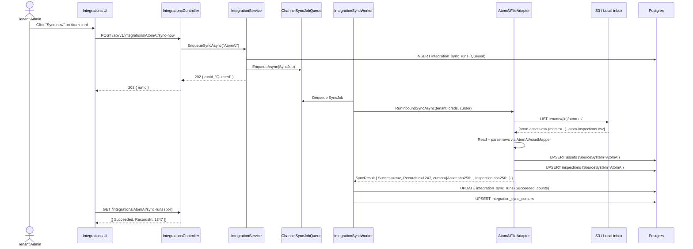

# Atom AI Connector — Implementation Spec

**Last updated:** 2026-07-23
**Owner:** Integrations Squad (Pradyumna M.)
**Status:** Draft — pending Atom AI partner-tier data-access confirmation (see §12)
**Ticket:** MAINT-ATOM-1

## Table of contents

1. [Executive summary](#1-executive-summary)
2. [Atom AI system inventory](#2-atom-ai-system-inventory)
3. [What data flows](#3-what-data-flows)
4. [Field mapping](#4-field-mapping)
5. [Maintain-side changes](#5-maintain-side-changes)
6. [Sync architecture](#6-sync-architecture)
7. [Application layer](#7-application-layer)
8. [API surface](#8-api-surface)
9. [Frontend](#9-frontend)
10. [Testing](#10-testing)
11. [Effort estimate](#11-effort-estimate)
12. [Open questions](#12-open-questions)

---

## 1. Executive summary

Atom (product of **AtomAI Solutions, Inc.**, atom-ai.com — divested from SADA Systems in early 2023) is a city-focused SaaS asset & maintenance management platform. It is deployed at state and municipal government agencies (public references include municipalities in Alabama, South Dakota, and Utah, plus state DOT ITS asset-management deployments). Atom's core strength is field-team operational workflows (assets, work orders, inspections, mapping) sitting on top of an ESRI/ArcGIS-compatible geospatial layer; it does **not** ship a capital-planning module.

**Operator's mental model:** Atom AI is the operational **system-of-record for asset inventory + inspections**. Aurigo Maintain becomes the capital-planning layer that sits on top of it — reads Atom's assets and inspection scores, projects RUL and risk, generates capital needs. Direction of flow is **Atom → Maintain (inbound, read-only) in v1**; a bidirectional back-flow (Maintain-approved capital need → Atom work-order request) is scoped for v2.

**Delivery mechanism:** Atom AI publishes no public REST or GraphQL API and has no Zapier/Make listing for the atom-ai.com product line (the "Atom" listing on Zapier is `atomchat-ai`, an unrelated chat product). This spec therefore proposes a **two-tier design**: (a) a v1 CSV/GeoJSON **file-drop importer** ("Atom Export Bridge") that works today with any Atom customer and needs zero cooperation from AtomAI Solutions, and (b) a v1.5 REST adapter that we swap in once a partner-tier data-access agreement with AtomAI Solutions unlocks their internal API. The `IIntegrationAdapter` abstraction lets us ship (a) first and swap in (b) without changing the vendor card, the controller, the frontend drawer, or the sync-run history.

## 2. Atom AI system inventory

### 2.1 What Atom AI is

Per atom-ai.com marketing pages and the About Us page:
- **Founded:** Originated inside SADA Systems Inc. (Google Cloud premier partner). Divested to independent **AtomAI Solutions, Inc.** in early 2023. HQ: North Hollywood, CA.
- **Products:**
  - **Atom** — asset + maintenance management (this connector targets this product)
  - **Coordinate** (formerly **dotMaps**) — right-of-way / project coordination
- **Verticals:** state & local government, DOT ITS assets, municipal public works, facilities, fleet.
- **Design philosophy:** "Google mobile-first"; strong native mobile field-team app with offline sync.

### 2.2 What data it holds (public docs, inferred)

Atom's marketing pages describe the domain but not the schema. What is public:

| Entity | Description (from atom-ai.com) |
|---|---|
| Asset | "Asset-agnostic" — customers define elements, sub-elements, attributes. Static (bridges, signs, signals, guardrails), vertical (facilities), dynamic (fleet, equipment), materials/inventory. |
| Work Order | Create/assign/track; captures labor, equipment, materials, budget, inventory. |
| Inspection | Field-technician inspections and preventive-maintenance schedules; real-time operational status. |
| User / Role | Role-based task assignment. |
| GIS layer | Atom Mapping Portal unifies ESRI/ArcGIS layers + government GIS datasets. |
| Custom form | "Custom Work Builder" and "Form Builder" — tenant-authored field sets. |

### 2.3 Auth model & API surface — what's **publicly documented**

**None.** As of 2026-07-23, atom-ai.com publishes no:
- REST or GraphQL API reference
- Developer portal
- OpenAPI / Swagger spec
- Webhook documentation
- Public SDK
- Zapier or Make integration (the `atomchat-ai` app on Zapier is a different vendor)
- Rate-limit or auth-flow documentation

The site claims Atom "is designed to integrate with nearly any database" and offers "seamless real-time integration with ESRI/ArcGIS" — both marketing statements, no mechanism disclosed. AtomAI has published partnerships with **Google LLC**, **Collins Engineers**, and **SADA Systems** but no formal partner-integration marketplace.

### 2.4 What this means for us

- **Design around exported files as day-1 mechanism** (§6.A). Every Atom customer can export from their tenant; we don't need a partner relationship to demo.
- **Note the partner-API path as v1.5** (§6.B) — an `IIntegrationAdapter` implementation that talks HTTP once we get AtomAI Solutions on a partner call and learn the endpoints. Placeholder scaffolding is cheap; production-hardening waits for real endpoints (per CLAUDE.md rule: "External API integrations — read the spec directly in the current session").
- **Rate limits, webhooks:** unknown until §12 open questions resolve.

## 3. What data flows

**Direction:** Atom → Maintain (inbound, read-only) in v1.

**Entity scope, v1:**
- `Asset` (inventory + geometry + core attributes)
- `Inspection` (condition observations tied to an asset)

**Deliberately out of scope for v1:**
- **Work orders.** Atom's WO ledger changes far more frequently than assets and would triple sync volume. We already ingest WO signal from Cityworks/Maximo for calibration; adding Atom WOs is v2 once we've proved the file-drop pattern works.
- **Users, contracts, materials.** Never touched.
- **Outbound push (Maintain → Atom).** A Maintain-generated capital need echoing back into Atom as a WO request is deferred to v2, matches the Cityworks Sprint 8 pattern (`RunOutboundSyncAsync`).

**System of record:** Atom retains ownership of asset inventory + inspection facts. Maintain never mutates the Atom side in v1. On re-sync, Atom-owned fields win (see `AssetFieldOwnership` in `Application/Integrations/Eam/AssetFieldOwnership.cs`).

## 4. Field mapping

Atom's schema is customer-configurable (their "elements + attributes" model), so the mapping below is a **starting canonical shape** the operator can override per tenant via `endpointOverridesJson.assetTypeMapping` (same pattern as Cityworks).

### 4.1 Atom Asset → Maintain `Asset`

Source columns are as they appear in the Atom CSV/JSON export (verified against the sample fixture in §10; final names pending partner-supplied schema).

| Atom field (export) | Maintain `Asset` field | Notes |
|---|---|---|
| `AtomAssetId` (GUID) | `SourceExternalId` | Primary key. Composite unique index `(TenantId, "AtomAI", SourceExternalId)`. |
| `GlobalId` (GUID) | `SourceExternalGisId` | If Atom's row is backed by an ArcGIS feature, this is the Esri GlobalID. Enables geometry join in v1.5 same as Cityworks. |
| `AssetTag` / `AssetNumber` | `Code` | Human-readable identifier. Falls back to `SourceExternalId` if missing. |
| `Name` / `Description` | `Name` | |
| `AssetTypeCode` / `ElementCode` | `AssetClass.Code` (via mapping) | Atom's "element" taxonomy → Maintain's `AssetClass`. Operator-editable JSON dictionary in `endpointOverridesJson.assetTypeMapping` (e.g. `{"BRIDGE-STL": "BRIDGE", "SIGN-STOP-30": "TRAFFIC-SIGN"}`). Auto-creates missing `AssetClass` **is not** permitted — matches Cityworks: unknown class = skip + log warning + `failed++`. |
| `Latitude` + `Longitude` (or `GeoJSON`) | `Geometry` (Point/LineString SRID 4326) | Prefer GeoJSON if present. Falls back to lat/lon → Point. |
| `Address` / `Location` | `LocationText` | |
| `OwnerAgency` | `Owner` | |
| `InstallDate` (ISO date) | `YearInstalled` | Year component only. |
| `Manufacturer`, `Model`, `Material` | same-named fields | |
| `LengthFt`, `WidthFt`, `HeightFt` | `LengthM`, `WidthM`, `HeightM` | **Conversion required:** ft × 0.3048 → m. Sample fixture confirms Atom ships imperial for US customers. |
| `ReplacementCost` (USD) | `ReplacementCost` | |
| Full row JSON | `ExtendedAttributes` | Verbatim JSON pass-through, same pattern as `CityworksAssetMapper.Map`. Preserves the customer's custom `Form Builder` fields. |

### 4.2 Atom Inspection → Maintain `Inspection`

| Atom field (export) | Maintain `Inspection` field | Notes |
|---|---|---|
| `InspectionId` (GUID) | `SourceExternalId` (via extended attrs) | `Inspection` entity does not yet carry a `SourceExternalId` — see §5. |
| `AtomAssetId` | resolves to `AssetId` | Lookup `Asset` by `(TenantId, "AtomAI", AtomAssetId)`. |
| `InspectionDate` | `Date` | |
| `InspectorName` | `InspectorName` | Free-text; `InspectorId` set to synthetic `Guid.Empty` when we have no Maintain-side user. |
| `TemplateName` | `TemplateId` (via lookup) | Best-effort match on `AssessmentTemplate.Name`; unmatched → tenant default template. |
| `Notes` / `Comments` | `Notes` | |
| `OverallConditionScore` | `InspectionAttributeScore` on a synthetic "Overall" attribute | See §4.3 for scale normalization. |
| `Status` | `Status` | Draft/InProgress/Completed. Default Completed if missing. |

### 4.3 Condition-score normalization

Atom is asset-agnostic and lets customers pick their own scale. From ITS + bridge deployments described publicly, the plausible scales are:
- **Bridge assets:** NBI 0–9 (already handled by our `ServiceStateTransformer` NativeScaleType="NBI").
- **Pavement:** PCI 0–100 (`NativeScaleType="PCI"`).
- **ITS / general assets:** Atom-custom 1–5 or 1–100 depending on customer.

Approach: read a per-tenant `endpointOverridesJson.conditionScaleByClass` map, e.g.
```json
{ "BRIDGE": "NBI", "PAVEMENT": "PCI", "TRAFFIC-SIGN": "One-to-Five" }
```
The importer sets the score verbatim on the synthetic "Overall" attribute; `ServiceStateTransformer` and the existing `ConditionGrade` derivation pipeline handle bucketing via the `AssetClass.NativeScaleType` field that already exists on `AssetClass.cs:23`. **No new normalization code** — reuse the machinery Maintain already has for Cityworks + Maximo.

## 5. Maintain-side changes

Design goal: **zero new entities.** Extend what's already there.

### 5.1 Domain changes

1. **`Asset.SourceSystem`** — no change. `"AtomAI"` becomes a new well-known value alongside `"Cityworks"` / `"Maximo"` / `"ArcGISEnterprise"`. The composite unique index `(TenantId, SourceSystem, SourceExternalId)` already covers idempotent re-import.

2. **`Inspection`** — needs `SourceSystem` + `SourceExternalId` columns (currently absent — see `Domain/Entities/Inspection.cs:6-18`). Without these, re-importing the same Atom inspection creates duplicates.

3. **`VendorCatalog.All`** (`Application/Integrations/Eam/VendorCatalog.cs`) — add one row:
   ```csharp
   new("AtomAI", "Atom (AtomAI Solutions)", "External", "External EAM",
       "AtomAI municipal asset & maintenance platform — inbound asset + inspection sync via CSV/GeoJSON export bridge (v1) or partner REST API (v1.5). Deployed at US cities, counties, and state DOT ITS shops.", "atom-ai"),
   ```

4. **Logo asset:** drop `/frontend/asset-maintenance-web/public/integrations/atom-ai.svg` (matches `LogoSlug`).

### 5.2 Migration

**File:** `backend/Aurigo.AssetMaintenance/src/Aurigo.AssetMaintenance.Infrastructure/Persistence/Migrations/20260723000001_AddInspectionExternalIdColumns.cs`

Adds to `inspections` table:
- `SourceSystem` `varchar(50)` nullable
- `SourceExternalId` `varchar(200)` nullable
- Composite partial unique index `IX_inspections_TenantId_SourceSystem_SourceExternalId WHERE SourceSystem IS NOT NULL AND SourceExternalId IS NOT NULL` (mirror of the asset migration at `20260720000004_AddAssetAndJobOrderExternalIdColumns.cs`).

Down migration drops the index + both columns. No data backfill required (existing rows stay NULL and won't collide with the partial index).

## 6. Sync architecture

### 6.A v1 — CSV / GeoJSON file drop ("Atom Export Bridge")

**Trigger:** operator drops `atom-assets.csv` (or `.geojson`) + `atom-inspections.csv` into a tenant-scoped S3 prefix (dev: local `./tenant-inbox/{tenantId}/atom-ai/`) and clicks **Sync now**. No live vendor call, no credentials on file.

**Adapter shape:** `AtomAiFileAdapter : IIntegrationAdapter`
- `Vendor => "AtomAI"`
- `Capabilities => new(Inbound: true, Outbound: false, EntityTypes: "Asset,Inspection")`
- `TestConnectionAsync` — checks the inbox prefix exists + returns file count as the latency proxy. Never throws on empty (empty inbox is a valid steady state).
- `RunInboundSyncAsync` — reads latest file (by mtime) per entity type, applies mapper (§7), upserts to DB. Cursor value = the processed file's `ETag`/mtime so re-runs are cheap no-ops.
- `RunOutboundSyncAsync` — `throw new NotSupportedException("Atom AI outbound is v2.")`

**Config (`endpointOverridesJson`):**
```json
{
  "environment": "production",
  "mode": "file",
  "inboxPath": "s3://aurigo-maintain-tenant-inbox/tenants/{tenantId}/atom-ai/",
  "assetTypeMapping": { "BRIDGE-STL": "BRIDGE", "SIGN-STOP-30": "TRAFFIC-SIGN" },
  "conditionScaleByClass": { "BRIDGE": "NBI", "PAVEMENT": "PCI" }
}
```

**No secrets stored** in v1 — S3 access uses the Maintain service role. `TenantIntegrationCredential.EncryptedPayload` stays null.

### 6.B v1.5 — REST adapter (post partner-tier data-access agreement)

Placeholder scaffolding shipped in v1 so the swap is a mapper replacement, not a controller/UI rewrite. Expected shape (all TBD pending partner call — the `Cityworks` adapter is the reference implementation):
- Bearer token endpoint (`POST /oauth/token`) — 5-min TTL, cached via `IAtomAiTokenCache` (mirror `ICityworksTokenCache`).
- `GET /v1/assets?modifiedSince={ISO}` — delta pull, keyed on `LastModifiedUtc`.
- `GET /v1/inspections?modifiedSince={ISO}`
- 401 → single retry with fresh token (`CityworksAdapter.FetchWithAuthAsync` pattern).

### 6.C Delta / cursor policy

Follows the shared `IntegrationSyncCursor` shape (`Domain/Entities/IntegrationSyncCursor.cs`). One cursor row per `(TenantId, "AtomAI", "Inbound", EntityType)`, `EntityType ∈ {"Asset", "Inspection"}`. Cursor value:
- File mode: `sha256:{hex}` of the processed file (dedupe on re-drop of identical bytes).
- REST mode: ISO-8601 UTC of highest `LastModifiedUtc` seen.

### 6.D Echo detection

n/a in v1 (read-only). When outbound lands in v2, echo the Cityworks pattern: write `AdditionalData.SourceSystem = "AurigoMaintain"` on outbound WO requests; inbound skip if the flag round-trips (see `CityworksAdapter.IsEchoedMaintainWorkOrder`).

### 6.E Sync frequency

- Manual `POST /integrations/AtomAI/sync-now` (default; ties to the operator "Sync now" button).
- Optional scheduled: 4h cadence via the existing `IntegrationSyncWorker` background service if the operator enables Auto-sync in the drawer. Match Cityworks default.

### 6.F Failure handling

- Malformed CSV row → increment `RecordsFailed`, log with row number, continue. Never abort the batch (matches `CityworksAdapter.SyncAssetsAsync:474-479`).
- Unknown `AssetClass` code → skip + `RecordsFailed++` (do **not** auto-create; matches Cityworks line 409-412).
- S3 access denied / file missing → `SyncResult.Success = false`, `ErrorSummary = "Inbox prefix inaccessible: {scrubbed}"`. Scrubbed via `HttpBodyScrubber.Scrub` per non-negotiable #6.
- Duplicate `SourceExternalId` in the same file → last-write-wins in the map before upsert.

### 6.G Sequence diagram



## 7. Application layer

Files to create (all under `backend/Aurigo.AssetMaintenance/`):

| File | Type | Purpose |
|---|---|---|
| `src/Aurigo.AssetMaintenance.Application/Integrations/Eam/VendorCatalog.cs` | **edit** | Add the `AtomAI` `CatalogRow` (§5.1). |
| `src/Aurigo.AssetMaintenance.Application/Integrations/AtomAi/AtomAiClientOptions.cs` | new | `SectionName = "AtomAi"` bound from `appsettings.json`. Fields: `DefaultInboxPathTemplate`, `HttpTimeoutSeconds`, `DefaultBatchSize`. |
| `src/Aurigo.AssetMaintenance.Application/Integrations/AtomAi/AtomAiEndpointOverrides.cs` | new | Deserialization shape for `TenantIntegrationCredential.EndpointOverridesJson`: `Mode` (`file`|`rest`), `InboxPath`, `BaseUrl`, `AssetTypeMapping`, `ConditionScaleByClass`. |
| `src/Aurigo.AssetMaintenance.Application/Integrations/AtomAi/IAtomAiInboxClient.cs` | new | Injected S3/local abstraction. Two methods: `ListLatestAsync(prefix, ct)` and `OpenAsync(objectKey, ct) → Stream`. Prod → S3; dev → filesystem. |
| `src/Aurigo.AssetMaintenance.Infrastructure/ExternalClients/AtomAi/AtomAiAssetMapper.cs` | new | Pure static; `CsvRow → CanonicalAsset`. Handles imperial→metric conversion, GeoJSON→NTS Geometry via `GeoJsonReader`. Mirror the shape of `CityworksAssetMapper.cs`. |
| `src/Aurigo.AssetMaintenance.Infrastructure/ExternalClients/AtomAi/AtomAiInspectionMapper.cs` | new | Pure static; `CsvRow → CanonicalInspection` (new tiny record; add to `Canonical.cs` alongside `CanonicalAsset` + `CanonicalWorkOrder`). |
| `src/Aurigo.AssetMaintenance.Infrastructure/ExternalClients/AtomAi/AtomAiFileAdapter.cs` | new | `IIntegrationAdapter` impl. Consumes `IAtomAiInboxClient`. This is the workhorse. |
| `src/Aurigo.AssetMaintenance.Infrastructure/ExternalClients/AtomAi/AtomAiS3InboxClient.cs` | new | Prod `IAtomAiInboxClient` impl (AWS SDK). |
| `src/Aurigo.AssetMaintenance.Infrastructure/ExternalClients/AtomAi/AtomAiLocalInboxClient.cs` | new | Dev-mode fallback under `./tenant-inbox/`. Registered when `AtomAi:UseLocalInbox=true`. |
| `src/Aurigo.AssetMaintenance.Infrastructure/DependencyInjection.cs` | **edit** | Register `AtomAiFileAdapter` as **both** the concrete type and as `IIntegrationAdapter` (mirror `services.AddScoped<CityworksAdapter>(); services.AddScoped<IIntegrationAdapter>(sp => sp.GetRequiredService<CityworksAdapter>());` at lines 285-286). Bind `AtomAiClientOptions`. Register the inbox client conditionally. |
| `src/Aurigo.AssetMaintenance.Application/Integrations/Eam/Canonical.cs` | **edit** | Add `CanonicalInspection` record: `(SourceSystem, SourceExternalId, string AssetSourceExternalId, DateTime Date, string? InspectorName, string? TemplateName, decimal? OverallScore, string? Notes, string Status, string? ExtendedAttributesJson)`. |

**No new MediatR handlers.** The existing `IIntegrationService` + `EnqueueSyncAsync` path handles everything. New adapters slot in via the `IIntegrationAdapterRegistry` resolution.

## 8. API surface

**No new controller.** `IntegrationsController` (`Api/Controllers/IntegrationsController.cs`) is already vendor-neutral — the `{vendor}` route parameter carries `"AtomAI"` through all seven existing endpoints (`List`, `Get`, `Upsert`, `TestConnection`, `SyncNow`, `SyncRuns`, `Disconnect`). Verified: adding the vendor to `VendorCatalog.All` is enough for it to appear in the grid, and the adapter registry does the rest.

**No Atom-specific routes needed for v1.** The ArcGIS pattern (`arcgis/layers`, `arcgis/seed-demo-layer`) exists because ArcGIS has an interactive Layer Picker in the drawer — Atom's config is a JSON textarea, no picker.

**v2 addition** (out-of-scope for this spec but reserved): if we ship inspection-CSV drop from the UI itself (rather than S3 pre-drop), add `POST /api/v1/integrations/AtomAI/upload-file` returning a signed URL. Not planned for MVP.

## 9. Frontend

### 9.1 Card

Zero component changes. `IntegrationCard.tsx` already renders every row from `VendorCatalog` — the Atom row appears the moment the backend catalog includes it. Ship the logo file (§5.1) and it renders.

### 9.2 Drawer — `ConfigureIntegrationDrawer.tsx` edit

Add a branch mirroring the existing `isCityworks` / `isMaximo` / `isArcGis` blocks (line 129-138):
```ts
const isAtomAi = item.vendor === 'AtomAI'
```

When `isAtomAi` is true:
- **Hide** the `clientId` / `clientSecret` / `organizationSecret` fields (v1 has no credentials).
- **Hide** the ESRI mapping textarea (Atom-native geometry).
- **Show** four fields:
  1. `Mode` — radio: File drop (default) | REST API (disabled + tooltip "Available after partner API access is provisioned").
  2. `Inbox path` — text; placeholder `s3://aurigo-maintain-tenant-inbox/tenants/{tenantId}/atom-ai/`.
  3. `Asset-type mapping` — JSON textarea, same validation pattern as the existing `esriFeatureServicesJson` field (line 60-65).
  4. `Condition-scale mapping` — JSON textarea; same validator.
- **Test connection** hits `POST /integrations/AtomAI/test-connection` which, for the file adapter, lists the inbox and returns count + total bytes as a success signal.

### 9.3 Bespoke UI — asset-class mapping picker

**Not for v1.** The JSON textarea approach ships fast; the operator maintains it in a text editor. A row-per-mapping picker with combobox lookup into `AssetClasses` is a nice-to-have and matches the Cityworks Sprint 11-tail item on the same field — defer to v1.1 and build once, use for all EAMs.

## 10. Testing

### 10.1 Sample Atom export payload

**No official public sample exists.** The below is a plausible shape reverse-engineered from atom-ai.com marketing screenshots + the Collins Engineers bridge-inspection use case; final format lands with the partner call (§12). Ship the fixture at `tests/Aurigo.AssetMaintenance.UnitTests/ExternalClients/AtomAi/fixtures/atom-assets-sample.csv`:

```csv
AtomAssetId,GlobalId,AssetTag,Name,AssetTypeCode,Latitude,Longitude,Address,OwnerAgency,InstallDate,Manufacturer,Model,Material,LengthFt,WidthFt,ReplacementCost
7a3b2d10-4c9e-42ab-b1f7-8a2e6c1d9f01,{B4F3A2C1-88E6-49AD-B0B5-71E39A2F8C42},BR-0142,"5th St Bridge over Waller Creek",BRIDGE-STL,30.2739,-97.7411,"5th St & Waller Creek, Austin TX","City of Austin",1998-06-15,ACME Steel,BX-40,Steel,120,32,4200000
2b8e5f42-7d3a-48bc-9e11-5f8c4a2b1e02,,SIGN-0731,"Stop sign at 5th & Lamar",SIGN-STOP-30,30.2701,-97.7502,"5th & Lamar","City of Austin",2019-03-01,MUTCD,R1-1,Aluminum,,,180
```

And `atom-inspections-sample.csv`:
```csv
InspectionId,AtomAssetId,InspectionDate,InspectorName,TemplateName,OverallConditionScore,Notes,Status
c1a2f9e0-1122-4433-aabb-ccddeeff0001,7a3b2d10-4c9e-42ab-b1f7-8a2e6c1d9f01,2026-05-14,Jane Roe,"Bridge NBI Inspection",6,"Minor spalling on north abutment.",Completed
c1a2f9e0-1122-4433-aabb-ccddeeff0002,2b8e5f42-7d3a-48bc-9e11-5f8c4a2b1e02,2026-06-02,John Doe,"Signage Visual",4,"Reflectivity within spec.",Completed
```

### 10.2 Unit test outline

`tests/Aurigo.AssetMaintenance.UnitTests/ExternalClients/AtomAi/AtomAiAssetMapperTests.cs`:
- **`Map_ProducesCanonicalAsset_WithSourceSystemAtomAI`** — smoke.
- **`Map_ConvertsImperialLengthToMeters`** — `120 ft → 36.576 m` (±0.001 tolerance).
- **`Map_PrefersGeoJsonOverLatLon_WhenBothPresent`** — GeoJSON LineString wins.
- **`Map_UnknownAssetTypeCode_FallsBackToRawCode`** — mirrors `CityworksAssetMapper.Map:38-39` behavior.
- **`Map_PreservesFullRow_InExtendedAttributesJson`** — round-trip check.
- **`Map_HandlesMissingGlobalId_LeavesSourceExternalGisIdNull`**.

`AtomAiInspectionMapperTests.cs`:
- **`Map_ResolvesAssetByExternalId_ThroughLookupCallback`**.
- **`Map_UnmatchedTemplateName_FallsBackToTenantDefault`**.
- **`Map_MissingStatus_DefaultsToCompleted`**.

`AtomAiFileAdapterTests.cs`:
- **`RunInboundSyncAsync_UpsertsAssetsAndInspections_Idempotently`** — run the same file twice, verify DB state identical, `RecordsIn` = 0 on second run (cursor SHA matches).
- **`RunInboundSyncAsync_MalformedRow_IncrementsFailedButContinues`**.
- **`RunInboundSyncAsync_UnknownAssetClass_SkipsWithWarning`** — assert log emitted, `RecordsFailed = 1`, other rows still upserted.
- **`RunOutboundSyncAsync_ThrowsNotSupported_InV1`**.

Integration test (Testcontainers Postgres): `tests/Aurigo.AssetMaintenance.IntegrationTests/Integrations/AtomAiSyncIntegrationTests.cs` — end-to-end with real DB, in-memory `IAtomAiInboxClient` fake serving fixture files. Mirror `CityworksSyncIntegrationTests.cs` structure.

## 11. Effort estimate

Assumes the v1 file-drop scope and one backend + one frontend engineer, both familiar with the Cityworks connector.

| Track | Person-days | Notes |
|---|---|---|
| BE — domain migration + entity edits (§5.2) | 0.5 | One migration, one entity property pair. |
| BE — mappers + canonical records (§7) | 1.5 | Pure static, most time in the CSV/GeoJSON parser + imperial conversion + edge cases. |
| BE — file adapter + inbox clients (S3 + local) (§6.A, §7) | 2 | S3 is boilerplate; local is trivial. |
| BE — vendor catalog + DI registration | 0.5 | |
| BE — unit + integration tests (§10) | 2 | ≥90% line coverage on mapper matches the CLAUDE.md target. |
| BE subtotal | **6.5** | |
| FE — drawer branch + logo asset (§9) | 1 | Isolated to `ConfigureIntegrationDrawer.tsx` + one SVG. |
| FE — test coverage (drawer render + validation) | 0.5 | |
| FE subtotal | **1.5** | |
| QA — end-to-end demo path with real fixture files | 1 | Load sample CSVs → click Sync now → verify assets appear in the Asset grid + inspections in detail view → RUL recalculates. |
| Docs — vault ADR + playbook cross-link | 0.5 | |
| **Total v1** | **9.5 person-days** | ~2 calendar weeks with normal review + merge cadence. |

v1.5 (REST adapter swap) is a separate ~5-person-day effort once the partner spec is in hand.

## 12. Open questions

1. **Atom AI SKU alignment** — AtomAI Solutions has at least two product lines (Atom, Coordinate). Confirm the target prospect city runs **Atom**, not Coordinate. Coordinate has no asset/inspection ledger and this connector doesn't help.
2. **Partner-tier data-sharing agreement** — Does Aurigo need a signed data-access agreement with AtomAI Solutions before we ship the file-drop importer? Legally, no (the customer exports their own data); but a joint co-selling motion probably wants AtomAI's blessing. Action: PM to open a partnership conversation via AtomAI's contact form.
3. **API access provisioning** — For v1.5, does AtomAI Solutions expose their internal REST API to partners under NDA? Is there a self-serve OAuth flow or is every customer manually provisioned? Rate limits and pagination unknowns until we get on a call.
4. **Export format specifics** — the sample fixture in §10 is our best guess; the real CSV column names may differ. Assumption to verify: exports are UTF-8, RFC 4180 CSV; geometry ships as separate lat/lon columns for point features and as a GeoJSON column for lines/polys.
5. **Customer's Atom AI tenant scope** — one Atom AI tenant per city, or does an agency slice by department? If sliced, do we ingest all departments into one Maintain tenant or map 1:1? Default assumption: one Atom tenant → one Maintain tenant.
6. **Coordinate (dotMaps) crossover** — worth a follow-up whether the ROW-permit / project-coordination data in Coordinate could feed Maintain's capital-need timeline. Not part of this spec.
7. **Number of city customers** — atom-ai.com does not disclose a customer count. The "500+ US city customers" figure floating in Maintain sales materials is unverified. Action: PM to confirm via a partner conversation before the number appears in Aurigo external comms.

---

## References

- Atom AI product pages: [atom-ai.com](https://atom-ai.com/), [/asset-management/](https://atom-ai.com/asset-management/), [/maintenance/](https://atom-ai.com/maintenance/), [/mapping-and-gis/](https://atom-ai.com/mapping-and-gis/), [/its-asset-management/](https://atom-ai.com/its-asset-management/), [/about-us/](https://atom-ai.com/about-us/)
- AtomAI Solutions LinkedIn: `linkedin.com/company/atomai-solutions-inc`
- Reference implementations in this repo:
  - `backend/Aurigo.AssetMaintenance/src/Aurigo.AssetMaintenance.Infrastructure/ExternalClients/Cityworks/CityworksAdapter.cs`
  - `backend/Aurigo.AssetMaintenance/src/Aurigo.AssetMaintenance.Infrastructure/ExternalClients/Maximo/MaximoAdapter.cs`
  - `backend/Aurigo.AssetMaintenance/src/Aurigo.AssetMaintenance.Api/Controllers/IntegrationsController.cs`
  - `backend/Aurigo.AssetMaintenance/src/Aurigo.AssetMaintenance.Application/Integrations/Eam/VendorCatalog.cs`
- Companion playbook chapter: `engineering-playbook/vol-6-integration-strategy/04-cityworks.md` (canonical pattern reference)
