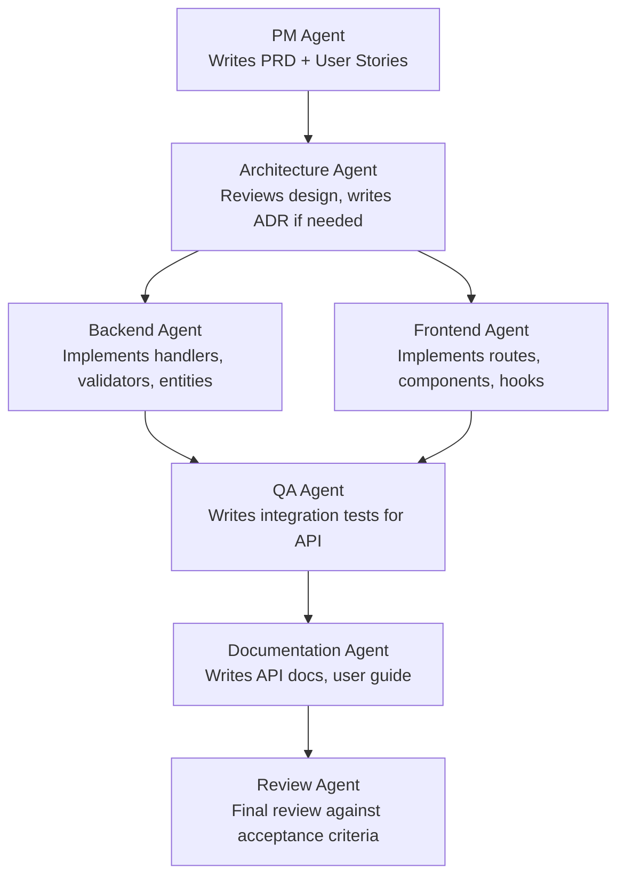

# Multi-Agent Collaboration Patterns

Complex software features cannot be well-implemented by a single AI agent. A feature that requires backend handlers, frontend components, API documentation, tests, and a migration is better served by specialized agents working in coordination than by one agent doing all of it with divided attention. Multi-agent collaboration is how Aurigo engineering handles feature work of any meaningful size.

This document covers how multiple agents collaborate: the models for agent communication, how information passes between agents, how to avoid duplication and conflicts, and the specific collaboration patterns used in Aurigo's workflows.

---

## The Full Feature Collaboration Model

For a complete feature implementation — from requirements to shipped code — the collaboration chain looks like this:



**PM Agent:** Given the feature brief, writes the user stories with acceptance criteria. Does not make technical decisions — surfaces ambiguities as questions for the human PM to resolve.

**Architecture Agent:** Reviews the design against existing ADRs and the playbook. If new patterns are required, drafts an ADR for human approval. Produces the implementation plan that Backend and Frontend agents will follow.

**Backend Agent and Frontend Agent (parallel):** Each works on its non-overlapping file set simultaneously. They share the implementation plan from the Architecture Agent. They do not interact directly with each other.

**QA Agent:** Reviews the implemented code, reads the acceptance criteria, and writes the test suite. The QA Agent works after implementation is complete — not during. This sequencing ensures tests are written against real code, not against an imagined implementation.

**Documentation Agent:** Reads the implemented code and the acceptance criteria. Writes API documentation (Swagger XML comments), endpoint reference markdown, and the user guide entry for the new feature.

**Review Agent:** Performs the final pass. Reads all produced artifacts — code, tests, documentation — against the original acceptance criteria. Produces a pass/fail report. If the review identifies issues, those issues are routed back to the appropriate agent for correction.

---

## Information Handoff Between Agents

Agents pass context through files, not conversation. This is a critical design principle. Conversation-based handoffs do not persist and cannot be reviewed. File-based handoffs are durable, reviewable, and shareable across agents and sessions.

**The handoff chain:**

1. PM Agent writes stories to: `docs/stories/sprint-[N]/[story-id].md`
2. Architecture Agent writes the implementation plan to: `docs/implementation-plans/[feature-name].md`
3. Backend Agent reads the implementation plan, writes code to the standard locations
4. Frontend Agent reads the implementation plan, writes code to the standard locations
5. QA Agent reads the code and the implementation plan, writes tests to the standard test locations
6. Documentation Agent reads the code and the stories, writes docs to `docs/api/` and `docs/user-guide/`
7. Review Agent reads all artifacts, writes the review report to: `docs/reviews/[feature-name]-review.md`

Each agent in the chain knows exactly where to find the input from the previous stage and where to place its output.

**Implementation plan format:**
The Architecture Agent's implementation plan is the central handoff document. It must contain:

```markdown
# Implementation Plan: [Feature Name]

## Backend Changes
### New Files
- `[file path]` — [what it does]
- `[file path]` — [what it does]

### Modified Files
- `[file path]` — [what changes are needed and why]

### Database Changes
- [Migration description: new tables, new columns, new indexes]

## Frontend Changes
### New Files
- `[file path]` — [what it does]
- `[file path]` — [what it does]

### Modified Files
- `[file path]` — [what changes are needed and why]

## API Contract
### New Endpoints
- `[METHOD] [path]` — [description, request shape, response shape]

### Modified Endpoints
- `[METHOD] [path]` — [what changes, backward compatibility status]

## Patterns to Follow
- Backend: follow [specific reference file]
- Frontend: follow [specific reference file]

## Constraints
- [Anything that is out of scope for this implementation]
- [Multi-tenancy considerations]
- [Security requirements]
```

---

## Avoiding Duplication and Conflicts

When multiple agents run in parallel, they must have non-overlapping file sets. If two agents write to the same file simultaneously, one will overwrite the other.

**File assignment rules:**

*Backend Agent scope:*
- All files under `src/[].Application/`
- All files under `src/[].Domain/`
- All files under `src/[].Infrastructure/`
- Migration files
- Controller files in `src/[].Api/Controllers/`

*Frontend Agent scope:*
- All files under `frontend/src/routes/`
- All files under `frontend/src/features/`
- All files under `frontend/src/components/`
- All files under `frontend/src/api/` (if modifying the API client)

*QA Agent scope:*
- All files under `tests/`
- All files under `frontend/src/__tests__/` or co-located test files

*Documentation Agent scope:*
- All files under `docs/api/`
- All files under `docs/user-guide/`
- Swagger XML comments in controller files (but only the XML comment sections, not the method implementations)

When an agent needs to modify a file outside its assigned scope — for example, if the Backend Agent notices a needed change in the frontend API client — it should document the needed change in its output notes, not make the change itself. The human engineer or the appropriate specialized agent handles cross-scope changes.

---

## Conflict Resolution Between Agents

Sometimes two agents produce conflicting implementations even when working on non-overlapping file sets. A common example: the Backend Agent designs an API response shape that the Frontend Agent's assumptions about the API shape do not match.

**Detection:** The Review Agent catches this. In the review pass, the Review Agent checks that the API contract documented in the implementation plan matches both the backend implementation and the frontend integration.

**Resolution process:**
1. The Review Agent documents the conflict in its review report
2. The human engineer reads the conflict description
3. The engineer decides which implementation is correct (or designs a synthesis)
4. The decision is noted in the implementation plan as a correction
5. The affected agent(s) are given a correction prompt to bring their implementation into alignment
6. The Review Agent runs again on the corrected output

**Prevention:** The most effective prevention is a high-quality implementation plan that specifies the API contract exactly — request and response DTOs with field names and types. When both agents are working from the same API specification, conflicts are rare.

---

## Sequential vs. Parallel Agents

**Use sequential agents when:**
- Agent B's work depends on Agent A's output (e.g., QA Agent needs the code to be written before it can test it)
- The task is simple enough that a single agent is sufficient
- The risk of conflicts from parallel work outweighs the time savings

**Use parallel agents when:**
- Agents are working on non-overlapping file sets (backend + frontend)
- Each agent's work is well-specified enough to proceed independently
- The feature is large enough that the time savings are significant

**Never use parallel agents when:**
- Both agents would write to the same files — this guarantees a conflict
- One agent's output changes the requirements for the other agent
- The implementation plan is not finalized — parallel agents working from different assumptions produce conflicting results

---

## The Supervisor Pattern

For very large features (5+ stories, multiple modules, 3+ agents), a Supervisor Agent can coordinate the work.

**Supervisor responsibilities:**
1. Read the full set of stories and the implementation plan
2. Decompose the work into sub-tasks with clear file ownership
3. Spawn the appropriate specialized agents with focused prompts
4. Review each agent's output for completeness and quality
5. Identify and route conflicts to the human engineer
6. Track overall progress and flag blockers

**Supervisor prompt structure:**
```
You are the Engineering Manager for this feature implementation.

## Your Task
Coordinate the implementation of [feature name]. You have these sub-tasks:

1. [Backend task] — spawn a Backend Implementation Agent for this
2. [Frontend task] — spawn a Frontend Implementation Agent for this
3. [Test task] — spawn a QA Agent for this (after 1 and 2 complete)
4. [Documentation task] — spawn a Documentation Agent for this (after 1 and 2 complete)

## File Ownership
[Assign each agent a non-overlapping set of files]

## Implementation Plan Reference
Read: docs/implementation-plans/[feature-name].md

## Your Deliverable
After all sub-agents complete, produce a summary:
- What was implemented
- What was not completed
- What issues or conflicts need human resolution
- Recommended next steps
```

**Supervisor limitations:** The Supervisor Agent adds coordination overhead. For small features (1-2 stories), the overhead is not worth it. Use the Supervisor pattern only when the feature is large enough that coordination risk (agents working on conflicting assumptions) exceeds the coordination cost.

---

## Communication Protocol Reference

The following table summarizes the communication protocol for multi-agent collaboration at Aurigo.

| Communication Need | Method | Location |
|-------------------|--------|----------|
| Feature requirements | User story file | `docs/stories/sprint-N/story-id.md` |
| Implementation design | Implementation plan file | `docs/implementation-plans/feature-name.md` |
| API contract | Implementation plan + Swagger | Implementation plan file |
| Review findings | Review report file | `docs/reviews/feature-name-review.md` |
| Corrections | Correction note in implementation plan | Implementation plan file |
| Session-to-session context | Memory files | `~/.claude/projects/[hash]/memory/` |
| Cross-agent corrections | Feedback memory file | `~/.claude/projects/[hash]/memory/feedback_*.md` |

Agents never communicate by talking to each other conversationally. All communication is through durable, reviewable files. This ensures the human engineer has a complete record of what was decided, why, and by whom (or which agent).
