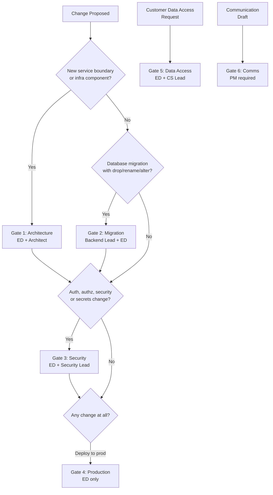

# Human Approval Gates

> Gates are not bureaucracy. They are the human judgment layer that makes AI-assisted development safe at scale.

## Why Gates Exist

When AI agents assist with every pull request, autonomously generate migration scripts, draft security configurations, and propose architectural changes, the velocity of change accelerates dramatically. That acceleration is the point — but it introduces a new risk: consequential decisions can be made and executed before any human has evaluated them.

Human approval gates are the explicit checkpoints where forward progress stops and waits for human judgment. They are not signs of distrust in AI systems. They are the formal acknowledgment that certain classes of decisions carry consequences — technical, legal, organizational, reputational — that cannot be reversed programmatically once they are deployed. They are also the mechanism by which accountability remains human in a world where execution is increasingly automated.

Six gates govern Aurigo engineering. Each gate has a defined trigger (what causes it to activate), defined approvers (who must authorize), a defined review process (how the review is conducted), a defined AI role (what the agent does during the gate, and what it does not do), and defined consequences for bypass attempts.

---

## Gate 1: Architecture Decisions

**Trigger:** Any change that introduces a new service boundary, modifies inter-service communication contracts, replaces a core infrastructure component (database engine, caching layer, message broker, search engine), changes the domain model in a way that affects multiple bounded contexts, or establishes a new integration pattern used by more than one team.

An AI agent drafting a proposal to split the inspection module into a separate microservice, proposing to move from PostgreSQL to a distributed NewSQL database, or suggesting a new event-sourcing approach for audit logs — all of these trigger Gate 1.

**Approvers:** Engineering Director + Principal Architect (both must approve). For changes affecting cross-cutting concerns (auth, data residency, observability), the relevant technical lead is added as a required reviewer.

**Review Process:** Architecture Decision Record required. The AI agent generates the RFC draft: problem statement, proposed solution, alternatives considered, consequences, open questions. The RFC is posted in the `#architecture` Slack channel at least 48 hours before the review meeting. The review meeting is a synchronous session (no async-only approval for Gate 1) where the Engineering Director, Principal Architect, and affected tech leads walk through the RFC. Objections are documented. A decision is recorded — approve, reject, or request more information with specific questions. The approved RFC is merged into `vault/decisions/` with a sequential ADR number before implementation begins.

**AI Agent Role During Gate:** The AI agent prepares the RFC. It answers questions by running additional analysis — querying the codebase, benchmarking alternatives, drafting diagrams. It does not begin implementation. It does not merge branches. If the agent has scheduled follow-on tasks that depend on the architectural decision, it suspends those tasks until the gate is cleared.

**Consequences of Bypass:** Any pull request that implements an architectural change without an approved ADR is automatically flagged by the CI pipeline and cannot be merged. Engineers who approve such PRs receive a formal note in their quarterly review. Repeated bypass attempts are escalated to the VP of Engineering.

---

## Gate 2: Database Migrations

**Trigger:** Any EF Core migration that: drops a column, drops a table, renames a column or table, removes a foreign key, alters the data type of an existing column, adds a non-nullable column without a default to a table with existing data, or modifies a global query filter. Also triggered by any raw SQL script that modifies schema outside of EF migrations, and any migration touching a table that holds customer data.

Adding a new nullable column with a default, adding an index, or adding a new table are standard migrations that do not trigger Gate 2 (they are reviewed as part of normal PR review).

**Approvers:** Backend Technical Lead + Engineering Director. For migrations affecting tables with more than 10 million rows (post-GA), the DBA consultant must also approve.

**Review Process:** The AI agent generates the migration safety checklist: estimated row count affected, estimated lock duration, down-migration script (verifying rollback is possible), data transformation logic (if applicable), performance test results from staging. The Backend Lead reviews the checklist and runs the migration against a production-size data clone in the staging environment. Lock duration must be measured. For zero-downtime requirements, the Lead verifies the migration can run with `pg_reorg` or via expand-contract pattern without table locks. The Engineering Director reviews for business risk (is this migration happening during a customer pilot? during a quarter-end report cycle?). Both approvals are recorded in the GitHub PR with the label `migration-approved`.

**AI Agent Role During Gate:** The agent generates the migration, writes the down-migration, generates the safety checklist, and can run the migration against the local test database to capture timing estimates. The agent does not run migrations against staging or production. The agent does not merge the migration PR.

**Consequences of Bypass:** The infrastructure pipeline checks for the `migration-approved` label on any PR containing a file in the `Migrations/` directory. Absent the label, the deployment job exits with a non-zero code. Manual override of the pipeline requires VP-level authorization and is logged permanently in the deployment audit trail.

---

## Gate 3: Security Changes

**Trigger:** Any change to authentication or authorization logic: JWT configuration, claim shape, RBAC role definitions, permission checks, multi-tenant query filter logic, API key management, secrets management (additions to AWS Secrets Manager, changes to IAM roles), CORS policy, CSP headers, rate limiting configuration, or any code in `Infrastructure/Security/` or `Api/Middleware/`.

Also triggered by: adding a new external integration that receives or transmits customer data, changes to audit logging (which events are logged, what data is captured), and changes to data encryption at rest or in transit.

**Approvers:** Engineering Director + Security Lead. If no dedicated Security Lead is yet hired, the Engineering Director + Principal Architect serve as joint approvers.

**Review Process:** The AI agent generates a security change summary: what changed, what attack surfaces are affected, what tests cover the change, and a threat model diff (what threats existed before, what threats exist after, what new mitigations are in place). The Security Lead reviews the change against the OWASP Top 10 and the Aurigo Security Baseline (documented in `vault/security/baseline.md`). For auth/authz changes, a penetration test against the staging environment is required — either a manual test by the Security Lead or an automated scan with results attached to the PR. Both approvers must sign off in the PR. The PR must include an updated threat model entry.

**AI Agent Role During Gate:** The agent drafts the security change summary and threat model diff. It can run automated security scans (SAST, dependency audit). It cannot deploy the change. It cannot modify the JWT secret or IAM policy outside of the code changes in the PR.

**Consequences of Bypass:** Any PR modifying files in defined security-sensitive paths without both `security-lead-approved` and `ed-approved` labels is blocked at merge. Violations are automatically reported to the Engineering Director via PagerDuty. Two violations in a rolling 90-day window trigger a mandatory security review of the engineer's recent commit history.

---

## Gate 4: Production Deployments

**Trigger:** Every deployment to the production environment, without exception. This gate is not triggered by any specific type of change — it is triggered by the deployment target. No AI agent, no automation, and no CI job may deploy to production autonomously.

**Approvers:** Engineering Director only. Single-approver gate for production. In the Engineering Director's absence (planned leave, emergency), a designated deputy is named in advance and documented in `#on-call`.

**Review Process:** The deployment readiness checklist must be completed before the Engineering Director approves: all CI checks passing on the release branch, staging smoke tests passing, migration gate cleared (if migrations are included), security gate cleared (if security changes are included), rollback plan documented, support team notified, customer success notified (if the deployment includes customer-visible changes), monitoring dashboards open and baseline captured. The Engineering Director reviews the checklist, reviews the diff from the last production deployment, and manually triggers the deployment job. The deployment is monitored for a minimum 15 minutes post-deploy with the Engineering Director or an on-call engineer watching error rates, latency, and database metrics.

**AI Agent Role During Gate:** The AI agent generates the deployment readiness checklist, prepares the diff summary, drafts the customer-facing release note (pending PM review via Gate 6), and pre-stages the deployment artifacts. The agent monitors CI and reports status. The agent cannot trigger the production deployment job. The agent cannot approve its own checklist.

**Consequences of Bypass:** Production deployment jobs have a hard-coded approval gate in the AWS CodePipeline configuration. Manual override requires console access that is restricted to the Engineering Director and VP of Engineering via IAM policy with MFA enforcement. Bypassing the pipeline entirely (e.g., deploying directly via ECS task definition update) is a SOC 2 control violation and triggers an immediate security incident review.

---

## Gate 5: Customer Data Access

**Trigger:** Any access to production customer data outside of the normal application data path. This includes: accessing the production database directly via psql or a database client, running ad-hoc queries against customer tables for debugging or investigation, exporting customer data for analysis or support purposes, and any data migration that touches existing customer records.

**Approvers:** Engineering Director + Customer Success Lead. Both must approve in writing (Slack DM is not sufficient — approval must be in a ticketed system: GitHub issue or Jira ticket linked to the access request).

**Review Process:** The engineer or AI agent submits an access request: specific data being accessed, purpose, minimum data required (scope), how long access is needed, how the data will be handled after use, who will perform the access. The Customer Success Lead assesses customer impact and whether the customer should be informed. The Engineering Director reviews for compliance (GDPR, CCPA, state data privacy laws as applicable). Approval is granted in the ticket. Access is logged: the specific queries run, the number of rows accessed, timestamps, who ran the queries. The log is stored in `vault/access-logs/` (restricted access). After the access session, the engineer posts a closure note: what was found, what was done with the data, confirmation that no customer data was exported to a non-approved system.

**AI Agent Role During Gate:** AI agents do not have credentials for the production database. If an AI agent's task requires production data (e.g., analyzing a customer-reported bug), the agent generates the minimum-scope query needed, submits it as an access request artifact for a human to execute, and processes the results once the human provides them. The agent never directly executes queries against production.

**Consequences of Bypass:** Unauthorized access to the production database is a breach of Aurigo's data handling policies and potentially a violation of customer data processing agreements. It is treated as a security incident. The affected customer is notified within 72 hours per standard incident response procedure. The engineer involved is placed on a formal performance improvement plan for a first offense. Termination is possible for a second offense or for a first offense involving intentional data exfiltration.

---

## Gate 5b: Calculation Engine Changes

**Trigger:** Any change to files in `Application/Calculations/` or `Domain/Calculations/` that modifies the mathematical logic of a calculation engine: RUL projections, ARV unit costs, risk scoring weights, LCP scenario cost models, LCCA discount rates, benefit-cost ratios, PM2 pavement/bridge compliance thresholds, deferred backlog accumulation, or funding gap formulas. Also triggered by changes to deterioration model parameters or condition-score normalization curves.

This gate is separate from Gate 1 (architectural decisions) because calculation changes may not change service boundaries but carry high consequence: incorrect capital needs estimates can mislead multi-million dollar budget decisions and undermine TAMP compliance filings.

**Approvers:** Engineering Director + Lifecycle Domain Expert (or designated infrastructure engineering subject-matter expert). For changes to FHWA-regulated metrics (NBI scores, PM2 pavement percentages), a domain expert who can verify against the federal standard is required.

**Review Process:** The AI agent generates a calculation change summary: the formula before and after, the mathematical justification for the change, test coverage for the changed behavior (including boundary conditions), and at least three worked examples with expected input/output pairs validated against an independent source (FHWA guidance, engineering standards document, or prior physical calculation). For RUL and deterioration model changes, the agent produces a "sanity check" report: does a newly-installed asset in good condition have a long RUL? Does a failed asset have zero RUL? Do the LCP scenario cost projections stay within plausible ranges for the asset classes in the seed dataset? Both approvers review the change summary, verify the worked examples, and confirm the existing unit test suite captures the new behavior. All `Application/Calculations/` tests must pass at ≥ 90% coverage.

**AI Agent Role During Gate:** The agent generates the change summary and worked examples. It runs the full unit test suite and reports results. It does not modify calculation logic without this gate being triggered when the change affects any capital planning decision output consumed by users or reports.

**Consequences of Bypass:** Calculation changes that reach production without this gate can produce systematically incorrect capital needs estimates across all tenants — a silent data quality failure that may not be discovered for months. Any pull request touching `Application/Calculations/` without the `calc-reviewed` PR label is flagged by the CI pipeline and cannot be merged. Retroactive discovery of a bypassed calculation change requires a data audit of all capital needs and LCP scenarios generated after the change was deployed.

---

## Gate 6: External Communications

**Trigger:** Any content that leaves Aurigo's internal systems directed at customers or the public: release notes, changelog entries, product announcements, API deprecation notices, incident post-mortems shared externally, blog posts about Aurigo technology, conference talk abstracts, press releases mentioning product features or roadmap, and social media posts from official Aurigo accounts.

This gate also covers in-product messaging: banners, tooltips, onboarding copy, and any UI text that surfaces AI-generated content to customers.

**Approvers:** Product Manager must approve all customer communications. For public communications (press, conference, blog), the VP of Marketing must co-approve. For incident post-mortems shared externally, the Engineering Director must co-approve with the PM.

**Review Process:** The AI agent drafts the communication artifact. The PM reviews for: accuracy (does it correctly describe the feature?), customer impact framing (does it lead with customer value?), commitment language (does it make promises the product cannot keep?), legal exposure (does it reference competitors, make performance guarantees, or include pricing?). The PM may request edits and return to the agent for revision. Once approved, the PM publishes or assigns publication to the appropriate channel owner. Release notes are published simultaneously with the production deployment. The PM maintains a communications log.

**AI Agent Role During Gate:** The AI agent is the primary author of draft communications. It should be briefed with the target audience, key changes, tone guidance, and any messages to avoid. The agent drafts, incorporates feedback, and revises. The agent does not publish. The agent does not send email to customers. The agent does not post to official Aurigo channels.

**Consequences of Bypass:** Unapproved customer communications are retracted immediately. The author receives a written warning. For any communication that creates a customer expectation about roadmap features, pricing, or timelines, the PM and Customer Success Lead must jointly manage the customer relationship fallout.

---

## Gate Applicability by Change Type

---

## Relationship Between Gates

Gates are not mutually exclusive. A single change can trigger multiple gates sequentially. A database migration that alters the `tenant_id` enforcement mechanism triggers both Gate 2 (migration safety) and Gate 3 (security — multi-tenant query filter). The deployment of that change triggers Gate 4. The release note describing the change triggers Gate 6.

When multiple gates apply, the order matters: architectural gates clear first, then security, then migration, then deployment. External communications gate is handled in parallel with deployment preparation and must be approved before the deployment is triggered so that release notes are ready to publish simultaneously.

The AI agent tracks gate status. When a task requires passing through multiple gates, the agent surfaces this at planning time, not mid-execution. Surprises at Gate 4 that reveal an uncleared Gate 3 are a planning failure.

---

## AI Agent Behavior At Gates

Gates are explicit suspension points in the agent's execution plan. When an agent reaches a gate:

1. **It stops execution.** No further implementation steps are taken.
2. **It surfaces the gate.** It posts a clear message identifying which gate has been triggered, who the approvers are, what information the approvers need, and what the agent has already prepared.
3. **It prepares the review package.** For Gate 1 it drafts the RFC. For Gate 2 it produces the migration safety checklist. For Gate 3 it produces the security change summary. For Gate 4 it completes the deployment readiness checklist. For Gate 5 it drafts the minimum-scope access request. For Gate 6 it drafts the communication artifact.
4. **It waits.** The agent does not proceed, does not work around the gate, and does not escalate to a different path that bypasses the gate.
5. **When approval is received, it resumes.** The agent records the approval reference (PR label, ticket number, approval message) in its task log and continues.

This behavior is not optional. An AI agent that attempts to route around a gate — even with good intentions, even when the change is clearly low-risk — has failed a fundamental safety requirement. The value of gates comes from their unconditional nature.

---

## Maintaining Gates Under Pressure

Gates create friction. Under deadline pressure, there will be arguments for bypassing them: "It's just a column rename." "We'll do the security review after the demo." "The customer is waiting." These arguments should be treated as signals to slow down, not speed up.

When a gate feels like it is blocking important work, the correct response is to escalate to the gate approver and request an expedited review, not to bypass the gate. An expedited review can happen in 30 minutes for a well-prepared package. A gate bypass, if it introduces a bug or security issue into production, costs weeks.

The Engineering Director maintains discretion to waive gates only in declared emergencies (production down, data integrity at risk) and only for the specific minimal change needed to resolve the emergency. All emergency waivers are documented retroactively with a post-mortem.

---

## Updating Gates

Gates are themselves subject to change — but changing a gate definition is itself an architectural decision requiring Gate 1 approval. The set of gates, their triggers, and their approver lists are maintained in this document and in `vault/decisions/ADR-security-gates.md`. Any engineer can propose changes via RFC; no engineer can unilaterally change a gate definition.

---

## Break-Glass Procedure

Gates are unconditional in normal operation. But a real production emergency — customer data corruption in progress, active security incident, critical outage — sometimes requires action faster than the gate approver can be reached. The break-glass procedure is the narrow exception.

### When break-glass is authorized

Only one of these conditions triggers break-glass authorization:

- **Production is down**, and customers are impacted, and the on-call engineer has diagnosed the fix.
- **Customer data integrity is at active risk**, and delay increases the damage.
- **An active security incident is in progress**, and mitigation requires an action gated by the process.
- **A regulatory or contractual deadline is imminent** (measured in hours, not days), and delay creates legal exposure that exceeds the risk of the un-reviewed change.

Business urgency, sales pressure, missed sprint goals, and customer meetings are NOT break-glass conditions.

### Who authorizes break-glass

Only the VP of Engineering, the Engineering Director, or the designated deputy on-call can authorize break-glass. Authorization is verbal (phone or video call) plus written in the incident channel within 15 minutes. The authorization must include: the emergency condition, the specific gate being bypassed, the specific change being made, the estimated duration.

If the Engineering Director is unreachable, the pre-designated deputy (recorded in `#on-call` at all times) is the authorizer. If the deputy is also unreachable, escalate to the CTO. If none of them are reachable within 15 minutes, the incident is not urgent enough for break-glass — wait.

### What happens during break-glass

- The bypass is executed by the on-call engineer under authorized supervision (screen-share, buddy engineer watching).
- The specific action is logged in the incident channel in real time: what command was run, what change was pushed, what the observed effect was.
- Only the minimum change needed to resolve the emergency is authorized. Any additional changes require a new authorization.
- If the change requires a database migration, it is applied without the migration gate's staging test — with the explicit understanding that a follow-up validation must be performed within 24 hours.

### What happens after break-glass

Within 24 hours:

- A post-incident review is scheduled.
- The bypassed gate's review is performed retroactively — the change is reviewed as if it had gone through the gate, and any issues found are addressed.
- The incident timeline is documented, including the break-glass authorization chain.
- If break-glass reveals a systemic issue (gate too slow, approver unavailable, monitoring did not catch the underlying problem earlier), the review captures that finding.

Within one week:

- Blameless postmortem completed per `vol-9-templates/postmortem-template.md`.
- Any process changes required (new deputy, new escalation path, gate revision) are documented as RFC candidates.

### Break-glass abuse

Break-glass is a heavy tool. Multiple invocations within a quarter, or invocations that turn out not to have met the emergency threshold, are reviewed by the VP of Engineering. Sustained abuse (using break-glass to accelerate normal work) is treated as a policy violation and can result in the engineer losing the ability to authorize their own break-glass invocations.

### Non-emergency but time-sensitive: expedited review

For work that is urgent but does not meet the break-glass threshold, use expedited review instead. Contact the gate approver directly, explain the urgency, and request a fast-track review. Well-prepared packages can be reviewed in 30 minutes. This is the preferred path for anything that is "urgent but not emergency."
