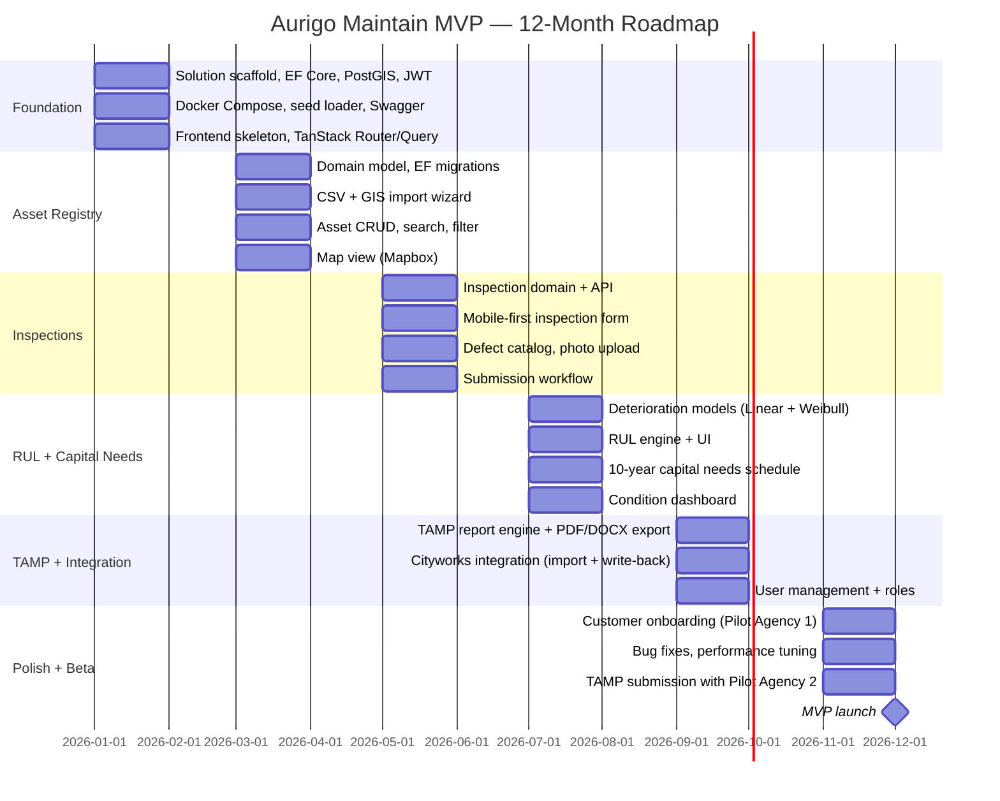

# MVP Roadmap — Aurigo Maintain

## What Is the MVP?

The Maintain MVP is the minimum product that delivers meaningful, standalone value to a US State DOT or county public works department managing a portfolio of civil infrastructure assets. Meaningful value means: a transportation agency can import its existing asset registry, record inspection results, see deteriorating assets, generate a 10-year capital needs schedule, and produce a draft TAMP (Transportation Asset Management Plan) that satisfies federal FHWA requirements — all without switching platforms mid-workflow.

The MVP is not a demo. It is not a proof of concept. It is a product a real agency could use in production and that Aurigo could support. It is the minimum scope that justifies a paying customer relationship.

The MVP is scoped for two asset classes: pavements and bridges. These are the two asset classes federally mandated in TAMP reporting for NHS (National Highway System) agencies. Starting here anchors the product to regulatory compliance — the strongest forcing function in public sector procurement.

---

## MVP Scope

### Included

**Asset Registry**
- Import from CSV (standard column mapping wizard) and GIS shapefile/GeoJSON (geometry preserved, attributes mapped)
- Manual asset entry with guided form (asset class, location, dimensions, classification)
- Asset classification hierarchy: asset class → asset subtype → component (e.g., Pavement → Flexible → Surface Course)
- Asset record: geospatial location (point, line, or polygon), physical attributes (dimensions, material, year constructed), administrative attributes (owner, district, funding source, NHS designation)
- Asset search and filter (by class, condition, district, year)
- Bulk edit (assign district, funding source, inspector to multiple assets)
- Asset detail page with inspection history, condition trend chart, and capital plan entries

**Inspection Recording**
- Mobile-first web inspection form (iOS Safari and Android Chrome — no native app at MVP)
- Condition rating 0–5 (whole number and decimal per component, per PASER and NBI conventions)
- Defect catalog: per asset class, predefined defect codes with severity levels
- Photo capture and upload per defect (stored in S3, displayed in asset record)
- Inspector notes (free text per component)
- Inspection submission workflow: draft → submitted → reviewed → approved
- Inspection history list per asset with date, inspector, overall condition score

**Condition Dashboard**
- Portfolio-level condition distribution chart (count of assets by condition band: good 4–5, fair 2–3, poor 0–1)
- Map view: assets colored by current condition
- Trend chart: portfolio average condition over time (requires at least two inspection cycles)
- Filter by asset class, district, date range
- Drill-down from dashboard to asset list to asset detail

**Deterioration Modeling**
- Linear deterioration model: condition declines at a constant rate per year, configurable per asset subtype
- Weibull survival model: condition as a function of age and asset-class-specific shape/scale parameters
- Model selection per asset subtype: Linear or Weibull
- Default parameters seeded from FHWA and AASHTO published research for pavements and bridges
- Model parameters configurable per tenant (customization for local conditions)
- Visual deterioration curve preview when configuring parameters

**Remaining Useful Life (RUL) Calculation**
- RUL calculated per asset based on current condition, deterioration model, and configurable intervention threshold
- Threshold configurable per asset class: "replace when condition drops below X"
- RUL displayed on asset detail page: years to replacement, projected replacement year, projected condition at replacement
- Portfolio-level RUL distribution (histogram of years-to-replacement)
- RUL recalculates automatically when a new inspection is recorded

**Capital Needs — 10-Year Schedule**
- Capital needs schedule generated per asset: projected intervention year, estimated unit cost (cost per square foot/linear foot/square meter by asset class, configurable), estimated total replacement cost
- Portfolio-level 10-year capital needs: annual spending requirement to maintain assets at or above threshold condition
- Capital needs table exportable to CSV and PDF
- "What-if" funding scenario: enter available annual budget, see which assets get funded vs unfunded (priority: worst-condition assets first by default)
- Unfunded assets flagged with projected condition at end of 10-year period

**TAMP Report**
- Federal-format TAMP summary for pavements and bridges (FHWA MAP-21/BIL compliance)
- TAMP sections: executive summary, asset inventory summary, condition assessment, deterioration forecast, investment strategy, performance targets
- Narrative text generated from data (template-based, AI-assisted in later phases)
- Pavement condition metrics: IRI (International Roughness Index) distribution, % in good/fair/poor
- Bridge condition metrics: NBI condition ratings, sufficiency rating distribution
- Performance gap analysis: current condition vs federal minimum condition standards
- Export to PDF and Word (DOCX) for submission
- Audit trail: which inspection data and model parameters were used to generate each TAMP (reproducibility)

**User Management**
- Multi-tenant: each agency is an isolated tenant, data never crosses tenant boundaries
- Roles: Agency Admin, Asset Manager, Field Inspector, Read-Only Viewer
- Agency Admin: manages users, configures asset classes, sets model parameters
- Asset Manager: full read/write on assets, inspections, capital plans, TAMP
- Field Inspector: creates and submits inspections, read-only on capital plans and TAMP
- Read-Only Viewer: read-only on all data, no exports
- JWT authentication (Aurigo lambda-authorizer claim shape)
- User invitation by email
- Audit log: who changed what and when (automatic via EF interceptor)

**EAM Integration — Cityworks Integrated Mode**
- One-way sync: asset records imported from Cityworks AMS (Asset Management System)
- Sync schedule: nightly batch import of new and updated assets
- Field mapping configuration: map Cityworks asset types and attributes to Maintain classification hierarchy
- Sync log: record of each sync run, count imported, errors
- Manual trigger: Agency Admin can trigger an immediate sync
- Assets imported from Cityworks are flagged with their Cityworks ID for traceability
- Write-back: capital plan interventions exported back to Cityworks as work order requests (one-way push)

---

### Explicitly Not in MVP Scope

- Native iOS or Android mobile apps (mobile web only)
- Asset classes beyond pavements and bridges
- Advanced TAMP for all asset classes
- Risk scoring (probability × consequence matrix)
- Capital plan optimization (budget scenario modeling with multi-variable optimization)
- Maximo, SAP, or any EAM integration other than Cityworks
- Work order management
- Preventive maintenance scheduling
- Parts, inventory, or vendor management
- Warranty tracking
- AI condition prediction from photos
- Natural language query interface
- Multi-jurisdiction rollup views
- Custom deterioration model calibration (only default parameter adjustment)
- SSO (SAML/OIDC) — username/password + JWT only
- SOC 2 certification
- Data residency options
- Self-service trial

---

## Success Criteria

The MVP is successful when all five of the following are measurably achieved:

1. **At least two paying customers** from the public sector (State DOT or county government) are live in production, having imported their real asset data and completed at least one full inspection cycle.

2. **TAMP export accepted** by at least one customer as the basis for their actual FHWA submission (not just used internally — actually submitted to FHWA, even if the customer does final edits).

3. **Field inspectors use the mobile web interface** for at least 80% of inspections at a live customer (not reverting to paper or spreadsheet and back-entering).

4. **10-year capital needs schedule** produced by the system matches within 15% of the figure independently calculated by the customer's own staff (regression test of model accuracy against known ground truth).

5. **Zero critical data loss incidents** in the first 90 days of production operation for any live customer.

---

## Timeline — 12-Month Phase Plan

### Month 1–2: Foundation

The .NET 8 solution scaffold is established: Clean Architecture project structure, EF Core 8 with Npgsql and NetTopologySuite, JWT middleware reusing the Aurigo lambda-authorizer claim shape, Swagger/OpenAPI, and Docker Compose for local Postgres + PostGIS. The React 18 + Vite + TypeScript frontend is initialized with TanStack Router, TanStack Query, Tailwind CSS, and shadcn/ui. CI/CD pipeline established (GitHub Actions → AWS ECS). The seed data loader is implemented so the team can work with representative data throughout development.

### Month 3–4: Asset Registry

The asset domain model is designed and migrated. CSV and GIS import wizards are built — this is the highest-friction onboarding step for agencies that have their data in ArcGIS or spreadsheets, and getting it right early prevents technical debt. Asset CRUD, search, filter, and the Mapbox-based map view are built and usable by end of month 4.

### Month 5–6: Inspections

The inspection domain and API are built. The mobile-first inspection form is the most UX-intensive work in the MVP — it must work reliably on a phone in the field without full connectivity. The defect catalog, photo capture and upload, and the submission workflow (draft → submitted → reviewed → approved) are all completed. By end of month 6 a field inspector can complete a full inspection of a pavement segment or bridge on their phone.

### Month 7–8: RUL + Capital Needs

The calculation engines are built: linear deterioration, Weibull survival model, RUL calculation. These are pure C# engines with no DB access, fully unit-tested. The 10-year capital needs schedule is generated. The condition dashboard is built. By end of month 8 an asset manager can see every asset in their portfolio, its RUL, and what it will cost to maintain the network over 10 years.

### Month 9–10: TAMP + Integration

The TAMP report engine is built — it pulls from the asset registry, inspection history, deterioration models, and capital needs schedule to generate the federal-format document. The Cityworks integration (nightly import + write-back of interventions) is built. User management with roles is completed. By end of month 10 the product is functionally complete for MVP scope.

### Month 11–12: Polish + Beta

The first pilot agency onboards. Real data is imported. Field inspectors are trained. The first full inspection cycle runs. Bugs are fixed. Performance is tuned under real data volumes. A second pilot agency targets TAMP submission. The MVP is formally launched at end of month 12.

---

## Dependencies and Risks

**AWS Infrastructure:** ECS cluster, RDS Postgres, S3, CloudFront, and API Gateway integration must be provisioned by month 2. Delay here blocks all downstream development.

**Cityworks API Access:** Integration requires a Cityworks sandbox and API credentials from a customer or Cityworks directly. If not available by month 8, the integration moves to Beta and the MVP ships without it.

**Pilot Agency Availability:** The success criteria require real customers. Pilot agency procurement cycles are 60–90 days. Customer Success must begin procurement conversations by month 6 to have signed agreements by month 10.

**FHWA TAMP Format Stability:** The federal TAMP format is defined by MAP-21 and the BIL. If FHWA updates reporting requirements during development, the TAMP module will need updates. Monitor FHWA asset management guidance at least monthly.
