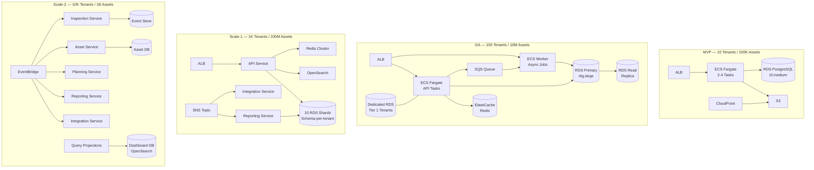

# Scalability Roadmap — Aurigo Maintain

## Design Philosophy

Scalability architecture should be earned, not speculative. The cost of premature optimization is paying for complexity you don't need: slower development, more failure modes, harder debugging, higher operational overhead. The cost of insufficient scalability is degraded customer experience and expensive emergency rearchitecting under pressure.

Maintain is designed with explicit scale milestones. At each milestone, specific architectural changes are made — not before they are needed, but also not after the system is already under stress. The milestones are based on customer count and data volume because these are the primary cost and complexity drivers for a multi-tenant infrastructure SaaS.

This document defines four scale milestones and the architectural evolution between them.

---

## Scale Targets

| Milestone | Tenants | Assets | Concurrent Users | Target Period |
|---|---|---|---|---|
| MVP | 10 | 100K | 100 | Launch |
| GA | 100 | 10M | 1,000 | ~36 months post-launch |
| Scale-1 | 1,000 | 100M | 10,000 | ~60 months post-launch |
| Scale-2 | 10,000 | 1B | 100,000 | ~84 months post-launch |

These are planning targets, not hard limits. The system should remain stable with 20% headroom above the target at each milestone before the next milestone architecture is needed.

---

## Milestone 1 — MVP Architecture

### What the Architecture Looks Like

The MVP architecture is a standard .NET 8 Web API deployed on AWS ECS Fargate, backed by a single Amazon RDS PostgreSQL 16 instance. All tenants share the same database (pool model), isolated by `tenant_id` row-level security enforced via EF Core global query filters. A single ECS service runs multiple Fargate tasks behind an Application Load Balancer. Static frontend assets are served from S3 via CloudFront.

The architecture is deliberately simple. There is one database. There is one application service. There is one cache (none — queries hit the database directly at MVP scale). There is one region. The simplicity enables fast iteration: there are fewer moving parts to configure, monitor, and debug.

### Components

- **Compute:** ECS Fargate, 2–4 tasks, t-shirt sizes: 1 vCPU / 2GB RAM per task. Auto-scaling based on CPU utilization (target 60%).
- **Database:** RDS PostgreSQL 16, db.t3.medium, Multi-AZ enabled (for HA, not for scale), 100GB GP3 storage with auto-scaling to 1TB.
- **Storage:** S3 for inspection photos and report exports. CloudFront CDN for the React frontend.
- **Auth:** AWS API Gateway + Aurigo lambda-authorizer. JWT validated at the gateway edge.
- **Observability:** CloudWatch for metrics and logs. CloudWatch Alarms for error rate and latency SLOs. X-Ray for distributed tracing.

### Performance Characteristics at MVP

- P99 API response time: < 500ms for standard CRUD operations
- Report generation (TAMP PDF): < 30 seconds for portfolios under 10K assets
- EAM sync jobs: nightly, run in ECS scheduled tasks, no impact on API availability
- Database connection pool: 20 connections per Fargate task, 80 total max (fits within RDS max_connections for t3.medium)

### Limitations That Are Acceptable at MVP

- No horizontal database scaling (single primary, one read replica for reporting queries)
- Report generation blocks if multiple customers generate TAMP simultaneously (queue not needed at 10 tenants)
- No Redis cache (database queries are fast enough at this data volume)
- No full-text search (ILIKE queries on PostgreSQL are sufficient at 100K assets)

---

## MVP → GA: Architecture Evolution

The transition from MVP to GA adds: read replicas, Redis caching, an async job queue, and the silo model for Tier 1 tenants.

### Pool Model Tenancy Formalization

At MVP the pool model is informal (a single EF query filter). At GA the pool model is formalized: each tenant gets a dedicated schema within a shared database cluster (PostgreSQL schema-per-tenant). This approach provides better data isolation than row-level security alone, enables per-tenant backup and restore, and makes it easier to migrate a tenant to a silo if they upgrade to a Tier 1 plan.

Schema-per-tenant requires EF Core to use dynamic schema names at runtime. Connection strings remain shared (pointing to the same RDS instance), but each query is prefixed with the tenant's schema name. Migration strategy: a master migration applies to all schemas in sequence. Tenant provisioning creates a new schema and runs all migrations against it.

### PostgreSQL Partitioning

At 10M assets across 100 tenants, some tables become large enough to benefit from partitioning. The `inspection_results` and `asset_conditions` tables are partitioned by `tenant_id` using PostgreSQL declarative partitioning (LIST partitioning). This ensures that queries scoped to a tenant scan only the tenant's partition, reducing index and heap scan costs significantly.

The `assets` table remains unpartitioned at GA scale (10M rows is manageable with proper indexing on `tenant_id` and composite indexes). At Scale-1 it will also be partitioned.

### Read Replicas

A single read replica is added to the RDS cluster at GA. The application layer routes read-heavy operations to the replica:
- All GET requests that do not require write-after-read consistency (asset list, inspection history, dashboard queries)
- Report generation queries (always run on the replica to avoid load on the primary during batch report jobs)
- EAM sync read operations

EF Core `UseQuerySplittingBehavior` is configured. The application's `DbContext` factory returns a read-only context (connected to the replica) for query-only operations and the standard context (primary) for command operations. CQRS lite — not full event sourcing, but command/query connection separation.

### Redis Cache

At GA, a Redis cluster (Amazon ElastiCache) is added for:
- Session/JWT claim cache (avoid re-calling the lambda-authorizer on every request)
- Dashboard aggregate cache (portfolio condition distribution, total asset count) — 5-minute TTL
- Tenant configuration cache (asset class definitions, deterioration model parameters) — 15-minute TTL
- NLQ intermediate results cache

Cache invalidation is event-driven: when an inspection is submitted or approved, the relevant dashboard aggregates are invalidated. Cache-aside pattern throughout.

### Async Job Queue — SQS + ECS Workers

Report generation (TAMP PDF, capital needs Excel), EAM sync, and bulk import are moved to an async job queue. The API accepts a request, enqueues a job in SQS, and returns a job ID. The client polls (or receives a webhook) when the job completes. A dedicated ECS worker service processes the queue.

This decouples report generation performance from API performance. 100 tenants generating TAMP reports simultaneously no longer impacts API P99 latency. Worker tasks scale based on SQS queue depth.

### Silo Model for Tier 1

The Terraform IaC is updated to support per-tenant RDS instance provisioning. Tier 1 tenants get a dedicated `db.r6g.large` RDS instance, a dedicated ECS task group, and an isolated S3 bucket. The application routes Tier 1 tenant requests to their dedicated database via a connection string resolver that uses tenant tier as the routing key.

---

## GA → Scale-1: Architecture Evolution

Scale-1 (1K tenants, 100M assets) requires extracting compute-intensive operations into separate services and implementing tenant-level database sharding.

### Extract Reporting Service

At Scale-1, report generation is heavy enough to warrant a dedicated microservice. The Reporting Service is a separate .NET 8 service that:
- Owns the report generation domain (TAMP, capital needs schedule, custom reports)
- Has its own ECS service and scaling policy (scales aggressively on queue depth)
- Uses read-only database connections to the replica layer
- Communicates with the main API via SQS (receives job requests) and SNS (publishes completion events)

Extracting reporting eliminates contention between report generation and API performance entirely. It also enables independent deployment and scaling of the reporting capability.

### Async Report Generation via SQS Fan-Out

The SQS queue is restructured as an SNS topic with SQS fan-out for different job types: report generation, EAM sync, bulk import, ML inference. Each queue has its own worker pool with independently configured concurrency limits. Report generation workers can scale to 50 concurrent tasks without impacting EAM sync throughput.

### Tenant-Level Database Partitioning

At 100M assets, the schema-per-tenant approach hits practical limits: PostgreSQL performance degrades with thousands of schemas. Scale-1 moves to a shard model: 10 RDS clusters (shards), each hosting 100 tenant schemas. Tenant-to-shard assignment is stored in a central routing table. The application's connection resolver maps `tenant_id` to the correct shard cluster.

Resharding (moving a tenant from one shard to another) is supported via a background migration job. Shards are sized to stay under 10TB of data.

### OpenSearch for Full-Text Search

At 100M assets, PostgreSQL ILIKE queries for asset search become unacceptably slow. Full-text search is extracted to OpenSearch (Amazon OpenSearch Service, successor to Elasticsearch). Asset records are indexed in OpenSearch on creation and update (via an SQS-triggered indexing worker). Queries that use free-text search route to OpenSearch; queries that use structured filters (condition, asset class, district) continue to route to PostgreSQL.

### ECS Auto-Scaling Maturity

At Scale-1, ECS auto-scaling uses multiple metrics simultaneously (CPU, memory, SQS queue depth for worker tasks, ALB request count per target for API tasks). Target tracking policies replace the simple CPU-based auto-scaling from MVP. Scheduled scaling (scale up before typical morning peak hours based on historical traffic patterns) supplements reactive auto-scaling.

---

## Scale-1 → Scale-2: Architecture Evolution

Scale-2 (10K tenants, 1B assets) represents a fundamental architectural shift. The monolithic .NET 8 API must be decomposed into microservices to allow independent scaling of hot paths (inspection recording, asset queries) from cold paths (TAMP generation, model training). Event sourcing is introduced for inspection records to support audit, replay, and stream processing.

### Full Microservices Decomposition

The Scale-2 architecture has five core services:

1. **Asset Service:** Owns asset registry CRUD, geospatial queries, classification hierarchy. High-read, low-write. Scales aggressively on read replicas.
2. **Inspection Service:** Owns inspection recording, submission workflow, photo management. Write-heavy during inspection campaigns. Scale with write sharding.
3. **Planning Service:** Owns RUL calculation, capital needs schedule, budget optimization. CPU-intensive batch operations. Scales on SageMaker for ML workloads.
4. **Reporting Service:** Owns TAMP generation, custom reports, data export. Async-only, scales on SQS queue depth.
5. **Integration Service:** Owns all EAM connectors, webhook delivery, public API. Stateless, scales horizontally.

Services communicate via event bus (Amazon EventBridge) for asynchronous workflows and gRPC for synchronous service-to-service calls. Each service owns its own database (bounded context isolation).

### Event Sourcing for Inspection Records

Inspection records are the highest-write, highest-compliance-requirement data in the system. At Scale-2, inspection recording is redesigned as an event-sourced system:
- Every inspection action (created, item-recorded, photo-attached, submitted, reviewed, approved) is an immutable event stored in an append-only event store (EventStoreDB or DynamoDB Streams)
- The current inspection state is a projection of the event stream
- Historical inspection state at any point in time can be reconstructed from events
- Event streams can be replayed to rebuild projections, feed ML training pipelines, or power audit queries

Event sourcing adds complexity — it is justified at Scale-2 by the compliance requirement (TAMP must be reproducible from source data for any historical period) and by the ML training pipeline requirement (need a complete history of inspection events, not just current state).

### CQRS

At Scale-2, full CQRS is implemented: the command model and query model are separate data stores. Commands (create inspection, submit inspection, approve capital plan) go to the event store. Queries (asset condition dashboard, capital needs schedule, inspection history) read from pre-built projections in PostgreSQL or OpenSearch. Projections are rebuilt by event stream processors (AWS Lambda or ECS tasks) triggered by EventBridge Pipes.

This separation allows the query model to be optimized independently of the command model. Dashboard queries that aggregate across millions of assets are pre-computed incrementally as events arrive, rather than computed on demand.

### Global Multi-Region

Scale-2 serves customers across the US (multiple regions) and potentially international. The multi-region architecture is:
- **Active-active for reads:** Asset queries, dashboard views, and inspection submission forms are served from the nearest AWS region to the user
- **Active-passive for writes:** All writes go to the primary region (us-east-1). Async replication to secondary regions. Write latency is slightly higher for non-primary-region users, but consistency is guaranteed
- **Tenant affinity:** Each tenant is assigned a home region. Reads are served globally; the home region owns all writes for that tenant
- **Global routing:** AWS Route 53 latency-based routing + CloudFront global distribution

---

## Architecture Diagrams by Scale Milestone

---

## Database Sizing Estimates

| Milestone | Assets | Inspections (5yr) | Photos | DB Size | 
|---|---|---|---|---|
| MVP | 100K | 500K records | 2M photos × 500KB | ~2TB |
| GA | 10M | 50M records | 100M photos × 500KB | ~60TB |
| Scale-1 | 100M | 500M records | 500M photos × 500KB | ~400TB |
| Scale-2 | 1B | 5B records | — (object storage) | ~2PB structured |

At Scale-1 and Scale-2, photos are tiered to S3 Intelligent-Tiering. Only metadata (S3 key, timestamp, defect association) is in PostgreSQL. Historical inspection records beyond 5 years are archived to S3 Glacier with query support via Athena.

---

## Cost Model Estimates

The architecture evolution is not free. Rough AWS cost estimates at each milestone:

- **MVP:** $2–5K/month (ECS Fargate t3.medium equivalent, single RDS t3.medium, minimal S3/CloudFront)
- **GA:** $15–30K/month (larger ECS fleet, r6g.large RDS primary + replica, ElastiCache, dedicated tenant RDS instances for Tier 1)
- **Scale-1:** $80–150K/month (10 RDS shards, OpenSearch domain, expanded ECS fleet, SageMaker inference endpoints)
- **Scale-2:** $400K–1M/month (multi-region, microservices fleet, global CloudFront, SageMaker at scale)

At Scale-2, infrastructure cost is managed via reserved instances (3-year RDS reservations, Savings Plans for Fargate), spot instances for batch ML training, and Graviton3 instances across the fleet for 20–30% cost reduction vs x86.
