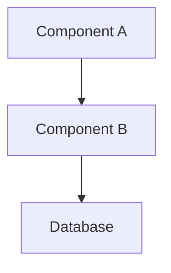
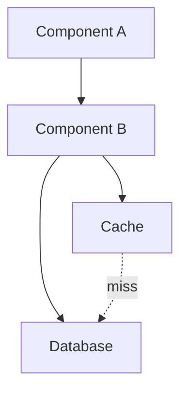

# Architecture Review

---

## Header

| Field | Value |
|-------|-------|
| **Review ID** | AR-[NNN] |
| **PR / Branch** | [PR number or branch name] |
| **Change Description** | [One sentence: what this PR does] |
| **Author** | [Engineer name] |
| **Reviewer** | [Engineering Manager name] |
| **Date** | YYYY-MM-DD |
| **Related Story** | [Story ID] |
| **Related ADR** | [ADR-NNN if this change is governed by an existing ADR] |

---

## Change Description

[Two to four sentences describing what architectural change is being introduced. Include: what new component or layer dependency is being added, what existing component is being modified, and what the expected behavior change is. Reference the PR description.]

---

## Scope — Architectural Areas Affected

Check all that apply:

- [ ] Clean Architecture layer boundaries (Domain / Application / Infrastructure / Api)
- [ ] Multi-tenancy (tenant_id filters, EF global query filters)
- [ ] EF Core patterns (new DbSet, new migration, query patterns)
- [ ] API contract (new endpoint, modified response schema, versioning)
- [ ] Authentication / Authorization (JWT claims, role-based access, policy)
- [ ] Calculation engines (`Application/Calculations/`)
- [ ] External integration connectors (`Infrastructure/ExternalClients/`)
- [ ] Background jobs or hosted services
- [ ] New infrastructure dependency (cache, queue, external service)
- [ ] Performance-sensitive code path (dashboard, bulk export, heavy query)

---

## Architecture Review Checklist

Each item is rated: **Pass**, **Fail**, or **N/A**.

### Clean Architecture Boundaries

| # | Check | Result | Notes |
|---|-------|--------|-------|
| CA-1 | Domain layer has no dependency on Application, Infrastructure, or Api | | |
| CA-2 | Application layer has no dependency on Infrastructure or Api | | |
| CA-3 | Infrastructure layer does not call Application layer (no circular dependency) | | |
| CA-4 | Controllers do not contain business logic (only call mediator/handler, map result, return response) | | |
| CA-5 | Calculation engines in `Application/Calculations/` are pure: no DB access, no I/O, no DI-resolved services | | |
| CA-6 | Domain entities are never returned directly from controllers (DTOs used throughout API boundary) | | |

### Multi-Tenancy

| # | Check | Result | Notes |
|---|-------|--------|-------|
| MT-1 | All new aggregate root entities have a `TenantId` property | | |
| MT-2 | EF global query filter applied for all new `DbSet`s that contain tenant-scoped data | | |
| MT-3 | No raw SQL or `FromSqlRaw` call that bypasses the global query filter | | |
| MT-4 | Bulk operations (delete, update) include an explicit `TenantId = currentTenant` predicate | | |
| MT-5 | New background jobs or scheduled tasks scope their queries to the correct tenant | | |

### API Standards

| # | Check | Result | Notes |
|---|-------|--------|-------|
| API-1 | New endpoints follow `/api/v1/[resource]` naming convention | | |
| API-2 | New endpoints are documented in Swagger (XML comments or `[SwaggerOperation]`) | | |
| API-3 | All new request DTOs have a corresponding FluentValidation validator | | |
| API-4 | Response DTOs do not include fields from a different tenant | | |
| API-5 | HTTP status codes are correct (200 for read, 201 for create, 204 for no-content delete, 404 for not found, 422 for validation failure) | | |

### EF Core Patterns

| # | Check | Result | Notes |
|---|-------|--------|-------|
| EF-1 | No N+1 queries: related entities are loaded via `.Include()` or explicit projection, not lazy loading | | |
| EF-2 | New migrations are reversible (or irreversibility is documented in migration file comments) | | |
| EF-3 | New foreign keys have an accompanying index | | |
| EF-4 | Audit fields (`CreatedAt`, `UpdatedAt`, `CreatedBy`) are managed by the `SaveChangesInterceptor`, not set manually in handlers | | |
| EF-5 | `AsNoTracking()` used on read-only queries that do not need change tracking | | |

### Security

| # | Check | Result | Notes |
|---|-------|--------|-------|
| SEC-1 | All new endpoints have an `[Authorize]` attribute or are explicitly documented as intentionally public | | |
| SEC-2 | Role-based authorization is applied where appropriate | | |
| SEC-3 | No user-supplied string is concatenated into a raw SQL query | | |
| SEC-4 | No sensitive data (PII, auth tokens, connection strings) appears in structured logs or exception messages | | |
| SEC-5 | New secrets or configuration values are in `appsettings.json` (structure only) with values in environment variables — not hardcoded | | |

### ADR Compliance

| # | Check | Result | Notes |
|---|-------|--------|-------|
| ADR-1 | If a new asset class is introduced, it uses the deterioration model mandated in ADR-009 or ADR-010 | | |
| ADR-2 | If a new database technology is introduced, it has an approved ADR | | |
| ADR-3 | No change overturns a currently Accepted ADR without a new superseding ADR | | |

---

## Findings

### Blockers
*Issues that must be resolved before this PR can be merged. Cannot be deferred.*

| # | Location | Finding |
|---|----------|---------|
| B-1 | [File:line or component] | [Description of the blocking issue and why it must be fixed] |

*(Write "None" if no blockers.)*

### Warnings
*Issues that should be addressed before merge but could theoretically be deferred with explicit PM/EM sign-off.*

| # | Location | Finding |
|---|----------|---------|
| W-1 | [File:line or component] | [Description] |

### Info
*Observations that are not issues but are worth noting for future work.*

| # | Location | Finding |
|---|----------|---------|
| I-1 | [File:line or component] | [Observation] |

---

## Diagrams

### Current State

*Replace with a Mermaid diagram showing the relevant part of the architecture before this change.*

### Proposed State

*Replace with a Mermaid diagram showing the architecture after this change.*

---

## Performance Impact Assessment

| Dimension | Before Change | After Change | Assessment |
|-----------|--------------|--------------|-----------|
| API P95 latency (primary endpoint) | [N ms] | [N ms] | Improved / Unchanged / Degraded |
| DB query count per request | [N] | [N] | Improved / Unchanged / Degraded |
| Memory allocation per request | [N KB] | [N KB] | Improved / Unchanged / Degraded |

If no performance measurement was taken: state the reason and whether a load test is required before GA.

---

## Security Impact Assessment

- **Attack surface change:** [Expanded / Unchanged / Reduced — brief explanation]
- **New data flows introduced:** [Describe any new data flowing between components, especially involving PII]
- **IAM / permissions change:** [Describe any new IAM roles, policies, or secrets required]
- **Threat model change:** [Describe any new threat vectors this change introduces]

---

## Operability Impact

- **New monitoring required:** [Describe any new metrics, dashboards, or log queries needed]
- **New alerts required:** [Describe any new alert thresholds]
- **Runbook update required:** [Yes / No — if Yes, link to the runbook section]
- **Deployment notes:** [Any special steps required during or after deployment — migration order, feature flag, warm-up]

---

## Decision

**Result:** Approved / Approved with Conditions / Request Changes

**Date:** YYYY-MM-DD

**Conditions (if Approved with Conditions):**
- [Condition 1 — must be verified by EM before merge or before GA]

**Request Changes Detail (if Request Changes):**
- [Change 1 — must be implemented and re-reviewed]

---

## Sign-Off

| Role | Name | Date | Signature |
|------|------|------|-----------|
| Author | [Name] | YYYY-MM-DD | |
| Engineering Manager | [Name] | YYYY-MM-DD | |
| Engineering Director (if Blocker found) | [Name] | YYYY-MM-DD | |

---
---

## Example: Architecture Review for Async Capital Needs Recalculation Background Job

### Header

| Field | Value |
|-------|-------|
| **Review ID** | AR-023 |
| **PR / Branch** | PR #287 — `feature/capital-needs-recalc-job` |
| **Change Description** | Adds an `IHostedService` background job that recalculates capital needs projections nightly for all active tenants |
| **Author** | Sanjay Venkataraman |
| **Reviewer** | Priya Nambiar (EM) |
| **Date** | 2026-07-10 |
| **Related Story** | MW-501 |
| **Related ADR** | ADR-011 (Capital Needs Calculation Engine) |

### Findings

#### Blockers

| # | Location | Finding |
|---|----------|---------|
| B-1 | `CapitalNeedsRecalcJob.cs:42` | The job calls `_dbContext.Assets.ToListAsync()` without a `TenantId` filter, violating MT-3. Because this is a background service (not an HTTP request), the scoped `ICurrentTenantService` is not available, and the global query filter is not activated for the ambient scope. The job must iterate over tenants explicitly and create a new `IServiceScope` per tenant, calling the tenant-scoped context within each scope. |

#### Warnings

| # | Location | Finding |
|---|----------|---------|
| W-1 | `CapitalNeedsRecalcJob.cs:88` | The job catches `Exception` broadly and logs at Warning level. If the capital needs calculator throws an unhandled exception for one tenant, the job continues silently. This should log at Error level and increment a metric counter so the on-call alert fires. |

#### Info

| # | Location | Finding |
|---|----------|---------|
| I-1 | `Program.cs:134` | The job interval is hardcoded to 24 hours. Consider moving this to `appsettings.json` as `Jobs:CapitalNeedsRecalcIntervalHours` to allow adjustment without redeployment. Not a blocker. |

### Decision

**Result:** Request Changes

**Request Changes Detail:**
- Fix B-1: Implement per-tenant scoped iteration using `IServiceScopeFactory`. Example pattern is in `InspectionReminderJob.cs` (shipped in Sprint 16).
- Fix W-1: Change catch block to log at Error level and increment `capital_needs_recalc_failures_total` counter.

Re-review required: Yes — brief re-review by EM after fixes are pushed.
